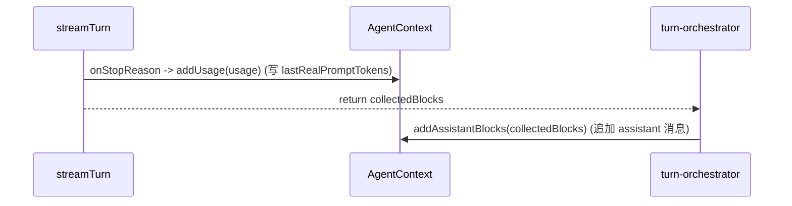
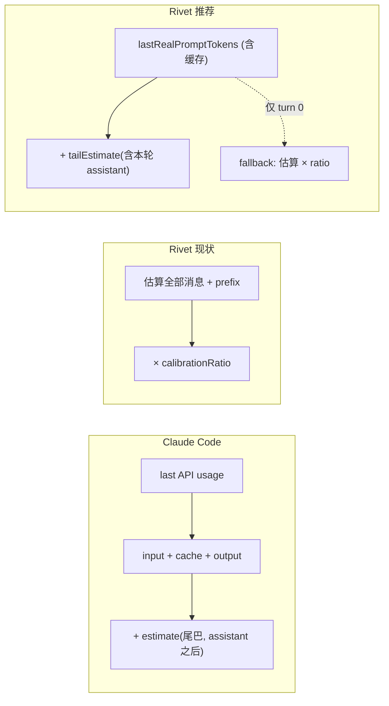

# 调查报告：上下文窗口占用如何计算才是「真实的模型窗口占用」

> 调查时间：2026-06-23 | 状态：✅ 已实现（display 层，跨提供商通用）
> 参考实现：`/Users/banxia/app/opencode/claude-code-haha`（Claude Code 源码）

## 实现落地（2026-06-23）

按本文设计实现，**仅改 display 层，不动压缩/压力阈值**：

- `SessionContext`（`src/agent/context.ts`）：新增 `tailEstimate` 状态 + `getRealOccupancy()`。
  - 采用「累加器」机制（设计第 3 节方案 B）：`add*/appendSystemReminder` 累加尾巴，`addUsage(input_tokens>0)` 归零（真值刚测得，尾巴重置）。
  - `output_tokens`-only 的 abort 路径不归零尾巴；`removeLastMessage`（abort 回滚）扣减尾巴。
  - 压缩 `replaceMessages` / `rewindToMessages` 时**作废锚点**（`lastRealPromptTokens=0`），让 `getRealOccupancy()` 回退到新（更小）历史的本地估算，避免拿压缩前的大 prompt 过报。
- `AgentLoop.getRealOccupancy()`（`src/agent/loop.ts`）：display 委托。
- 接线（仅显示口）：GlanceBar 的 `metricsProvider`（`src/main.ts`）、desktop 头部进度条（`src/server/serve.ts`）。`/context` 已单列 `API (last)` 真值，未改其 ledger 快照。
- **跨模型通用（GLM / MiMo / DeepSeek）**：锚点用的是 `addUsage` 写入的、经 `calibrateUsage()` 归一化后的 `input_tokens`——DeepSeek/MiMo 的 `prompt_tokens` 本含缓存，GLM（`usageCalibrationFactor=0`）则被替换成本地请求估算。两种情况下都是「当前可得的最佳真值」，**无需按模型分支**。
- 测试：`src/agent/__tests__/context.test.ts` 新增 `getRealOccupancy` 套件（锚点+尾巴、首响应前回退、尾巴重置、abort 不归零、压缩作废锚点、回滚扣减），48/48 通过。
- 已知无关失败：`compaction-controller.test.ts` 的 `P1.2 prune` 在 HEAD 上即失败（并行压缩修复 workspace 改动所致），与本次改动无关（已用干净 HEAD worktree 核实）。

## 结论

Rivet 当前用「本地重估全部历史 × 全局校准比」算占用（`getEstimatedTokens`），把已经拿到手的真值（`lastRealPromptTokens`）只用来推导比例、却不当锚点。参考实现（Claude Code）的做法更准也更简单：**锚定上一次 API 的真实 usage，只对其后新增的尾巴做估算**。

对 Rivet 的「真实占用」应为：

```
realOccupancy = lastRealPromptTokens                       // 上次请求的 prompt_tokens（OpenAI 兼容：已含缓存）
              + estimate(自上次 API 响应以来新增的消息)     // 含本轮 assistant 回复，chars/CJK 估算的有界尾巴
```

关键的提供商差异（见第 2 节）：DeepSeek / OpenAI 兼容的 `prompt_tokens` **已经包含缓存命中**，所以 **不能** 照搬参考实现的 `input + cache_read + cache_creation` 加和，否则会把缓存重复计一遍。

关键的时序事实（见第 3 节，已核实）：`addUsage`（写 `lastRealPromptTokens`）在 `addAssistantBlocks`（追加 assistant 消息）**之前**触发。因此 anchor 里 **不应单列 `output_tokens`**——assistant 回复应当作为尾巴的一部分被估算，否则双重计数。

**严重程度**：当前显示占用偏差为中（CJK / 大 tool_result 会让全局比例失真）；不影响正确性（compact 自有阈值），但 GlanceBar / `/context` 显示的「上下文占比」不够真实。本轮只产出设计，不动代码，且刻意不碰压缩/压力阈值（与正在进行的压缩修复 workspace 重叠）。

---

## 1. 两边当前怎么算

### 1.1 Claude Code（参考）——锚定真值，只估尾巴

规范函数 `tokenCountWithEstimation`（`src/utils/tokens.ts`）：

```
realTokens = getTokenCountFromUsage(lastApiUsage)
           + roughTokenCountEstimationForMessages(最后一条 usage 记录之后的消息)

getTokenCountFromUsage(usage) =
    usage.input_tokens
  + usage.cache_creation_input_tokens
  + usage.cache_read_input_tokens
  + usage.output_tokens
```

要点：
- **Anthropic 的 `input_tokens` 不含缓存**，所以这里把 `cache_creation + cache_read` 加回来才是完整输入。
- 会向前走过同一个 API 响应被拆分的多条 assistant 记录（并行 tool call 共享 `message.id`），避免漏算夹在中间的 tool_result（`tokens.ts:226-261`）。
- **同一个函数同时喂显示与阈值**：
  - 显示：`calculateContextPercentages`（`src/utils/context.ts:118-144`）用 `(input + cache_creation + cache_read) / window`，**显示口径不含 output**。
  - 阈值：`shouldAutoCompact`（`src/services/compact/autoCompact.ts:160-239`）用 `tokenCountWithEstimation`，对比 `getAutoCompactThreshold = effectiveWindow − 13k`（`effectiveWindow = contextWindow − min(maxOut, 20k)`）。
- 窗口大小按模型解析：`getContextWindowForModel`（`src/utils/context.ts:51-98`），默认 200k，sonnet-4 / opus-4-6 + 1M beta → 1_000_000。

### 1.2 Rivet——重估全部历史，抹一个全局比例

`getEstimatedTokens()`（`src/agent/context.ts:331-334`）：

```
getEstimatedTokens = (Σ estimateOaiMessageTokens(所有消息) + prefixOverhead) × contextCalibrationRatio
```

`contextCalibrationRatio` 是 `apiPromptTokens / 本地估算` 的 EMA，clamp `[0.5, 5]`，α=0.7（`context.ts:258-287`）。消费方全部用这同一个估算：
- GlanceBar 主路径：`metricsProvider` → `getEstimatedTokens()`（`tui/engine/app.ts`，`getMetrics`）。
- 压力监控：`PressureMonitor.check(estimatedTokens, …)`（`context/pressure-monitor.ts:34`）。
- 压缩分级：`compact-boundary-coordinator.ts` 多处 `getEstimatedTokens()`。
- 工具结果截断：`tool-execution.ts:352` 用 `estimatedTokens / ctxWindow`。

讽刺的是，GlanceBar 的 **fallback** 路径 `accumulateUsage`（`tui/engine/app.ts:1702-1703`）用的是 `(input_tokens + output) / window`——直接用真实 `prompt_tokens`，反而比主路径的 `getEstimatedTokens` 更接近真值。

---

## 2. 核心发现：提供商口径不对称

Rivet 把 DeepSeek / OpenAI 兼容的 usage 映射为（`api/openai-client.ts:735-741, 805-811`）：

```
input_tokens             = usage.prompt_tokens
cache_read_input_tokens  = usage.prompt_cache_hit_tokens ?? prompt_tokens_details.cached_tokens
cache_creation_input_tokens = usage.prompt_cache_miss_tokens
```

而 DeepSeek 的 `prompt_cache_hit_tokens + prompt_cache_miss_tokens = prompt_tokens`。也就是说：

- **`input_tokens`（= `prompt_tokens`）本身就是完整的输入占用，缓存已经含在里面。**
- `cache_read / cache_creation` 是它的**子集拆分**，不是叠加项。

| 提供商 | `input_tokens` 含缓存？ | 真实输入占用 |
|--------|------------------------|--------------|
| Anthropic | 否（缓存单列） | `input + cache_read + cache_creation` |
| DeepSeek / OpenAI 兼容 | **是** | `input_tokens`（**不要再加缓存**） |
| Codex（OpenAI Responses） | 是（顶层 `input_tokens` 含缓存） | `input_tokens`（cache 字段恒为 0，见 §4） |

→ **直接把参考实现的 `getTokenCountFromUsage` 搬过来会在 Rivet 上把缓存重复计一遍。** 真值其实早已存在 `lastRealPromptTokens`（`context.ts:336-339`），但只被用来推 ratio，从未当过占用锚点。

---

## 3. 时序事实（已核实）：`addUsage` 在 assistant 追加之前

调用链（`agent/turn-stream.ts` + `agent/turn-orchestrator.ts`）：

1. 流式过程中，`onStopReason` 回调触发 → `this.deps.addUsage(usage)` + `recordTurnCache(...)`（`turn-stream.ts:169-176`）。此时写入 `lastRealPromptTokens`。
2. `streamTurn()` 返回 `collectedBlocks`。
3. 编排器随后才 `addAssistantBlocks(collectedBlocks)`（`turn-orchestrator.ts:596 / 613`）把 assistant 消息追加进 session。



含义：在 `addUsage` 那一刻，assistant 消息**还没进数组**。

- 若按「index-based / anchor + 单列 `output_tokens`」实现：anchor 在 `addUsage` 取，之后 assistant 进数组被算进尾巴，而 `output_tokens` 又已计入 → **assistant 双重计数**。
- 因此推荐：anchor 只取 `lastRealPromptTokens`（不单列 output），尾巴累加包含 assistant 在内的所有后续追加。

---

## 4. Codex usage 形状（已核实）

`api/codex-client.ts:467-473`：

```
onStopReason(stopReason, {
  input_tokens: usage.input_tokens ?? 0,     // Responses API 顶层，含缓存输入
  output_tokens: usage.output_tokens ?? 0,
  cache_creation_input_tokens: 0,            // Codex 不上报缓存拆分
  cache_read_input_tokens: 0,
  reasoning_tokens: extractReasoningTokens(usage),
})
```

→ Codex 走与 OpenAI 相同的口径：`input_tokens` 即真实输入占用，cache 字段恒 0，公式 `lastRealPromptTokens + tail` 直接适用，无需加缓存。

---

## 5. 推荐设计：真实占用 = 锚点 + 尾巴（带 turn-0 fallback）

### 5.1 公式

```
当 lastRealPromptTokens > 0：
  realOccupancy = lastRealPromptTokens + tailEstimate
当 lastRealPromptTokens == 0（首个 API 响应前 / turn 0）：
  realOccupancy = getEstimatedTokens()   // 现有 本地估算 × contextCalibrationRatio（保留为 fallback）
```

- `lastRealPromptTokens`：上次请求的 `prompt_tokens`（OpenAI 兼容已含缓存；Anthropic 若接入需改为 input+cache 之和）。
- `tailEstimate`：自上次 `addUsage(input>0)` 以来新增消息的 `estimateOaiMessageTokens` 之和，**包含本轮 assistant 回复**。

### 5.2 机制（推荐 B：累加器，时序安全）

鉴于第 3 节的时序（`addUsage` 先于 assistant 追加），推荐**累加器**而非 index：

- 在 `AgentContext` 增 `tailEstimate` 字段。
- `addUsage(usage)`：当 `usage.input_tokens > 0` 时，`tailEstimate = 0`（真值刚被测量，尾巴清零）。注意中止路径 `addUsage({output_tokens})` 不带 input，不应清零（`turn-stream.ts:205-210`）。
- `addUserMessage / addAssistantBlocks / addToolResults`：各自 `tailEstimate += estimateOaiMessageTokens(msg)`（这些方法已经在累加 `estimatedTokens`，顺手累加 `tailEstimate` 即可）。
- 新增 `getRealOccupancy()`：按 §5.1 返回。

不用 index 的原因：index 在 `addUsage` 取会落在 assistant 之前，要么双重计数（加 output），要么得改到 `addAssistantBlocks` 里取 index——多一处耦合，收益甚微。累加器天然时序安全。

为何 anchor 不单列 `output_tokens`：assistant 回复会作为尾巴被估算一次；若再加 `output_tokens` 即双算。用估算代替精确 output 的误差有界（单轮一条 assistant 消息），可接受。

### 5.3 与显示口径的关系

参考实现「显示」口径不含 output（`calculateContextPercentages`），但「阈值」口径含。Rivet 若统一用 `realOccupancy`（含本轮 assistant 估算），语义是「**下一次请求大约会占多少**」——这对 GlanceBar / `/context` 的「还剩多少窗口」更直觉。是否要单独区分「当前 fill（不含 output）」与「下轮预估（含 output）」留作显示层取舍，不影响锚点机制。

---

## 6. 数据流对比



---

## 7. 接线点（未来，本轮范围外）

- 显示：`metricsProvider` 闭包改用 `getRealOccupancy()`；`/context`（`tui/slash-commands.ts:937-942`）已经在显示 `getLastRealPromptTokens()` 作为「API (last)」，可顺势统一。
- **刻意不动**压缩 / 压力监控 / 工具截断的阈值——它们当前都吃 `getEstimatedTokens()`，改动与正在进行的压缩修复 workspace 重叠，留作后续单独评估。
- 1M 窗口、worker 子会话：公式不变，仅 `contextWindow` 不同。

---

## 8. 涉及文件

参考实现：
- `claude-code-haha/src/utils/tokens.ts` — `tokenCountWithEstimation`、`getTokenCountFromUsage`、`tokenCountFromLastAPIResponse`
- `claude-code-haha/src/services/tokenEstimation.ts` — `roughTokenCountEstimation*`（chars/4，JSON 用 /2，图片 2000）
- `claude-code-haha/src/utils/context.ts` — `getContextWindowForModel`、`calculateContextPercentages`
- `claude-code-haha/src/services/compact/autoCompact.ts` — `getAutoCompactThreshold`、`shouldAutoCompact`

Rivet：
- `src/agent/context.ts` — `getEstimatedTokens`（331-334）、`addUsage` 校准（258-287）、`lastRealPromptTokens`（336-339）
- `src/api/openai-client.ts` — usage 映射（735-741, 805-811）、`calibrateUsage`（912-941）
- `src/api/codex-client.ts` — usage 映射（467-473）
- `src/agent/turn-stream.ts` — `onStopReason → addUsage`（169-176）、中止路径 output 估算（205-210）
- `src/agent/turn-orchestrator.ts` — `addAssistantBlocks` 时序（596, 613）
- `src/tui/engine/app.ts` — `metricsProvider`/`getMetrics`、`accumulateUsage` fallback（1702-1703）
- `src/context/pressure-monitor.ts` — `check(estimatedTokens)`（34）
- `src/tui/slash-commands.ts` — `/context`、`/stats cache`（937-942, 673）
