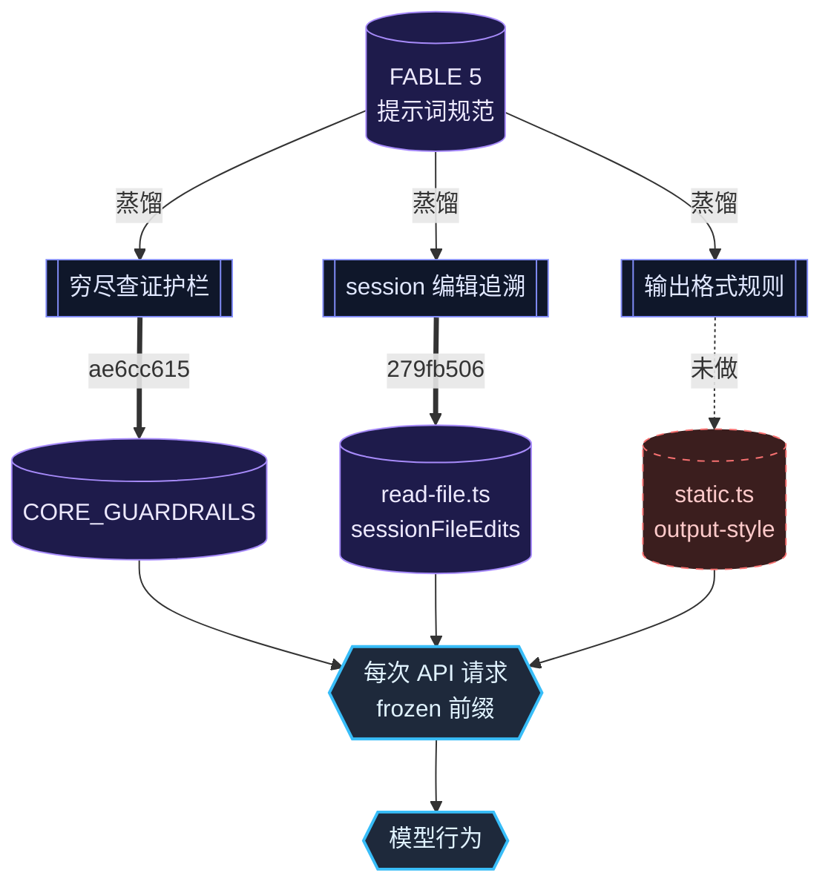

# FABLE 5 蒸馏对照 — 三域核验与优先级排序

# FABLE 5 蒸馏 → 天枢认知场对照计划

## 一、核验矩阵

逐条对照 FABLE 5 三个维度，核验当前天枢的实现状态：

| FABLE 5 规则 | 天枢现状 | 今天提交 | 优先 |
|---|---|---|---|
| UNRECOGNIZED ENTITY → 必须搜索 | ✅ 已写入 CORE_GUARDRAILS | `ae6cc615` | — |
| 代码编辑后 mtime 刷新 | ✅ hash_edit + edit_file staleness guard | 已有 | — |
| 编辑后"忘记自己改过" | ✅ session 编辑追溯 Set | `279fb506` | — |
| 工具前后序关系强制执行 | ⚠️ 无显式门控链，仅描述性提示 | — | 低 |
| 默认 prose / 拒绝不用 bullets | ❌ 当前 static.ts 无格式规则 | — | 中 |
| 输出 bullets 至少 1-2 句 | ❌ 不存在 | — | 低 |
| "Searching costs seconds. Confabulating costs trust" | ⚠️ 语义已蒸馏进护栏，但缺锐度 | `ae6cc615` | 低 |

## 二、已完成（今天两笔提交）

**`ae6cc615`** — 第5条护栏：穷尽查证再下结论，语义覆盖 FABLE 5 的 UNRECOGNIZED ENTITY RULE + "Searching costs seconds. Confabulating costs the user's trust." 注入到 `src/agent/seed-capsule-store.ts` 的 `CORE_GUARDRAILS`，每次 API 请求 frozen 前缀包含。

**`279fb506`** — session 文件编辑追溯：`read-file.ts` 新增 `sessionFileEdits` Set，`edit/hash-edit/write-file` 写入成功后标记。staleness 错误消息从 "modified externally" 改进为区分自改/外改。覆盖 FABLE 5 的 "view → str_replace → view" 前后序关系中的"编辑后状态感知"部分。

## 三、待做（优先级排序）

### 3.1 中优先级：输出格式规则恢复

**问题**：当前 `static.ts` 的 `<output-style>` 段有"直线到达目标""代码改动直接给代码""去掉开场白收尾语"——但**缺少任何关于 formatting（bullets/bold/headers）的约束**。旧版曾有"不用列表能说清的用散文"但已在之前的重构中丢失。

FABLE 5 对应规则：
- 默认 prose，不用 bullets/headers/bold
- 只有两种例外才用列表：(a) 用户要求 (b) 内容多面体到不用列表无法清晰
- Bullets 至少 1-2 句
- **拒绝时绝不用 bullet points**

**改动**：`src/prompt/static.ts` 的 `<output-style>` 段，新增一条格式规则。

**伪代码**：
```
- 用最少格式传达清晰——默认 prose，只在内容多面体到不用列表无法清晰、或用户明确要求时才用 lists/bold/headers。
- 拒绝时不用 bullet points——prose 对人的接受度更高。
```

**影响**：提示词增量 <100 字节，前缀缓存安全（frozen 区内修改，但之前 static.ts 已经过多次修改，非首次冻结）。预期效果：减少 agent 在简单回答中滥用 structured output。

### 3.2 低优先级：锐化"推测代价"措辞

**问题**：第5条护栏"穷尽查证再下结论"语义正确，但措辞偏向义务陈述（"先穷尽所有可用查证手段"），缺少 FABLE 5 那句击穿认知防御的锐度——"Searching costs seconds. Confabulating costs the user's trust."

**可选改动**：在 `CORE_GUARDRAILS` 第5条末尾追加半句，或改为两条。不宜——护栏已 5 条，密度已高。保留现状。

### 3.3 低优先级：工具前后序关系表

**问题**：天枢工具缺乏显式的 pre-requisite 检查。当前的保护来自：
- 工具 description（"Read the file first before editing"）
- hash_edit staleness guard（拒绝 mismatched mtime）
- session edit 追溯（今天加的）

这些覆盖了最关键的 failure mode。建立正式的门控链需要跨工具基础设施改造，收益/成本比不高。

**建议**：不做代码改动，在 `.rivet/knowledge/tools.md` 或 prompt 中增加工具前后序关系的文档化描述。

## 四、数据流图



## 五、验证计划

1. 检查 `static.ts` 当前 `<output-style>` 段确认格式规则缺失 → 已确认
2. 新增格式规则后：`npx tsc --noEmit` + `npx tsx --test src/prompt/__tests__/static.test.ts` 
3. 手动验证：改后启动 agent，观察默认回答是否减少不必要的 bullets
