> **Status: COMPLETED** — 2026-06-19

> **Status: APPROVED** — 2026-06-17T19:21:06.284Z

# GLM coding API prompt_tokens 虚高修复 — provider-aware usage 校准

## 问题

GLM 5.2 coding API (`open.bigmodel.cn/api/coding/paas/v4`) 返回的 `prompt_tokens` 虚高 20-120 倍。

实测证据（session `mqiah02a5fduxj3r`）：
- OAI 消息总量：89 条，content 238K chars + reasoning 50K chars → `estimateOaiTokens` ≈ 72K tokens
- GLM API 报告 `prompt_tokens`：1,970,432（虚高 27 倍）

session `mqicjelaoy784tqs`（当前会话）：
- OAI 消息：190 条，~236K chars → 估算 ~59K tokens
- GLM API 报告 `prompt_tokens`：5,976,654（虚高 100 倍）

同一 turn 内连续 API 调用（工具循环）的 input_tokens 增量是前次 output 的 20-33 倍（turn 1）和 4-5 倍（turn 2+），不可能是真实的上下文增长。

## 根因

`openai-client.ts:647` 将 GLM 的 `prompt_tokens` 直接映射为 `input_tokens`。GLM coding API 的 `prompt_tokens` 语义与标准 OpenAI 不同——它可能在服务端重复计数 reasoning tokens 或使用了不同的 tokenizer 基准。天枢对所有 provider 统一使用同一个解析路径，没有 provider-specific 校正。

## 影响面

**假数据流向**（`addUsage` → `session.totalUsage`）：
1. TUI cockpit 显示的 `in` token 数和费用完全失真
2. 桌面端 ThreadView turn_complete 的 `totalTokens` 失真
3. `session-persist-listener.ts:47` 将假数据写入 `.meta.json` 的 `tokenUsage`
4. `getCacheHitRate()` 用 `cache_read_input_tokens / input_tokens` 计算命中率——GLM 的 cache_read 也虚高但比例可能与 input 不同，导致命中率失真
5. `cacheAdvisor.getRecentHitRate()` 消费失真的命中率，影响压缩延迟决策

**不受影响**（压缩决策正确）：
- `compaction-controller.ts` 的 ratio 计算用 `session.getEstimatedTokens()`（chars/4 估算），不用 API usage
- `compact-boundary-coordinator.ts` 同理
- 结论：压缩系统行为正确，不需要改

**mqiah02 的"三轮对话"**：OAI 日志确认 89 条消息全在、0 个 compact 标记——消息没丢。用户感知的"丢失"是模型注意力受限（GLM 在长上下文 + reasoning echo 下注意力退化），不是天枢删了消息。events.jsonl 的 turn_complete 计数重置是因为 turn 5 → turn 6 时 `input_tokens` 暴跌到 19K（天枢内部估算），UI turn counter 回退。

## 修复方案

```mermaid
flowchart TD
    A[API usage chunk] --> B[openai-client.ts parseUsage]
    B --> C{provider == glm?}
    C -- 是 --> D[校正: input_tokens = estimateOaiTokens estimate]
    C -- 否 --> E[直接使用 prompt_tokens]
    D --> F[addUsage 校正后的值]
    E --> F
    F --> G[UI / persist / cacheAdvisor]
    
    style D fill:#1e3a5f,stroke:#60a5fa
    style C fill:#4c1d95,stroke:#a78bfa
```



核心改动：在 `openai-client.ts` 的 usage 解析路径中，为已知虚高的 provider 加入校正因子。

### Task 1: provider-aware usage 校正

**文件**: `src/api/openai-client.ts:640-650`

当前行为：
```typescript
callbacks.onStopReason?.(mapFinishReason(stopReason), {
  input_tokens: usage.prompt_tokens ?? 0,
  ...
})
```

改为：当 provider 是 GLM（或更通用地，当 `prompt_tokens` 与本地估算偏差 >3 倍时），用本地估算替代 API 报告的 input_tokens。

具体实现：
- 在 `OpenAIClient` 上增加一个 `usageCalibrationFactor?: number` 配置项（默认 1.0 = 信任 API）
- GLM provider preset 设置 `usageCalibrationFactor: 0`（完全不信任 prompt_tokens）
- 当 factor=0 时，input_tokens 用 `estimateOaiTokens(request.messages)` 的结果
- cache_read_input_tokens 和 cache_creation_input_tokens 同比例缩放（保持命中率计算的一致性）

**为什么用 factor 而不是 hardcode provider check**：未来可能有其他 provider 有类似问题。factor=0 表示完全不信任，factor=0.5 表示打五折，factor=1 表示完全信任。

### Task 2: 配置传递

**文件**: `src/config/provider-presets.ts`（GLM preset 加 `usageCalibrationFactor`）、`src/api/openai-client.ts`（读取配置）、`src/agent/create-agent-config.ts`（传递到 client config）

### Task 3: 测试

**文件**: `src/api/__tests__/openai-client.test.ts`

反证测试表：
| 条件 | 输入 | 预期 | 打红什么错误实现 |
|------|------|------|-----------------|
| GLM factor=0 | prompt_tokens=1970432, 估算=72000 | input_tokens=72000 | hardcode 不读 factor |
| DeepSeek factor=1 | prompt_tokens=100 | input_tokens=100 | 对所有 provider 都校正 |
| 未知 provider factor=undefined | prompt_tokens=100 | input_tokens=100 | 缺省时崩 |
| GLM cache_read 校正 | cache_read=1778816, 估算比例 | 校正后的 cache_read | 只校正 input 不校正 cache |

## Scope

| 碰 | 不碰 |
|-----|------|
| `src/api/openai-client.ts` usage 解析 | `src/compact/` 压缩策略 |
| `src/config/provider-presets.ts` GLM preset | `src/agent/compaction-controller.ts` |
| `src/agent/create-agent-config.ts` 配置传递 | `src/prompt/engine.ts` |
| `src/api/__tests__/openai-client.test.ts` | `src/agent/context.ts` |

## 验证

1. `npx tsc --noEmit`
2. `npm exec -- tsx --test src/api/__tests__/openai-client.test.ts` — 新增的校正测试
3. 手动验证：用 GLM 发一条简单消息，TUI cockpit 显示的 input_tokens 应在 15-40K 范围而不是 2M+
