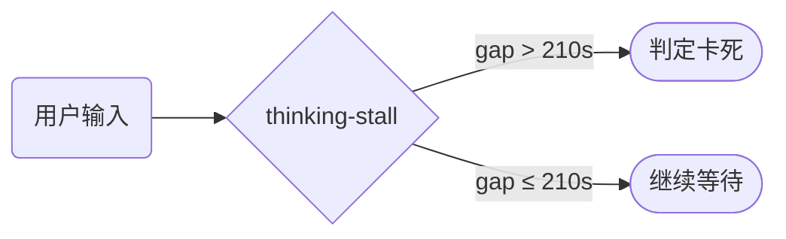

> **Status: COMPLETED** — 2026-06-19

> **Status: APPROVED** — 2026-06-17T16:00:53.542Z

# glm-thinking-stall-timeout-120s-to-210s

# GLM Thinking-Stall Timeout: 120s → 210s

## 根因

GLM 慢推理模式下，`reasoning_content` delta 之间可能有较长间隙（合法深思）。当前 thinking-stall 阈值 120 秒太短，误杀合法的慢推理。

## 改动



`src/api/factory.ts:49`：

```typescript
// 改前
glm: 120_000,

// 改后
glm: 210_000,
```

同步更新测试断言 `src/api/__tests__/factory.test.ts:257`：
```typescript
// 改前
assert.equal(config.thinkingStallTimeoutMs, 120_000, ...)
// 改后
assert.equal(config.thinkingStallTimeoutMs, 210_000, ...)
```

以及 `src/api/__tests__/thinking-stall-config.test.ts:126` 中 glm 的测试用例值。

## 验证

`npm exec -- tsx --test src/api/__tests__/factory.test.ts src/api/__tests__/thinking-stall-config.test.ts`
