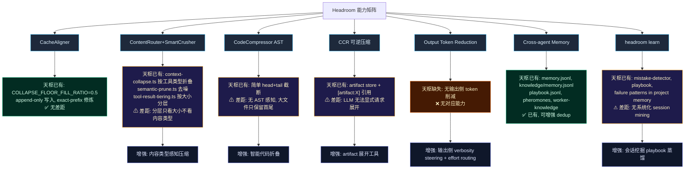

# Headroom 能力对标与原生增强方案

# Headroom 能力对标与原生增强方案

## 问题描述

对标 Headroom (headroomlabs-ai/headroom) 的核心能力矩阵，在天枢原生架构上实现更适配的增强版本。不引入外部 Rust 依赖，不改动核心 prefix-cache 稳定性约束。

## Headroom 能力 → 天枢现状 → 差距 → 增强方案



## 增强任务优先级

| # | 增强项 | 价值 | 风险 | 复杂度 | 文件 |
|---|--------|------|------|--------|------|
| P1 | 输出 verbosity steering | 高 — 每条回复省 10-30% 输出 token | 极低 — 动态块尾部追加 | 极小 | `src/prompt/volatile.ts` |
| P2 | 输出 effort routing | 中高 — 例行跟进轮省思考 token | 低 — 已有 ReasoningEffortController | 小 | `src/agent/reasoning-effort-controller.ts` |
| P3 | 内容类型感知压缩 | 中高 — 大 JSON/diff/test 输出压缩比提升 | 中 — 需改 tiering 管线 | 中 | `src/agent/tool-result-tiering.ts` |
| P4 | 智能代码折叠 | 中 — read_file 大文件保留签名压体 | 中 — 需语言检测+解析 | 中高 | `src/tools/read-file.ts` + 新 compact 模块 |
| P5 | artifact 展开 | 低 — LLM 可通过 read_section 已有途径获取 | 低 | 小 | `src/artifact/` |
| P6 | 会话挖掘 playbook | 中 — 自动从失败中学习 | 中高 — 需设计挖掘策略 | 中高 | `src/agent/playbook.ts` |

## P1: 输出 verbosity steering（立即执行）

**机制**: 在 volatile prompt 的动态尾部追加一条 terseness nudge。不对 static base prompt 做任何修改（保证 prefix cache 命中）。

**改动位置**: `src/prompt/volatile.ts` 的 `buildDynamicAppendixParts` 函数返回列表末尾。

**内容**: 一条 1-2 句的 terseness 指令，类似 `"Be terse. Don't restate code or context already shown. Skip preambles and closings. Output the answer directly."`

**约束**:
- 只在 dynamic appendix 中追加（在 history 之后），不影响 base prompt 的 prefix cache 命中
- 通过环境变量 `RIVET_TERSE=0` 可关闭
- 不计入 volatile hash（不触发 volatile swap），或在 hash 计算中显式排除

**验证**: 修改后跑 `src/prompt/__tests__/engine-cache-stability.test.ts` 确认缓存指纹不变。

## P2: 输出 effort routing（P1 完成后执行）

**机制**: 在 `ReasoningEffortController` 中添加 turn 类型检测——当一轮是纯 tool result 跟进（前一 assistant 消息含 tool_calls，当前无新 user 消息），将 reasoning effort 降低一档。

**改动位置**: `src/agent/reasoning-effort-controller.ts`，新增 `adjustForTurnType()` 方法。

**逻辑**:
```
if (当前轮无用户消息 && 上轮有 tool_calls):
    effort = max(floor, current_effort - 1 tier)
else:
    effort = 原逻辑
```

**约束**:
- 必须有 reasoning floor 保护——floor 为 `high` 时不能降到 `low`
- 通过 `RIVET_EFFORT_ROUTING=0` 可关闭
- 仅在 DeepSeek V4（支持 reasoning_effort 参数）上生效

**验证**: 新增 `src/agent/__tests__/reasoning-effort-routing.test.ts`

## P3: 内容类型感知压缩（后续执行）

**机制**: 在 `tool-result-tiering.ts` 的 Tier 1 压缩中，根据 tool name 选择不同的压缩策略（当前是统一的结构化摘要）。保持 Tier 0 不变（小结果全量保留），Tier 1 使用内容感知压缩，Tier 2 不变（极小摘要）。

**改动位置**: `src/agent/tool-result-tiering.ts`，新增 `compressByToolType()` 函数。

**压缩策略**:
- `grep` / `glob` → 保留匹配文件名 + 匹配计数，去重（已有 context-collapse 逻辑，前移到 tiering）
- `bash` (test output) → semantic-prune 的 test pass 行去除（已有，前移到 tiering）
- `read_file` → 保留 import 行 + 导出签名，折叠函数体
- `web_fetch` → 保留关键段落，去 HTML 噪声
- 默认 → 当前 head+tail 截断

**约束**: 压缩必须在**消息首次写入 session 前**完成（tiering 的一级写入原则），不可事后修改历史。

## P4: 智能代码折叠（后续执行）

**机制**: 对 `read_file` 返回的大文件内容，检测语言，提取函数/类签名，折叠实现体。

**改动位置**: 新增 `src/compact/code-fold.ts`，在 `read-file.ts` 的 model content 构造中调用。

**实现策略**: 使用正则做语言无关的签名检测（可选 AST 增强）:
- 检测 `function`, `class`, `interface`, `export`, `import` 行
- 保留签名行 + doc comment 块
- 折叠函数体（`{ ... }` block 替换为 `{ ... }`）
- 折叠深度限制为 2 层（避免过度折叠丢失 context）

**约束**: 
- 折叠结果必须保留足够信息让 LLM 判断是否需要展开
- 展开路径通过现有的 `read_file(offset, limit)` 参数实现（LLM 可重读具体范围）
- 这是一个纯 text-in/text-out 的压缩层，不改变 read_file tool 的接口

## P5: artifact 展开（低优先级）

**机制**: 天枢已有 `read_section` tool（`src/tools/read-section.ts`），可直接用 `[artifact:X]` 引用读取 artifact store 中的完整内容。当前 LLM 已经在使用这个路径。**无需额外工作**。

## P6: 会话挖掘 playbook（低优先级）

**机制**: 在 session 结束时自动扫描 `.rivet/sessions/<id>.jsonl`，识别失败模式并写入 playbook。

**改动位置**: `src/agent/playbook.ts` 的 `reflect` 方法增强。

**策略**: 
- 检测 `isError: true` 的工具调用序列
- 匹配已知失败模式（已有 `failure-classifier.ts`）
- 写入 playbook 时去重（同模式不重复写入）

---

## 执行路线图

```
Phase 1 (此轮)    : P1 verbosity steering   → 1 文件, 极低风险
Phase 2 (下轮)    : P2 effort routing        → 1 文件 + 1 测试
Phase 3 (后续)    : P3 内容感知压缩          → 2 文件重构
Phase 4 (远景)    : P4 代码折叠, P6 会话挖掘
```

## 验证计划

- Phase 1: `npm run typecheck` + `npm exec -- tsx --test src/prompt/__tests__/engine-cache-stability.test.ts`
- Phase 2: typecheck + 新增 routing 测试
- Phase 3: typecheck + `src/agent/__tests__/tool-result-tiering.test.ts` + `src/compact/__tests__/context-collapse.test.ts`

## 风险与权衡

- **P1 风险**: terseness nudge 可能让模型过于简略，丢失有用的解释。通过 `RIVET_TERSE=0` 环境变量提供逃生门。
- **P2 风险**: 降低 routine turn 的 reasoning 可能导致模型在需要深度分析的跟进轮中表现下降。通过 reasoning floor 保护 + 可关闭来缓解。
- **P3 风险**: 前移压缩逻辑可能改变现有 tiering 行为，影响缓存。但 tiering 本身就是首次写入压缩，不事后修改——与现有缓存纪律一致。
