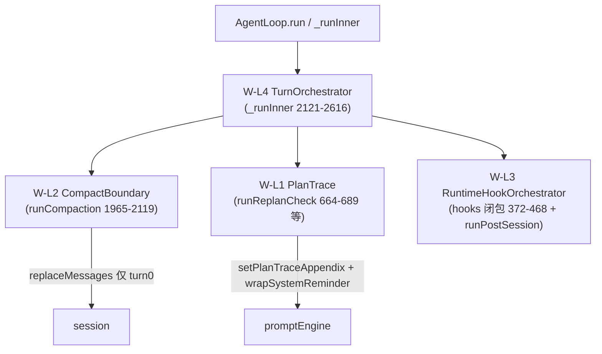

> **Status: COMPLETED** — 2026-06-19

# mid-loop 阶段 — `loop.ts` 上帝对象分解（coordinator 抽取）

> 把 `src/agent/loop.ts`（约 2657 行）沿 **既有 `loop-factory` 穿线模式**渐进抽成独立 coordinator，按耦合度与前缀缓存风险从低到高分四波：`PlanTrace → CompactBoundary → RuntimeHook → TurnOrchestrator`。**纯结构重构，零行为变更、零新增功能。** 终态：`AgentLoop` 退化为「字段持有 + 薄 facade」，turn 编排/compact 边界/planTrace 生命周期/hook 编排各自独立可测。
>
> ⚠ **强烈建议每波独立会话执行**，且按本文次序逐波推进——前三波把 seam 收窄、接口稳定后，最高危的 W-L4 才动 `_runInner`。

## 0. 三条硬缰绳（全程不可破）

① 动态附录在用户消息内冻结，中途注入走 **system-reminder**（`wrapSystemReminder`）；② 不每轮重写 `frozenBase`/`volatileBlock`；③ 不在 anchor 前重排消息。**任何 coordinator 抽取都不得改变 `promptEngine` setter 的调用时机、`session` 消息序列、或 compact 边界语义。** 本质是「搬运代码到新文件，调用点与时序逐字保留」，而非重写控制流。

## 1. 现状与既有抽取模式

`AgentLoop`（`src/agent/loop.ts`，类体约 160–2644）已抽出 7 个子控制器，全部走 **`loop-factory.ts` 的 `createXxx(self) + deps 闭包` 模式**——子控制器不 import `AgentLoop` 类型（避免循环），而是通过 deps 对象的 getter/setter 闭包读写 `self` 字段：

| 已抽控制器 | 字段行 | 来源 |
|-----------|--------|------|
| `TurnPerceptionController` | `perception:231` | turn-perception.ts |
| `TurnIntentController` | `intent:232` | turn-intent.ts |
| `ContextInjectionController` | `contextInjection:233` | context-injection.ts |
| `CompactionController` | `compaction:234` | compaction-controller.ts |
| `TurnStreamController` | `turnStream:235` | loop-factory.ts:14-99 |
| `TurnCompletionController` | `turnCompletion:236` | loop-factory.ts:100-121 |
| `ToolExecutionController` | `toolExecution:237` | loop-factory.ts:122-169 |

**安全网现状**：`src/agent/__tests__/loop-factory.test.ts` 已钉 `buildRuntimeSnapshot` 字段映射（mid-loop 前置网，已落地）。另有 20+ 个以 `AgentLoop` 为主体的集成测试（见 §6），是本次重构的回归地板。

> 行号说明：以下行号为**抽取锚点**，执行时以 `grep`/`semantic_search` 重新定位为准（重构中会漂移）。



## 2. 改动总览

| 文件 | 改动 | 波次 |
|------|------|------|
| `src/agent/plan-trace-coordinator.ts` | **新建**：搬 runReplanCheck/capturePlanSteps/buildStepResultFromTurn | W-L1 |
| `src/agent/loop-factory.ts` | 加 `createPlanTraceCoordinator(self)` 穿线 | W-L1 |
| `src/agent/loop.ts` | 三方法体迁出 → 改委托；planTrace 字段保留为 self 持有 | W-L1 |
| `src/agent/compact-boundary-coordinator.ts` | **新建**：搬 runCompaction P2-5 边界策略 | W-L2 |
| `src/agent/runtime-hook-orchestrator.ts` | **新建**：搬 createDefaultRuntimeHooks 闭包 + runPostSession | W-L3 |
| `src/agent/turn-orchestrator.ts` | **新建**：搬 _runInner + wrapCallbacksWithHeartbeat | W-L4 |
| `src/agent/__tests__/*.ts` | 各波先补/复用安全网；现有 loop*.test.ts 全程绿 | 各波 |

## 3. 前置决策项（动手前先定夺）

**孤儿方法 `runCognitivePrep`（1690–1761）**：设置 `setCognitiveProjection`(1751)，但**全仓库无调用点**（仅 `runPerception` 在非 actionable 时清空 1854-1855）。
- 决策 A（推荐）：确认为死代码 → 在 W-L1 之前**单独提交删除** + `setCognitiveProjection` 生产路径若无其他来源一并清理；
- 决策 B：本是漏接线 → 恢复在 `buildTurnRequest` 前调用并补测，再开始分解。

**禁止**：把未定夺的 `runCognitivePrep` 连带搬进任何 coordinator（搬运死代码会固化 bug 并误导后续）。

## 4. 执行波次（TDD，每波先确认安全网再搬）

### W-L1 — `PlanTraceCoordinator`（最内聚 / seam 最窄 / 风险低）

**任务契约**：新建 `plan-trace-coordinator.ts`，搬以下逻辑，`loop.ts` 改为薄委托：
- `runReplanCheck`(664-689)、`capturePlanSteps`(638-644)、`buildStepResultFromTurn`(649-658)
- `initializeRun` 内 trace 开窗/清理(1520-1537)
- `_runInner` 工具轮后 `appendResult`(2512-2518)

字段归属：`planTrace`、`latestConvergenceResult`、`lastReplanInjection`（仍由 `self` 持有，coordinator 经 deps getter/setter 访问；`latestConvergenceResult` 写入来自 `runConvergenceCheck:1782`，是 coordinator 的只读输入）。

deps seam（必须保留时序）：
- `config.promptEngine.setPlanTraceAppendix`（688/1525/1536）
- `session.addUserMessage(wrapSystemReminder(ctx.text))`（683）— **mid-task 纠偏必须 reminder，禁改成 frozen appendix**（677-680 注释依据）
- `toolExecution` 的 `onPlanSteps → capturePlanSteps` 链路（loop-factory.ts:146）
- 输入：`traceStore` 工具事件、`consecutiveNoToolTurns`、`_taskDepthLayer`、`taskContract`

**过门**：`trace-integration.test.ts` + `replan-loop.test.ts` + `plan-execution-trace.test.ts` 全绿；新增「coordinator 委托后 todo→setPlanTraceAppendix 序列化链路」断言（沿用 trace-integration 的 spy 手法）。
**风险**：低（字段内聚、seam 窄）。

### W-L2 — `CompactBoundaryCoordinator`（逻辑内聚 / 缰绳高危）

**任务契约**：新建 `compact-boundary-coordinator.ts`，搬 `runCompaction`(1965-2119) 的 **P2-5 边界策略**：turn===0 gate、`pendingStaleCompact`/`pendingHeapCompact` 跨轮延迟标记、token-gate、diet+stale-round；以及 `initializeRun` 的 split-before-user-message(1477-1480)。
字段：`compactFailures`、`lastCompactTurn`、`pendingStaleCompact`、`pendingHeapCompact`、`_prevPhaseHint`。

deps seam（**逐字保留语义**）：
- `compaction.trySessionSplit/maybeCompact/tryPartialCompact`、`enforceContextCeiling`（在 buildTurnRequest，不搬）
- `session.replaceMessages`（2064/2075/2112）— **前缀缓存高危：1M 窗口 mid-round 必须延迟到 turn 0 边界**，时序一字不可动
- `p3.dietMessages`、`compactStaleRoundsOai`、`microCompactOai`、`cacheAdvisor.shouldDelayCompact`、`immuneHook.injectSignal`（compact 失败）

**过门**：`compaction-controller.test.ts` 全绿；**补 loop 级集成测试**覆盖 P2-5 pending 标记与 stale-round `replaceMessages` 仅 turn 0 触发（当前为测试缺口，见 §6）——此测试应在搬运**之前**写好作为安全网。
**风险**：中（必须严格保留边界语义；建议独立会话）。

### W-L3 — `RuntimeHookOrchestrator`（搬大闭包 / 瘦身 constructor）

**任务契约**：新建 `runtime-hook-orchestrator.ts`，搬 constructor 内 `createDefaultRuntimeHooks` 巨型 deps 闭包(372-468，含 stigmergy/theta/HEARTH/constellation/physarum prewarm/advisoryBus) + `runPostSession`(1235-1290)。对外暴露 `runPostSession(callbacks)` 与 perception/intent 所需 deps。
seam：闭包内 `self.*` 多为一次性读写；注意 `addUserMessage(wrapSystemReminder)` 经 perception/intent deps（478/485）。

**过门**：`loop.test.ts` 的 postSession 相关用例（final 前触发 / AbortError 时触发）全绿；构造不读 DB（`loop-warmup.test.ts`）保持。
**风险**：中低（多为搬运，constructor 体积下降）。

### W-L4 — `TurnOrchestrator`（最后 / 最大 / 最高危）

**任务契约**：新建 `turn-orchestrator.ts`，搬 `_runInner`(2121-2616) 主体 + `wrapCallbacksWithHeartbeat`(2623-2643)。局部状态（`assistantResponded`/`userMessageConsumed`/stream dedup 三态机 2254-2365/`finalTurnCompleted`）随之迁移。`AgentLoop.run()`(1305-1324) 退化为「创建 abortController + 委托 orchestrator」。
seam（回调 self）：`session.removeLastMessage/addAssistantBlocks/addUserMessage`、边界子流程（`runCompaction/runPerception/runConvergenceCheck/runReplanCheck/buildTurnRequest`，前三波抽出后改为调对应 coordinator）、`callbacks` 全量、`config.maxTurns`、`runPostSession`、`cacheAdvisor.onTurnEnd`、`telemetryWriter`。

**缰绳重点**（逐字保留）：stream reconnect 丢弃 partial(2341-2345)、abort 时跳过 `addAssistantBlocks`(2440-2444)、`removeLastMessage` 仅当 `!assistantResponded && !userMessageConsumed`、TTSR 手写 `<system-reminder>` 标签(2400-2402)。

**过门**：`loop.test.ts`/`text-persistence.test.ts`/`agent-reconnect.test.ts`/`abort-*.test.ts` 全绿；TTSR retry cap(2381-2408) **补独立测试**（当前缺口）后再搬。
**风险**：**高**（最大单体、多会话共享、缰绳密集）。**必须独立会话，单波单提交**。

## 5. 反证测试表（哪些偷懒会红）

| 偷懒实现 | 会红的测试 |
|----------|-----------|
| W-L1 把 replan 改走 frozen appendix 而非 system-reminder | trace-integration / replan 注入断言（mid-task reminder 缺失） |
| W-L2 把 `replaceMessages` 提前到 mid-round | 新增 P2-5「stale-round 仅 turn 0 触发」集成测试 |
| W-L4 abort 时仍 `addAssistantBlocks` | `abort 中途` / 流错误保留 partial blocks 用例 |
| 任意波改变 `setPlanTraceAppendix`/setter 调用时机 | loop.test.ts star-domain volatile / cache diagnostic 用例 + P2-6 breadcrumb |
| 搬运 `runCognitivePrep` 死代码 | 无测试覆盖 → 评审拒绝（决策项未定夺） |
| coordinator 直接 import AgentLoop 形成循环 | tsc / 构建失败 |

## 6. 测试缺口（搬运前先补网）

- `runCompaction` 的 P2-5 pending 标记、stale-round `replaceMessages` 无专门 loop 级集成测试 → **W-L2 前补**
- TTSR stream rule retry cap(2381-2408) 无独立测试 → **W-L4 前补**
- `runCognitivePrep`/`setCognitiveProjection` 生产路径无测试（因未调用）→ §3 决策项处理
- `runReplanCheck` system-reminder 注入仅 trace-integration 间接覆盖 → W-L1 补直测

## 7. 前缀缓存硬缰绳触点清单（执行者逐条核对，搬运前后 diff 必须为空）

**promptEngine setter（loop.ts，时机不可动）**：`setActiveDomain`(743/1054/1060)、`setWorktreeReality`(1467/1470)、`setActionableTurn`(1501)、`setTaskDepthLayer`/`setPlanMethodology`(1517-1519/1530-1531)、`setPlanTraceAppendix`(1525/1536/688)、`setSkillAdvisoryBlock`/`setCrossSessionMemoryBlock`/`setMentionContextBlock`(1540-1542)、`setPlanCacheAdvisory`(1544-1546)、`setIntentRetrievalRoute`(815/852-853/857)、`setPlanModeState`(930)、`setHarnessAdvisoryBlock`(1626)、`setCrossSessionEvents`(1671)、`setSessionState`(1675)、`setTaskProgress`(1855)、`setAffordanceHint`(1919)、`setPolicyGuidance`(1929)、`setPhaseHint`(1944)、`buildOaiRequest`(1681-1685)、`updateSessionMemory`/`updateTools`(1011/1015)。

> 注意：**无 `setReplanContext`**——replan 走 `injectReplanContext` + system-reminder 用户消息(676-683)，不是 engine setter。

**`wrapSystemReminder` 注入点**：478/485（perception/intent 伪用户消息）、683（U6 replan 纠偏）、1800/1813（收敛 L2 + doom-loop hint）、2570（thinking-only retry）、2400-2402（TTSR 手写标签）。**真实用户消息不 wrap**：`initializeRun:1498`。

**消息重排/重写（前缀破坏点）**：`trySessionSplit`(1480/1977/1820，必须 user message 前或 turn 0)、`replaceMessages`(2064/2075/2112，mid-round 延迟到 turn 0)、`removeLastMessage`（守卫）、`pendingStaleCompact`/`pendingHeapCompact`(2054-2055/2098-2099 跨轮延迟)、stream reconnect 丢弃 partial(2341-2345)、abort 跳过 addAssistantBlocks(2440-2444)。

## 8. 缰绳

- 每波只「搬运 + 改委托」，调用点与时序逐字保留；diff 应只见「方法体移动 + 新 deps 闭包」，不见控制流改写。
- coordinator 一律走 `createXxx(self)` + deps 闭包，**禁止** import `AgentLoop` 类型。
- 每波独立提交；`tsc --noEmit` + 相关 `loop*.test.ts`/`trace-integration.test.ts`/`compaction-controller.test.ts` 全绿；对照 clean HEAD 预存失败集**零新增**。
- W-L2 / W-L4 为缰绳高危波，**强制独立会话**、先补缺口测试再搬。

## 9. 执行次序

```
[前置] runCognitivePrep 决策（删/接线） ✅
  → W-L1 PlanTrace（低） ✅
  → W-L2 CompactBoundary（中，⚠ 独立会话 + 先补 P2-5 测试） ✅
  → W-L3 RuntimeHookOrchestrator（中低） ✅
  → W-L4 TurnOrchestrator（高，⚠ 独立会话 + 先补 TTSR 测试） ✅ 2026-06-17
```
