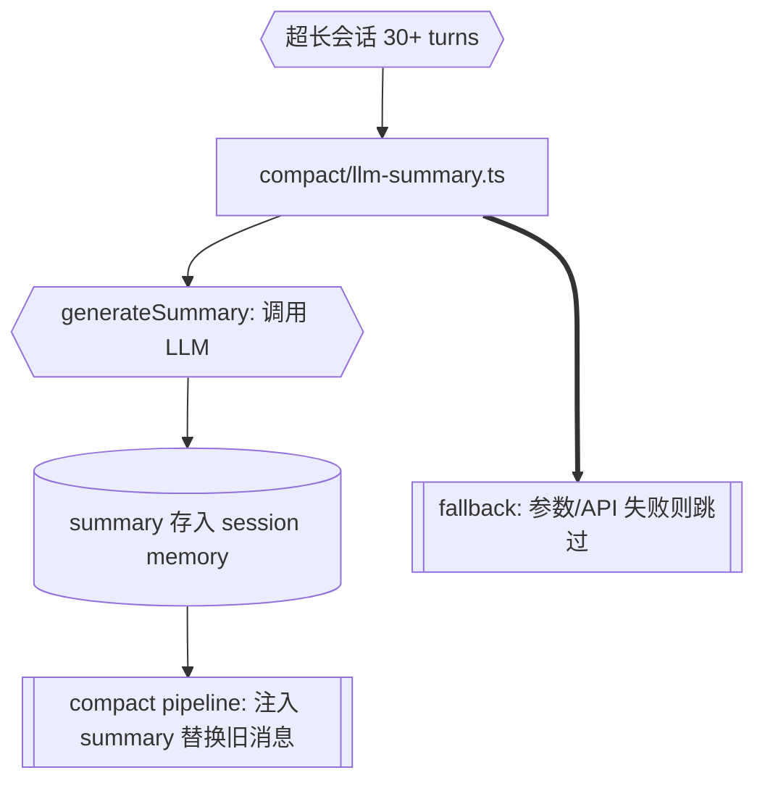

# omp 回流 P5 — LLM 摘要压缩

# omp 回流 P5 — LLM 摘要压缩

> 来源: `.rivet/knowledge/tianshu-omp-feature-inventory.md` 优先级 5

**目标:** 天枢新增第 5 层 compaction 策略——用模型自身对超长会话（30+ turns）的旧对话历史做语义摘要压缩，保留比规则压缩更多的连贯性。omp 的 `compaction.ts` 有完整实现（`generateSummary` / `generateHandoff`），天枢零 LLM 压缩可以叠加此层。

**改动:** 新建 `src/compact/llm-summary.ts`，导出 `generateConversationSummary(messages, model, apiKey)`。在 `src/compact/micro.ts` 的 compaction pipeline 中插入摘要层——当 turnCount > SUMMARY_THRESHOLD(30) 且 `RIVET_ENABLE_LLM_SUMMARY` 环境变量为真时触发。opt-in 模式避免成本意外。

**安全不变量:**
1. 必须 RIVET_ENABLE_LLM_SUMMARY=true 才启用（默认关闭）
2. LLM 调用失败时静默跳过（不阻塞 compaction）
3. 摘要存放 `{ content, generatedAt, turnRange }`，可追溯
4. 不使用 session 的主 API key——需要独立配置或降级

**任务拆解:**
| # | 文件 | 改动 |
|---|------|------|
| 1 | `src/compact/llm-summary.ts` (新建) | `generateConversationSummary` + prompt 模板 |
| 2 | `src/compact/micro.ts` | 在 pipeline 中插入摘要层触发点 |
| 3 | `src/compact/__tests__/llm-summary.test.ts` (新建) | 纯函数测试 + mock LLM 测试 |
| 4 | `src/config/` | 添加 `rivet.llmSummary.enabled` 配置项 |

**验证:** typecheck + `llm-summary.test.ts` 全绿 + 手动 `/team` 长会话测试（需真实 API key 环境）

**风险:** 消耗 LLM token 成本，opt-in 控制。

**commit:** `feat(compact): add opt-in LLM conversation summarization layer`
