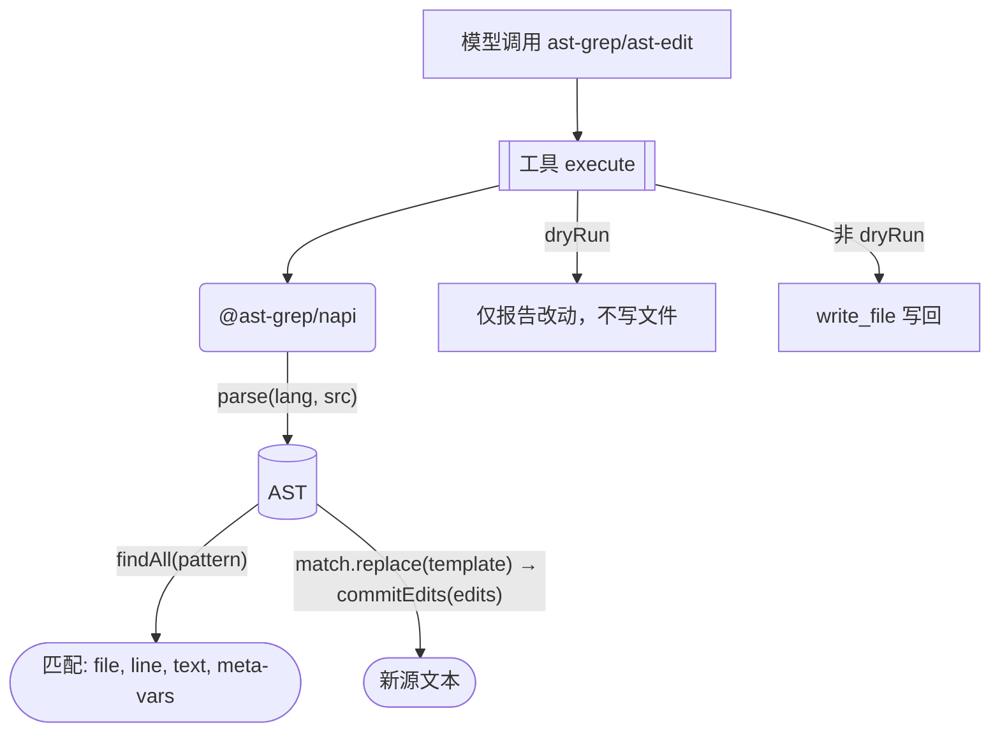

> **Status: APPROVED** — 2026-06-27T08:37:39.632Z

# omp 回流 P6 — AST 语义编辑工具（@ast-grep/napi 路径）

# omp 回流 P6 — AST 语义编辑工具（@ast-grep/napi 路径）

> 来源: `.rivet/knowledge/tianshu-omp-feature-inventory.md` 优先级 6
> **2026-07-01 调整:** 引擎从纯 JS tree-sitter WASM 切换为 `@ast-grep/napi`（预编译 Rust napi 绑定）。底层引擎为 `ast-grep-core`——omp 的 `pi-natives/src/ast.rs` 直接依赖同一个 crate（`use ast_grep_core::…`），parser 层共享 tree-sitter grammar。

**目标:** 为天枢新增两个 ast-grep 驱动的语义编辑工具——`ast-grep`（AST 模式搜索）和 `ast-edit`（AST 模式替换）。

**技术栈:** TypeScript strict, Node.js 22, `node:test`, `@ast-grep/napi` v0.44（预编译 napi 绑定，内置 TypeScript/JavaScript/Tsx/Html/Css 语言，零 Rust 工具链）

**核心决策 — 为什么 `@ast-grep/napi` 而非 raw tree-sitter WASM：**

| 维度 | tree-sitter WASM | `@ast-grep/napi` |
|------|:---:|:---:|
| 引擎 | C→WASM 编译，Node 内解释执行 | Rust napi 原生二进制，与 omp 共享 `ast-grep-core` |
| API 抽象层 | raw S-expression query + 手动 find/replace 循环 | Pattern 编译 + `findAll`/`replaceAll` + strictness/selector |
| 多语言 | 需要按语言 `npm install tree-sitter-<lang>` | 内置 5 语言，扩展需 `registerDynamicLanguage` |
| 性能 | WASM 比 native 慢 5-10x | 原生速度 |
| 构建 | 零编译门槛 | 预编译 binary，`npm install` 直接拉取 |
| 与 omp 对齐 | 不同引擎 | 同一引擎（`ast-grep-core`），工具语义可直接对齐 |



## 安全不变量

1. **零 Rust 工具链**：`@ast-grep/napi` 是预编译 napi 二进制，`npm install` 直接拉取对应平台的 `.node` 文件
2. **不修改 omp 的 Rust 代码**：独立 npm 依赖，无 Cargo 集成
3. **ast-edit 默认 dryRun: true**：不传 `--apply` 绝不写文件，防止意外破坏
4. **ast-grep 只读**：零副作用
5. **同文件多编辑原子写**：同一文件的多个替换先在内存中完成，一次性 `write_file`，不产生中间态
6. **不替代已有工具**：ast-grep 是 `grep` 的语义补充，ast-edit 是 `edit_file` 的语义补充

## 触发路径清单

| 输入 | 行为 |
|------|------|
| `ast-grep { pattern: "function $NAME($$$) { $$$ }", paths: [...] }` | 搜索匹配 AST 节点，返回 file:line:col + matched text |
| `ast-grep { pattern: "console.log($$$)", paths: [...], lang: "TypeScript" }` | 指定语言，避免扩展名歧义 |
| `ast-edit { ops: [{ find:"var $X = $Y", replace:"const $X = $Y" }], paths: [...] }` | dryRun 模式，返回变更预览 |
| `ast-edit { ops: [...], paths: [...], dryRun: false }` | 实际写文件 |
| 目标文件不存在 | 报错：文件未找到 |
| 目标文件语法错误 | 报错：解析失败 + file:line + 跳过该文件 |
| pattern 语法错误 | 报错：pattern 编译失败 + 诊断信息 |
| pattern 无匹配 | 返回空结果 |

## 条件矩阵

| 条件 | ast-grep | ast-edit |
|------|:--:|:--:|
| pattern 匹配 | 返回匹配位置 + meta-variables | 执行替换→写回 |
| pattern 无匹配 | 返回空结果 | 返回空（无改动） |
| 文件语法错误 | 跳过该文件 + warn | 跳过该文件 + warn |
| 跨文件 glob | 支持 glob + directory | 支持 glob + directory |
| dryRun（ast-edit） | N/A | 默认 true，仅报告不写文件 |
| 大文件 >500KB | 截断提示（保护内存） | 截断提示 |
| meta-variables 捕获 | 可选 includeMeta | N/A（替换自动绑定） |

## 任务拆解

### 任务 0：`npm install @ast-grep/napi` + 二进制验证（前置门）

在执行任何代码编写前，验证 native binary 在当前平台可加载：

```bash
npm install @ast-grep/napi
node -e "
const { parse, Lang } = require('@ast-grep/napi');
const root = parse(Lang.TypeScript, 'const x = 1; function foo() { return x; }').root();
const matches = root.findAll('function \$NAME() { \$\$\$BODY }');
console.log(matches.length, 'match(es), root kind:', root.kind());
matches.forEach(m => console.log(' -', m.text().trim().slice(0, 40)));
"
```

预期输出: `1 match(es), root kind: program` 后跟匹配文本。如果探针失败（napi 版本不兼容 Node.js v24 / 平台二进制缺失），整个方案需调整（降级到纯 JS tree-sitter WASM 或等待 napi 版本升级）。

### 任务 1：新建 `src/tools/ast-grep.ts` — AST 语义搜索

依赖 `@ast-grep/napi` 的 `parse` + `findAll`。输入：pattern（ast-grep Pattern 语法）、paths、可选 lang/limit/includeMeta。输出：`{ file, line, column, matchText, metaVariables? }[]` + summary。

关键实现点：
- 语言推断：有 `lang` 参数用显式值，否则从文件扩展名推断（`.ts`→TypeScript, `.tsx`→Tsx, `.js`→JavaScript, `.html`→Html, `.css`→Css）
- 用 `glob` + `readFile` 遍历 paths（复用现有 `src/tools/` 下的 glob 能力），每个文件 `parse(lang, source).root().findAll(pattern)`
- `findAll` 接受 ast-grep Pattern 字符串（如 `function $NAME($$$ARGS) { $$$BODY }`）或 rule 对象（如 `{ rule: { kind: 'function_declaration' } }`）
- 按 (file, line, column) 排序输出

测试：`src/tools/__tests__/ast-grep.test.ts` — TypeScript fixture 文件，验证 function/const/import 等常见节点的匹配

### 任务 2：新建 `src/tools/ast-edit.ts` — AST 语义替换

依赖 `@ast-grep/napi` 的 `parse` + `SgNode.replace` + `SgRoot.commitEdits`。输入：`ops[]`（`{ find: pattern, replace: template }`）、paths、可选 lang/dryRun/limit。输出：每个文件的 `{ file, changes: [{ before, after, line }] }` + summary。

关键实现点：
- **单节点替换**：`match.replace(template)` 返回 `{ startPos, endPos, insertedText }` 编辑对象（字节偏移 + 替换文本）
- **批量提交**：收集同文件所有 edits 后，`root.commitEdits(edits)` 一次性生成新源文本——无需自己实现 offset 排序和字符串拼接
- ast-grep Pattern 中的 meta-variable（如 `$NAME`）在 replace template 中保持字面量——若需捕获再拼接，先用 `match.getMatch('NAME')?.text()` 取值再构造
- 默认 `dryRun: true` — 只返回 diff 预览不写文件
- 非 dryRun 时，用 `write_file` 工具写回（复用现有工具而非直接 `fs.writeFile`，保证会话一致性）
- 同文件多个 find/replace op 按顺序：每轮 `findAll` → collect edits → `commitEdits` → 重新 `parse` 进入下一轮

测试：`src/tools/__tests__/ast-edit.test.ts` — TypeScript fixture，验证 dryRun 不写文件、非 dryRun 写回、多 op 顺序应用

### 任务 3：在 `src/main.tsx` 注册两个新工具 + typecheck + 回归测试

- 导入 `createAstGrepTool` / `createAstEditTool` 并注册
- 验证命令：
  ```bash
  npx tsc --noEmit
  node --import tsx --test src/tools/__tests__/ast-grep.test.ts
  node --import tsx --test src/tools/__tests__/ast-edit.test.ts
  ```

commit: `feat(tools): add AST semantic search (ast-grep) and rewrite (ast-edit) via @ast-grep/napi`

---

## 与原计划的差异

| 原计划 | 新计划 |
|--------|--------|
| `tree-sitter` + `tree-sitter-typescript` 等独立 grammar | `@ast-grep/napi` 单一依赖，内置多语言 |
| 任务 1: grammar 管理（loadGrammar, isGrammarInstalled） | 删除 — napi 内置，无需管理 |
| 需自己实现 find 循环 | `findAll` 直接返回 |
| 需自己实现 replace 循环 + offset 排序 + 字符串拼接 | `match.replace(template)` → `{ startPos, endPos, insertedText }` → `root.commitEdits(edits)` 内置 |
| raw tree-sitter query S-expression | ast-grep Pattern 语法 + rule object |
| 4 个任务 | 4 个任务（Task 0 前置门 + Task 1/2/3） |

## 备注

- `@ast-grep/napi` v0.44 内置语言限定为 Html/JavaScript/Tsx/Css/TypeScript。对天枢 95% 场景（编辑自身 TS 源码）足够。若未来需要 Python/Rust/Go 等额外语言，通过 `registerDynamicLanguage` 按需加载 `tree-sitter-<lang>.wasm`
- ast-grep Pattern 语法文档: https://ast-grep.github.io/guide/pattern-syntax.html
- meta-variables: `$NAME`（单节点）、`$$$REST`（零或多节点）、`$$$`（匿名通配）
- omp 的 ast-edit 支持 `pat`/`out` 两步，天枢版本对应的 `ops[].find` / `ops[].replace` 语义一致
