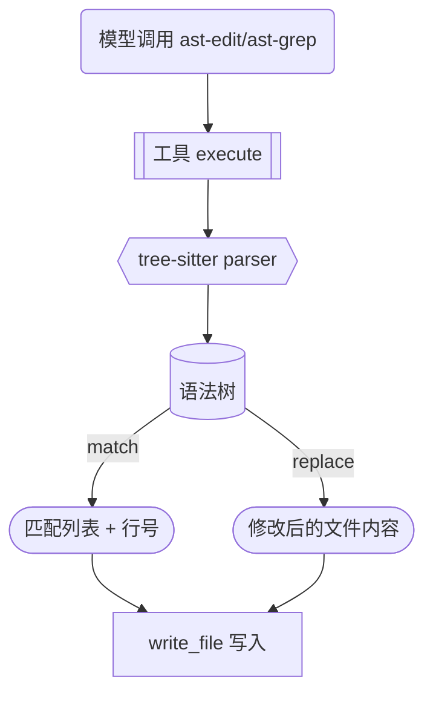

# omp 回流 P6 — AST 语义编辑工具

> 来源: `.rivet/knowledge/tianshu-omp-feature-inventory.md` 优先级 6

**目标:** 为天枢新增两个 tree-sitter 驱动的语义编辑工具——`ast-edit`（按 AST 模式替换代码）和 `ast-grep`（按 AST 模式搜索代码）。omp 通过 Rust napi 绑定（`@oh-my-pi/pi-natives`）实现，天枢采用纯 JS tree-sitter 绑定渐进式路径。

**技术栈：** TypeScript strict, Node.js 22, `node:test`, `tree-sitter` npm 包（纯 JS WASM 绑定），多语言 grammar（TypeScript/JavaScript 自带，Python/JSON/Markdown 按需加载）



---

## 安全不变量

1. **不修改 omp 的 Rust 绑定代码**：天枢用 tree-sitter 纯 JS 实现独立路径
2. **ast-edit 必须 snapshot 文件**：修改前通过 SHA-256 记录原始内容，支持回滚
3. **ast-grep 只读**：零副作用，不改变任何文件
4. **grammar 按需加载**：不预装所有语言，首次使用某语言时从 npm registry 拉取
5. **不替代已有工具**：ast-grep 是 `grep` 的语义补充（搜索语法结构而非文本），ast-edit 是 `edit_file` 的语义补充（操作 AST 节点而非行文本）

---

## 触发路径清单

| 输入 | 行为 |
|------|------|
| `ast-grep { pattern: "(export function $NAME) @fn", paths: [...] }` | 搜索匹配的 AST 节点，返回文件:行号列表 |
| `ast-edit { ops: [{ find:"old", replace:"new" }], paths: [...] }` | 替换 AST 节点，写回文件 |
| 目标文件不存在 | 报错：文件未找到 |
| 目标文件语法错误 | 报错：解析失败 + 行号 |
| 未安装对应 grammar | 自动 `npm install tree-sitter-<lang>` |

---

## 条件矩阵

| 条件 | ast-grep | ast-edit |
|------|:--:|:--:|
| pattern 匹配 | 返回匹配位置 | 执行替换→写回 |
| pattern 无匹配 | 返回空结果 | 返回空（无改动） |
| 文件语法错误 | 跳过该文件 + warn | 跳过该文件 + warn |
| grammar 未安装 | 自动安装 | 自动安装 |
| 跨文件引用（import） | 支持 glob + directory | 支持 glob + directory |
| 大文件 >100KB | 截断提示（保护内存） | 截断提示 |

---

## 任务拆解

### 任务 1：新建 `src/tools/tree-sitter-grammar.ts` — grammar 管理与加载

```typescript
// 负责 language → tree-sitter grammar 的按需加载
// 首次使用: npm install tree-sitter-typescript / tree-sitter-python 等
// 返回 Parser 实例
loadGrammar(language: 'typescript' | 'javascript' | 'python' | 'json'): Parser
getSupportedLanguages(): string[]
isGrammarInstalled(language: string): boolean
```

验证：`node --import tsx --test src/tools/__tests__/tree-sitter-grammar.test.ts`

### 任务 2：新建 `src/tools/ast-grep.ts` — AST 语义搜索

```typescript
// 工具定义: pattern (AST pattern, tree-sitter query S-expression)
//           paths (file/glob/directory 列表)
//           language (可选，自动从文件扩展名推断)
// 输出: { file, line, column, matchText }[] + summary
```

验证：`node --import tsx --test src/tools/__tests__/ast-grep.test.ts`

### 任务 3：新建 `src/tools/ast-edit.ts` — AST 语义替换

```typescript
// 工具定义: ops[].find (AST pattern) + ops[].replace (template)
//           paths (file/glob/directory 列表)
//           dryRun (boolean, 默认 false — 仅报告不写文件)
// 输出: 每个文件的修改摘要 (changed / unchanged / error)
```

验证：`node --import tsx --test src/tools/__tests__/ast-edit.test.ts`

### 任务 4：在 `src/main.tsx` 注册两个新工具 + typecheck + 全量回归

验证命令：
```bash
npx tsc --noEmit
node --import tsx --test src/tools/__tests__/ast-grep.test.ts
node --import tsx --test src/tools/__tests__/ast-edit.test.ts
node --import tsx --test src/tools/__tests__/tree-sitter-grammar.test.ts
```

commit: `feat(tools): add AST semantic code search (ast-grep) and replace (ast-edit) via tree-sitter`

---

## 备注

- omp 的 ast-edit 支持 `pat` / `out` 两步（find→replace），天枢初始版本用 tree-sitter query 的 capture 语法实现等价功能
- omp 的 ast-grep 支持 `skip` 参数跳过大文件，天枢直接用 `limit` cap
- 核心依赖 `tree-sitter` 是纯 WASM 绑定，无需 Rust 工具链——与 omp 的 `@oh-my-pi/pi-natives` 相比，牺牲性能换零编译门槛
