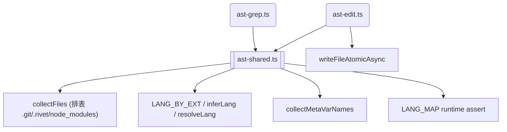

# omp 回流 P6 后续 — 共享模块提取 & 审查项修复

> 来源: P6 审查 findings + 已知限制

**目标:** ① 消除 ast-grep/ast-edit 约 80 行重复代码 → `src/tools/ast-shared.ts`；② `LANG_MAP` 加运行时断言防静默 break；③ `ast-edit` 用 `writeFileAtomicAsync` 替代裸 `writeFileSync`。

**技术栈:** TypeScript strict, Node.js 22, `node:test`, `@ast-grep/napi`



**调研背书:**
- `collectFiles` 仅被 ast-grep:L127 / ast-edit:L184 调用。`startsWith('.')` 改为显式排表 `['node_modules', '.git', '.rivet']`。
- `collectMetaVarNames` 仅被两文件调用，实现完全一致。
- `LANG_MAP` cast 问题：`napi.Lang` 属性 non-enumerable，`typeof langValue !== 'string'` 已有 guard 但不够明确——加 `assert(typeof lv === 'string')` 在类型收窄后尽早失败而非静默跳过。
- 工具层 bypass：`ast-edit` 用裸 `writeFileSync`，改为项目标准的 `writeFileAtomicAsync`（同 `write_file` 工具）。
- 完整的 tool-history/hooks 追踪需要框架层变更（`ToolCallParams` 无 emitEvent），不在本计划范围。

## 任务

### 任务 1：新建 `src/tools/ast-shared.ts` + 测试

- [ ] 创建 `src/tools/ast-shared.ts`：从 ast-grep/ast-edit 提取 `LANG_BY_EXT`、`inferLang`、`resolveLang`、`collectFiles`（修复版）、`collectMetaVarNames`
- [ ] `collectFiles` 修复：`entry.name.startsWith('.')` → `excludeDirs = new Set(['node_modules', '.git', '.rivet'])`
- [ ] 创建 `src/tools/__tests__/ast-shared.test.ts`：测试语言推断、文件收集（含 `.test-tmp` 目录不跳过）、meta-var 解析

**验证:**
```bash
npx tsc --noEmit
node --import tsx --test src/tools/__tests__/ast-shared.test.ts
```

### 任务 2：更新 ast-grep + ast-edit 引用共享模块 + LANG_MAP 断言 + 原子写

- [ ] 修改 `src/tools/ast-grep.ts`：删除本地重复定义 → `import from './ast-shared.js'`
- [ ] 修改 `src/tools/ast-edit.ts`：同上 + `langValue` 加 `assert(typeof lv === 'string', ...)` + `writeFileSync` → `writeFileAtomicAsync`
- [ ] 确认 17 用例全绿

**验证:**
```bash
npx tsc --noEmit
node --import tsx --test src/tools/__tests__/ast-grep.test.ts src/tools/__tests__/ast-edit.test.ts
```

**提交:** `refactor(tools): extract ast-shared, add LANG_MAP runtime assert, use writeFileAtomicAsync`

## 备注

- 工具层事件追踪（onToolComplete hooks）需要 `ToolCallParams` 扩展，属独立框架变更，不在本次范围
- `collectFiles` 的显式排表可后续根据实际需要扩展（如 `.DS_Store`）
