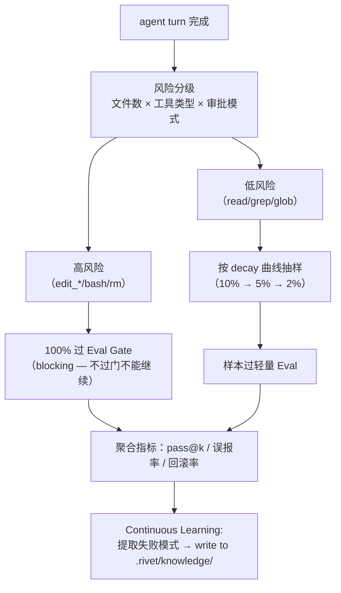

# P0: Eval Harness + Continuous Learning 融合计划

## 天璇方法：跨域碎片 → 收敛

### 探索三域

| 域 | 核心模式 |
|---|---|
| **CI/CD 质量门**（Jenkins） | 每次 push 跑分层检查：fast lint → medium test → slow integration。不可变的 PR 合并前必须过门。 |
| **间隔重复学习**（Anki） | 记忆衰减曲线：刚学的高频复习，掌握好的低频复习。卡片难度自适应调度。 |
| **财务审计抽样**（SOX） | 不审全部交易——按风险分层抽样。高风险交易 100% 审，低风险按比例抽。 |

### 收敛：分层抽样 + 衰减调度 + 不可变门禁



### 温跃层（反证）

- **"每轮都跑 eval"** → 太贵。反证：普通 read 操作不需要 eval。
- **"永远不跑 eval"** → 盲区。反证：bash/rm/edit 无验证则累积不可逆破坏。
- **温跃层**：按工具类型 + 文件数量 + 审批模式做风险分层，高风险 blocking gate，低风险抽样。

## 辅方法：聚焦已有能力，不新建系统

天枢**已有**的验证基础设施：

| 已有 | 位置 | 当前用途 |
|------|------|---------|
| `/review` + L2/L3 | review-router.ts | **手动触发**，单次审查 |
| VSW 快照验证 | loop.ts | **手动触发**，隔离基线跑测试 |
| deliver_task 交付门 | deliver-task.ts | 提交时 GREEN/YELLOW/RED |
| verification summary | loop.ts getVerificationSummary | 回合后被动收集 |
| claim-store + antibodies | claim-store.ts | 失败模式记忆 |
| checkpoint + rollback | checkpoint.ts | 文件回滚 |

**聚焦策略**：不是加一个新 eval 系统，是把已有验证能力**自动化并分层调度**。辅说"好的蒸馏最终只留少数几条——但每条都能改变行为"。

## 设计方案

### ① Eval Harness（自动化质量度量）

**核心新增**：`src/agent/eval-harness.ts` — turn 完成后自动触发的分层验证调度器。

```
evalHarness.afterTurn(turnContext) {
  risk = assessRisk(turnContext)  // 文件数 × 工具类型 × 审批模式 × 修改文件数
  switch (risk) {
    high:   runFullGate()      // blocking — 过门才能继续
    medium: runSampledGate()   // decay 曲线抽样
    low:    skipOrLightCheck() // 只记录，不阻塞
  }
}
```

**分层门禁**：

| 等级 | 触发条件 | 验证内容 | 阻塞？ |
|------|---------|---------|--------|
| **GATE** | edit_*/bash/rm ≥ 3 文件 | VSW 快照验证 + 测试 runner | **是** |
| **CHECK** | edit_* 1-2 文件 | 抽样 50%：diff review + test runner | 否（记录） |
| **NOTE** | 纯 read/grep/glob | 只记录文件数 | 否 |

**指标产出**：
- `pass@k`：最近 k 个 GATE 的通过率
- `false_positive_rate`：review 误报占比
- `rollback_rate`：round 内回滚次数
- `verification_latency_ms`：从 turn 完成到验证完成的时间

### ② Continuous Learning（自动经验沉淀）

**核心新增**：增强 `src/agent/observation-store.ts` + turn 完成后的自动提取。

**触发机制**：每个 turn 完成后，扫描回合中的关键信号。

```
afterTurn(turnContext) {
  signals = extractSignals(turnContext)
  // 信号：审批被拒绝的模式、回滚的模式、compaction 触发模式
  
  for each signal where occurrences >= 3 (同一 session 内):
    pattern = distill(signals, template)
    writeToKnowledge(pattern)  // → .rivet/knowledge/YYYY-MM-DD-pattern.md
    proposeClaim(pattern)      // → claim-store (failure_pattern kind)
}
```

**可提取的信号**：

| 信号 | 提取规则 | 产出 |
|------|---------|------|
| 审批频繁被拒 | 同一 toolName 被拒绝 ≥ 3 次 | `.rivet/knowledge/` 写入"考虑将 X 加入 auto-accept 白名单" |
| 同一文件反复修改 | 同一 path 被 edit ≥ 5 次 | 写入"可能缺少一次性方案，建议先规划再动手" |
| compaction 频繁触发 | 3 轮内 2 次 compact | 写入"建议减少单轮操作粒度" |
| 回滚后重试同一操作 | rollback + 同一 prompt 再次提交 | 写入"任务可能需要更小的拆分" |

## Scope Check

| 文件 | 改动 | 层 |
|------|------|---|
| `src/agent/eval-harness.ts` | **新建** — 分层验证调度器 | agent |
| `src/agent/continuous-learning.ts` | **新建** — 信号提取 + 模式蒸馏 | agent |
| `src/agent/loop.ts` | afterTurn 中调用 evalHarness + continuousLearning | agent |
| `src/agent/observation-store.ts` | 新增 distillPattern 方法 | agent |
| `.rivet/knowledge/` | 自动写入模式文件（已有目录） | data |

**不碰**：review-router、deliver-task、checkpoint、compaction-controller（只读引用）

## 验证计划

### 反证测试

| # | 偷懒实现 | 会红的测试 |
|---|---------|-----------|
| 1 | eval 只在 GATE 级别触发 | 纯 read 操作也会被 GATE 误判——`assessRisk` 应返回 NOTE |
| 2 | 抽样参数写死 | 不同 session 共享相同 decay 状态——应 per-project |
| 3 | 模式提取触发太频繁 | 同一信号被重复写入 `.rivet/knowledge/`——应有去重 |

### 交付门
- tsc 绿
- `src/agent/__tests__/eval-harness.test.ts` — risk 分级逻辑 + decay 曲线 + 抽样
- `src/agent/__tests__/continuous-learning.test.ts` — 信号提取 + 去重 + 写入
- 全量 agent 测试不回归

## 风险与缓解

| 风险 | 缓解 |
|------|------|
| GATE 阻塞正常开发流 | GATE 只在高风险操作触发；可 `/auto` 跳过（记录 audit trail） |
| 抽样导致漏检 | decay 曲线保证低频操作也有最小抽样率（≥ 2%） |
| LLM 驱动的 eval 成本 | 只在高风险 GATE 使用 LLM；CHECK 级用纯规则 |
