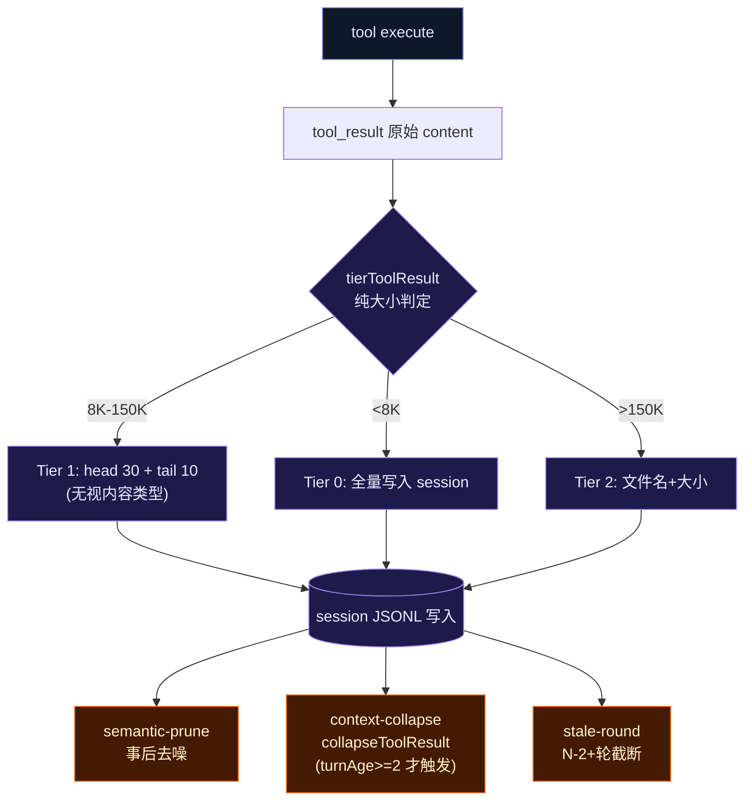
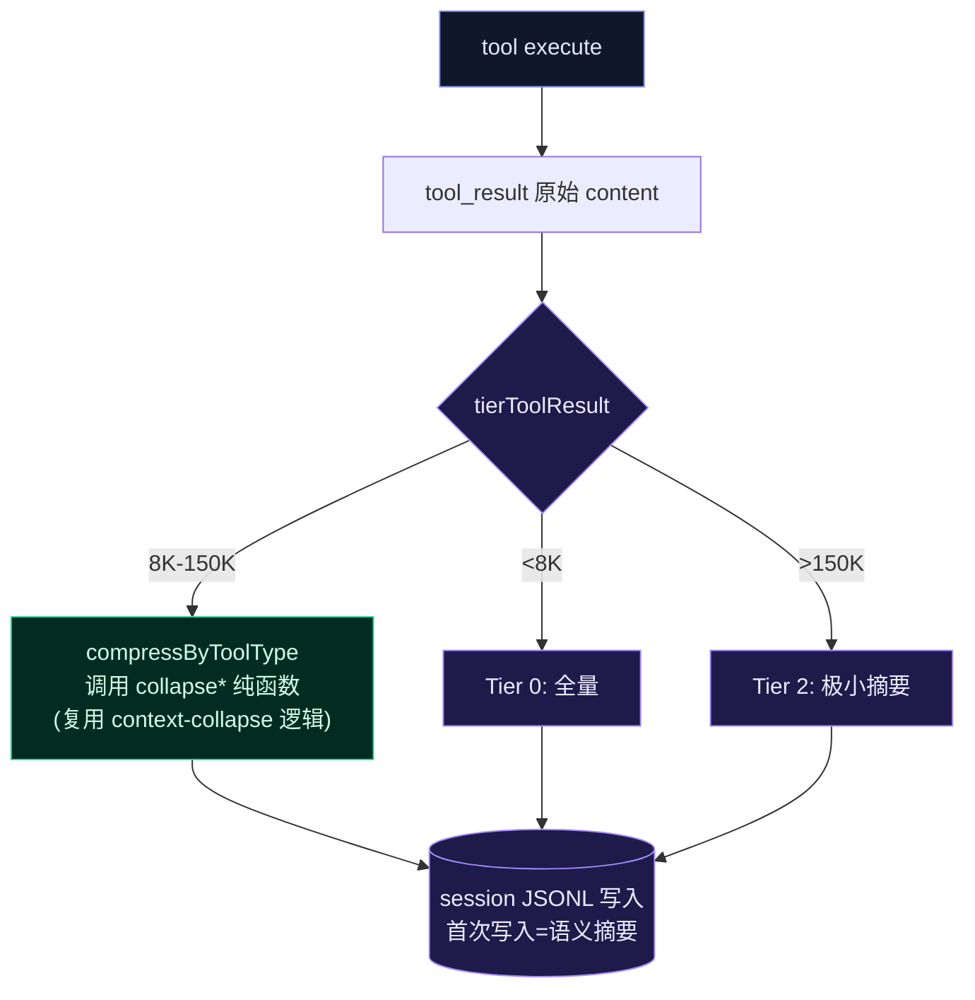

# P3: 内容类型感知压缩

## 问题描述

`tool-result-tiering.ts` 的 Tier 1 对所有工具类型用统一策略：head 30 + tail 10。忽略不同工具输出的语义结构差异。

`context-collapse.ts` 已有按工具类型的语义折叠——`collapseGrepResult`（文件名+计数）、`collapseReadFileResult`（签名提取）、`collapseBashResult`（exit code+tail）。但这些内层函数未导出，仅供 `collapseToolResult` 内部使用。`collapseToolResult` 带了 `turnAge < 2` 守卫——只对 2+ 轮前的旧消息生效，**错失了在首次写入时就做语义压缩的机会**。

`collapseToolResult` 本身是纯函数（text → CollapsedResult），不修改 OaiMessage 数组。修改数组的是调用方——`micro.ts`（`{ ...msg, content: collapsed.summary }`）和 `engine.ts`（`messages[i] = { ...msg, content: collapsed.summary }`）。

**核心洞见**：不需重写压缩逻辑。只需导出 context-collapse 的内层 collapse 函数，在 tiering 的 Tier 1 中直接调用——一次实现，两处消费。

## 当前数据流



## 目标数据流



## 设计方案

### 核心决策：复用，不重写

context-collapse.ts 的 `collapseGrepResult`、`collapseReadFileResult`、`collapseBashResult`、`collapseGenericResult` 是纯函数。当前未导出。方案：

1. **导出内层函数**：给四个 collapse 函数加 `export`
2. **tiering 调用**：`compressByToolType()` 分发到对应的 collapse 函数，生成 `[collapsed ...]` 摘要
3. **保留 turnAge 守卫**：`collapseToolResult` 保持不变——micro.ts 和 engine.ts 的 post-hoc 路径不受影响（两者各有自己的 turnAge 守卫，详见下方「三路径关系」）
4. **差异增强**：部分 collapse 函数需要微调以适配 tiering 场景（见下方）

### 改动范围

| 文件 | 改动 | 说明 |
|------|------|------|
| `src/compact/context-collapse.ts` | `export` 四个内层函数 + 微调 | 最小改动 |
| `src/agent/tool-result-tiering.ts` | 导入 collapse 函数，新增 `compressByToolType()`，修改 `buildTier1Inline()` | 消费方 |
| `src/agent/__tests__/tool-result-tiering.test.ts` | 新增按工具类型压缩的测试用例 | 验证 |
| `src/compact/__tests__/context-collapse.test.ts` | 验证导出函数可独立调用 | 不改或微调 |

### context-collapse.ts 需要的最小改动

```typescript
// 当前（未导出）:
function collapseGrepResult(toolName: string, content: string, originalTokens: number): CollapsedResult { ... }

// 改为（导出 + 增加可选的 turnAge 参数，默认行为不变）:
export function collapseGrepResult(toolName: string, content: string, originalTokens: number): CollapsedResult { ... }
```

四个内层函数全部加 `export`。`collapseToolResult` 包装函数保持不变。

### collapseReadFileResult 的微调

当前 `collapseReadFileResult` 只扫描前 100 行提取签名。对于 tiering 场景（首次写入），这个范围可能不够——一个大文件的 import 块可能超过 100 行。需要增加 `maxScanLines` 参数，默认 100（向后兼容），tiering 调用时传更大的值（如 300）。

```typescript
export function collapseReadFileResult(
  content: string,
  originalTokens: number,
  maxScanLines?: number,  // 默认 100
): CollapsedResult { ... }
```

### collapseBashResult 的微调

当前只保留 tail 最后 3 行。tiering 场景需要同时保留 fail/error 行（semantic-prune 已有这个逻辑，但那是后处理）。可以在 collapseBashResult 中增加 fail 行检测：

```typescript
export function collapseBashResult(content: string, originalTokens: number): CollapsedResult {
  const lines = content.split('\n').filter(l => l.trim())
  // 🆕 提取 fail/error 行
  const failPattern = /fail|error|FAIL|ERROR|✗|✘|❌/i
  const failLines = lines.filter(l => failPattern.test(l) && !/^\s*[✓✔●◌⊙]/.test(l))
  // ... 保留原有 tail 逻辑，同时附加 failLines
}
```

### tool-result-tiering.ts 的改动

```typescript
import { collapseGrepResult, collapseReadFileResult, collapseBashResult, collapseGenericResult } from '../compact/context-collapse.js'

const CHARS_PER_TOKEN = 4

function compressByToolType(toolName: string, content: string): string | null {
  const originalTokens = Math.ceil(content.length / CHARS_PER_TOKEN)
  
  // grep / glob / search: 文件名+计数摘要
  if (toolName === 'grep' || toolName === 'glob' || toolName === 'search') {
    const r = collapseGrepResult(toolName, content, originalTokens)
    return r.summary
  }
  // read_file: 签名骨架
  if (toolName === 'read_file') {
    const r = collapseReadFileResult(content, originalTokens, 300)
    return r.summary
  }
  // bash: exit code + tail + fail 行
  if (toolName === 'bash') {
    const r = collapseBashResult(content, originalTokens)
    return r.summary
  }
  // 默认: 不做语义压缩，退回 head+tail
  // collapseGenericResult 只保留 3 行 preview，对 delegate_task/web_fetch
  // 等大结果比原始 head 30 + tail 10 还激进。tiering 场景用原始 head+tail 更安全
  return content
}
```

Tier 1 路径改为：先调 `compressByToolType`，若返回 null 或压缩后仍超限，再走 head+tail 兜底：

```typescript
function buildTier1Inline(toolName: string, content: string, artifactId?: string): string {
  const compressed = compressByToolType(toolName, content)
  
  if (compressed && compressed.length < content.length * 0.8) {
    // 压缩有效（至少缩减 20%）：使用压缩结果
    const ref = artifactId ? ` [artifact:${artifactId}]` : ''
    return `${compressed}${ref}`
  }
  
  // 压缩无效或压缩比不够：回退到 head+tail
  const lines = content.split('\n')
  const lineCount = lines.length
  const head = lines.slice(0, 30).join('\n')
  const tail = lines.slice(-10).join('\n')
  const ref = artifactId ? ` [artifact:${artifactId}]` : ''
  return [
    `[tiered-summary: ${toolName}, ${lineCount} lines, ${content.length} chars${ref}]`,
    head,
    `... ${Math.max(0, lineCount - 40)} lines omitted (full content on disk) ...`,
    tail,
  ].join('\n')
}
```

### 安全不变量

1. **append-only**：压缩只在 tiering 首次写入时执行。session JSONL 写入后不再修改
2. **artifact 保留**：Tier 1/2 完整内容始终写 artifact store。`read_section` 可恢复
3. **Tier 0 不变**：<8K chars 不做任何压缩
4. **降级兜底**：压缩比不足 20% 时回退到 head+tail；任何异常返回原内容
5. **一次实现**：collapse 逻辑只存在于 context-collapse.ts，tiering 只是消费方

### 条件矩阵

| 条件 | Tier 0 (<8K) | Tier 1 (8K-150K) | Tier 2 (>150K) |
|------|-------------|-------------------|----------------|
| grep/glob/search | 全量 | `[collapsed grep: N matches in M files: ...]` | Tier 2 极小摘要 |
| bash | 全量 | `[collapsed bash: N lines, exit X, tail: ...]` + fail行 | 极小摘要 |
| read_file | 全量 | `[collapsed read_file: N lines, classes: ..., functions: ...]` | 极小摘要 |
| 其他工具 | 全量 | head 30 + tail 10（默认回退，不用 generic collapse） | 极小摘要 |
| 小窗口 (<500K) | 全量 | 全量（tiering 不触发） | 全量 |

### 反证测试表

| 测试 | 预期 | 如果只做 head+tail |
|------|------|-------------------|
| grep 50KB → summary <500 chars | 文件名计数摘要 | head 30 行 >2KB |
| bash test PASS 行被 collapse 摘要替代 | 摘要含 exit code + tail | PASS 行原样保留入 session |
| read_file 2000行 → 签名摘要 | classes/functions 列表 | import 块外全部截断 |
| 未知工具类型 → head+tail 回退 | 默认不压缩，保留原始 head+tail | 若误用 generic collapse 则只剩 3 行 preview |
| Tier 0 原样返回 | 不调 compressByToolType | 全量保留（正确） |
| compressByToolType 异常 → 回退 head+tail | 不丢数据 | 崩溃则丢数据（本方案 try-catch 防护） |

## 三路径关系

`collapseToolResult` 被三个调用方消费，各自有独立的守卫层。导出内层函数后，tiering 成为第四个消费方（跳过 `collapseToolResult` 的包装守卫，直接调内层函数）：

```
tiering 路径（首次写入，新增）:
  tool execute → tierToolResult → compressByToolType → collapseGrepResult/collapseBashResult/...
  → session JSONL 首次写入（语义摘要）
  守卫: Tier 0 不触发（仅在 8K-150K 的 Tier 1 调用）；压缩比不足 20% 回退 head+tail

micro.ts 路径（post-hoc, 不变）:
  session JSONL → microCompactMessage → collapseToolResult → 替换 msg.content
  两层守卫: micro.ts 调用方 turnAge >= 4 + collapseToolResult 内部 turnAge >= 2
  实际效果: 仅对 4+ 轮前的旧消息触发折叠

engine.ts 路径（requestTimeCollapse, 不变）:
  session JSONL → requestTimeCollapse → collapseToolResult → 替换 msg.content
  守卫: computeCollapseBoundary 计算的 turnAge + collapseToolResult 内部 turnAge >= 2
  实际效果: 基于窗口边界和消息位置动态决定折叠范围
```

三路径共享同一组 collapse 纯函数。`collapseToolResult` 的内部守卫（`turnAge < 2` 和 `content.length < 200`）对 micro.ts 和 engine.ts 仍然生效。tiering 路径绕过这些守卫（直接调内层函数），但受 Tier 0 大小守卫和压缩比回退保护。

## 验证计划

```bash
npx tsc --noEmit
npm exec -- tsx --test src/agent/__tests__/tool-result-tiering.test.ts
npm exec -- tsx --test src/compact/__tests__/context-collapse.test.ts
```

## 风险与缓解

| 风险 | 缓解 |
|------|------|
| collapse 函数原为 post-hoc 设计，前移到 tiering 可能过度压缩 | 压缩比不足 20% 时回退 head+tail；artifact 可恢复 |
| collapseReadFileResult 只扫前 100 行，漏掉深层签名 | 增加 maxScanLines 参数，tiering 传 300 |
| collapseBashResult 不保留 fail 行（当前无此逻辑） | 在 collapseBashResult 中增加 fail 行检测 |
| 与 semantic-prune 重复处理 | 互补不冲突——tiering 做语义摘要，prune 做垃圾目录删除 + pass 行移除 |

## 执行步骤

1. context-collapse.ts: 给四个内层函数加 `export`，`collapseReadFileResult` 增加 `maxScanLines` 参数
2. context-collapse.ts: `collapseBashResult` 增加 fail 行保留逻辑
3. tool-result-tiering.ts: 导入 collapse 函数，新增 `compressByToolType()`
4. tool-result-tiering.ts: 修改 `buildTier1Inline()`，先调 `compressByToolType` 再兜底
5. 新增/更新测试用例
6. typecheck + 全量测试
