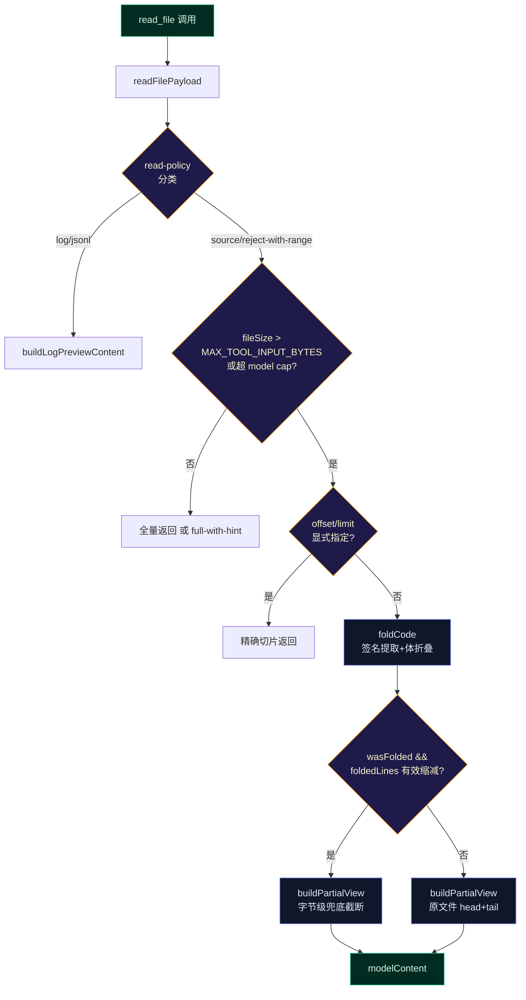

# P4: 智能代码折叠

## 问题描述

`read_file` 对大文件返回 PARTIAL view（首页 + 导航），或 head+tail 截断。LLM 拿到的是一段拼接碎片——签名在头、实现在尾、中间被截。对于需要理解代码结构的任务（重构、调试、cross-reference），这种截断丢掉了最重要的结构信息。

Headroom 的 CodeCompressor 用 tree-sitter AST 做签名提取 + 体折叠。天枢不需要引入原生依赖——源码语言以 TS/JS/TSX/Python/JSON/Markdown 为主，正则即可覆盖 90% 场景。

## 架构数据流



## 调用链（两个 PARTIAL view 分支都要接入）

`read-file.ts` 中有两个 `buildPartialView` 调用点，折叠需要同时覆盖：

```
分支 A (L327-337): fileSize > MAX_TOOL_INPUT_BYTES (100KB) 且 policy.action === 'partial'
  → 超大文件，readFile 全部读入内存后走 PARTIAL view
  → 🆕 折叠插入点：buildPartialView 之前调 foldCode

分支 B (L366-373): policy.action === 'partial' 且 !hasExplicitRange
  → 文件装入内存但 modelContent 超过 cap.maxChars
  → 🆕 折叠插入点：buildPartialView 之前调 foldCode
```

两个分支的折叠逻辑完全相同——先 foldCode 提取骨架，再用 buildPartialView 做字节级兜底。

## 影响范围

| 文件 | 改动 | 说明 |
|------|------|------|
| `src/compact/code-fold.ts` | **新建** | `foldCode()` 核心实现 |
| `src/compact/__tests__/code-fold.test.ts` | **新建** | 单元测试 |
| `src/tools/read-file.ts` | 修改 | 两个 `buildPartialView` 调用点前插入 `foldCode` |

注意：`code-fold` 放在 `src/compact/` 而非 `src/tools/`，因为它是一个纯 text→text 压缩层，与 `context-collapse`、`semantic-prune` 属于同一概念空间。`read-file.ts` 是它的唯一消费方。

## 实现设计

### 语言检测

从扩展名推断，不做内容启发式（避免误判）：

```typescript
type FoldableLanguage = 'ts' | 'tsx' | 'js' | 'jsx' | 'py' | 'json' | 'md' | 'unknown'

function detectLanguage(filePath: string): FoldableLanguage {
  const ext = extname(filePath).toLowerCase()
  const map: Record<string, FoldableLanguage> = {
    '.ts': 'ts', '.tsx': 'tsx',
    '.js': 'js', '.jsx': 'jsx', '.mjs': 'js', '.cjs': 'js',
    '.py': 'py', '.pyi': 'py',
    '.json': 'json',
    '.md': 'md', '.mdx': 'md',
  }
  return map[ext] ?? 'unknown'
}
```

### 签名提取 + 体折叠（TS/JS 族）

正则策略（不依赖 tree-sitter）：

```
阶段 1 — 分类行:
  import/export from ...      → 保留整行
  export function/const/class → 保留签名行
  function xxx(                → 保留签名行
  class/interface/enum/type   → 保留签名行
  /** doc comment */           → 保留（紧邻签名的）
  其他                         → 折叠候选

阶段 2 — 体折叠:
  追踪大括号深度。
  进入 { → 深度+1，若深度=1 且当前在函数/类签名后 → 开始折叠
  折叠区内 → 跳过（不输出）
  遇到 } 深度回落 → 若回落到 0 → 输出 "{ … }" 并结束折叠
  深度=0 的非签名行 → 正常输出

阶段 3 — 行数限制:
  折叠后超过 maxLines（默认 200）→ 截断为折叠签名头 + 尾 20 行
  maxLines 是行数维度的软限制，字节维度的硬限制由 buildPartialView 兜底
```

关键约束：

- 折叠体后插入 `{ … }` 占位，让 LLM 知道这里有被折叠的实现
- 保留 export 签名——这是 LLM 判断模块边界的最关键信息
- 不折叠 interface/type 定义（它们本身就是结构声明，体很小）
- doc comment（`/** ... */`、`//` 行）紧邻签名时保留

### Python 处理

- 检测 `def `、`class ` 行 → 保留签名
- 缩进追踪 → 函数体折叠（缩进 > 签名行缩进的部分）
- `@decorator` 行保留

### JSON/Markdown/未知

- JSON: 保留 key 名 + 类型提示（`"key": "…"`、`"key": [N items]`、`"key": { … }`）
- Markdown: 保留标题行（`#`/`##`/`###`），段落首句，去列表细节
- 未知: 退回现有 head+tail 截断（不折叠）

### maxLines 与 maxChars 的优先级

**先按行折叠（maxLines=200），再按字节截断（buildPartialView + cap.maxChars）。** 两层是串行兜底关系：

1. `foldCode(content, { maxLines: 200 })` → 签名骨架（控制在 ~200 行）
2. `buildPartialView(folded, filePath, cap.maxChars)` → 字节截断兜底（如果 200 行签名仍超 cap）

如果折叠后 200 行签名骨架的字节数已经小于 `cap.maxChars`，`buildPartialView` 不会再次截断——全量输出折叠结果。这是最常见的情况：200 行签名通常 <20KB，远小于 model cap。

### 有效性判断用行数而非字节数

折叠的价值在行数减少——签名行本身可能很长（`export async function readFilePayload(...)`），被折叠掉的短 getter 函数体可能只有几行。用字节数比较会误判"折叠无效"：

```
❌ fold.folded.length < content.length * 0.7      // 字节比较——短体长签名时误判
✅ fold.foldedLines < fold.originalLines * 0.7    // 行数比较——反映真实折叠量
```

```typescript
if (fold.wasFolded && fold.foldedLines < fold.originalLines * 0.7) {
  // 折叠有效（行数至少减少 30%）→ 使用折叠结果
} else {
  // 折叠无效 → 退回原始 PARTIAL view
}
```

### 消费者接口

```typescript
// src/compact/code-fold.ts
export interface FoldOptions {
  filePath: string
  maxLines?: number  // 默认 200。行数软限制，字节硬限制由 buildPartialView 兜底
}

export interface FoldResult {
  folded: string           // 折叠后文本
  originalLines: number    // 原始行数
  foldedLines: number      // 折叠后行数
  signatures: string[]     // 提取的签名摘要（用于日志/调试）
  wasFolded: boolean       // 是否实际执行了折叠（unknown 语言/短文件 = false）
}

export function foldCode(content: string, options: FoldOptions): FoldResult
```

### read-file.ts 调用点（两个分支统一逻辑）

两个 PARTIAL view 调用点前插入相同的折叠逻辑。抽取为内联调用，避免重复：

```typescript
// readFilePayload() 中，L327 和 L366 两个分支共享以下模式：

function applyFoldThenPartial(
  content: string,
  filePath: string,
  cap: ModelReadCap,
): string {
  const fold = foldCode(content, { filePath, maxLines: 200 })
  if (fold.wasFolded && fold.foldedLines < fold.originalLines * 0.7) {
    // 折叠有效（行数至少缩减 30%）→ 对折叠结果做字节级兜底
    return buildPartialView(fold.folded, filePath, cap.maxChars)
  }
  // 折叠无效 → 回退原文件 PARTIAL view
  return buildPartialView(content, filePath, cap.maxChars)
}
```

分支 A (L327-337) 改为：
```typescript
if (fileSize > MAX_TOOL_INPUT_BYTES && !hasExplicitRange) {
  if (policy.action === 'partial') {
    const content = await readFile(filePath, 'utf-8')
    const cap = options.modelCap ?? DEFAULT_MODEL_READ_CAP
    const partialContent = applyFoldThenPartial(content, filePath, cap)
    // ... 其余不变
  }
}
```

分支 B (L366-373) 改为：
```typescript
if (policy.action === 'partial' && !hasExplicitRange) {
  const partialContent = applyFoldThenPartial(content, filePath, cap)
  // ... 其余不变
}
```

## 边界情况与安全

| 场景 | 行为 |
|------|------|
| 单行/短文件（< 50 行） | `wasFolded=false`，原样返回 |
| 非代码文件（.log/.jsonl/.txt） | `wasFolded=false`，走现有 log preview |
| 大括号不匹配 | 深度追踪有 -1 保护，不匹配时放弃折叠，回退 head+tail |
| 超大文件（> 5000 行） | 只处理前 3000 行做签名提取，其余标记为省略 |
| offset/limit 显式指定 | 不折叠——用户已指定精确范围 |
| 折叠后 200 行签名仍超 cap.maxChars | buildPartialView 二次截断兜底 |

## 验证计划

1. **typecheck**: `npx tsc --noEmit`
2. **单元测试** (`src/compact/__tests__/code-fold.test.ts`):
   - TS 函数+类折叠：签名保留、体折叠、`{ … }` 占位
   - JSX 组件折叠：保留 `export function Component`、折叠 JSX 体
   - Python 折叠：`def` + 缩进体折叠、`@decorator` 保留
   - 边界：空文件、单行、大括号不匹配、5000+ 行
   - 回退：unknown 语言 `wasFolded=false`
   - **有效性判断**：确认用 `foldedLines < originalLines * 0.7` 而非字节比较
3. **集成测试** (`src/tools/__tests__/read-file*.test.ts`):
   - 超大文件（>100KB）→ 触发分支 A 折叠
   - 中等文件（超 cap 但不超 100KB）→ 触发分支 B 折叠
   - 小文件 → 不触发折叠，全量返回
   - offset/limit → 不触发折叠
4. **回归测试**: `src/compact/__tests__/context-collapse.test.ts` 确认 context-collapse 行为不变

## 风险与缓解

- **折叠太激进丢 context**: maxLines=200 + 保留所有 export 签名。折叠只在 PARTIAL view 路径触发，正常大小文件全量返回
- **正则误判签名**: 分号/字符串中的 `function` 关键词可能被误判。加前后缀约束（`/^\s*(export\s+)?(async\s+)?function\s+\w/`）
- **大括号深度追踪 bug**: 最坏情况 = 折叠体不匹配时 `wasFolded=false`，退回现有 head+tail——不会比现在更差
- **两个分支行为不一致**: 抽取 `applyFoldThenPartial` 内联函数，确保两个调用点使用完全相同的折叠逻辑

## 与 P3 的协作面

P3 在 tiering 的 Tier 1 中为 `read_file` 结果添加内容感知压缩。P4 的 `foldCode` 是 read_file 的结果预处理。两者互不冲突：

- P4 先跑（在 readFilePayload 内），产出折叠后的 modelContent
- P3 的 tiering 后跑（在 tool-execution.ts 中），对 modelContent 做 Tier 1 压缩

P4 的 `foldCode` 也可以被 P3 的 `compressByToolType('read_file', ...)` 调用——如果 read_file 的 modelContent 在 P4 层面未触发折叠（因为文件不够大），P3 的 Tier 1 仍可以再次折叠。这是安全冗余，不是冲突。
