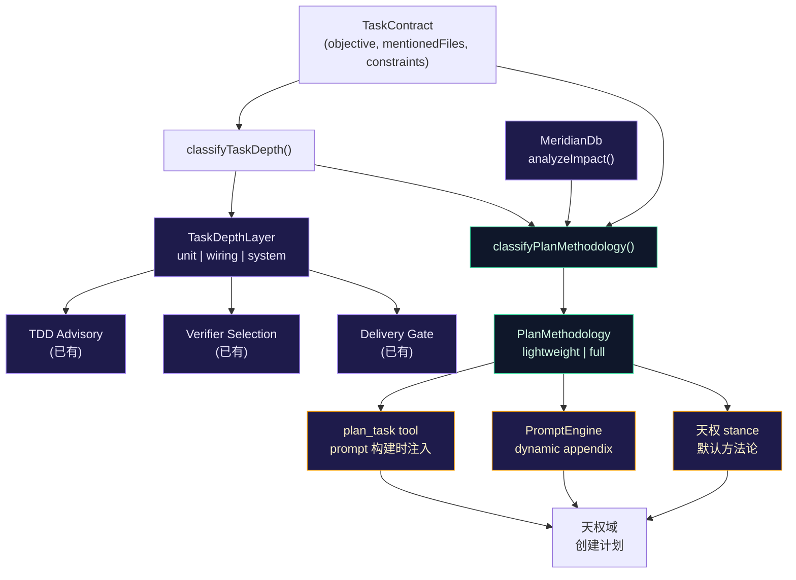
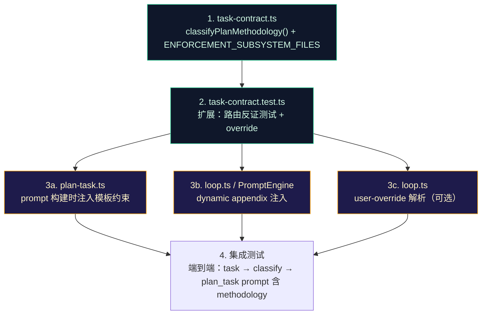

# PlanDesignIntentRouter — 任务复杂度→计划方法论智能路由

# PlanDesignIntentRouter — 任务复杂度→计划方法论智能路由

> 设计日期：2026-06-14
> 星域：天权（主设计） + 天璇（碎片收敛） + 贪狼（系统联合） + 瑶光（反证验证）

---

## Background: 三个独立输入共享同一缺口

当前系统有三个独立存在的推理产物，它们各自正确，但**没有连接**——天权做计划时不知道用哪个模板，天梁执行时不知道按哪个方法论验证。

- **Input A**: `TaskDepthLayer`（`src/context/task-contract.ts:310`）— 按模块边界数分类为 unit/wiring/system，已有 verb heuristics + impact analysis + taskKind bias。消费于 TDD advisory 注入、verifier 选择、delivery gate 深度标注。
- **Input B**: 完整版计划模板（`docs/superpowers/plans/2026-06-14-plan-methodology-template.md`）— 九阶段，为多门协同变更设计（安全/权限/沙箱）。
- **Input C**: 轻量版计划模板（`docs/superpowers/plans/2026-06-14-plan-methodology-lightweight.md`）— 五阶段，为单模块重构/内聚变更设计。

**共享缺口**：天权创建计划时，没有机制判断"这个任务应该用哪个模板"。TaskDepthLayer 分类了模块边界数，但没分类"这个变更涉及几个 enforcement gate"——两个维度正交但相关。

### 天璇收敛（碎片→模式）

三个独立领域指向同一模式：

```
sandbox-path-grants    → 双门（validatePathSafe + defaultWritableRoots）→ 完整版模板
tool-group 生产化       → 单模块（ui/format 内聚）→ 轻量版模板
task_dependency_layer  → 边界计数（unit/wiring/system）→ 已有分类器
```

收敛点：**所有三个系统都在数边界**——TaskDepthLayer 数模块边界，两个模板的区别本质上是 enforcement gate 数量。统一它们的方法不是新建第四个系统，而是让 TaskDepthLayer 的输出**直接驱动模板选择**。

### 贪狼联合（接到更大的网）

不新建 store。不新建管道。扩展现有 `classifyTaskDepth` 的输出，让它顺便输出 `PlanMethodology` 信号。消费方：
- `plan_task` 工具 → 生成计划 prompt 时注入对应模板的结构约束（dynamic，不影响缓存）
- `PromptEngine` dynamic appendix → 注入"推荐使用 [lightweight/full] 计划模板"指引（volatile，天然避缓存）
- 天权域的规划 stance → 引用路由结果作为默认（可被用户显式覆盖）

### 瑶光反证（RED→GREEN）

路由器的验证必须能打红错误实现：

| 任务描述 | 错误路由 | 为什么错 | 正确路由 |
|---------|---------|---------|---------|
| "fix typo in path-grants.ts canonicalize" | full | 单文件 typo fix，不涉及多门协同 | **lightweight** |
| "接通 sandbox-profile 和 path-validate 的授权检查" | lightweight | wiring verb + 两个 enforcement 文件 | **full** |
| "重构 tool-group.ts 为 collapsed-read-search，抽纯函数" | full | 单模块内聚重构，消费者明确 | **lightweight** |
| "给 request_path_access 加 remember 参数并更新 prompt" | lightweight | 跨 tool + prompt 两子系统，且 tool 是安全关键 | **full** |

---

## Scope & Gate Count Detection

### 新类型：`PlanMethodology`

```typescript
// src/context/task-contract.ts (extend existing)

export type PlanMethodology = 'lightweight' | 'full'

/**
 * Routing decision: given what we know about the task, which plan
 * template should 天权 use?
 *
 * This is a DERIVED signal — it doesn't replace TaskDepthLayer, it
 * combines TaskDepthLayer with gate-count and safety-critical signals.
 */
export function classifyPlanMethodology(
  contract: TaskContract,
  depthLayer: TaskDepthLayer,
  impact?: DepthImpactHint,
): PlanMethodology
```

### 路由规则（优先级递减）

```
Rule 1 — SYSTEM depth → always 'full'
  理由：system 任务跨越 3+ 层，即使只有单门变更，消费者影响面也
  需要完整版的边界标定和安全不变量。

Rule 2 — Multi-gate signal → 'full'
  检测方式：
    a. Verb pattern: /双门|多门|两个.*gate|both.*enforcement|sandbox.*file.*tool|file.*sandbox/i
    b. File pattern: mentionedFiles 同时包含不同 enforcement 子系统的文件
       - Enforcement subsystems 定义见下方 ENFORCEMENT_SUBSYSTEM_FILES 常量
    c. Constraint signal: contract.constraints 含 "security" | "permission" | "sandbox"
    d. **Safety keyword in objective → 'full'（2026-06-14 补强）**
       即使 mentionedFiles 只含 0~1 个 enforcement 文件，如果 objective 包含
       安全语义关键词，也必须走完整版模板——因为"存在第二个门"这个事实往往在
       问题建模阶段才浮现（见下方"已知局限：鸡生蛋裂缝"）。
       关键词：/授权|越界|放行|sandbox|permission|path.*(safe|grant|allow)|安全|沙箱|权限/i

Rule 3 — WIRING depth + multi-file → 'full' if ≥2 enforcement files, else 'lightweight'
  理由：wiring 任务可能只是连两个普通模块（lightweight），也可能是连
  两个 enforcement gate（full）。

Rule 4 — WIRING depth + single enforcement file + safety keyword → 'full'
  理由：即使只碰一个 enforcement 文件，如果 objective 含安全关键词，
  完整版的安全不变量和触发路径清单有防御价值。

Rule 5 — UNIT depth → 'lightweight'
  理由：单文件/单函数 scope，轻量版足够。

Default — 'lightweight'
  无足够信号时保守选择轻量版（可被用户显式覆盖为完整版）。
```

### Enforcement 文件清单（集中维护）

不硬编码在 classifyPlanMethodology 函数体内。抽为模块级常量，新增 enforcement 文件时只需在一处更新：

```typescript
// src/context/task-contract.ts — 模块顶部

/**
 * Files belonging to enforcement subsystems. When a task mentions files from
 * 2+ different subsystems here, it's a multi-gate coordination change →
 * full plan methodology.
 *
 * Maintained as a flat list for now (MVP: security domain). Future domains
 * (prompt + behavior, cache + prompt, API + error-classifier) can be added
 * by extending this list or migrating to a directory-convention glob.
 */
const ENFORCEMENT_SUBSYSTEM_FILES: ReadonlySet<string> = new Set([
  // File-tool gate
  'src/tools/path-validate.ts',
  'src/tools/path-grants.ts',
  // Kernel sandbox gate
  'src/tools/sandbox-profile.ts',
  // Approval perimeter
  'src/agent/permissions.ts',
  'src/agent/approval-risk.ts',
  // Sandbox wrapper (bash tool)
  'src/tools/bash.ts',
])
```

### 用户覆盖机制

路由结果可被显式覆盖。覆盖信号流：

```
来源（二选一）:
  ├── Slash command: /plan-approve --methodology full
  └── Plan 内声明: plan frontmatter 中 methodology: full

解析位置:
  └── loop.ts initializeRun() → extractTaskContract() 解析 constraints
      或 plan_submit 工具 execute() 中解析 params

消费位置:
  └── classifyPlanMethodology() 接受可选 override 参数:
      classifyPlanMethodology(contract, depthLayer, impact?, override?)
      若 override 非空，直接返回 override 值，跳过规则链

遥测记录:
  └── 当 override !== undefined 且 override !== 路由器原本会返回的值时，
      记录 PlanMethodologyOverrideEvent { from, to, reason } 到 MeridianDb
      （供后续分析路由器规则是否需要校准）
```

### 扩展性预留

当前 MVP 只覆盖 security domain（path-validate / sandbox / approval / bash）。但项目中存在其他类型的"多门协同"场景：

| 领域 | Gate A | Gate B | 同步要求 |
|------|--------|--------|---------|
| Security（已覆盖） | `validatePathSafe` | `defaultWritableRoots` | 授权状态同步 |
| Prompt + Behavior | `static.ts` / `engine.ts` | hook 行为 / tool definition | 模型认知与运行时一致 |
| Cache + Prompt | `prefix-cache` | `static.ts` 结构 | 缓存稳定性 |
| API + Error | `api/factory.ts` | `error-classifier.ts` | 协议变更时分类同步 |

`ENFORCEMENT_SUBSYSTEM_FILES` 设计为可扩展列表。未来新增领域时，只需向该常量追加文件路径，路由器规则无需修改。若列表膨胀到 30+ 文件，再迁移为目录约定 glob（如 `tools/*-validate.ts` / `tools/*-profile.ts` / `agent/permissions*.ts`），但 MVP 阶段 flat list 的维护成本远低于 glob 的误匹配风险。

天璇方法第 4 条（"找温跃层"）：文件数和 gate 数是两个正交维度的边界。一个任务可能改 10 个文件但全是同一子系统内的纯函数重命名（lightweight）；另一个任务可能只改 2 个文件但分别是 path-validate.ts 和 sandbox-profile.ts（full）。文件数不是 gate 数的代理。

### 已知局限：鸡生蛋裂缝（2026-06-14 对抗审查发现）

路由器依赖 `mentionedFiles` 来检测 enforcement 文件。但**"存在第二个门"这个事实，常常在问题建模阶段才浮现**——即完整版模板的第一阶段产物。这构成了一个结构性悖论：

```
"给越界路径放行" — mentionedFiles 可能只提 path-validate.ts
→ 路由器：0 enforcement files，unit depth → lightweight
→ lightweight 模板砍掉了边界标定和双门对齐
→ 永远不会触发"grep 还有没有别的门"这一步
→ defaultWritableRoots（第二个门）被漏掉
```

**代价不对称**：重构任务误判成 full 浪费几页文档；安全任务误判成 lightweight 留下可利用的裂缝。默认值 lightweight 对两类错误一视同仁，但后果不对称。

**已实施的补强（Rule 2d）**：objective 含 `授权|越界|放行|sandbox|permission|path安全` 等安全语义词时，即使 0 个 enforcement 文件也升级到 full。这覆盖了"伪装成简单"的安全任务。

**待评估的更彻底方案**（未实施，供后续决策）：
- 引入第三档 `lightweight-with-boundary-scan`：不走完整九阶段，但强制保留不可删的边界扫描步骤
- 让 lightweight 模板第二阶段内置 `grep 调用同一 guard 函数的所有路径`（原则 A 的检查方法），这样即使误判到 lightweight，第二个门也会被 grep 抓出来

感谢 Cursor Opus 4.8（sandbox-path-grants 执行当事人）发现这个裂缝。

---

## Dataflow



`classifyPlanMethodology` 是纯函数——输入 TaskContract + TaskDepthLayer + ImpactHint，输出 PlanMethodology。不依赖任何新 store。TaskDepthLayer 的现有消费方（TDD advisory、verifier 选择、delivery gate）完全不受影响。

---

## Trigger Inventory

### ~~Trigger A — plan_submit 工具描述注入~~（已废弃——前缀缓存保护）

**原设计**：修改 `plan_submit` 的 `definition.description` 静态字符串，注入动态 `{methodology}` 推荐。

**废弃理由**：`plan_submit` 的 tool description 是系统提示词的一部分（`src/tools/plan-submit.ts:17-68`），属于前缀缓存的静态区域。每次任务动态注入不同 methodology 会导致 tool definition 变化，碎掉前缀缓存——这是天枢项目的核心性能优化目标，不可接受。

**替代方案**：方法论推荐只走以下两条路径，均在 volatile/dynamic 区域，不影响静态前缀缓存：
- Trigger B — plan_task 生成 prompt 时注入（每次动态生成，不在静态提示中）
- Trigger C — PromptEngine dynamic appendix 注入（volatile context，天然避缓存）

### Trigger B — `plan_task` 工具生成计划时

`plan_task` 在生成计划 prompt 时，根据 `classifyPlanMethodology` 的结果注入对应模板的结构约束。注入内容在 `plan_task` 的 prompt 构建阶段，属于一次性消费，不写入任何持久化 tool definition。

注入指引示例：

```
## 计划方法论推荐

本任务分类: depth={wiring} | methodology={full}
推荐使用完整版计划模板（9阶段），路径:
docs/superpowers/plans/2026-06-14-plan-methodology-template.md

必须包含: 安全不变量、触发路径清单、双门对齐数据流图
```

### Trigger C — PromptEngine dynamic appendix

在 volatile context 或 dynamic appendix 中注入方法论推荐。`dynamic appendix` 位于前缀缓存的 volatile 区域，内容每 turn 可变但不影响静态缓存行。

```
[计划方法论路由]
任务深度: {depthLayer} | 推荐模板: {methodology} | 理由: {reason}
如用户未指定模板，默认使用 {methodology} 版本。
模板路径: docs/superpowers/plans/2026-06-14-plan-methodology-{methodology}.md
```

注入条件：只在 `depthLayer !== 'unit'` 或 `methodology === 'full'` 时注入——unit + lightweight 是默认，不占用上下文。实现模式参考已有的 TDD advisory 注入（`src/agent/loop.ts:106`），同样是 classify → inject into dynamic appendix。

---

## Security Invariants

| # | Invariant | Verified by |
|---|-----------|------------|
| 1 | `classifyPlanMethodology` 是纯函数，无副作用，不修改任何状态 | 单元测试：多次调用同输入返回同输出 |
| 2 | 不改变 `classifyTaskDepth` 的现有行为——所有现有消费方不受影响 | 现有 TaskDepthLayer 测试全部 GREEN |
| 3 | 路由结果可被用户显式覆盖。覆盖信号从 TaskContract.constraints 或 plan_submit params 解析，传入 `classifyPlanMethodology(override?)` 参数。覆盖前后的值不一致时记录 PlanMethodologyOverrideEvent 到 MeridianDb | 单元测试：override 参数被正确消费；集成测试：覆盖后 dynamic appendix 显示覆盖后的 methodology |
| 4 | `full` 模板只在有充分信号时推荐——不因为"不确定"而默认升级到完整版（fail-conservative） | 反证测试：无信号任务路由到 lightweight |
| 5 | 方法论推荐**永不**写入静态 tool definition 或静态 prompt——只出现在 volatile/dynamic 区域，不影响前缀缓存稳定性 | 验证：plan_submit.ts 的 definition.description 保持为静态字符串，不含任何 {methodology} 插值 |

---

## Counterexample Test Table

| Test file | Counterexample: lazy impl gets wrong | Fails if |
|-----------|--------------------------------------|----------|
| `task-contract.test.ts` (extend) | 只看文件数不看 gate 归属 | "接通 path-validate 和 sandbox-profile" 有 2 文件但它们是 enforcement 文件 → 应 full，错路由到 lightweight |
| `task-contract.test.ts` (extend) | system depth 不强制 full | system depth + 0 enforcement files → 仍应 full（消费者影响面大） |
| `task-contract.test.ts` (extend) | 单 enforcement 文件 + unit depth 误升到 full | "fix canonicalize in path-grants.ts" → unit + 1 enforcement file → 应 lightweight |
| `task-contract.test.ts` (extend) | wiring depth + 无 enforcement 文件 → 正确降为 lightweight | "重构 tool-group 为 collapsed-read-search" → wiring + 0 enforcement files → lightweight |
| `task-contract.test.ts` (extend) | override 参数被 ignore | `override='full'` 传入但 unit depth 仍返回 lightweight → 应该返回 'full' |

### RED→GREEN 验证步骤

1. 写测试，所有反证用例 RED（路由器做错误选择）
2. 实现 `classifyPlanMethodology` + `ENFORCEMENT_SUBSYSTEM_FILES` 常量，测试 GREEN
3. 实现 plan_task 指引注入，测试 GREEN
4. 实现 PromptEngine appendix + user-override 解析，测试 GREEN
5. 回归：现有 TaskDepthLayer 测试全部 GREEN

---

## Precedent References

| Precedent | Location | How reused |
|-----------|----------|------------|
| `classifyTaskDepth` — verb heuristics + impact analysis | `src/context/task-contract.ts:337` | Same pattern: priority-ordered rules, pure function, optional impact hint |
| `buildGateConvergenceHint` — depthLayer → conditional suffix | `src/agent/delivery-gate-v2.ts:138` | Same pattern: TaskDepthLayer → conditional injection |
| TDD advisory injection in loop.ts | `src/agent/loop.ts:106` | Same pattern: classify → inject into dynamic appendix (NOT static prompt) |
| `plan_task` prompt construction | `src/tools/plan-task.ts` | Existing prompt-building logic, inject methodology guidance there |

---

## Execution Order



### Wave breakdown

| Wave | Tasks | Verifies | Commit |
|------|-------|----------|--------|
| 1 | `task-contract.ts`: `PlanMethodology` 类型 + `classifyPlanMethodology()` + `ENFORCEMENT_SUBSYSTEM_FILES` 常量 | 纯函数可通过单元测试 | `feat(context): plan methodology classifier` |
| 2 | `task-contract.test.ts`: 5 个反证测试 + override 测试 + 边界用例 | RED→GREEN | `test(context): plan methodology routing counterexamples` |
| 3a | `plan-task.ts`: prompt 构建时注入模板结构约束 | plan_task 生成的 prompt 包含正确指引 | `feat(tools): inject methodology into plan_task prompt` |
| 3b | `loop.ts` / PromptEngine: dynamic appendix 注入 + user-override 解析 | 端到端：task → classify → appendix 含 methodology | `feat(agent): methodology routing advisory in prompt engine` |
| 3c | （可选）`loop.ts`: user-override 解析 + MeridianDb 遥测 | override 后路由被跳过，事件已记录 | `feat(agent): user-override for plan methodology routing` |

---

## 贪狼联合检查（系统集成审计）

- [x] 不新建 store——纯函数，零持久化
- [x] 不新建管道——扩展现有 `classifyTaskDepth` 模式，消费方为已有工具和 prompt engine
- [x] 接到更大的网——TaskDepthLayer 已有 4 个消费方（TDD/verifier/gate/auto-delegate），PlanMethodology 新增 3 个消费路径（plan_task prompt 构建 / PromptEngine dynamic appendix / 天权 stance），全部汇流到 TaskContract。**不含 plan_submit 静态 description**——保护前缀缓存。
- [x] 消费者数 > 0——plan_task 是即时消费者，prompt engine 是每 turn 消费者，天权 stance 是常驻消费者

## 瑶光验证检查（反证与复现）

- [x] 反证表有 5 个"偷懒实现会红"的测试
- [x] 每个规则都有对应的反证测试（Rules 1-5 → 5 tests）
- [x] 安全不变量第 4 条（fail-conservative）有对应反证：无信号 → lightweight
- [x] 不取信自己——路由器的正确性必须通过 RED→GREEN 验证，不能靠"看代码觉得对"

## 设计偏离（与原始 task_dependency_layer 计划的关系）

原 `task_dependency_layer` 计划引入了 TaskDepthLayer 分类，本计划在此基础上扩展 PlanMethodology 路由——这是**叠加**，不是替代。TaskDepthLayer 回答"这个任务跨多少模块边界"，PlanMethodology 回答"这个任务应该用哪个计划模板"。两者共享信号源（TaskContract + ImpactHint），但输出维度不同。
