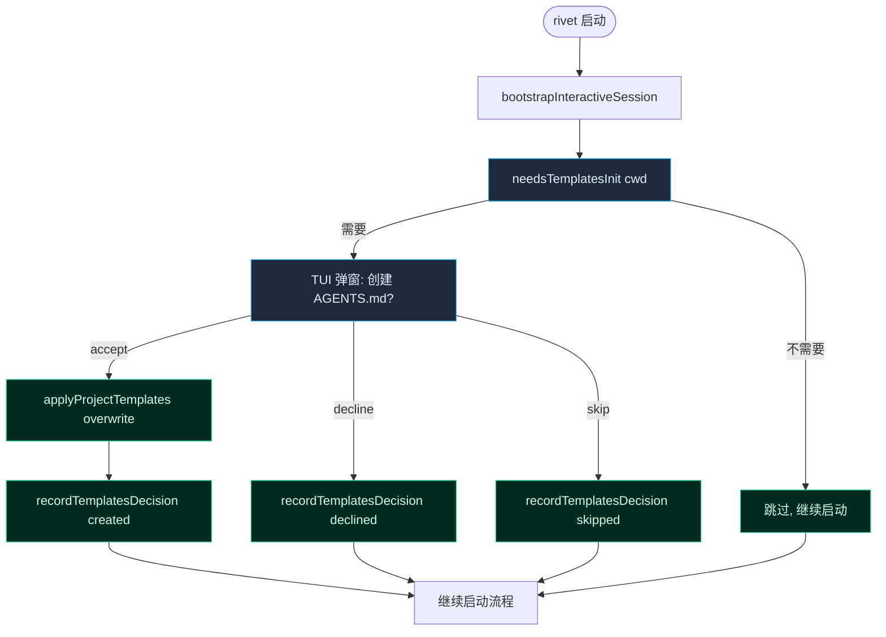

# project-templates 启动接入计划

> **背景**：commit `293fe09d` 创建了 `src/bootstrap/project-templates.ts` 模块（首次启动时提示创建 AGENTS.md / .rivet.md），但未接入启动流程——`needsTemplatesInit()` 没有任何生产调用方。本计划把它接到 `bootstrapInteractiveSession`。

## 数据流图



## 接入点

`src/bootstrap.ts:bootstrapInteractiveSession()` — 在步骤 4（`createSessionInfrastructure`）之后、步骤 5（`SessionPersist`）之前插入。此时 cwd 已确定，TUI 尚未渲染（如果是 headless 则不需要弹窗）。

## 任务

### Task 1: bootstrap.ts 接入检测 + 静默创建 .rivet.md

- [ ] 修改 `src/bootstrap.ts:bootstrapInteractiveSession()`
- 在 `const cwd = ...` 之后、`createSessionInfrastructure` 之前插入
- 逻辑：调 `needsTemplatesInit(cwd)`，如果返回 true：
  - 静默创建 `.rivet.md`（`applyProjectTemplates(cwd, { agentsMode: 'skip' })`——.rivet.md 总是创建，AGENTS.md 暂跳过）
  - 记录 sentinel 为 'skipped'（AGENTS.md 没动）
  - 设一个 flag `templatesPendingAgents = true`，后续 TUI 渲染时弹窗询问 AGENTS.md

**关键约束**：
- `bootstrapInteractiveSession` 是 async，但当前不负责 TUI 渲染——它只返回 `BootstrapContext`
- TUI 弹窗逻辑在 `src/main.ts` 的 React 渲染层
- 因此 bootstrap 阶段只做"检测 + .rivet.md 静默创建 + 设 flag"，AGENTS.md 的弹窗 prompt 留给 TUI 层

**验证**：
```bash
npx tsc --noEmit
node --import tsx --test src/bootstrap/__tests__/project-templates.test.ts
```

### Task 2: TUI 层 AGENTS.md 弹窗

- [ ] 修改 `src/main.ts`（或 TUI 组件）
- 从 `BootstrapContext` 读 `templatesPendingAgents` flag
- 如果 true，渲染一个一次性弹窗组件（类似 approval prompt）：
  - 预览 AGENTS.md 模板内容
  - 三个选项：创建（overwrite）、追加到已有（append，如果已存在）、跳过
  - 用户选择后调 `applyProjectTemplates` + `recordTemplatesDecision`
- 弹窗关闭后正常进入会话

**设计决策**：
- 弹窗用 Ink 的 overlay 组件（项目已有 approval / theme picker 的 overlay 模式）
- 不阻塞 agent loop——弹窗在第一轮 API 请求前出现
- 如果 `--dangerously-skip-permissions` 或 headless 模式，跳过弹窗，默认 declined

**验证**：
```bash
npx tsc --noEmit
# TUI 弹窗需要手动验证：在空项目里启动 rivet
```

### Task 3: BootstrapContext 扩展

- [ ] 修改 `src/bootstrap.ts:BootstrapContext` 接口
- 加 `templatesPendingAgents?: boolean` 字段
- 非破坏性变更——现有调用方不消费这个字段，只有 TUI 层读

**验证**：
```bash
npx tsc --noEmit
```

## 风险与缓解

**风险 1：TUI 渲染时序**
弹窗需要在 agent loop 启动前渲染，但不能阻塞 TUI 初始化。缓解：用 Ink 的 `useState` + `useEffect`，在 app mount 后、第一轮 API 请求前检查 flag。

**风险 2：并发会话**
两个 rivet 实例同时启动在同一空项目里——sentinel 可能竞争写入。缓解：`.rivet/` 目录的 mkdirSync 用 `recursive: true`（幂等），sentinel 写入用 `writeFileSync`（原子性足够，最后写入者获胜，内容一致）。

**风险 3：用户删除文件后重启**
sentinel 存在但文件不存在——`needsTemplatesInit` 返回 false（sentinel 抑制），用户不会再次被询问。这是设计意图（"尊重用户的删除决定"），不需要修复。

## 验证计划

| 场景 | 预期 |
|------|------|
| 空项目首次启动 | .rivet.md 创建，AGENTS.md 弹窗 |
| 已有 AGENTS.md | 跳过（needsTemplatesInit 返回 false） |
| 已有 .rivet.md | 跳过 |
| sentinel 存在 | 跳过（不管文件是否存在） |
| 用户删除后重启 | 跳过（sentinel 抑制） |
| headless / --dangerously-skip-permissions | .rivet.md 静默创建，AGENTS.md declined |
