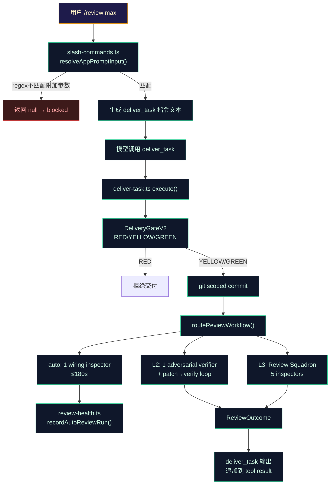

> **Status: ARCHIVED** — 2026-06-19 (审计/复盘文档)

# Review & Delivery Workflow — 现状审计

> 审计日期：2026-06-15
> 执行：天枢 / 天梁域
> 目的：为用户和天权提供交付+审查流程的精确现状地图，作为优化方案的约束基准

---

## 1. 端到端数据流



## 2. 当前存在三个相互独立的问题

### 问题 A：斜杠命令无法携带任务描述

**位置**：`src/tui/slash-commands.ts:resolveAppPromptInput()` (L129-136)

**现状**：
```typescript
const reviewMatch = input.match(/^\/review(\s+max)?$/i)
```

正则 `$` 锚点要求输入以命令结束，无法匹配 `/review max 检查 hash-edit 的锚点漂移问题`。

**影响**：用户输入附加描述时命令被 blocked（返回 null），只能先 `/review max` 回车发出，再用下一条消息说"检查 XX 问题"。

**根因**：`resolveAppPromptInput` 被设计为"匹配完整命令"——但 review 是唯一一个在命令后需要自由文本描述的场景。其他命令如 `/plan <feature>` 走 switch-case 返回 false 让 agent 处理，但 review 被映射为 deliver_task 指令文本，不走 agent 的自然语言理解。

**同样受影响的命令**：
- `/team <task>` — `parts.slice(1).join(' ')` 可以正常拼接
- `/plan <feature>` — 返回 false，由 agent 处理
- `/interview <topic>` — 返回 false，由 agent 处理
- `/review max <desc>` — **唯一被 regex 卡死的**

### 问题 B：审查过程是黑盒

**位置**：`src/agent/deliver-task.ts:execute()` post-commit review 段

**现状**：
```
用户视角的时间线：
  t=0s  输入 "提交一下"
  t=2s  GlanceBar 显示 ◧ thinking...
  t=5s  工具调用 deliver_task
  t=5s  GlanceBar 显示 ◧ running deliver_task...
  t=8s  commit 完成
  t=8s  → GlanceBar 继续显示 ◧（审查 worker 启动）
  t=30s  → 无任何可见变化
  t=60s  → 无任何可见变化
  t=120s → 无任何可见变化
  t=180s → 审查结果作为 tool result 一次性输出
```

**用户实际感知**："commit 之后卡住了，不知道在干嘛，是不是死循环了。"

**代码事实**：
- `deliver-task.ts` 的审查段是 `await route(change, ctx.reviewDeps, ...)` 单个 await——所有 worker spawn、执行、汇总都在这个 Promise 内部完成
- 没有任何中间状态通过 `params` 回调或 streaming 暴露给 TUI
- `review-health.ts` 记录 infra 失败但仅可通过 `/status` 查看——不在正常交付路径上
- 审查 worker 内部有 `defaultTimeoutMs`（adversarial_verifier 600s, reviewer 600s）——但用户不知道这个时间预期

**审查各级耗时预期**（来自 `review-router.ts`）：

| 模式 | Worker | 内部预算 | 外层预算 | 用户感知 |
|------|--------|---------|---------|---------|
| auto | 1 wiring inspector | ~180s | 180s | 无感知（嵌入 commit） |
| L2 | 1 adversarial verifier | 600s | 660s | 无感知 |
| L3 | 5 inspectors 并行 | 600s/worker | 660s | 无感知 |

### 问题 C：审查只能通过 commit 触发

**位置**：`src/agent/deliver-task.ts` + `src/tui/slash-commands.ts`

**现状**：`/review max` 映射为 "call deliver_task with commit=true and review_level=L3"。这意味着：
- 不提交就无法触发审查
- 如果在提交前想先审查（"先审再交"），没有直接路径
- 审查结果以 `deliver_task` 的 tool result 形式返回——`deliver_task` 输出已经很长（Owned/External/Verification diagnostics/Recovery journal/Checklist），审查结果被淹没在大量文本中

**已有的非 commit 审查路径**：
- `team_orchestrate.ts:200` — 在 team mode 中直接调用 `routeReviewWorkflow`，不通过 `deliver_task`
- 这说明 `routeReviewWorkflow` 本身可以独立使用——只是没有暴露为独立工具或 slash command

## 3. 现有架构的优势（不应破坏）

1. **审查后置不阻塞交付**：commit 在审查前完成（`a0f5d2a2` 决策），审查结果 advisory 不 block——这是正确的设计，不应回退
2. **深度自适应**：`classifyChangeScale` + `upgradeScaleByDepth` + `isTrivialChange` 自动选择审查深度——减少不必要的 worker spawn
3. **Infra 失败 fail-open**：auto 模式 infra 失败不阻塞（inconclusive 而非 rejected）——防止审查基础设施故障卡死主循环
4. **审查健康追踪**：`review-health.ts` 记录连续失败——使其可观测
5. **前缀缓存保护**：审查不写 static prompt/tool definition——不影响缓存命中率

## 4. 我建议的优化方向（供天权称量）

### 方向 1：修复斜杠命令参数解析

最小改动：将 `resolveAppPromptInput` 中 review 的正则从 `$` 结尾改为允许后续自由文本：

```
/^\/review(\s+max)?$/i  →  /^\/review(\s+max)?(\s|$)/i
```

匹配后提取 `max` 后面直到行尾的文本作为审查描述，注入到生成的 prompt 中：`focus on the following: <description>`。

### 方向 2：审查进度可见化

两种可行的子方向：

**2a. 轻量：在 tool result 中追加进度标记**

在 `deliver_task` 的审查段，commit 完成后立即输出一条进度行：
```
✅ Scoped commit created...
⏳ Post-commit review starting (auto wiring inspector, ≤180s)...
```
然后等待审查完成，追加结果。

优点：改动极小，不涉及 TUI 层
缺点：仍然是"等结果"——只是用户知道在等什么

**2b. 中量：将审查输出为独立 tool**

创建 `review_changes` 工具（或在 `/review` slash command 中直接 spawn），不耦合 `deliver_task`：

- `/review` → L2 审查当前改动（不提交）
- `/review max` → L3 审查当前改动（不提交）
- `/review max <描述>` → L3 审查，带描述

`deliver_task` 的 auto review 保持不变（嵌入式、轻量）。

优点：审查独立可触发、结果独立可读、不污染 deliver_task 输出
缺点：新增工具需要注册+测试

### 方向 3：审查结果结构化

当前审查结果是一段纯文本嵌入 `deliver_task` 输出。建议：
- 审查 verdict 用明确的 emoji 前缀：🔴 rejected / 🟡 inconclusive / 🟢 verified
- 审查发现用独立 section 隔开（已有，但被 deliver_task 的大量输出淹没）
- `/review` 命令作为独立入口时，输出就是审查报告本身，不被其他信息稀释

## 5. 关键文件索引

| 文件 | 职责 |
|------|------|
| `src/tui/slash-commands.ts` | 斜杠命令解析、`/review` 路由 |
| `src/agent/deliver-task.ts` | 交付工具、commit + 审查编排 |
| `src/agent/review-router.ts` | 审查工作流路由、auto/L2/L3 分派 |
| `src/agent/review-discipline.ts` | 审查纪律文本、变更分类、尺度升级 |
| `src/agent/review-health.ts` | 审查基础设施健康追踪 |
| `src/agent/review-coordinator-deps.ts` | 审查 worker spawn 桥接 |
| `src/tools/team-orchestrate.ts` | 独立使用 `routeReviewWorkflow` 的参考实现 |

## 6. 天枢补充观测

### 观测 1：`resolveAppPromptInput` 返回 null 的 blocked 路径

`resolveAppPromptInput` 对不匹配的斜杠命令返回 `null`——TUI 层将其解释为"blocked"，输入不会发给 agent。

这意味着 `/review max 检查 hash-edit 锚点` 不仅没有触发审查——用户的消息被**完全丢弃**了。用户看不到任何错误提示，消息凭空消失。这比"功能不工作"更差——它造成数据丢失的错觉。

### 观测 2：审查与交付的耦合是历史产物

`deliver_task` 最初是一个 git commit wrapper。审查是在 commit 之后追加的 advisory step。但 `/review` 斜杠命令也被路由到 `deliver_task`——这是把两个语义不同的操作（"提交"和"审查"）塞进了同一个工具调用。

`team_orchestrate.ts:200` 证明了 `routeReviewWorkflow` 可以独立使用——它直接调审查，不经过 deliver_task。独立审查工具的实现参考已经存在。

### 观测 3：审查黑盒的认知成本

当用户在 commit 后等待 180 秒却没有可见反馈时，他们不是"耐心等待"——他们是在**猜**：
- 是不是死循环了？
- 是不是 worker 超时了？
- 我该不该 Ctrl+C？

一行 `⏳ 审查中 (auto wiring inspector, ≤180s)...` 就能消除这三个猜测。成本是 0 行架构改动，收益是信任感的数量级提升。

## 7. 待确认问题

1. `/review` 是否应该默认不提交？（目前是"call deliver_task with commit=true"）
2. 审查进度是否需要实时 streaming（每个 worker 完成时推送），还是阶段性汇总足够？
3. `review-health.ts` 的累计统计是否需要持久化到 session 文件（跨进程重启保留）？
