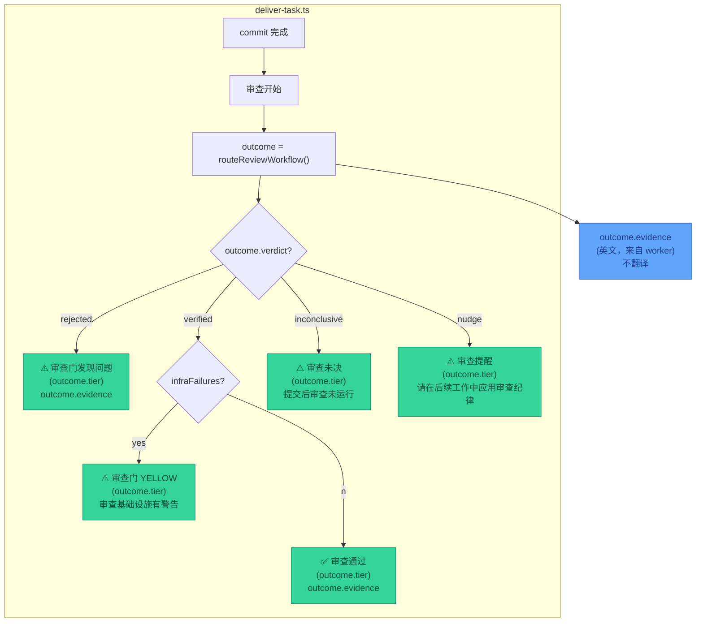

> **Status: COMPLETED** — 2026-06-19

# review-max-chinese-display-revised

# Review Max 审查结果中文化 — 修订版计划

> 修订日期：2026-06-15  
> 执行：天枢 / 天权域  
> 基于：`.rivet/plans/review-delivery-workflow-audit.md`（方向正确，本计划聚焦中文化需求）  
> 星域胶囊：天璇（寻迹者）、瑶光（验证者）、贪狼（勘探者）

---

## 0. 核心需求

**review max 审查门的结果需要中文显示**。

当前 `deliver-task.ts` 输出的审查结果全部为英文：
```
⚠️ ReviewRouter flagged issues (L3): adversarial review found 3 wiring issues
✅ ReviewRouter verified (auto): auto wiring review: no blocking findings
⚠️ ReviewRouter INCONCLUSIVE (auto): post-commit review DID NOT run (timed out)
⚠️ ReviewRouter nudge (auto): apply review disciplines in follow-up work.
```

用户需要中文显示，以便快速理解审查结论，无需在脑中翻译。

---

## 1. 天璇寻迹：跨域模式收敛

**观察**：项目中所有用户面向的 TUI 输出已全面中文化——

| 模块 | 文件 | 语言 |
|------|------|------|
| 欢迎屏 | `welcome.ts` | `天枢 · Tiānshū` |
| 状态栏 | `glance-bar.ts` | `水·凝思` / `火·书写` |
| 用户消息 | `user-message.ts` | `▌` 朱砂印（无文本，符号语言） |
| 助手消息 | `assistant-message.ts` | `·` 紫微紫（无文本，符号语言） |
| Thinking | `thinking.ts` | `凝思中… 45s` |
| 工具卡片 | `tool-card.ts` | `✦ read_file`（工具名保留英文，前缀中文化） |

**唯一例外**：`deliver-task.ts` 的审查结果输出——**这是唯一一块用户面向的英文飞地**。

**收敛结论**：中文化不是"新功能"，而是**消除不一致性**。所有用户面向输出应统一语言。

**反证哨兵**：如果工具名（`read_file`、`deliver_task`）保留英文是合理的（因为是 API 标识符），那么审查结果中的 `ReviewRouter`、`L3`、`auto` 是否也应该保留英文？

**答案**：
- `ReviewRouter` → 保留（系统组件名，类似 `AgentLoop`）
- `L3` / `auto` → 保留（审查层级标识符，类似 HTTP 状态码）
- **描述性文本**（`flagged issues`、`verified`、`INCONCLUSIVE`）→ 翻译为中文

---

## 2. 瑶光验证：RED→GREEN 证据链

**瑶光纪律**：绿色不是证明，RED→GREEN 才是证据。

### 2.1 翻译范围矩阵

| 文本类型 | 来源 | 翻译策略 | 示例 |
|----------|------|----------|------|
| **硬编码 verdict 文本** | `deliver-task.ts:621-638` | ✅ 直接翻译 | `flagged issues` → `发现问题` |
| **outcome.evidence** | review worker 生成（LLM 输出） | ❌ 不翻译（scope 外） | `adversarial review found 3 wiring issues` |
| **follow-up 建议** | `deliver-task.ts:626,636` | ✅ 直接翻译 | `Address the review finding...` → `在后续 commit 中处理审查发现` |
| **infra failure 描述** | `deliver-task.ts:635` | ✅ 直接翻译 | `post-commit review DID NOT run (infra failure)` → `提交后审查未运行（基础设施故障）` |

**证据**：`outcome.evidence` 来自 `review-router.ts` 调用 worker，worker 的 prompt 是英文的（`src/agent/prompts/review-*.md`）。翻译 worker 输出需要改 prompt + 后处理，属于独立任务。

### 2.2 验证测试

```typescript
// src/agent/__tests__/deliver-task-i18n.test.ts
it('审查结果 verdict 文本为中文', async () => {
  const ctx = makeB1Context({ reviewDeps: mockDeps({ verdict: 'verified' }) })
  const result = await DELIVER_TASK.execute(makeParams({ commit: true, message: 'test' }), ctx)
  
  // RED: 旧版英文
  assert.ok(!result.content.includes('ReviewRouter verified'))
  
  // GREEN: 新版中文
  assert.ok(result.content.includes('审查通过'))
  assert.ok(result.content.includes('(auto)'))  // 层级标识保留英文
})

it('infra failure 描述为中文', async () => {
  const ctx = makeB1Context({ reviewDeps: mockDeps({ verdict: 'inconclusive', reason: 'timeout' }) })
  const result = await DELIVER_TASK.execute(makeParams({ commit: true, message: 'test' }), ctx)
  
  assert.ok(result.content.includes('提交后审查未运行'))
  assert.ok(result.content.includes('超时'))
})
```

---

## 3. 贪狼勘探：激活休眠能力

**贪狼纪律**：面对休眠系统时，不计成本地勘探联合机会。

当前审查系统有三个休眠能力：

### 3.1 独立审查（不提交）

**现状**：`/review max` 映射为 `deliver_task(commit=true, review_level=L3)`——必须先提交才能审查。

**休眠证据**：`team_orchestrate.ts:200` 直接调用 `routeReviewWorkflow`，不经过 `deliver_task`。

**激活方案**：
```
/review          → L2 审查当前改动（不提交）
/review max      → L3 审查当前改动（不提交）
/review max <描述> → L3 审查，带描述（不提交）
```

**收益**：
- 用户可以"先审后交"，降低风险
- 审查结果独立输出，不被 `deliver_task` 的大量信息淹没
- 中文化审查结果在这个独立入口更突出

### 3.2 审查进度流式输出

**现状**：`await routeReviewWorkflow(...)` 是单个 Promise，用户等待 180s 无任何反馈。

**休眠证据**：`team_orchestrate` 的 wave 进度输出机制（每完成一个 wave 输出进度）。

**激活方案**：
```
⏳ 审查中 (L3 squadron, 5 inspectors, ≤660s)...
  ✓ wiring-checker: passed (12s)
  ✓ type-safety: passed (18s)
  ⏳ adversarial-verifier: running...
```

**收益**：用户知道"系统在干什么"，消除"是不是死循环了"的猜测。

### 3.3 审查结果结构化

**现状**：审查结果是一段纯文本，嵌入 `deliver_task` 输出的末尾。

**激活方案**：
```
━━━ 审查报告 (L3) ━━━
结论：⚠️ 发现问题
轮次：2
证据：adversarial review found 3 wiring issues
  → wiring-checker: dead import in foo.ts:42
  → type-safety: missing null check in bar.ts:88
  → adversarial-verifier: 3 issues (see above)

建议：在后续 commit 中处理这些发现。
━━━━━━━━━━━━━━━━━━━━
```

**收益**：审查结果独立可读，不被 `deliver_task` 的其他信息（Owned files、Verifications、Recovery journal）淹没。

---

## 4. 实施路线图

### Phase 1: 中文化（scope 内，本次实施）

**改动文件**：`src/agent/deliver-task.ts`

**翻译表**：

| 英文 | 中文 |
|------|------|
| `ReviewRouter flagged issues` | `审查门发现问题` |
| `ReviewRouter verified` | `审查通过` |
| `ReviewRouter INCONCLUSIVE` | `审查未决` |
| `ReviewRouter nudge` | `审查提醒` |
| `post-commit review skipped: review dependencies are unavailable` | `提交后审查跳过：审查依赖不可用` |
| `post-commit review DID NOT run (infra failure)` | `提交后审查未运行（基础设施故障）` |
| `post-commit review DID NOT run (timed out)` | `提交后审查未运行（超时）` |
| `The commit has landed. Address the review finding in a follow-up commit.` | `提交已落地。请在后续 commit 中处理审查发现。` |
| `This change is UNREVIEWED. Run /review max for a full squadron review.` | `此变更未经审查。运行 /review max 进行完整审查。` |
| `apply review disciplines in follow-up work.` | `请在后续工作中应用审查纪律。` |
| `Rounds:` | `轮次：` |
| `review infrastructure caveat(s), delivery verified by available evidence.` | `审查基础设施有警告，交付已通过可用证据验证。` |

**验证**：
- typecheck 通过
- 新增测试 `src/agent/__tests__/deliver-task-i18n.test.ts`
- 现有 `deliver-task.test.ts` 不回归

### Phase 2: 独立审查入口（scope 外，后续迭代）

- 新增 `/review` 斜杠命令（不提交）
- 修复 `resolveAppPromptInput` 正则（允许 `/review max <描述>`）
- 审查结果独立输出（不被 `deliver_task` 淹没）

### Phase 3: 进度流式输出（scope 外，后续迭代）

- `deliver-task.ts` 在 `await routeReviewWorkflow` 前输出进度行
- 每个 worker 完成时推送进度（需要改 `review-router.ts` 接口）

---

## 5. 数据流图（Phase 1）



---

## 6. 风险与缓解

| 风险 | 概率 | 影响 | 缓解 |
|------|------|------|------|
| 翻译后测试回归 | 低 | 中 | 新增 i18n 测试，现有测试不依赖具体文本 |
| `outcome.evidence` 中英混杂不协调 | 中 | 低 | Phase 2 翻译 worker prompt，Phase 1 先接受混杂 |
| 用户习惯英文输出，中文化后困惑 | 低 | 低 | 保留 `ReviewRouter`、`L3`、`auto` 等标识符 |
| 翻译文本过长，破坏对齐 | 低 | 低 | 中文通常比英文短，实测验证 |

---

## 7. 待确认问题

1. **Phase 1 scope**：是否只翻译 `deliver-task.ts` 的硬编码文本，不动 worker prompt？
2. **独立审查入口**：`/review` 是否应该默认不提交？（原计划建议是，但需用户确认）
3. **进度流式输出**：是否需要实时 streaming（每个 worker 完成时推送），还是只在开始和结束时输出？

---

## 8. 关键文件索引

| 文件 | 职责 | 改动 |
|------|------|------|
| `src/agent/deliver-task.ts` | 审查结果输出 | Phase 1: 翻译 verdict 文本 |
| `src/agent/review-router.ts` | 审查工作流路由 | Phase 3: 添加进度回调接口 |
| `src/tui/slash-commands.ts` | 斜杠命令解析 | Phase 2: 新增 `/review` 命令 |
| `src/agent/__tests__/deliver-task-i18n.test.ts` | i18n 测试 | Phase 1: 新增 |

---

## 9. 成功标准

- ✅ `deliver_task` 输出的审查结果 verdict 文本为中文
- ✅ `outcome.evidence` 保留英文（scope 外）
- ✅ 现有测试不回归
- ✅ 新增 i18n 测试覆盖所有 verdict 分支
- ✅ typecheck 通过
