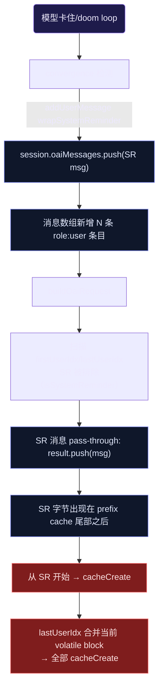

> **Status: COMPLETED** — 2026-06-19

> **Status: APPROVED** — 2026-06-18T05:28:18.267Z

# SR 注入缓存断裂修复 — convergence/hook 注入不增加消息数组条目

## 1. 问题

模型卡住 → convergence 检测触发 → `addUserMessage(wrapSystemReminder(...))` 向 session 消息数组追加新 `role:user` 条目。这些条目虽然被 `buildOaiRequest` 的 `isSystemReminder` 识别为 pass-through（不触发 volatile swap），但它们是**物理消息**，出现在 prefix cache 边界之后。

DeepSeek 前缀缓存是字节级严格匹配。SR 消息在前一轮 API 调用中不存在，下一轮它们作为新字节出现在消息数组尾部。从 SR 消息开始，前缀缓存断裂，后面所有内容（SR 消息本身 + `lastUserIdx` 合并的 volatile block + appendix）全部变成 cacheCreate。

session ee3e768b 的实际数据：模型卡住期间注入 4 条 SR（L322-L327），下一轮 cacheCreate=73464 token（29%）。

## 2. 根因数据流



## 3. 方案：SR 追加到最后一条消息的 content，不新增消息条目

**核心改动**：SR 注入不调用 `addUserMessage`，而是将 SR 内容追加到消息数组中**最后一条已有 user 消息的 content** 末尾。消息数组长度不变，prefix cache 边界不移动。

### 3.1 为什么安全

当前 SR 注入路径（6 个调用点）都不依赖 SR 作为独立消息条目存在：
- `isSystemReminder` 检查的是 content 是否以 `<system-reminder>` 开头——不关心消息条目数量
- DeepSeek API 收到的是 `role:user + content`，多条 SR 合并到一条 user 消息的 content 里，语义上等价（都是 user role 里的系统提示文本）
- session 持久化（JSONL）只是记录消息数组，合并后每行更长但行数更少，不影响回放

### 3.2 新增方法

在 `SessionContext`（`src/agent/context.ts`）新增方法：

```typescript
/**
 * Append system-reminder content to the last user message instead of
 * creating a new message entry. This keeps the message array length stable,
 * preserving DeepSeek exact-prefix cache when convergence/hook injections
 * occur mid-task.
 *
 * The SR text is wrapped in <system-reminder> tags and appended to the
 * last user message's string content with a separator newline.
 */
appendSystemReminder(text: string): void {
  const wrapped = wrapSystemReminder(text)
  const msgs = this.state.oaiMessages
  // Find last user message with string content
  for (let i = msgs.length - 1; i >= 0; i--) {
    const m = msgs[i]!
    if (m.role === 'user' && typeof m.content === 'string') {
      msgs[i] = { ...m, content: m.content + '\n' + wrapped }
      this.onMutation?.({ type: 'replace', messages: msgs.slice() })
      return
    }
  }
  // No user message to append to — fall back to new message
  this.addUserMessage(wrapped)
}
```

### 3.3 调用点改造

| # | 文件 | 行号 | 当前 | 改后 |
|---|------|------|------|------|
| 1 | `src/agent/loop.ts` | L354 | `this.session.addUserMessage(wrapSystemReminder(message))` | `this.session.appendSystemReminder(message)` |
| 2 | `src/agent/loop.ts` | L361 | 同上 | 同上 |
| 3 | `src/agent/loop.ts` | L1018 | `this.session.addUserMessage(wrapSystemReminder(...))` | `this.session.appendSystemReminder(...)` |
| 4 | `src/agent/loop.ts` | L1031 | 同上 | 同上 |
| 5 | `src/agent/loop-factory.ts` | L336 | `self.session.addUserMessage(wrapSystemReminder(content))` | `self.session.appendSystemReminder(content)` |
| 6 | `src/agent/turn-orchestrator.ts` | L695 | `this.deps.addUserMessage(wrapSystemReminder(...))` | 需在 TurnOrchestratorDeps 新增 `appendSystemReminder` |

L354/L361 的 lambda 是传给 controller 的 callback。需要改为调用 `appendSystemReminder`。

turn-orchestrator.ts L695 通过 `this.deps.addUserMessage` 调用。需要在 `TurnOrchestratorDeps` 接口新增 `appendSystemReminder: (content: string) => void`，并在 loop-factory.ts 中提供实现。

### 3.4 认知影响

SR 内容追加到已有 user 消息末尾后，`isSystemReminder` 检查会失效——因为消息 content 不再以 `<system-reminder>` 开头，而是 `原始内容\n<system-reminder>...`。

**解决方案**：修改 `isSystemReminder` 的检测逻辑，从"content 以 `<system-reminder>` 开头"改为"content 包含 `<system-reminder>`"。

但这会影响 `buildOaiRequest` 的 user boundary 检测——当前逻辑依赖 `isSystemReminder` 排除 SR 消息。如果改为 `includes`，真实用户消息中碰巧包含 `<system-reminder>` 文本的也会被排除。

**更优方案**：不修改 `isSystemReminder`。追加的 SR 文本会出现在 `lastUserIdx` 消息的 content 中。`buildOaiRequest` 处理 `lastUserIdx` 时，会将整个 content（含追加的 SR）与 volatile block 合并。这实际上是正确行为——SR 作为上下文指引，出现在用户消息内部是合理的。

但这也意味着追加的 SR 会影响 frozen snapshot。当 `lastUserIdx` 的消息内容变化（因为追加了 SR），下一次该消息变成历史消息时，frozen snapshot 的 key 会不同。不过这恰好是我们想要的——每次 SR 追加都创建一个新的 frozen snapshot，后续不再变化。

**最终认知影响**：SR 从独立消息变为附加到最后一条 user 消息的 content。模型仍然能读到 SR 内容（它就在 user message 里），但不再作为独立 user turn 出现在历史中。这减少了消息数组的膨胀，对模型理解会话结构有轻微影响——SR 不再表现为"独立的用户介入"，而是表现为"最后一条用户消息的补充说明"。

## 4. 改动清单

### Task 1: SessionContext.appendSystemReminder
- 文件：`src/agent/context.ts`
- 改动：新增 `appendSystemReminder(text: string)` 方法
- 测试：`src/agent/__tests__/context-memory.test.ts` 或新建 `context-sr-append.test.ts`
  - 验证：追加后消息数组长度不变
  - 验证：追加后最后一条 user 消息 content 包含 SR 文本
  - 验证：无 user 消息时 fallback 到 addUserMessage
  - 验证：追加后 mutation listener 触发 replace

### Task 2: 改造 6 个调用点
- 文件：`src/agent/loop.ts`（L354, L361, L1018, L1031）
- 文件：`src/agent/loop-factory.ts`（L336）
- 文件：`src/agent/turn-orchestrator.ts`（L695 + 接口新增）
- 改动：`addUserMessage(wrapSystemReminder(...))` → `appendSystemReminder(...)`

### Task 3: 缓存稳定性测试
- 文件：`src/prompt/__tests__/engine-cache-stability.test.ts`
- 新增测试：模拟 convergence 注入场景
  - 构建消息数组 [user1, asst1, tool1, user2]
  - 调用 buildOaiRequest → 记录 result1
  - 追加 SR 到 user2 content（模拟 appendSystemReminder）
  - 再次调用 buildOaiRequest → 记录 result2
  - 断言：result2 的消息数组长度 == result1（关键不变量）
  - 断言：result2 最后一条 user 消息包含 SR 文本
  - 断言：前缀字节稳定（result2 的前 N-1 条消息与 result1 字节相同）

## 5. 反证测试表

| 错误实现 | 哪条测试会红 |
|----------|-------------|
| 仍然调用 addUserMessage（新增消息） | Task 3: 消息数组长度 != result1 |
| 追加到错误的消息（如 assistant） | Task 1: 最后一条 user 消息不包含 SR |
| 未触发 mutation listener | Task 1: persistence 测试失败 |
| wrapSystemReminder 未应用（SR 无标签） | Task 3: SR 文本不包含 `<system-reminder>` |
| turn-orchestrator 调用点遗漏 | 现有 thinking-retry 测试 + 手动验证 |

## 6. 风险

**风险 1**：SR 追加到最后一条 user 消息后，如果该消息是 `lastUserIdx`，SR 内容会被 volatile block merge 吞掉——SR 出现在 `---` 分隔符之前的 content 部分。模型可能不太注意它。

**缓解**：volatile block merge 格式是 `volatileBlock\n---\nuserContent`。追加的 SR 在 userContent 末尾，位于 `---` 之后，模型能看到。如果追加了多条 SR，它们累积在 userContent 末尾，格式是 `userContent\n<system-reminder>...A...\n<system-reminder>...B...`。可读性可接受。

**风险 2**：SR 追加到 `lastUserIdx` 消息后，该消息的 content key 变化，导致 frozen snapshot 的 key 与之前不同。下次该消息变成历史消息时，frozen lookup 可能 miss（因为 key 变了），走 fallback 路径用当前 volatile block 重建。

**缓解**：这是可接受的一次性 cacheCreate——SR 追加只发生一次（convergence 触发时），frozen snapshot 会在下一次 buildOaiRequest 时建立新 key。后续不再变化。

**风险 3**：session 持久化（JSONL 回放）中，追加 SR 后的消息 content 更长。如果 compact/session-split 依赖消息边界，可能受影响。

**缓解**：compact 操作处理的是 `role:user` 消息，不关心 content 长度。session-split 也是按消息条目数工作。追加 SR 不改变消息条目数。

## 7. 验证计划

1. `npx tsc --noEmit` — typecheck
2. `npm exec -- tsx --test src/agent/__tests__/context*.test.ts` — context 测试
3. `npm exec -- tsx --test src/prompt/__tests__/engine*.test.ts` — engine 缓存测试
4. `npm exec -- tsx --test src/agent/__tests__/persist*.test.ts` — 持久化测试
5. 全量 `npm exec -- tsx --test src/**/__tests__/*.test.ts` — 全套

## 8. 文档更新

修复完成后更新 `.rivet/knowledge/debug-cache-break-on-stall.md`：
- 标注"已通过 appendSystemReminder 机制修复"
- 更新根因描述（SR 不再作为独立消息条目存在）
- 保留诊断方法（grep cache-log 仍有参考价值）
