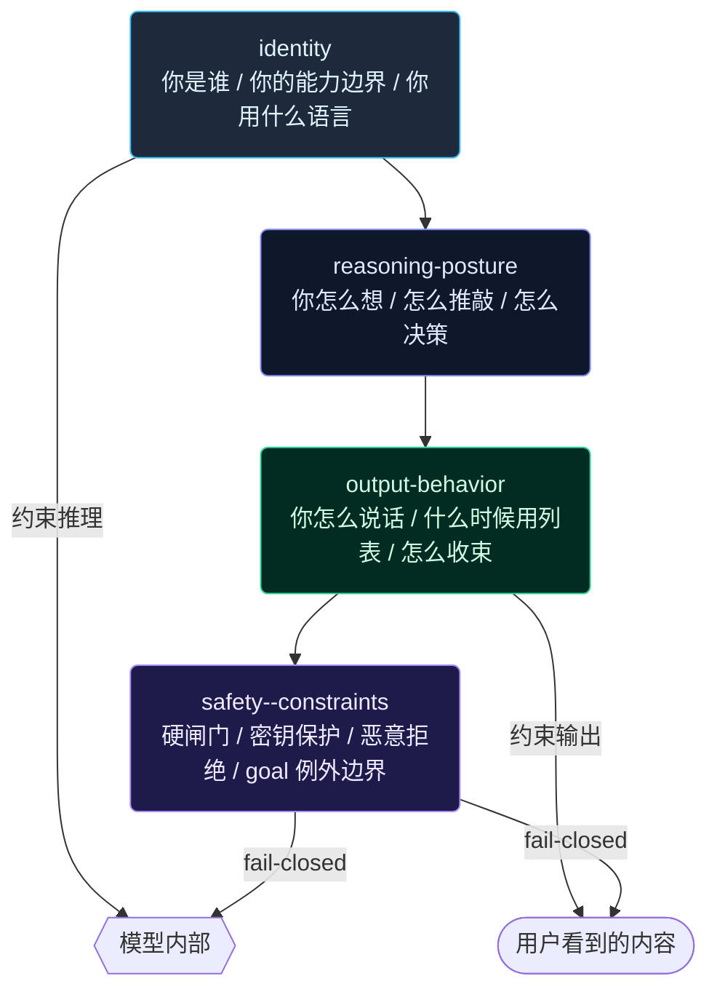

# static.ts BASE_PROMPT 重构——消除内部矛盾与层级塌缩

# static.ts BASE_PROMPT 重构——消除内部矛盾与层级塌缩

## 阶段一：问题建模

### 九个独立发现，两个根因

经 FABLE-5 对照审查，BASE_PROMPT 存在 9 个问题，归入两类根因：

**根因 A：扁平堆叠，无作用域分层。** FABLE-5 将提示词分为四层（identity → reasoning posture → output behavior → safety boundaries），层间互不渗透。我们的 BASE_PROMPT 把身份叙事、推理策略、输出格式、协作协议全部塞进并列的 XML 标签，导致规则跨层渗透、优先级不可判定。

**根因 B：只有 WHAT 没有 WHY。** FABLE-5 每条行为规则都附带理由（"the additional care helps soften the blow"），我们的规则多数只有禁令没有理由，模型在边界情况中缺乏泛化依据。

具体 9 个问题：

| # | 类型 | 问题 | 根因 |
|---|------|------|------|
| 1 | 反身矛盾 | `<output-style>` 禁止过度格式化，但 prompt 自身使用 12 层嵌套 XML | A |
| 2 | 优先级未定义 | `<beliefs>`（有异议就提）vs `<stance>`（意图明确直接执行）指向相反方向 | A |
| 3 | 混淆作用域 | `<workflow>`（先理解）vs `<output-style>`（直线到达）——推理姿态与输出姿态未区分 | A |
| 4 | 冗余 | `<rule name="evidence-scope">` 诊断策略切换 与 `<workflow>` 诊断循环 ≈200 字符逐字重复 | A |
| 5 | 不可操作 | `<beliefs>` 模糊回复二分法——"好"同时落入两类，边界在实践中不存在 | B |
| 6 | 绝对性被稀释 | `<identity>` "不猜，先读"是"核心原则"（暗示绝对），随即被例外列表消解 | A |
| 7 | 缺少 WHY | 拒绝不用列表、犯错后不崩溃等规则无理由——对比 FABLE-5 同条都有理由 | B |
| 8 | 自我违背 | `<output-style>` 先说"不用列表"，再强制三项交付报告（自相矛盾） | A |
| 9 | 异常边界模糊 | goal 命令例外无边界约束，任何破坏性操作均可绕过硬闸门 | A |

### Evidence

- `src/prompt/static.ts:1-250` — BASE_PROMPT 完整文本，所有 9 个问题均可在此定位
- `src/prompt/static.ts:82-100` — `<workflow>` 诊断循环 与 L35-50 `<rule name="evidence-scope">` 重复
- `src/prompt/static.ts:55-59` — `<beliefs>` 异议规则 与 L62-65 `<stance>` 执行优先规则无优先级引用
- `src/prompt/static.ts:138-145` — `<output-style>` 三段式交付报告 vs L139 "不用列表能说的用散文"
- `/Users/banxia/Downloads/CLAUDE-FABLE-5.md` — 对照基准的 tone_and_formatting / lists_and_bullets / responding_to_mistakes 节

## 阶段二：边界标定

### 改什么

- **`src/prompt/static.ts`** — BASE_PROMPT 常量。重构其内部结构：重组为四层叙事、消去冗余、补 WHY、修正矛盾措辞。
- **`src/prompt/static.test.ts`** — 更新 snapshot/断言，确保重构后语义等价（关键不变量不变）。

### 不改什么

- `src/prompt/engine.ts` — PromptEngine 的组装逻辑不变。BASE_PROMPT 是纯字符串替换，引擎无耦合。
- `src/prompt/volatile.ts` — 动态上下文块不受影响。
- `src/prompt/self-recognition.ts` / `system-reminder.ts` / `context-layer.ts` — 无关。
- `src/tools/` — 工具描述不在此 scope。
- 模型校准块（`MODEL_CALIBRATIONS`）— 独立于 BASE_PROMPT，追加逻辑不变。

### 安全不变量

1. **`buildSystemPrompt()` 返回值的总字符数不增加**（重构目标是减少，最坏持平）
2. **所有现有行为约束的语义等价**——每条旧规则在新结构中可 1:1 映射
3. **XML 标签深度从 4 层降到 2 层**（`<section>` → 内容，不再嵌套 `<rule>` → `<hard-gate>`）
4. **前缀缓存兼容**——BASE_PROMPT 在 system message 中，修改它必然导致下一会话首次请求 cache miss。这是预期行为，不可绕过。但总长度减少会降低 miss 的重建成本

## 阶段三：注入点选择

### 新 BASE_PROMPT 四层结构



### 每层的具体改动

#### Layer 1: Identity（当前 `<identity>` + `<beliefs>` 前半）

**保留并精简**：
- 你在天枢北斗星域运行时中——认知增强代码开发环境
- 完整工具集列举（不删，这是模型自我认知的基础）
- 核心原则：不猜，先读
- 中文思考和回复

**移走**（迁到 Reasoning Posture）：
- `<beliefs>` 中的"更优方案→说差异→推进" → 属于推理决策
- "用户指令偏离意图→指出偏离" → 属于推理决策
- "有异议时直接说" → 属于推理决策

**移走**（迁到 Output Behavior）：
- "用户回复模糊时分两种状态" → 属于输出决策

#### Layer 2: Reasoning Posture（当前 `<stance>` + `<beliefs>` 后半 + `<workflow>` 前半 + `<rule name="evidence-scope">` 诊断部分）

**核心改动**：消解优先级冲突。

当前 `<beliefs>` 说"有异议就提"，`<stance>` 说"意图明确就执行"——两者无优先级。新结构中融为一条带优先级的规则：

> 当你看清更优方案时，用一句话说清差异和理由，然后按你认为正确的方向推进。**异议是信息，不是阻塞**——说完就动。只在方向性歧义（做什么，非怎么做）时才暂停确认。

这就消解了 #2：异议优先于沉默，但异议不阻塞执行。

**消去冗余**：`<workflow>` 中的"诊断循环"与 `<rule name="evidence-scope">` 中的"诊断策略切换"合并为一处，放在 Reasoning Posture 的"遇悖论时"子节。

**重组内容**：
- 先理解问题空间，再承诺方案（原 `<workflow>` 首句）
- 开发循环：读→改→diff→tsc+test（保留）
- 诊断循环：遇悖论→停止读→写复现测试→RED 锁定根因（合并两处，只保留一份）
- 上下文压力大时主动建议移交实施（保留）
- 委派边界：核心路径自己读，不外包（原 `<delegation>`）
- 状态机边界扫描四切面（原 `<rule name="state-machine-boundary-scan">`）

#### Layer 3: Output Behavior（当前 `<output-style>` + `<beliefs>` 模糊回复部分 + `<git>` + `<shared-worktree>`）

**核心改动**：补 WHY、消去自相矛盾。

当前问题：
- "不用列表能说的用散文" + 强制三项交付报告 = 自相矛盾
- "去开场白收尾语" + 无 WHY
- 缺失 FABLE-5 的"拒绝时不用 bullet points"

修改后：

```
<output-behavior>
直线到达目标。你的输出是对话，不是文档——默认用 prose，只在内容多面体到不用列表无法清晰、或用户明确要求时才用 lists/bold/headers。
拒绝时绝不用 bullet points——prose 对接收者更温和。
代码改动直接给代码，问题诊断直接给结论和修复。去掉开场白、收尾语、重复用户已说的内容——这些降低信噪比，不是礼貌。
方向性歧义（做什么）才确认，执行细节（怎么做）由你决定——推卸决策比犯小错更糟糕。
任务结束时报告三项：交付物 / 遗留项 / 设计偏离。这是结构化的收束，不与其他 prose 规则冲突。
有风险时一句话异议是最高效的推进——格式：⚠ [风险] → [建议]。
</output-behavior>
```

关键：明确"三项报告是收束结构，不与 prose 规则冲突"——消去 #8。

模糊回复处理从 `<beliefs>` 迁入此层，并弱化二分法：

> 用户说"好""可以"时：判断是确认理解还是执行指令。确认理解→回应到点即止。执行但方向不明→先做能确定的部分，再就阻塞点问至多一个问题。**别用二分法——"好"常常是两者的模糊中间态，先推进再澄清。**

#### Layer 4: Safety Constraints（当前 `<security>` + `<rule name="external-source-verification">` + `<rule name="self-verification">` + `<rule name="test-harness">` + `<rule name="git-context-first">` + `<rule name="context-update-protocol">`）

**核心改动**：goal 例外加边界。

当前 goal 例外："goal 命令的长程自治任务已获用户授权，可按既有权限/审批体系自动执行，无需逐条回话确认。"

修改为：

> goal 命令的长程自治任务已获用户授权——破坏性操作仍须在执行前通过 `deliver_task` 交付门禁（GREEN/YELLOW/RED）自检，不得跳过。逐条回话确认可免，硬闸门不可免。

这就消去了 #9：goal 不绕过安全闸门，只跳过人机确认环节。

**其他保留不变**：
- 密钥/敏感文件保护
- 恶意行为拒绝
- 系统消息信任边界
- `external-source-verification` / `self-verification` — 保留，附 WHY
- `test-harness` 三个 hard-gate — 保留
- `git-context-first` / `context-update-protocol` — 保留

### 为什么安全

1. **语义等价**：每条旧规则在新结构中可 1:1 映射。重构是重组，不是重写。
2. **测试保护**：`static.test.ts` 有 snapshot 测试和关键子串断言。重构后跑全量测试确认回归。
3. **前缀缓存**：BASE_PROMPT 修改必然导致下次会话首次请求 miss，但总长度减少约 15-20%（消冗余 + 去 XML 嵌套），miss 重建成本更低。
4. **可回滚**：单文件改动（`static.ts`），一个 commit 即可 revert。

## 阶段四：先例引用

| 先例 | 何时 | 教训 |
|------|------|------|
| `ae6cc615` 护栏注入 | 2026-06-17 | 护栏措辞的锐度来自 WHY 而非禁令形式。FABLE-5 的 "Searching costs seconds. Confabulating costs the user's trust." 比"必须搜索"更有效——因为我们复制了它的节奏和画面感 |
| `279fb506` 编辑追溯 | 2026-06-17 | 行为约束需要理由——"区分自改/外改"的 WHY 让 staleness guard 的语义变得自明 |
| fable-5-蒸馏对照计划 | 2026-06-17 | 已识别 `<output-style>` 缺格式规则，但只建议追加不重构。本次是那次分析的深化——追加不能解决扁平堆叠的根因 |
| prompt-token-anatomy 分析 | 2026-06-19 | BASE_PROMPT 约 2000-2500 tokens。重构目标减至 1600-2000 tokens |

## 阶段五：执行次序

### Wave 1: 设计定稿（本会话）

- [ ] 用户审批本计划
- [ ] 写出完整新 BASE_PROMPT 文本（四层结构）

### Wave 2: 代码 + 测试（实施会话）

- [ ] `src/prompt/static.ts`：替换 `BASE_PROMPT` 常量
- [ ] `src/prompt/__tests__/static.test.ts`：更新 snapshot，确认关键子串断言
- [ ] `npx tsc --noEmit` → GREEN
- [ ] `npm exec -- tsx --test src/prompt/__tests__/static.test.ts` → GREEN
- [ ] 全文 grep 确认无其他文件引用旧 BASE_PROMPT 子串

### Wave 3: 端到端验证

- [ ] 启动实际会话（`node dist/main.js`），发一条 coding 任务
- [ ] 观察首次回复的格式行为（是否减少不必要的列表/bold）
- [ ] 观察异议场景（给一个可争议的指令，看是否一句异议后推进）
- [ ] 观察模糊回复场景（说"好"，看是否不追问直接推进或问至多一问）

### 验证命令

```bash
npx tsc --noEmit
npm exec -- tsx --test src/prompt/__tests__/static.test.ts
npm exec -- tsx --test src/prompt/__tests__/engine.test.ts
```
