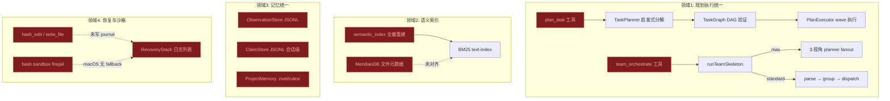
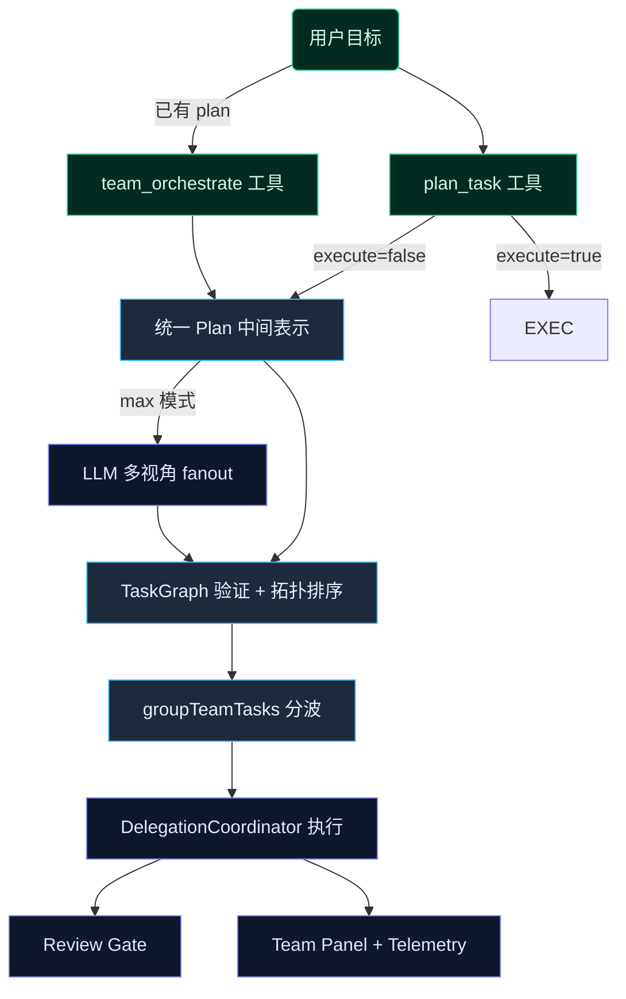
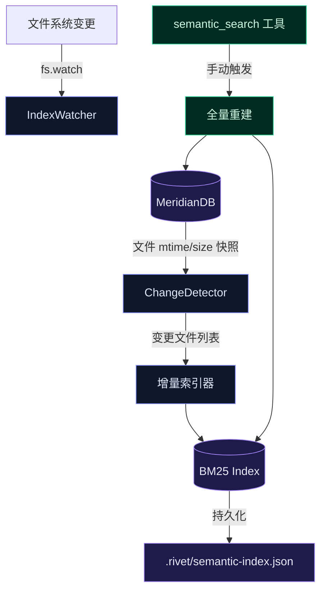
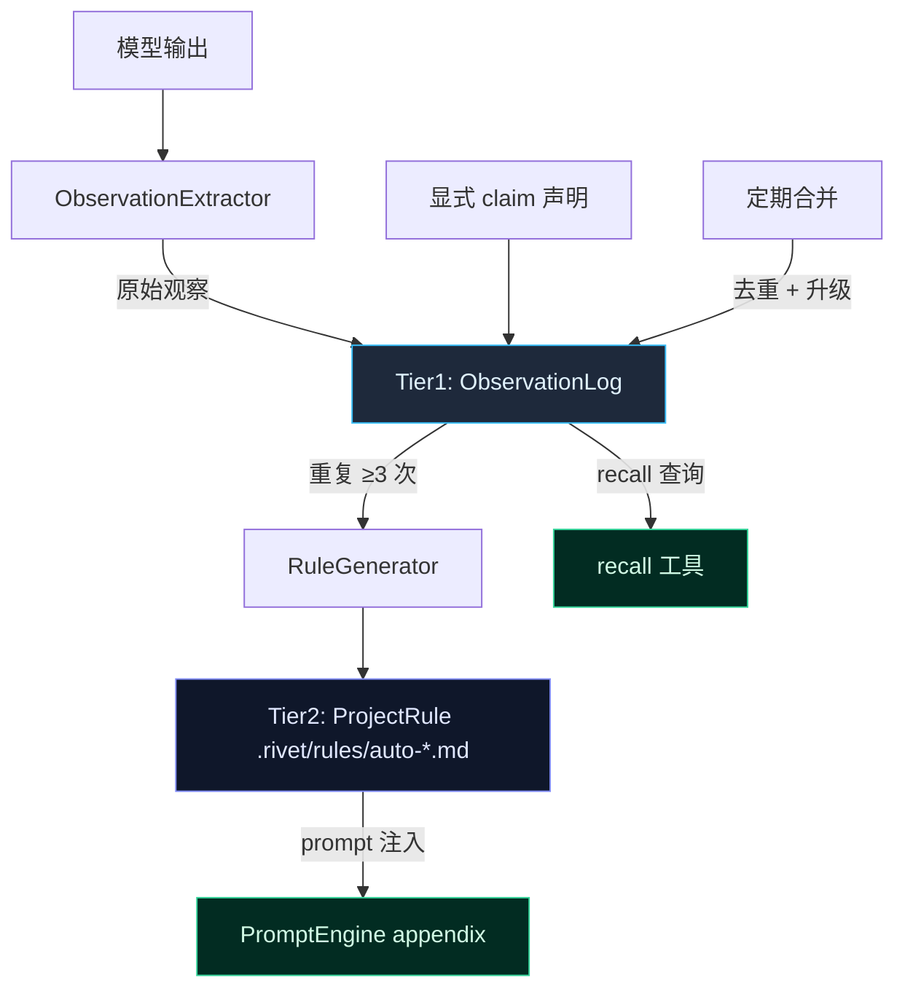
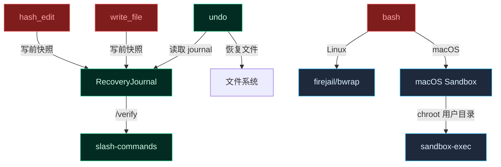
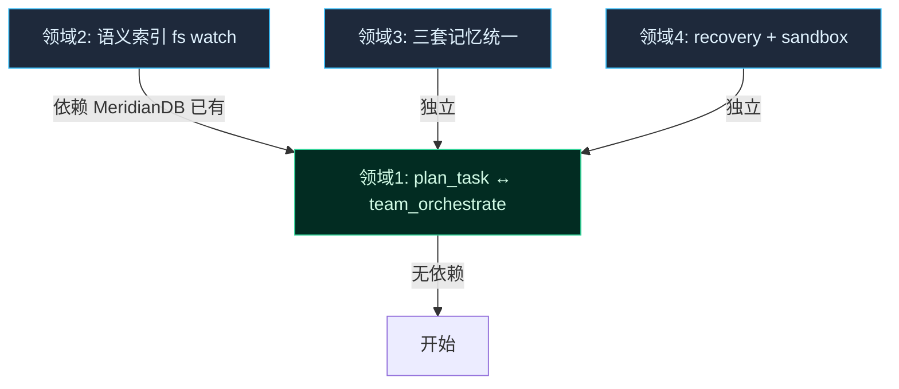

> **Status: COMPLETED** — 2026-06-19

# T11 深化：四领域架构统一设计

# T11 深化：四领域架构统一设计

> 2026-06-13 · `t9-ui-refactor` 分支  
> **状态：✅ 全部完成** · 4 领域 + 审查修复闭环  
> 关联 commit：`bf9c8672` `5790ca73` `3711ccb8` `6154f6a1` `7812bfae` `c097720c` `21de9182` `bcc79b50` `2229e19d` `34fbbafc`  
> 基于 T11 已落地的 R3 MVP 骨架，对四个"已有但未闭环"的子系统做深度统一。

---

## 1. 总览：四个领域的现状与目标



四个领域共性：**MVP 已建，但子系统间存在语义重叠、数据流断裂、或平台覆盖缺口**。

---

## 2. 领域 1：`plan_task` ↔ `team_orchestrate` 统一

### 2.1 问题

两个工具各自维护一套"分解→DAG→分波→执行"流水线：

| 维度 | `plan_task` | `team_orchestrate` |
|------|-------------|-------------------|
| 分解策略 | 启发式规则（关键字匹配） | LLM 三视角 fanout（max）/ 解析已有 plan（standard） |
| DAG 层 | `TaskGraph`（拓扑排序 + 环检测） | `groupTeamTasks`（文件冲突检测 + 依赖拓扑） |
| 执行层 | `PlanExecutor`（自定义重试 + refine） | `DelegationCoordinator.delegateBatch`（worker profiles + 断路器） |
| 可观测 | 无 | TeamPanel + scheduler bandit + reward loop + review gate |
| 缓存 | 无 | TeamPlanCache（骨架缓存，跳过重复 planner fanout） |

**核心断裂**：如果用户先用 `plan_task` 生成 plan，再用 `team_orchestrate` 执行，plan 格式不互通——`plan_task` 输出的是 `TaskDraft[]`（带 `dependsOn` 的 JSON），`team_orchestrate` 期望的是 Markdown plan。

### 2.2 目标架构



### 2.3 具体变更

#### 2.3.1 统一 Plan 中间表示 (`src/agent/unified-plan.ts` 新建)

```typescript
// 统一的 plan 中间表示，同时兼容 plan_task 和 team_orchestrate
interface UnifiedTaskNode {
  id: string
  objective: string
  kind: 'code_search' | 'plan' | 'review' | 'verify' | 'patch_proposal' | 'doc_research'
  profile?: string           // worker profile 名称
  files: string[]            // 文件范围
  dependsOn: string[]        // 依赖 task ID 列表
  riskTier: 'low' | 'medium' | 'high'
  groupId?: string           // 可选分组标签
  metadata?: Record<string, unknown>  // 扩展字段
}

interface UnifiedPlan {
  version: 1
  objective: string
  tasks: UnifiedTaskNode[]
  source: 'plan_task' | 'team_orchestrate' | 'manual'
  createdAt: number
}
```

#### 2.3.2 `plan_task` 变更

- 当前 `plan_task` 的 `TaskDraft` 输出序列化为 `UnifiedPlan`
- `execute: false` 时返回 `UnifiedPlan` JSON（可直接传给 `team_orchestrate` 的 `planMarkdown` 或新增 `planJson` 参数）
- 废弃内置的 `PlanExecutor`——执行统一走 `DelegationCoordinator`

#### 2.3.3 `team_orchestrate` 变更

- 新增 `planJson` 输入参数，接受 `UnifiedPlan`
- 当 `planJson` 传入时，跳过 plan 解析（standard）或 planner fanout（max），直接进入 `TaskGraph` 验证 + `groupTeamTasks` 分波
- `max` 模式的 planner fanout 输出也序列化为 `UnifiedPlan`

#### 2.3.4 `PlanExecutor` 废弃 / 合并

- `PlanExecutor` (`src/agent/plan-executor.ts`) 的核心逻辑（wave 迭代 + 失败 refine）移到 `team-orchestrator.ts` 的 `dispatchWaveAt` 增强版
- `PlanExecutor` 文件保留为兼容层（re-export），标记 `@deprecated`

#### 2.3.5 共享 TaskGraph

- `TaskGraph` (`src/agent/task-graph.ts`) 已独立，`team_orchestrate` 在 `groupTeamTasks` 之前先过 `TaskGraph.validateAndSort`

### 2.4 不变的部分

- `team_orchestrate` 的 scheduler bandit、plan cache、review gate、reward loop、team panel **全部保留**
- `plan_task` 的工具名和 API 形状保持兼容
- `DelegationCoordinator` + worker profiles 不变

---

## 3. 领域 2：语义索引 fs watch + Meridian 对齐

### 3.1 问题

当前 `semantic_index` 是**全量一次性重建**，索引文件 `.rivet/semantic-index.json` 在 repo 变化后立即过期。Meridian DB (`src/repo/meridian-db.ts`) 已经有文件级元数据追踪（mtime、size、immune memory），但语义索引没有利用它。

### 3.2 目标架构



### 3.3 具体变更

#### 3.3.1 Meridian 对齐 (`src/search/index-watcher.ts` 新建)

- 读取 MeridianDB 的文件记录（path → {mtime, size}）
- 与当前文件系统状态 diff，产出变更列表：`added[] / modified[] / deleted[]`
- 变更列表传给增量索引器

#### 3.3.2 增量索引 (`src/search/text-index.ts` 增强)

- `TextIndex` 新增方法：
  - `addDocuments(files: string[]): void` — 对新增/修改文件分词并插入
  - `removeDocuments(files: string[]): void` — 删除文件的 term→doc 映射
  - `isStale(meridianSnapshot: Map<string, FileMeta>): boolean` — 判断索引是否过期

#### 3.3.3 fs watch (`src/search/index-watcher.ts`)

- 使用 `fs.watch`（递归）监听项目目录
- 去抖 500ms，批量处理变更
- 自动调用增量索引
- 仅在 `semantic_search` 首次调用时启动（lazy init），避免空跑

#### 3.3.4 索引元数据扩展

- `.rivet/semantic-index.json` 增加 `lastMeridianSeq` 字段，记录索引时的 Meridian 序列号
- 启动时对比 Meridian 序列号，判断是否需要全量重建

### 3.4 边界

- 不做 embedding/向量检索（MVP 诚实边界）
- fs watch 使用原生 `fs.watch`（Node 22 稳定），不依赖 chokidar
- 大仓库（>10K 文件）不启动自动 watch，退化为手动 `semantic_search(rebuild: true)`

---

## 4. 领域 3：Observation / Claim-store / Project-memory 三套记忆统一

### 4.1 问题

三套记忆系统各自独立，语义重叠：

| 系统 | 存储 | Schema | 查询 | 生命周期 |
|------|------|--------|------|----------|
| ObservationStore | `~/.rivet/memory/<hash>/observations.jsonl` | `{text, kind, confidence, source, tags, sessionId}` | `countSimilarObservations`（文本匹配） | 跨会话持久 |
| ClaimStore | `.rivet/sessions/<id>/claims.jsonl` | `{text, kind, status, evidence, confidence, verifiedAt}` | `recall` 工具（关键词匹配） | 跟随会话 |
| ProjectMemory | `.rivet/rules/auto-*.md` | Markdown frontmatter + body | prompt 注入 | 跨会话持久 |

**核心重叠**：
- Observation 的 `{text, kind, confidence}` 与 Claim 的 `{text, kind, confidence, status}` 几乎同构
- Observation 重复 3 次 → auto-rule（ProjectMemory），但 Claim 也有类似"多次验证→提升置信度"的逻辑
- `recall` 查询 ClaimStore，但 ObservationStore 的观察对 recall 不可见

### 4.2 目标架构



**核心思路**：不是三套合并为一个巨型存储，而是建立分层：
- **Tier1（ObservationLog）**：所有观察/claim 的原始日志，统一 JSONL schema（合并 Observation + Claim 的字段超集）
- **Tier2（ProjectRule）**：从 Tier1 自动升华的持久规则，Markdown 格式，注入 prompt
- **recall** 查询 Tier1（统一入口），不再需要区分"这是 claim 还是 observation"

### 4.3 具体变更

#### 4.3.1 统一 Schema (`src/memory/unified-memory.ts` 新建)

```typescript
interface MemoryEntry {
  id: string                    // uuid
  text: string                  // 事实/决策/偏好/约束 文本
  kind: 'fact' | 'decision' | 'constraint' | 'preference' | 'finding'
  confidence: number            // 0-1
  source: 'auto' | 'manual' | 'claim' | 'verification'
  status: 'observed' | 'claimed' | 'verified' | 'rejected' | 'expired'
  evidence?: string             // 支撑证据
  sessionId?: string
  tags: string[]
  ts: number
  repeatCount: number           // 跨会话重复次数
  promotedToRule?: string       // 升级到的 rule 路径
}
```

#### 4.3.2 存储统一

- **统一存储路径**：`~/.rivet/memory/<project-hash>/memory.jsonl`（替代 `observations.jsonl`）
- **ClaimStore 迁移**：会话级 claim 写入统一 memory log（带 `sessionId`），不再独立 `.rivet/sessions/<id>/claims.jsonl`
- **向后兼容**：首次启动时自动迁移旧 `observations.jsonl` + `claims.jsonl` 到新格式

#### 4.3.3 recall 增强

- `recall` 工具查询统一 memory log，而非仅查询 ClaimStore
- 支持 `kind` 过滤（`recall(kind: "decision")`）
- 返回结果标注来源（auto/manual/claim）

#### 4.3.4 RuleGenerator 复用

- `RuleGenerator` 已基于 ObservationStore 工作——改为基于统一 MemoryEntry
- 当 `repeatCount >= 3` 且 `status === 'verified'` 时触发自动 rule 生成

#### 4.3.5 ProjectMemory 不消失

- `.rivet/rules/` 目录保留作为**人类可读/可编辑**的规范层
- 自动生成的 `auto-*.md` 与手动编写的规则共存
- ProjectMemory loader 同时读取 Tier2 rules + 最近的 Tier1 entries

### 4.4 迁移路径

1. 新建 `unified-memory.ts`，实现新 schema + 读写
2. 修改 `ObservationExtractor` → 写入统一 log
3. 修改 `ClaimStore` → 写入统一 log（保留读取旧格式的兼容）
4. 修改 `recall` → 查询统一 log
5. 修改 `RuleGenerator` → 基于统一 log
6. 添加启动迁移逻辑（旧格式 → 新格式）
7. 删除旧 ObservationStore 独立文件（保留 re-export 兼容）

---

## 5. 领域 4：`edit_file`/`write_file` 写 recovery；macOS sandbox fallback

### 5.1 问题

- `RecoveryStack` 已存在，`undo.ts` 已接 recovery journal
- 但 `hash_edit.ts`（即 edit_file）和 `write_file.ts` ——文件变更的主入口——**不写 recovery journal**
- `bash.ts` 的 sandbox 靠 firejail/bwrap，macOS 上两者都不可用——macOS 用户零隔离

### 5.2 目标架构



### 5.3 具体变更

#### 5.3.1 Recovery Journal 集成 (`src/agent/recovery-stack.ts` 增强)

当前 `RecoveryStack` API：
```typescript
track(journal: RecoveryJournal): void
list(): RecoveryJournal[]
```

新增：
```typescript
// 文件变更的轻量记录（不存储完整内容，只存 diff/revert 信息）
interface FileChangeRecord {
  filePath: string
  action: 'edit' | 'write' | 'delete'
  backupPath?: string        // 临时备份文件路径
  toolCallId: string
  ts: number
}

trackFileChange(record: FileChangeRecord): void
getFileChangeStack(): FileChangeRecord[]
```

#### 5.3.2 `hash_edit.ts` 变更

- 执行编辑前，创建临时备份文件（`.rivet/backups/<timestamp>/<filepath>`）
- 调用 `recoveryStack.trackFileChange({...})`
- `undo` 工具可直接从 backup 恢复

#### 5.3.3 `write_file.ts` 变更

- 如果是**覆盖已有文件**（非新建），先备份原内容
- 调用 `recoveryStack.trackFileChange({...})`
- 新建文件不备份（undo 即删除）

#### 5.3.4 macOS Sandbox Fallback (`src/tools/bash-sandbox-macos.ts` 新建)

- 使用 macOS 原生 `sandbox-exec`（基于 Seatbelt）
- 提供预置 profile：`read-only-fs`（只读文件系统）、`no-network`（禁止网络）
- 作为 firejail/bwrap 不可用时的 fallback

```typescript
// 沙箱等级
type SandboxLevel = 'none' | 'readonly' | 'isolated'

function resolveSandbox(): { level: SandboxLevel; command?: string[] } {
  if (process.platform === 'linux') {
    if (hasFirejail()) return { level: 'isolated', command: ['firejail', '--quiet', '--'] }
    if (hasBwrap()) return { level: 'isolated', command: ['bwrap', '--ro-bind', '/', '/', '--'] }
  }
  if (process.platform === 'darwin') {
    // sandbox-exec 总是可用（macOS 内置）
    return { level: 'readonly', command: ['sandbox-exec', '-p', '(version 1)(allow default)(deny file-write*)', '--'] }
  }
  return { level: 'none' }
}
```

**macOS sandbox 诚实边界**：
- `sandbox-exec` 的 Seatbelt profile 是进程级限制，不是容器级隔离
- 比 firejail 弱，但比零隔离强
- 文档明确标注"macOS 为只读文件系统级别，非完整容器"

### 5.4 不变的部分

- `undo.ts` 的恢复逻辑保持不变
- `RecoveryStack` 的 journal 格式兼容
- bash sandbox 的 `RIVET_BASH_SANDBOX` 环境变量保持不变

---

## 6. 执行顺序与依赖



**推荐顺序**：D1（最大变更，最高风险）→ D4（最独立）→ D3（需要迁移逻辑）→ D2（依赖 Meridian 对齐）

每个领域独立提交，不交叉。

---

## 7. 风险与缓解

| 风险 | 领域 | 缓解 |
|------|------|------|
| `plan_task` API 兼容性破坏 | D1 | 保留旧 `TaskDraft` 格式作为 `UnifiedPlan` 的超集；`PlanExecutor` 保留 re-export |
| ClaimStore 迁移丢数据 | D3 | 启动时自动迁移 + 保留旧文件（加 `.bak` 后缀） |
| macOS sandbox-exec 行为差异 | D4 | 默认 `readonly` 级别，不强制 `isolated`；环境变量 `RIVET_MACOS_SANDBOX=0` 可关闭 |
| fs.watch 在大型仓库性能 | D2 | 文件数 >10K 时自动退化为手动模式；watch 使用 lazy init |

---

## 8. 验证计划

| 领域 | 关键测试 | 验证命令 |
|------|----------|----------|
| D1 | `plan_task` 输出 → `team_orchestrate` 消费，端到端 | `npx tsc --noEmit` + 集成测试 |
| D1 | `PlanExecutor` 废弃后原测试仍通过 | 运行 `plan-executor.test.ts` |
| D2 | Meridian diff 检测文件变更，增量索引正确 | `text-index.test.ts` 新增增量用例 |
| D3 | 旧 observations.jsonl 自动迁移 | `unified-memory.test.ts` 迁移用例 |
| D3 | recall 查询到原 ObservationStore 的数据 | `recall` 集成测试 |
| D4 | hash_edit 写 recovery journal，undo 可恢复 | `recovery-stack.test.ts` 新增用例 |
| D4 | macOS sandbox-exec 正确拦截文件写入 | `bash-sandbox.test.ts` macOS 用例 |
