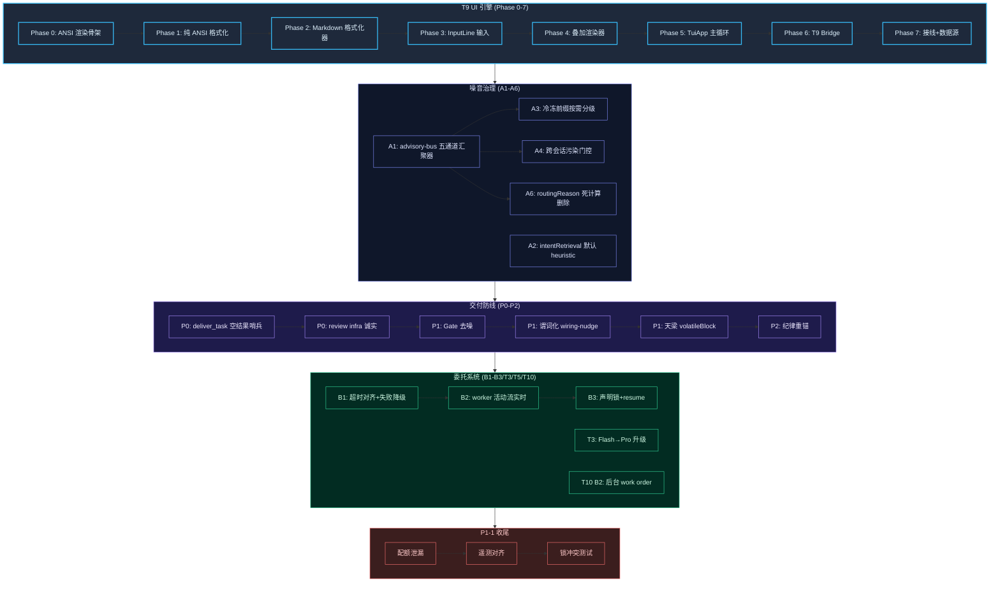

> **Status: ARCHIVED** — 2026-06-19 (审计/复盘文档)

# t9-ui-refactor 分支复盘 — 152 提交 / 五大领域 / 主线切换评估

# t9-ui-refactor 分支复盘与主线切换评估

> 152 commits，60 fix + 74 feat + 12 docs。分支覆盖 T9 UI 引擎、噪音治理、交付防线、委托系统、模型路由五大领域。

---

## 1. 问题描述

`t9-ui-refactor` 分支自 Phase 0（ANSI 渲染引擎骨架）起，历经 T9 UI 全栈建设、噪音系统治理、交付防线哑火修复、委托系统契约对齐等，当前已稳定（typecheck 零错误、coordinator 测试全绿）。用户要求切换 T9 UI 为主链路前，先复盘全分支工作。

---

## 2. 事实流图：五大建设领域

---

## 3. 核心建设清单

### 3.1 T9 UI 引擎（纯 ANSI 路线，替代 Ink/React TUI）

| 阶段 | 内容 | 状态 |
|------|------|------|
| Phase 0 | ANSI 渲染引擎骨架 (`src/tui/ansi/`) | ✅ |
| Phase 1-2 | 纯 ANSI 格式化 + Markdown 渲染 | ✅ |
| Phase 3 | InputLine 输入层（替代 base-text-input.tsx） | ✅ |
| Phase 4 | 叠加渲染器（overlay renderers） | ✅ |
| Phase 5 | TuiApp 主事件循环 | ✅ |
| Phase 6 | T9 Bridge — AgentLoop 集成桥接 | ✅ |
| Phase 7 | 接线 + 数据源集成 | ✅ |
| M1 | bootstrap + main-ansi 端到端 AgentLoop 接线 | ✅ |
| M2.1-M2.5 | user commit、steer buffer、live tool cards、approval UI、SlashRouter | ✅ |
| Phase C+D | 全局快捷键 + slash 命令处理器 | ✅ |

### 3.2 噪音治理（A1-A6）

| 编号 | 内容 | 状态 |
|------|------|------|
| A1 | advisory-bus 五通道汇聚器（repair/cerebellar/harness 等） | ✅ |
| A2 | intentRetrievalRouter 默认 heuristic，低置信不渲染 | ✅ |
| A3 | 冷冻前缀按需分级（projectIndex/胶囊/projectMemory 预算上限） | ✅ |
| A4 | 跨会话污染门控（durable claims TTL + 文件交集过滤） | ✅ |
| A5 | autoDelegateEnabled 配置字段落地 | ✅ |
| A6 | routingReason 死 setter/getter 清除（loop.ts + cockpit + engine.ts） | ✅ |

### 3.3 交付防线哑火修复（P0-P2）

| 编号 | 内容 | 状态 |
|------|------|------|
| P0 | deliver_task 空结果根因 + 非空哨兵测试 | ✅ |
| P0 | review infra 失败不伪装 verified + /status reviewHealth | ✅ |
| P1 | Delivery Gate 去噪（.test-tmp 过滤 + 限 5 条） | ✅ |
| P1 | 生产路径闭环谓词化（wiring-nudge + 入口锚点） | ✅ |
| P1 | 天梁纪律接入主会话（volatileBlock + 阈值 >=4） | ✅ |
| P2 | 纪律抗习惯化重锚（advisory bus 每 N 次工具调用） | ✅ |

### 3.4 委托系统修复

| 编号 | 内容 | 状态 |
|------|------|------|
| B1 | delegate_task 失败收敛为结构化降级 packet | ✅ |
| B2 | 三层超时对齐（progressiveTimeout + profile 预算 + abort） | ✅ |
| B3 | worker 活动流 tool_result 实时 + team panel 增量状态 | ✅ |
| T3 | Flash→Pro 升级（max 3 次/会话） | ✅ |
| T5 | fingerprint resume（读回已持久化结果） | ✅ |
| T10 B2 | 后台 work order（delegateBackground + waitBackgroundRun） | ✅ |
| T3/T10 | 契约对齐 — delegateBackground 感知 degraded 结果 | ✅ |

### 3.5 P1-1 收尾修复

| 编号 | 内容 | 状态 |
|------|------|------|
| LOW | 升级配额泄漏 — proUpgradeCount 移到 claim check 后 | ✅ |
| LOW | 首次冲突路径补 selectedModel + telemetry | ✅ |
| MEDIUM | 重试锁冲突分支补测试 | ✅ |
| LOW | 首次冲突 nextActions 恢复可操作中文指引 | ✅ |
| LOW | recordEscalation 提取消重 | ✅ |

---

## 4. 切换主线风险评估

### 4.1 已就绪

- **typecheck**：零错误
- **coordinator 测试**：7/7 全绿
- **交付防线**：5 道防线全部发声，哑火已修复
- **委托契约**：T3/T10 B2 已对齐

### 4.2 需确认

- **T9 UI vs Ink TUI 共存**：当前 `main.tsx` 仍使用 Ink/React TUI 作为主链路。T9 以 `main-ansi.ts` 独立入口运行。切换主线需：
  1. 确认 T9 所有 M2 功能（live tool cards、approval UI、steer buffer）在真实会话中稳定
  2. 决定 Ink TUI 是否保留为 fallback 或直接移除
- **slash 命令覆盖**：SlashRouter 已桥接，需确认 `/status`、`/model`、`/review` 等命令在 T9 下输出正确
- **cockpit 面板**：当前 cockpit/state.ts 仍在 Ink TUI 侧使用，T9 需独立数据源或复用

### 4.3 建议切换步骤

1. 将 `main-ansi.ts` 重命名为 `main.ts`（或通过配置切换入口）
2. 移除 Ink/React TUI 依赖（`ink`、`react` 从 dependencies 删除）
3. 清理 `src/tui/` 下的 Ink 组件（保留 cockpit 数据层、slash-commands 逻辑层）
4. 端到端回归测试：启动 → 输入 → 工具调用 → 交付 → 退出

---

## 5. 不做事项

- 不在此分支继续新增功能特性
- 不重构 cockpit 数据源（切换后单独处理）
- 不移除 Ink TUI 中仍被逻辑层引用的类型（渐进清理）

---

## 6. 验证计划

- [ ] T9 UI 启动 → 显示欢迎画面
- [ ] 输入用户消息 → AgentLoop 正常响应
- [ ] 工具调用过程 → live tool cards 实时更新
- [ ] 审批交互 → y/n/e 正常
- [ ] `/status` → banditState + reviewHealth 显示
- [ ] `/model` → 模型切换可溯源
- [ ] `Ctrl+C` → 安全退出，session 持久化不丢
