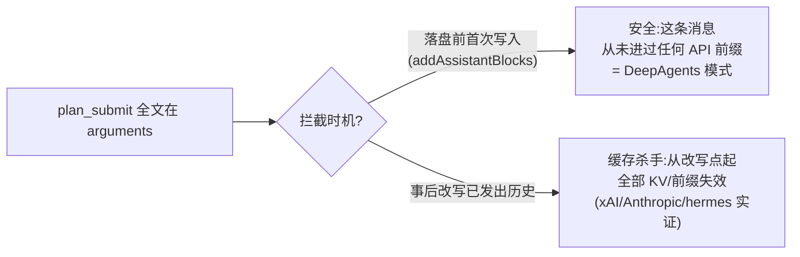

> **Status: ARCHIVED** — 2026-06-19 (审计/复盘文档)

# Tool Call Arguments 上下文膨胀治理 — 方案评审

> 评审对象:[tool-call-arguments-上下文膨胀治理-长期架构方案.md](./tool-call-arguments-上下文膨胀治理-长期架构方案.md)
> 方法:多子代理(内部代码追踪 + plan mode 状态机梳理 + 外部竞品调研)
> 日期:2026-06-17

## 总体判断

方案诊断的问题真实存在且重要。天枢的"去程未修复"分析准确——`e112ef1c` 只修了 approve 后的回程([session-manager.ts:774](../../src/server/session-manager.ts) 注入 `<active-plan>` 指针),而 `plan_submit` 调用本身的去程仍然把全文经 `stableStringify(b.input)` 写进 assistant 消息([context.ts:168](../../src/agent/context.ts))。

但方案在三个关键点上需要修正才能落地,其中两个是"按原文实现会出错或自相矛盾"的硬伤。整体方向(externalization / context offloading)被业界充分验证,但 Layer 2 偏重、Layer 3 有过度设计风险。建议分波落地而非一次性三层。

## 一、对的地方(站得住)

- **根因定位正确**:现有所有防线(`artifactIntercept`、`truncateToolResult`、`toolTypeBudgets`、`staleRoundThresholds`)全部作用于 tool result 的 post-execute 阶段,对 assistant 消息里的 `tool_calls.arguments` 零覆盖。这张表与代码一致。
- **安全不变量大体正确**:tool_call_id 不变、JSON 合法性、幂等、fail-open(失败返回 null 而非抛异常)——都对,且与外部实证(hermes-agent 的 byte-identical 教训)同向。
- **externalization 模式被业界背书**:把大参数换成"文件指针 + 按需 read_file",正是 LangChain DeepAgents 的 "offload large tool inputs"、Anthropic 的 memory tool、IBM 的 Memory Pointer Pattern、以及有实证论文的 Large Result Offloading(LRO)。这不是发明,是成熟做法。
- **Layer 2 方向正确**:plan 内容应活在文件 + 独立上下文,而非永久挂在主线 assistant 消息里——OpenCode 的 plan/build 独立 context、Cline 的 Plan/Act 都印证了这点。

## 二、错的地方(按原文实现会出错)

### 1. 接入点写错了 — Task 3 的 `TurnPerceptionController` 不成立

方案 Task 3 和 mermaid("TurnPerception 解析 → 原始 assistant 消息")与真实代码不符。`TurnPerceptionController` 跑在 stream 之前([turn-orchestrator.ts:329](../../src/agent/turn-orchestrator.ts)),此刻本轮 assistant 的 `tool_calls` 还不存在。tool_use block 实际在 `OpenAIClient.flushToolCalls`([openai-client.ts](../../src/api/openai-client.ts))解析、在 `TurnStreamController.onContentBlock` 收集。

`RuntimeHookPipeline` 也不行:其 `RuntimeHookEffects` 只有 `injectUserMessage` 之类,没有改写 assistant 消息的 API,且 `postTool` 在工具执行之后才跑。

**唯一正确的 choke point** 是 `addAssistantBlocks`([context.ts:163](../../src/agent/context.ts))——所有 assistant blocks 进 `oaiMessages` 的唯一入口;或其调用方 [turn-orchestrator.ts:600](../../src/agent/turn-orchestrator.ts)。

注意:方案自身 L172 写的是"TurnPerception **或** ContextInjection",但 Task 3 固定成了 TurnPerception。修订建议:以"写入 SessionContext 前"为准,落到 `addAssistantBlocks`。

### 2. Layer 3 的 async 矛盾 — 按原文无法编译

Layer 1 接口是同步的 `process(args): string | null`(方案 L93),但 Layer 3 的 `applyBudget` 里写了 `await ctx.artifactStore.save(...)`(方案 L345)。`ArtifactStore.save` 确实是 `async (): Promise<string>`([artifact/store.ts:58](../../src/artifact/store.ts))。在同步函数里 `await` 是 TypeScript 非法。要么把整条 `process` 链改 async(`addAssistantBlocks` 及其调用方都要 await),要么对 plan_submit 走纯同步替换。

对 plan_submit 而言根本不需要 artifactStore:`plan_submit.execute` 已经用 `slugify(title)` 把全文写到 `.rivet/plans/{slug}.md`([plan-submit.ts:90-97](../../src/tools/plan-submit.ts))。argProcessor 只要算出同一个 slug,把 `plan` 字段同步换成指向该文件的指针即可。这让 plan_submit 的 Layer 1 变成纯同步、零依赖,是被方案低估的关键简化。

### 3. "缓存断裂点"的表述不精确 — 且这恰恰决定 Layer 1 安全与否

方案说全文"在 exact-prefix cache 中形成永久断裂点——此消息之后所有 prefix 全部失效"。不准确:只要历史 byte-identical,带全文的那条消息仍会逐字命中缓存,它不"断裂"缓存,而是永久占用 ~6K tokens 前缀空间 + 首次纳入时付一次 cache-write。真正的收益是上下文窗口经济,不是"修复断裂"。

这个区分至关重要,因为它划清了 Layer 1 的安全边界:

`addAssistantBlocks` 拦截属于左路(安全)——这条 assistant 消息此刻还从未进过任何 API 请求前缀。方案必须把这条不变量写死:只在首次写入时变换,永不回改已发出的历史。

## 三、遗漏的点(必须补)

1. **byte-identical 铁律**(hermes-agent #4555 实证):内存态与会话重载态发给 API 的消息必须逐字节一致。拦截必须同时落到 persist 路径——`addAssistantBlocks` 经 `onMutation` 写盘,reload 回来的也得是指针版,否则同一会话"内存迭代 vs 重启恢复"会产生不同 token、整段 KV 失效。在 `addAssistantBlocks` 拦截天然满足(persist 在 push 之后),但方案没点明这条约束。
2. **preview/摘要是模型的"决策面",不是可选项**(LRO、aipatternbook 一致结论):指针里若只有"plan 已存到文件",模型要么瞎猜要么不读。需保留 title + 关键摘要 + 行数/字符数,让模型判断是否值得 read_file 回看。方案 L162 的替换串方向对,但应强化 preview。
3. **切回主线的"显式回看"动作**:Claude Code 退出 plan mode 会显式 read 回 plan 文件。方案 Task 9 提到更新 volatile 提示,但应明确:执行阶段开工前要有动作/提示去 read plan(`e112ef1c` 的 `<active-plan>` 指针已含 "需要时用 read_file 查看",可对齐)。
4. **排序细节与安全保证**:`addAssistantBlocks`(:600)在 `executeBatch`(:627)之前跑,所以拦截时 `.rivet/plans/{slug}.md` 还没写。但 slug 由 title 确定性派生,文件会在同轮毫秒级后写入。需要补强的是这里的**安全保证(而非隐患)**:
   - 拦截发生时,本轮 assistant 消息**还没进过任何 API 请求**(它是刚收到的响应,尚未回灌)。所以首轮发出去的版本里 `plan` 字段从一开始就是指针——模型在后续任何一轮里都**看不到全文**,这正是预期行为,不是 bug。
   - "文件还没写"不构成风险:模型要 read 这个文件,最早也只能在**下一轮**发起(本轮 assistant 消息正是 plan_submit 调用本身,工具执行紧随其后)。等任何后续轮次真去 read 时,`.rivet/plans/{slug}.md` 早已落盘。指针指向的是"将在同轮立即存在、且此后永久存在"的文件。
   - 换句话说:**写文件(执行侧)与写指针(历史侧)在同一轮内分别落地,二者通过确定性 slug 锚定同一路径,时间差对模型不可见**。方案需把这条显式写成不变量,而不是留给读者推断。
5. **共享引用风险**(关键安全点):`collectedBlocks` 与 `toolUses` 共享同一 `block.input` 引用([turn-stream.ts:147](../../src/agent/turn-stream.ts))。拦截只能改 stringify/persist 路径,绝不能 mutate `block.input`,否则 `executeBatch` 拿到的就是指针字符串,plan_submit 写文件会写成指针——全文彻底丢失。这是最危险的实现陷阱,方案没提。

## 四、逐层外部对标评价

- **Layer 1(通用 arg 后处理)** — 成败全看"拦截时机"。理解为"落盘前一次性拦截 + 永不回改"则是 DeepAgents 标准做法;理解为"事后改写历史 arguments"则与缓存目标自相矛盾。必须钉死前者。
- **Layer 2(plan mode 独立上下文通道)** — 方向主流,但实现偏重。评估为 L 级:当前架构消息层是严格单通道(一个 `oaiMessages`、一条 persist 链、一个 `buildOaiRequest` 入口,全库无 `routeMessage`),新增旁路数组要贯穿 persist/compact/rewind/token 估算/bootstrap rehydrate 等 15+ 模块。且与 `e112ef1c` "正文离盘、指针进 appendix" 哲学有张力——approve 时若把大量探索 tool 结果 merge 回主历史,会抵消指针策略的收益。轻量替代:approve 时对 planning 阶段的 tool 轮做 compaction 剪枝,或把探索摘要离盘(延续 `e112ef1c` 模式),改动小得多且与现有缓存哲学一致。
- **Layer 3(预算 + artifact 系统)** — 内核(offload)最成熟,但有过度设计风险。LRO 实证:对当下模型,裸"路径 + preview + sizeBytes"已够,复杂的 schema/descriptor/jq 配方库属于"为未来模型预留"。预算阈值要敢设高(DeepAgents 用 20K tokens / 85% 窗口量级),否则小参数也外置反而造成回读反噬 token。

## 五、推荐路径(分波)

### 第一波 — 高收益、低风险、可独立交付

Layer 1 精准版,仅 plan_submit。在 `addAssistantBlocks` 同步拦截,`plan` 字段换成 `.rivet/plans/{slug}.md` 指针 + 标题/行数 preview,不碰 `block.input`,persist 路径同步生效。直接解决"去程未修复",不依赖 artifactStore、不动消息架构。配 Task 9/10 的提示词与工具描述更新。

### 第二波 — 可选

把 Layer 1 抽象成 `ToolArgPostProcessor` 注册表,覆盖 `delegate_task` 等大参数工具。若要 artifact 落盘,把 `process` 接口改 async,整条链 await——这是 Layer 3 的真正落点,且要钉死高阈值 + 裸指针 MVP。

### 第三波 — 重评估

Layer 2 独立上下文通道。建议先用"approve 时剪枝/离盘"的轻量替代验证收益,再决定是否值得做完整双数组架构。这一层的成本(15+ 模块、双 persist、rewind 语义)是否值得,取决于 planning 阶段探索消息在实际会话里占多大比例。

## 附:关键代码坐标

- 断裂点(去程):`addAssistantBlocks` → [src/agent/context.ts:163-178](../../src/agent/context.ts),`arguments: stableStringify(b.input)` 在 L168
- 调用方:[src/agent/turn-orchestrator.ts:600](../../src/agent/turn-orchestrator.ts)(在 executeBatch :627 之前)
- 共享引用:[src/agent/turn-stream.ts:147](../../src/agent/turn-stream.ts)(`collectedBlocks` 与 `toolUses` 共享 `block.input`)
- plan_submit 写盘:[src/tools/plan-submit.ts:90-97](../../src/tools/plan-submit.ts)(`slugify` + `writePlan`,全文已离盘)
- 回程已修(e112ef1c):[src/server/session-manager.ts:774](../../src/server/session-manager.ts)(`approvePlan` 注入指针 + 短 kickoff)
- 指针格式:`formatActivePlanPointer` → [src/agent/loop.ts:100](../../src/agent/loop.ts)
- artifact 接口:[src/artifact/store.ts:58](../../src/artifact/store.ts)(`save` 为 async)

## 附:外部调研出处(节选)

- xAI prompt caching multi-turn:改写早期消息必破缓存,only append
- Anthropic Context Editing(`clear_tool_uses_20250919`):`clear_tool_inputs` 是"清 arguments"的官方先例,但默认 false;`clear_at_least` 用于权衡"是否值得为清理而打断缓存"
- Anthropic《Effective context engineering》:tool result clearing + memory tool(状态外置到文件按需读回)
- LangChain DeepAgents:offload large tool inputs(20K/85% 阈值)
- IBM / agentium Memory Pointer Pattern:`{pointer, preview, sizeBytes}` 约定
- LRO 论文(zircote.com/LRO):裸指针对当下模型已足够,重型 descriptor 属前向兼容脚手架
- NousResearch hermes-agent #4555:内存态与重载态必须 byte-identical,否则整段 KV 失效

## 修订:基于真实会话 cache-log 的实证(2026-06-17)

对会话 `d6448b29-f459-4b83-b14e-1f5d673b52e3`(GLM 5.2,better-sqlite3 生产打包方案)的 `cache-log.jsonl` + 消息体逐条复盘,修正本评审两处表述,并补一条更值钱的发现。

### 真凶是 write_file,不是 plan_submit

cache-log 中两次 0% 归零里,第一次(`userMsgs:6, turn:1, input 126098, cacheRead 0`)精确对应消息 [101]:USER"继续"之后,模型用 **`write_file` 一次性把 20,055 字符 / 549 行**的 `docs/superpowers/plans/2026-06-17-better-sqlite3-生产打包方案.md` 塞进 tool-call arguments(args 总长 20,800 字符)。这正是方案"问题描述"里"548 行、~15K chars"经验数据的来源。

含义:(1) 这坐实了方案"非 plan_submit 个例,而是系统性问题"的判断;(2) 真实咬人的是 `write_file`——Layer 1 若只挂 plan_submit 会漏掉它,**必须覆盖 write_file/edit_file**。

### 两种独立的断裂机制(不是同一个)

| 断裂 | 对应 | 墙钟间隔 | 引擎标记 | 机制 |
|------|------|---------|---------|------|
| cache-log L43 | [101] write_file 20KB args | 仅 20s | 无 frozenEvicted | 巨型单条 args 入历史那轮 provider(GLM)缓存归零 |
| cache-log L123 | userMsgs14 turn0 | 421s | frozenEvicted + collapseWatermark | 长空闲 → frozen base 驱逐重建 |

L43 仅隔 20s,够不上 120s 思考停滞;且引擎自身计数器(frozenFallbackRebuilds/volatileSwap)那一行全未触发——说明是 **provider 侧**行为,非引擎改写历史。最可能组合:uMsg6 前有 437s 空闲(provider KV 部分过期,turn0 仅 74%),turn1 又插入 20K 巨块,provider 直接未命中。L123 才是"长空闲→frozen 重建",更接近"超时"归因,但发生在桌面端报错排查轮,不是写文档。

### 对本评审"断裂 vs 膨胀"表述的修正

本评审第三节曾断言"append 只膨胀、绝不清零缓存"——**过于绝对,予以修正**。实测 L43 这轮(20K args 入历史)provider 即返回 0%。诚实边界:仅凭 cache-log + 消息体无法机械证明"为何 append 20K 即 0% 而非部分命中"(缺每轮 request 字节与 provider 缓存内部逻辑);能确证的是 0% 精确落在 20K-args 那轮、引擎侧无重建标记、且膨胀永久存在(input 自 [101] 起骑高位再未回落)。

### 对修复优先级的修正

- Layer 1(大 args 换指针)比本评审原先给的分量**更值得做**:可同时消除 ~5K 永久膨胀**与**那一轮 20K 巨型 delta(很可能是压垮 provider 缓存的最后一下)。且**必须覆盖 write_file/edit_file**,不能只挂 plan_submit。
- 但 Layer 1 修不了 L123 那类(长空闲→frozen 驱逐重建),需单独治理(稳定 frozen 重建 / 空闲后缓存预热)。
- 下一步若要机械坐实 L43 的 provider 侧因果,需在 client 层对每轮 request 前缀打指纹,对比 turn0/turn1 字节前缀。
