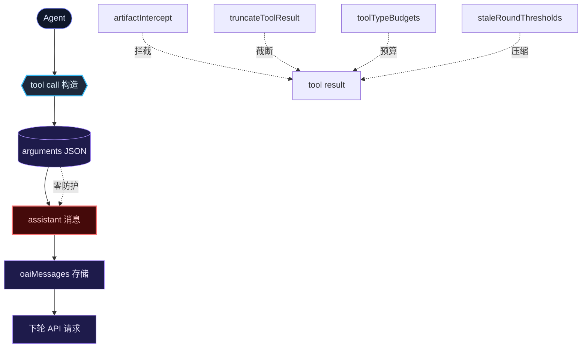
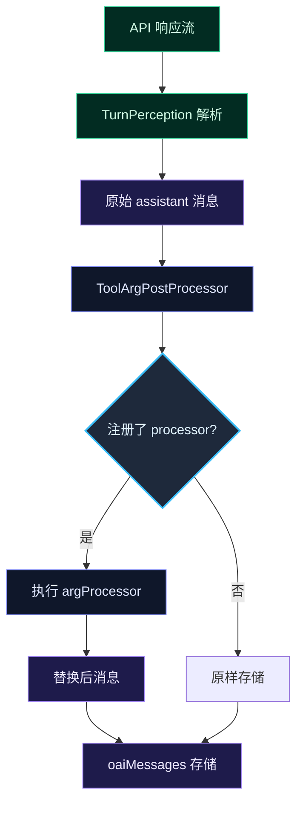
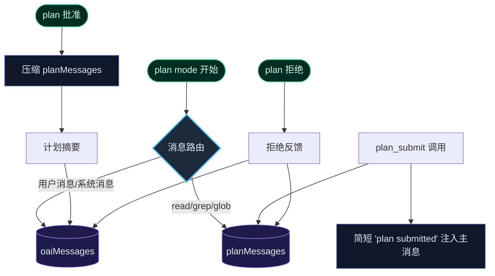
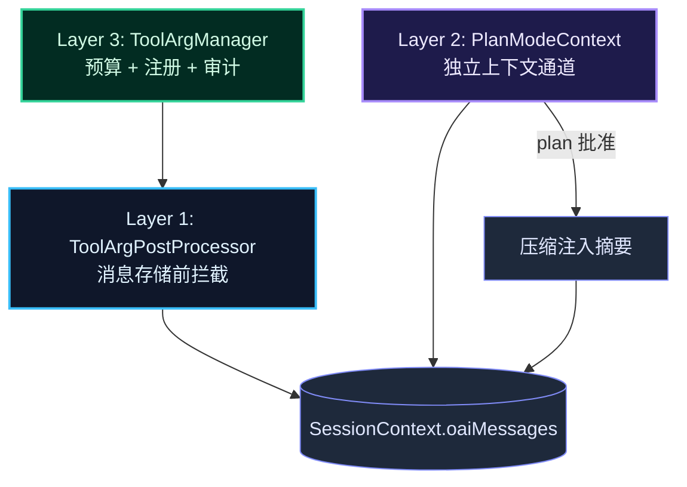

> **Status: COMPLETED** — 2026-06-19 (Layer 1 + W2 + W3 已落地，Layer 2/3 为远景预案)

# Tool Call Arguments 上下文膨胀治理 — 长期架构方案

## 问题描述

`plan_submit` 工具将完整的 plan Markdown 作为 `plan` 参数嵌入 OpenAI function call arguments，随 assistant 消息进入 `SessionContext.oaiMessages`。单次调用注入 ~6K tokens（GLM 5.2 实测：25 代码块、548 行、~15K chars），在 DeepSeek exact-prefix cache 模型中形成永久断裂点——此消息之后的所有 prefix 全部失效。

更根本的问题是：**这不是 plan_submit 的个例，而是一类系统性问题**。任何接受大文本参数的工具（`delegate_task.instructions`、`send_message.body`、未来的 `skill.instructions` 等）都面临同样的膨胀路径。当前压缩体系（artifactIntercept、truncateToolResult、toolTypeBudgets、staleRoundThresholds）全部作用于 **tool result**，对 tool call arguments 零覆盖。

## 根因分析



**断层位置**：tool call arguments 从构造到存储有一条完全未被拦截的路径。`OaiToolCall.function.arguments` 是一个 JSON 字符串，直接写入 `OaiAssistantMessage`，不经任何中间层。

**为什么现有防线覆盖不到**：

| 防线 | 作用阶段 | 作用对象 | 为何无效 |
|------|---------|---------|---------|
| `artifactIntercept` | tool-pipeline post-execute | tool result content | arguments 在 pre-execute 阶段已固化 |
| `truncateToolResult` | tool-pipeline post-execute | tool result content | 同上 |
| `toolTypeBudgets` | compact/constants | tool result content | budget 系统仅针对 result |
| `staleRoundThresholds` | compaction post-hoc | N-2 轮 tool 消息 | 不触及 assistant 消息的 tool_calls |
| `compactStaleRoundsOai` | compaction post-hoc | tool result content | 不修改 assistant 消息结构 |

## 设计方案：三层架构

### Layer 1：ToolArgPostProcessor — 通用工具参数后处理框架

在消息进入 `SessionContext.oaiMessages` 之前，对 assistant 消息中的 `tool_calls` 做后处理。每个注册的工具可以有一个 `argProcessor`，对 arguments JSON 做智能转换。

**数据流**：



**核心接口**：

```typescript
// src/agent/tool-arg-post-processor.ts

export interface ToolArgProcessor {
  /** 工具名 */
  toolName: string
  /**
   * 处理 tool call arguments JSON 字符串。
   * 返回替换后的 arguments 字符串（合法 JSON）或 null（不替换）。
   * 不抛异常——失败时静默返回原 arguments。
   */
  process(args: string, context: ArgProcessContext): string | null
}

export interface ArgProcessContext {
  /** tool call ID */
  toolCallId: string
  /** 当前 cwd */
  cwd: string
  /** artifact store（用于持久化大参数） */
  artifactStore?: import('../artifact/store.js').ArtifactStore
  /** 上下文窗口大小 */
  contextWindow: number
}

export class ToolArgPostProcessorRegistry {
  private processors = new Map<string, ToolArgProcessor>()

  register(processor: ToolArgProcessor): void {
    this.processors.set(processor.toolName, processor)
  }

  /**
   * 处理一条 assistant 消息中的所有 tool_calls。
   * 返回新的消息（不修改原对象）。
   */
  processMessage(msg: OaiAssistantMessage, ctx: ArgProcessContext): OaiAssistantMessage {
    if (!msg.tool_calls || msg.tool_calls.length === 0) return msg
    let changed = false
    const newCalls = msg.tool_calls.map(tc => {
      const processor = this.processors.get(tc.function.name)
      if (!processor) return tc
      try {
        const newArgs = processor.process(tc.function.arguments, ctx)
        if (newArgs !== null && newArgs !== tc.function.arguments) {
          changed = true
          return { ...tc, function: { ...tc.function, arguments: newArgs } }
        }
      } catch { /* processor failed — keep original */ }
      return tc
    })
    if (!changed) return msg
    return { ...msg, tool_calls: newCalls }
  }
}
```

**plan_submit 的 argProcessor 实现**：

```typescript
// src/tools/plan-submit-arg-processor.ts

export const planSubmitArgProcessor: ToolArgProcessor = {
  toolName: 'plan_submit',

  process(args: string, ctx: ArgProcessContext): string | null {
    let parsed: { title?: string; plan?: string }
    try { parsed = JSON.parse(args) } catch { return null }

    if (typeof parsed.plan !== 'string' || parsed.plan.length === 0) return null

    const planLen = parsed.plan.length
    const planLines = parsed.plan.split('\n').length
    const title = parsed.title ?? 'untitled'
    const slug = slugify(title)
    const fileRef = `.rivet/plans/${slug}.md`

    // 构造替换后的 arguments：保留 title，plan 替换为文件引用
    const replacement = JSON.stringify({
      ...parsed,
      plan: `[plan persisted to ${fileRef} — ${planLines} lines, ${planLen} chars. Use read_file to review.]`,
    })

    return replacement
  },
}
```

**为什么安全**：替换后的 arguments 仍然是合法 JSON。tool call 的 `id` 不变。后续 tool result 匹配不受影响。唯一变化是消息历史中存储的 plan 内容变成了文件引用——模型在后续轮次中看到的不是 plan 全文，而是"plan 已存到文件"的提示。模型需要用 `read_file` 来回顾 plan 内容。

**安装点**：`TurnPerceptionController` 或 `ContextInjectionController` 中，在 assistant 消息写入 `SessionContext` 之前调用 `registry.processMessage()`。

---

### Layer 2：Plan Mode 独立上下文通道

当前 plan mode 期间的所有消息（探索性 read_file、grep、最后的 plan_submit）全部进入主 `oaiMessages`。plan 批准后，这些消息仍然占据着上下文窗口的很大一部分——但它们在执行阶段不再需要（执行阶段只需要计划的摘要和当前状态）。

**设计**：



**SessionContext 变更**：

```typescript
// src/context/types.ts 或 SessionContext 接口

interface PlanModeContext {
  /** plan mode 期间的消息（不进主 oaiMessages） */
  messages: OaiMessage[]
  /** plan 提交后的文件路径 */
  submittedPlanPath?: string
  /** plan 提交后的 slug */
  submittedPlanSlug?: string
  /** plan 是否已批准 */
  approved: boolean
}

interface SessionContext {
  // ... 现有字段
  oaiMessages: OaiMessage[]
  /** plan mode 独立上下文（仅在 planModeState === 'planning' 时活跃） */
  planModeContext?: PlanModeContext
}
```

**消息路由逻辑**（在 `ContextInjectionController` 或 `TurnPerceptionController` 中）：

```typescript
function routeMessage(msg: OaiMessage, planMode: PlanModeState, session: SessionContext): void {
  if (planMode !== 'planning') {
    session.pushMessage(msg) // 正常路径
    return
  }

  if (msg.role === 'user') {
    session.pushMessage(msg) // 用户消息始终进入主历史
  } else if (msg.role === 'assistant') {
    // assistant 消息进入 plan 通道
    session.planModeContext ??= { messages: [], approved: false }
    session.planModeContext.messages.push(msg)
  } else if (msg.role === 'tool') {
    // tool 消息进入 plan 通道
    session.planModeContext?.messages.push(msg)
  }
}
```

**plan 批准时的压缩注入**（在 `/plan-approve` 处理中）：

```typescript
async function onPlanApproved(session: SessionContext, slug: string): Promise<void> {
  const planCtx = session.planModeContext
  if (!planCtx) return

  // 读取 plan 文件内容
  const planContent = readFileSync(join(session.cwd, '.rivet', 'plans', `${slug}.md`), 'utf-8')

  // 压缩 plan mode 消息为摘要（保留关键发现、约束、决策）
  const summary = await compressPlanMessages(planCtx.messages, planContent)

  // 注入摘要到主消息历史
  session.pushMessage({
    role: 'user',
    content: `<plan-approved slug="${slug}">\n${summary}\n</plan-approved>`,
  })

  // 清理 plan 通道
  planCtx.approved = true
  session.planModeContext = undefined
}
```

**为什么这是架构升级而非补丁**：它改变了消息的归属模型。plan mode 的消息不再污染主历史，而是在批准时压缩注入。这意味着 plan mode 的探索成本（通常占整个会话 token 消耗的 30-50%）从主消息历史中完全移除，只保留压缩后的知识。

---

### Layer 3：通用大参数工具注册与预算系统

Layer 1 建立了 argProcessor 框架，Layer 3 将其扩展为一个完整的工具参数管理系统：注册、预算、审计。

**ToolArgManager**：

```typescript
// src/agent/tool-arg-manager.ts

export interface ToolArgBudget {
  /** 单次调用 arguments 最大字符数 */
  maxArgsChars: number
  /** 超出后行为：'reject' | 'truncate' | 'artifact' */
  overflowAction: 'reject' | 'truncate' | 'artifact'
  /** 超出后的替换模板（overflowAction === 'artifact' 时） */
  artifactTemplate?: string
}

export const DEFAULT_TOOL_ARG_BUDGETS: Record<string, ToolArgBudget> = {
  plan_submit: {
    maxArgsChars: 2_000, // title + 简短引用
    overflowAction: 'artifact',
    artifactTemplate: '[plan persisted to {filePath} — {lineCount} lines, {charCount} chars. Use read_file to review.]',
  },
  delegate_task: {
    maxArgsChars: 4_000, // task + 简短指令
    overflowAction: 'artifact',
  },
  send_message: {
    maxArgsChars: 2_000,
    overflowAction: 'truncate',
  },
  // default: 不限制（现有行为）
}

export class ToolArgManager {
  private budgets: Record<string, ToolArgBudget>
  private registry: ToolArgPostProcessorRegistry

  constructor(budgets: Record<string, ToolArgBudget> = DEFAULT_TOOL_ARG_BUDGETS) {
    this.budgets = budgets
    this.registry = new ToolArgPostProcessorRegistry()
    // 自动为每个有 budget 的工具注册 processor
    for (const [toolName, budget] of Object.entries(this.budgets)) {
      this.registry.register({
        toolName,
        process: (args, ctx) => this.applyBudget(toolName, args, budget, ctx),
      })
    }
  }

  private applyBudget(
    toolName: string,
    args: string,
    budget: ToolArgBudget,
    ctx: ArgProcessContext,
  ): string | null {
    if (args.length <= budget.maxArgsChars) return null

    if (budget.overflowAction === 'artifact' && ctx.artifactStore) {
      // 将完整 arguments 持久化到 artifact，替换为引用
      const { artifactId } = await ctx.artifactStore.save({
        tool: toolName,
        target: `${toolName}-args`,
        rawContent: args,
        summary: `Full arguments for ${toolName} (${args.length} chars)`,
        sections: [],
      })
      // 仍保留 args 的前 500 chars 以便快速识别
      const preview = args.slice(0, 500)
      return JSON.stringify({
        _artifact_ref: artifactId,
        _preview: preview,
        _note: `Full arguments persisted as artifact:${artifactId}. Use read_section to view.`,
      })
    }

    if (budget.overflowAction === 'truncate') {
      return args.slice(0, budget.maxArgsChars)
    }

    // 'reject': 不替换，让消息原样通过
    // 但记录 warning 日志
    return null
  }
}
```

---

## 三层之间的协作关系



Layer 1 是通用拦截层——所有工具的 arguments 在进入存储前经过它。Layer 2 是 plan mode 专用的上下文隔离——解决的是更根本的"plan mode 消息不该污染主历史"问题。Layer 3 是策略层——定义哪些工具的 arguments 需要处理、如何处理。

---

## 安全不变量

1. **tool call ID 不变**：argProcessor 只替换 `function.arguments` 字符串，不修改 `id`、`type`、`function.name`。后续 tool result 的 `tool_call_id` 匹配不受影响。
2. **JSON 合法性**：argProcessor 的返回值必须是合法 JSON 字符串或 null。null 表示不替换，保留原 arguments。
3. **幂等**：argProcessor 对已处理过的 arguments 再次执行时应返回 null（检测到已替换则跳过）。
4. **不破坏开发模式**：argProcessor 框架是可选的——如果没有注册 processor，行为与现在完全一致。
5. **Plan Mode 消息不丢失**：plan mode 的消息进入 `planModeContext.messages`，在 plan 批准时压缩注入，拒绝时也可注入反馈。不会静默丢弃。
6. **向后兼容**：现有的 `SessionContext` 接口通过可选字段 `planModeContext` 扩展，不破坏任何现有调用方。

## 触发路径清单

| 路径 | 当前行为 | 改后行为 |
|------|----------|----------|
| agent 在 plan mode 下调用 plan_submit | plan 全文进入 oaiMessages → 缓存断裂 | Layer 1: plan 替换为文件引用；Layer 2: assistant 消息进入 planMessages |
| agent 在非 plan mode 下调用 plan_submit | plan 全文进入 oaiMessages → 缓存断裂 | Layer 1: plan 替换为文件引用（全局生效） |
| agent 调用 delegate_task 传大 instructions | instructions 全文进入 oaiMessages | Layer 1+3: 超出预算则 artifact 引用 |
| plan mode 下执行 read_file/grep | 结果进入 oaiMessages → 占用上下文 | Layer 2: 结果进入 planMessages，不影响主历史 |
| plan 被批准 | 无特殊处理 | Layer 2: planMessages 压缩为摘要注入主历史 |
| plan 被拒绝 | 拒绝反馈追加到 oaiMessages | Layer 2: 拒绝反馈注入主历史 + planMessages 保留供修订 |
| 连续 reject→revise→resubmit | 每次 plan_submit 都注入完整 plan → 线性膨胀 | Layer 1: 每次只注入文件引用；Layer 2: 修订轮次的消息仍在 planMessages 中 |
| 非 plan_submit 的普通工具调用 | 不变 | 不变 |

## 实施任务

### Task 1: 创建 ToolArgPostProcessorRegistry

**文件**：
- 创建：`src/agent/tool-arg-post-processor.ts`
- 测试：`src/agent/__tests__/tool-arg-post-processor.test.ts`

**交付物**：`ToolArgPostProcessorRegistry` 类 + `ToolArgProcessor` 接口。能注册 processor、处理 assistant 消息中的 tool_calls、不修改无 processor 的消息。

**验证**：typecheck + 单测（注册/处理/不匹配/空 tool_calls/JSON 解析失败/异常恢复）。

### Task 2: 实现 plan_submit 的 argProcessor

**文件**：
- 创建：`src/tools/plan-submit-arg-processor.ts`
- 测试：`src/tools/__tests__/plan-submit-arg-processor.test.ts`

**交付物**：`planSubmitArgProcessor`。将 plan 字段替换为文件引用。检测已替换的 arguments 时返回 null（幂等）。

**关键细节**：替换后的 JSON 保留所有原有字段，仅 `plan` 字段被替换为简短引用字符串。

**验证**：模拟一个包含 548 行 plan 的 arguments，处理后 arguments 长度 < 500 chars。再次处理同一 arguments 时返回 null。

### Task 3: 在 TurnPerceptionController 中接入 ToolArgPostProcessor

**文件**：
- 修改：`src/agent/turn-perception.ts`（或 `context-injection.ts`）

**改动**：在 assistant 消息写入 SessionContext 之前，调用 `registry.processMessage()`。

**为什么安全**：这是一个纯函数变换——输入 OaiAssistantMessage，输出 OaiAssistantMessage。不改变消息的角色、id 或 tool call 的结构。现有的所有测试应该继续通过。

**验证**：typecheck + 现有全量测试通过。新增集成测试：发送一个 plan_submit tool call，验证 oaiMessages 中的 arguments 已被替换。

### Task 4: 扩展 SessionContext 支持 PlanModeContext

**文件**：
- 修改：`src/context/types.ts`（或 SessionContext 相关文件）
- 修改：`src/agent/session-context.ts`（如果有的话；否则在对应文件中）

**交付物**：`PlanModeContext` 接口 + `SessionContext.planModeContext` 可选字段。

**验证**：typecheck。现有测试不需要改动（字段可选）。

### Task 5: 实现消息路由逻辑（plan mode 消息分离）

**文件**：
- 修改：`src/agent/context-injection.ts` 或消息写入点

**改动**：根据 `planModeState` 将消息路由到 `oaiMessages` 或 `planModeContext.messages`。

**验证**：集成测试——进入 plan mode → 执行 read_file → 验证 read_file 结果在 planMessages 中而不在 oaiMessages 中 → plan_submit → 验证 plan_submit 的 tool call 在 planMessages 中。

### Task 6: 实现 plan 批准时的压缩注入

**文件**：
- 修改：`src/server/session-manager.ts`（`/plan-approve` 处理逻辑）
- 可能新建：`src/agent/plan-compressor.ts`

**改动**：批准 plan 时，将 `planModeContext.messages` 压缩为摘要，注入到主消息历史。清理 planModeContext。

**验证**：集成测试——plan mode 完成 → plan_submit → plan-approve → 验证主消息历史中有压缩后的摘要，planMessages 已清空。

### Task 7: 创建 ToolArgManager（通用预算系统）

**文件**：
- 创建：`src/agent/tool-arg-manager.ts`
- 测试：`src/agent/__tests__/tool-arg-manager.test.ts`

**交付物**：`ToolArgManager` 类。集成 ToolArgPostProcessorRegistry + budget 配置。支持 `artifact`、`truncate`、`reject` 三种溢出策略。

**验证**：typecheck + 单测（各策略的触发和正确行为）。

### Task 8: 端到端集成测试

**文件**：
- 创建：`src/agent/__tests__/plan-mode-context-isolation.test.ts`

**测试场景**：
1. plan mode 完整流程：进入 → 探索 → plan_submit → 验证 plan 内容不在主消息历史中
2. plan 批准后摘要注入：plan-approve → 主消息中存在摘要
3. plan 拒绝后修订：plan-reject → 继续探索 → resubmit → 验证只有最后一次 plan_submit 的文件引用在主消息中
4. delegate_task 大参数的 artifact 引用（Layer 3 覆盖）
5. 旧行为兼容性：无 argProcessor 的工具不受影响

### Task 9: 更新 plan mode 提示词（volatile.ts）

**文件**：
- 修改：`src/prompt/volatile.ts`（plan mode 段，~L670）

**改动**：告知模型 plan 内容会被持久化到文件，消息历史中的 plan 是引用而非全文。模型在后续轮次中如需查看 plan 应使用 read_file。

**认知影响**：这是一个行为提示变更。模型被告知 plan_submit 的新行为后，应该减少"在消息历史中反复查看 plan 内容"的倾向。不影响 plan mode 的探索行为。

### Task 10: 更新 plan_submit 工具描述

**文件**：
- 修改：`src/tools/plan-submit.ts`（definition.description 或注释）

**改动**：在工具描述中说明 plan 内容会被持久化，消息历史中仅保留引用。帮助模型理解新行为。

## 反证测试表

| 场景 | 如果只做 checklist（错误实现）会怎样 | 哪条测试会红 |
|------|--------------------------------------|-------------|
| argProcessor 替换后 JSON 不合法 | API 请求中 arguments 解析失败，tool call 无法匹配 | Task 2 单测：`JSON.parse(processed.args)` 不抛异常 |
| argProcessor 修改了 tool_call_id | tool result 无法匹配到对应的 tool call → orphan result | Task 3 集成测试：验证处理后的消息 tool_calls[0].id 不变 |
| plan mode 消息路由错误——用户消息被路由到 planMessages | 模型看不到用户的新指令 | Task 5 集成测试：user 消息始终在 oaiMessages 中 |
| plan 批准后 planMessages 未被压缩 | 主消息中缺少计划摘要，模型不知道要执行什么 | Task 6 集成测试：批准后 oaiMessages 中存在 `<plan-approved>` 块 |
| argProcessor 对已处理消息重复执行 | plan 引用被嵌套包裹 | Task 2 单测：幂等检测返回 null |
| delegate_task 的 instructions 在 Layer 3 下仍全量存储 | 同类问题未被覆盖 | Task 8 集成测试：delegate_task 的 arguments 被 artifact 引用替换 |

## 风险与缓解

| 风险 | 概率 | 影响 | 缓解 |
|------|------|------|------|
| argProcessor 替换 plan 后，模型不理解需要 read_file 来回看计划 | 中 | 执行阶段模型缺少计划上下文 | volatile prompt 中明确告知 plan 文件路径；ToolArgPostProcessor 的替换消息中包含文件路径 |
| PlanModeContext 在 session 持久化/恢复时丢失 | 中 | 重启后 plan mode 消息丢失 | 将 planModeContext 纳入 session persist 体系 |
| 旧版 agent（未更新提示词）在 plan_submit 后尝试从消息历史读取 plan 全文 | 中 | 模型读到截断的 plan → 困惑 | 替换后的 plan 字段包含明确的文件路径指引 |
| ToolArgManager 的 artifact 溢出策略在 artifactStore 不可用时静默失败 | 低 | arguments 原样存储（退化为旧行为） | argProcessor 失败时返回 null 而非抛异常——fail-open，不退化为更差状态 |
| Layer 2 的消息路由增加复杂度 | 低 | 调试困难 | 充分的集成测试覆盖所有路由分支 |

## 执行顺序依赖

```
Task 1 (ToolArgPostProcessor) ──→ Task 2 (plan_submit argProcessor)
                                       │
Task 4 (PlanModeContext 类型) ──→ Task 5 (消息路由)
                                       │
                                  Task 3 (接入 TurnPerception)
                                       │
Task 7 (ToolArgManager) ──────────────┤
                                       │
                                  Task 8 (端到端集成测试)
                                       │
                                  Task 6 (plan 批准压缩注入)
                                       │
                                  Task 9 (提示词更新)
                                  Task 10 (工具描述更新)
```

Task 1/4 可并行（纯类型/接口定义）。Task 2/7 可并行（两个独立的 argProcessor 实现）。Task 3/5 依赖前置类型和实现。Task 6 依赖 Task 4/5。Task 9/10 依赖整体方案落地后更新。
