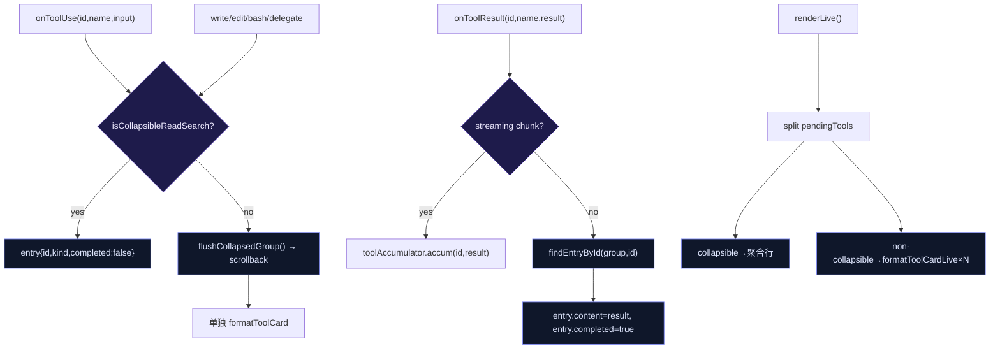

> **Status: ARCHIVED** — 2026-06-19 (审计/复盘文档)

# Tool Group 生产化 — 天枢评估

> 评估对象：[Cursor plan] `tool_group_生产化_9ae281ff.plan.md`
> 评估日期：2026-06-14
> 评估者：天枢 (Tiānshū)

---

## 总体判断：方向正确，细节不足

该计划正确诊断了当前 tool-group 的三个核心缺陷，并选择了正确的修复方向。但在实现细节、边界条件、向后兼容和测试策略上存在显著缺口——照单执行会留下一批回归 bug。

**评级：6/10 — 可执行，但需补充以下 8 项。**

---

## 一、计划正确之处（无需重复）

1. **id 绑定替代 name 绑定** — 这是核心修复。当前 `handleToolResult` 用 `toolName` 匹配最后一个 entry，并行同族调用时结果必然错绑。改为 `toolUseId` 匹配是唯一正确解。

2. **read+search 统一单组** — 语义正确。Agent 在探索阶段交替 read/grep/glob 是同一认知单元，拆成两组反而割裂。

3. **纯函数抽取** — 从 `app.ts` 中分离出 `isCollapsibleTool` / `attachResult` / `buildSummaryText`，可单测、可复用。工程上正确。

4. **Wave 分解合理** — 数据模型 → 渲染 → 去重 → 文档，依赖关系清晰。

---

## 二、必须补齐的 8 项

### G1. 文件重命名与旧导出废弃策略（缺失）

计划说"在 `tool-group.ts`（或重命名为 `collapsed-read-search.ts`）"——悬而未决。

**天枢决策**：重命名为 `collapsed-read-search.ts`。理由：
- 当前 `tool-group.ts` 仍在导出 `ToolGroup` / `groupFamily` / `canCollapse` 等旧语义
- 新类型 `CollapsedReadSearchEntry` / `CollapsedReadSearchGroup` 与旧名语义无交集
- 保留旧文件 + 新增 deprecation re-export 窗口（1-2 周），避免 main-ansi 等外部消费者构建失败

迁移路径：
1. 新建 `collapsed-read-search.ts`，实现全部新类型 + 纯函数
2. 在旧 `tool-group.ts` 中 re-export 新函数的别名（`canCollapse` → `isCollapsibleReadSearch` 等），标记 `@deprecated`
3. `app.ts` 改用新文件
4. 确认无其他调用方后删除旧文件

### G2. 工具分类矩阵不完整（遗漏工具）

计划只提到 `grep/glob/semantic_search → search`、`read_file → read`、`ls → list`。但当前代码库有以下边界工具：

| 工具 | 当前 `groupFamily` 分类 | 是否应折叠 | 理由 |
|------|----------------------|----------|------|
| `read_policy` | `other` | **应** → `read` | 读取策略文件，与 `read_file` 同性质 |
| `read_section` | `other` | **应** → `read` | 读取 artifact，同性质 |
| `file_info` | `other` | **可** → `read` | 获取文件元信息，轻量 |
| `repo_map` | `other` | **应** → `search` | 代码结构探索，与 `glob` 同性质 |
| `repo_graph` | `other` | **应** → `search` | 代码图查询，同性质 |
| `recall` | `other` | **不应** | 记忆召回，非文件搜索 |
| `recall_capsule` | `other` | **不应** | 星域胶囊，非文件搜索 |
| `related_tests` | `other` | **应** → `search` | 测试文件查找 |
| `inspect_project` | `other` | **应** → `search` | 项目结构探索 |

**天枢决策**：折叠族应扩展为 `read_file | read_policy | read_section | file_info` → read，`grep | glob | semantic_search | repo_map | repo_graph | related_tests | inspect_project` → search。其他保持 `other` 不折叠。

实现上，不要用 `classifyCollapsibleKind(name, input)` 的 `input` 参数做二次判断——工具名已足够判定分类。input 只用于 `displayName` 提取。

### G3. handleToolResult 的 pendingTools 泄漏（当前 bug，计划未提）

在 `handleToolResult` 第 1230 行（当前代码），collapsible tool 的 terminal result 到达时：

```typescript
if (canCollapse(family) && this.toolGroupBuffer) {
  // ... 写入 entry.content ...
  return  // ← 这里提前 return，从未执行 this.pendingTools.delete(id)
}
```

`pendingTools` 中的 collapsible tool 永远不删除——live 区域会一直显示已完成工具的执行卡片。

**天枢修复**：collapsible tool 的 terminal result 到达后也必须从 `pendingTools` 中删除，同时从 `toolAccumulator` 清除。

### G4. 非 collapsible 打断时残留 entry 无 content（当前 bug，计划提了但未给解）

计划承认"flush 时可能仍有 entry 无 content（异族 tool 打断时）"。

当 write_file 打断 read+search 组时，组中最后一个 read 可能尚未收到 result。flush 调用 `buildSummaryText` 时，某些 entry 的 `content` 为 undefined。

**天枢修复**：`buildSummaryText` 只统计 `completed: true` 的 entry。未完成的 entry 不计入 `searchCount` / `readFilePaths`，但保留在组中以备后续补充（如果还在同一 turn 内）。组 flush 到 scrollback 时丢弃未完成 entry 或标记 `(pending)`。

### G5. formatToolCardLive 去重策略不明确（W3 描述太简）

W3 说"live 区 collapsible pending 聚合行，跳过重复 formatToolCardLive"。但当前 live 区逻辑在 `renderLive()` 中无条件遍历 `pendingTools`：

```typescript
if (this.pendingTools.size > 0) {
  for (const [id, meta] of this.pendingTools) {
    const toolLines = formatToolCardLive({ ... })
    lines.push(...)
  }
}
```

**天枢设计**：

```
live 区 collapsible 聚合行（在 worker pills 之下、非折叠工具卡片之上）：
  ⠋ Searching 2 patterns, reading 3 files · 2.1s
      src/foo.ts (120L)
      "pattern" in src/

非 collapsible 工具仍走独立 formatToolCardLive。
```

实现：`renderLive()` 中先分类 `pendingTools` → `collapsiblePending` / `nonCollapsiblePending`。collapsible 聚合为一行（gather current partial outputs），nonCollapsible 按现有逻辑。

### G6. ctrl+o 展开需要覆盖 group（不仅是单卡）

当前 `expandLastTruncatedTool` 只展开 `lastTruncatedTool`（单卡）。计划正确指出应改为 `lastCollapsedGroup`。

但计划未回答：展开后 group 的完整内容如何渲染？当前 `formatToolGroup` 有一个 `expanded?: boolean` 参数（未使用）。应新增 `formatCollapsedReadSearch({ group, expanded: true })` 路径：

- 展开时：每条 entry 显示完整 content（前 30 行 + 截断标记 + 行数统计）
- 与 `formatToolCard(expanded: true)` 同风格

### G7. 测试策略需要从 Ink 组件测试迁移到纯函数测试

当前 `src/tui/__tests__/tool-group.test.ts` 仍在测 Ink `ToolGroup` 组件：

```typescript
assert.ok(typeof ToolGroup === 'function' || typeof ToolGroup === 'object')
```

这是无意义的测试——只检查 exports。计划说"清理 stale tool-group.test.ts"但未给出新测试结构。

**天枢测试结构**：

```
src/tui/__tests__/
  collapsed-read-search.test.ts   ← 纯函数单测（新增）
    ├── isCollapsibleTool 覆盖所有工具的边界
    ├── classifyCollapsibleKind
    ├── shouldBreakGroup
    ├── attachResult (id 匹配正确性)
    ├── buildSummaryText (各种组合)
    └── 并行结果绑定（2 read_file 同时到达，按 id 正确分配）
  
  tool-group.test.ts              ← 删除（或改为仅测旧 Ink 组件直到 deprecated）
  
  app-tool-group.test.ts          ← 集成测（新增）
    ├── 异族打断：read×3 + write → flush 完整 read 组
    ├── 并行绑定：2 read_file 结果按 id 正确分配
    ├── 混合组：read + grep + read → 统一摘要
    └── abort 中断时 flush 组
```

### G8. 流式 chunk 路径需要明确（计划说"可选"）

`handleToolResult(id, name, result, isError={undefined})` — 当 `isError === undefined` 时这是 streaming chunk。计划说"可选：写入 entry 的 partial content 供 live 预览"。

**天枢决策**：不写入 entry content（read_file 的 chunk 流对折叠组无意义——用户只需知道文件正在被读取）。但需写入 `toolAccumulator` 并在 live 聚合行中显示最新 chunk 的末 2 行。这样用户在等待大文件读取时能看到进度。

---

## 三、架构简图（天枢修正版）



---

## 四、文件变更清单（修正后）

| 文件 | 操作 | 说明 |
|------|------|------|
| `src/tui/format/tool-group.ts` | 保留 + deprecation re-export | 旧函数标记 @deprecated，1-2 周后删除 |
| `src/tui/format/collapsed-read-search.ts` | **新建** | 全部新类型 + 纯函数 |
| `src/tui/engine/app.ts` | 修改 | 切换 toolGroupBuffer 为新类型，修复 pendingTools 泄漏，live 聚合 |
| `src/tui/__tests__/collapsed-read-search.test.ts` | **新建** | 纯函数单测 |
| `src/tui/__tests__/app-tool-group.test.ts` | **新建** | 集成测 |
| `src/tui/__tests__/tool-group.test.ts` | 删除 | 或改为 deprecated 占位 |

---

## 五、执行优先级

| 序号 | 内容 | 理由 |
|------|------|------|
| 1 | 新建 `collapsed-read-search.ts`（纯函数 + 类型） | 无依赖，可独立完成 + 测试 |
| 2 | 修复 `handleToolResult` pendingTools 泄漏（G3） | 先止血 |
| 3 | 改 `app.ts` pipeline（id 绑定 + 统一组） | 核心变更 |
| 4 | live 聚合 + 非折叠工具卡片去重（G5） | 可见的 UX 改善 |
| 5 | ctrl+o 组展开（G6） | 功能补全 |
| 6 | 测试（G7） | 验证以上所有 |
| 7 | 旧文件 deprecation + 清理 | 收尾 |

---

## 六、一句话总结

计划的方向和问题诊断是正确的，但缺少 8 项实现级决策——从工具分类矩阵到 pendingTools 泄漏修复，从 live 聚合的具体形态到测试策略迁移。照计划执行会留下一批回归 bug。补上上述 8 项后，这是一个合格的 P0 生产化计划。
