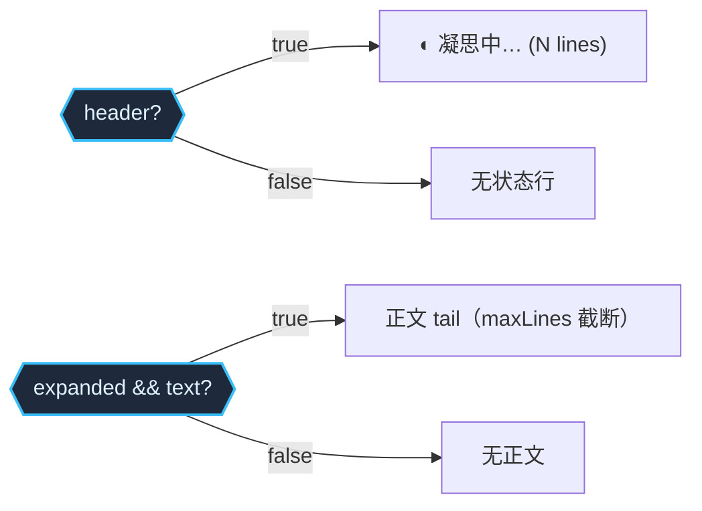

> **Status: APPROVED** — 2026-06-19T09:26:23.143Z

# TUI DeepSeek thinking display — formatThinking API 简化优化

# TUI DeepSeek 推理显示 — 设计审查与优化

> 审查原始方案，在 `formatThinking` API 层面提出简化优化。

## 原方案评估

根因定位（两道门挡住推理）完全正确，修复方向也正确。问题出在 `formatThinking` 的重构方式——引入 "committed" vs "live-tail" 两个模式，概念上冗余。

## 核心优化：用 `header` + `maxLines` 替代 "mode" 概念

原方案引入两种渲染模式（committed / live-tail），根因是 `formatThinking` 有两层职责叠在一起：(a) 产生状态行（`◐ 凝思中…`），(b) 产生正文行。流式渲染时 spinner 已承担状态行 → 需要 "live-tail 模式跳过状态行"；提交时无 spinner → 需要 "committed 模式含状态行"。两个模式本质上只差一行。

更简洁的做法：**让调用方决定要不要状态行**，`formatThinking` 只管格式化。

```typescript
// 优化后的接口（thinking.ts）
export interface FormatThinkingInput {
  text: string
  elapsedMs: number
  /** 包含头部状态行（凝思中…）。默认 true。
   *  流式渲染时 spinner 已显示状态，可设 false。 */
  header?: boolean
  /** 展开正文内容。默认 false。 */
  expanded?: boolean
  /** 正文最大行数。默认 8。commit 时可加大（如 60）。 */
  maxLines?: number
}
```

去掉了 `isStreaming` 标志和 "committed/live-tail" 模式概念。三个参数语义正交：

| 参数 | 作用 | 流式 live | 提交 scrollback |
|------|------|-----------|----------------|
| `header` | 是否输出状态行 | `false`（spinner 承担） | `true`（默认） |
| `expanded` | 是否输出正文 | =`thinkingExpanded` | `true` |
| `maxLines` | 正文截断行数 | 8（默认） | 60 |



## 具体改动

### 1. `src/tui/format/thinking.ts` — 简化重构

```
// 移除 isStreaming 和 expanded（从 input 移到调用方控制）
// 移除 FormatThinkingInput.isStreaming
// 新增 FormatThinkingInput.header?: boolean（默认 true）
// 新增 FormatThinkingInput.maxLines?: number（默认 8）
// 删除 L32: if (!input.isStreaming) return []
// L39-44 状态行改为受 header 控制
// L46-51 正文改为受 expanded 控制 + maxLines 截断
// 超限时追加 `… +M more lines`
```

### 2. `src/tui/engine/app.ts` — 三处修改

**L378 — 默认展开：**
```
thinkingExpanded: true  // 原 false → true
```

**L1803 — 流式渲染（去掉状态行，spinner 已有）：**
```typescript
if (this.state.isThinking && this.state.thinkingText) {
  const thinkingLines = formatThinking({
    text: this.state.thinkingText,
    elapsedMs: Date.now() - this.state.thinkStartMs,
    header: false,                     // spinner 已显示状态
    expanded: this.state.thinkingExpanded,
  }, this.theme)
  for (const line of thinkingLines) {
    lines.push({ text: line })
  }
}
```

**L2105 — commit 到 scrollback（含状态行 + 更大截断）：**
```typescript
const formatted = formatThinking({
  text: this.state.thinkingText,
  elapsedMs: Date.now() - this.state.thinkStartMs,
  expanded: true,
  maxLines: 60,  // scrollback 中可展示更多行
}, this.theme)
this.commit.write({ text: formatted.join('\n'), trailingNewline: true })
```

### 3. 测试更新

**`src/tui/__tests__/format-tool-diff-thinking.test.ts`：**
- `returns empty when not streaming` → 改为 `returns empty when no text`（isStreaming 不再存在于接口）
- `shows status line when streaming` → 改为 `shows status line when header is true`
- `shows expanded content when expanded` → 保留 + 加 `maxLines` 截断断言
- 新增：`hides status line when header: false`
- 新增：`shows truncation hint when text exceeds maxLines`
- 新增：`produces output without isStreaming flag`（验证核心修复：不再因 isStreaming=false 返回空）

**`src/tui/engine/__tests__/stream-render-lifecycle.test.ts`：**
- thinking delta 后断言默认渲染暗色正文（不再需要 Ctrl+T 才可见）

## 与原方案对照

| 维度 | 原方案 | 优化后 |
|------|--------|--------|
| 核心概念 | committed / live-tail 两种模式 | header + maxLines 两个正交参数 |
| `isStreaming` | 保留，用于模式切换 | 删除 |
| API 参数数 | 4（含 mode 概念） | 4（text, elapsedMs, header?, expanded?, maxLines?） |
| 调用方语义 | "用 committed 模式渲染" | "含状态行，60 行截断" |
| 概念负担 | 需理解两种模式差异 | 三个显式参数，含义自明 |

节省的不是代码行数，是概念数量。`header`、`expanded`、`maxLines` 三个参数各自独立、含义不重叠——调用方组合它们得到所需输出，不需要记住"live-tail 模式 = 无状态行 + 8 行尾"这种隐藏映射。

## 验证计划

1. `npx tsc --noEmit` — typecheck
2. `npm exec -- tsx --test src/tui/__tests__/format-tool-diff-thinking.test.ts` — formatThinking 单元测试
3. `npm exec -- tsx --test src/tui/engine/__tests__/stream-render-lifecycle.test.ts` — app 层生命周期
4. 手动：实跑 DeepSeek 确认流式可见 / Ctrl+T 折叠 / 完成保留

## 风险

- 现有测试 `returns empty when not streaming` 直接依赖 `isStreaming` 参数——需同步更新
- `header: false` + `expanded: false` 时输出空数组，调用方需确保只在有内容时调用（当前 L1803 已有 `thinkingText` 守卫，安全）
