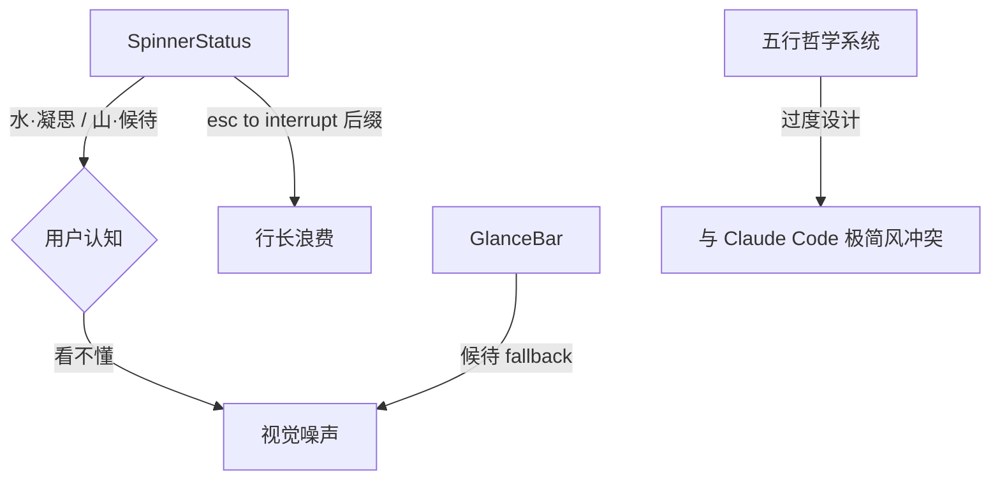

# TUI 会话界面精简优化 — 去冗余文本 + 对标 Claude Code 渲染

# TUI 会话界面精简优化

## 问题描述

当前 TUI 会话界面存在几类冗余文本和视觉噪声，影响信息密度和专注度。用户明确提到：
1. **「候待」** — 五行 phase 标签（水·凝思 / 火·书写 / 风·运作 / 山·候待）过于文艺，用户看不懂
2. **「esc to interrupt」** — spinner 状态行后缀太长
3. **长文本后缀** — 各种提示性文字过多

对标 Claude Code 的克制风格：极简状态行、无装饰性标签、工具结果高度折叠。

## 根因分析



Claude Code 的设计哲学：spinner 只显示 `⠋ elapsed`，无 phase 标签、无 esc 提示（esc 行为在帮助里说明，不在状态行重复）。工具结果默认折叠，点击展开。

## 改动范围（Scope Check）

| 文件 | 改动 | 行为变化 |
|------|------|---------|
| `src/tui/format/spinner-status.ts` | 精简状态行格式 | spinner 行从 `⠋ 水 · 凝思… (12s · esc to interrupt)` → `⠋ 12s` |
| `src/tui/format/spinner-status.ts` | `phaseIndicator` 标签简化 | `水 · 凝思` → `思考` / `山 · 候待` → `待命` |
| `src/tui/format/glance-bar.ts` | fallback 文本简化 | `候待` → `待命` |
| `src/tui/format/spinner-status.ts` | 移除 esc 后缀 | esc 行为已在 welcome 和双击 Esc rewind 中说明 |

**不碰的文件**：app.tsx（渲染逻辑不变）、engine/（输入处理不变）、welcome.ts（首次提示不变）

## 具体改动

### 1. Spinner 状态行精简

**当前** (spinner-status.ts:89):
```
⠋ 水 · 凝思… (12s · esc to interrupt)
```

**改后**:
```
⠋ 思考 12s
```

改动点：
- 移除五行标签，改用直白中文动词（思考/书写/运作/待命）
- 移除 `…` 省略号
- 移除 `· esc to interrupt` 后缀
- 移除括号，用空格分隔 elapsed

### 2. phaseIndicator 标签简化

**当前**:
```typescript
thinking: '水 · 凝思'
streaming: '火 · 书写'
analyzing: '风 · 运作'
waiting: '山 · 候待'
idle: '候待'
```

**改后**:
```typescript
thinking: '思考'
streaming: '书写'
analyzing: '运作'
waiting: '待命'
idle: '空闲'
```

glyph 保持不变（◐◆◈◇·）——菱形家族视觉系统已经收敛，不需要动。

### 3. GlanceBar fallback 文本

**当前** (glance-bar.ts:91): `'候待'`
**改后**: `'待命'`

### 4. formatTurnWorkSummary 精简

**当前**:
```
◆ Worked for 2m 15s · 12.3k in / 5.1k out
```

**改后**:
```
◆ 2m 15s · 12.3k→5.1k
```

## 验证计划

1. `npx tsc --noEmit` — typecheck
2. `TMPDIR=/tmp node --import tsx --test src/tui/__tests__/spinner-status.test.ts` — spinner 测试需要更新断言
3. `TMPDIR=/tmp node --import tsx --test src/tui/__tests__/format-welcome.test.ts` — welcome 测试不涉及改动
4. 手动验证：`node dist/main.js` 启动后观察状态行

### 测试更新

`spinner-status.test.ts` 中有两个断言需要更新：
- L33: `plain.includes('esc to interrupt')` → 移除此断言
- L42: `waiting.includes('候待…')` → `waiting.includes('待命')`
- L100-107: phaseIndicator 断言更新为新标签

## 风险与缓解

| 风险 | 缓解 |
|------|------|
| 测试断言更新遗漏 | grep 所有引用 '候待'/'凝思' 的测试文件 |
| 用户习惯了五行标签 | 标签简化但 glyph 不变，视觉连续性保留 |
| 其他文件引用旧标签 | grep 全量扫描确认无遗漏 |
