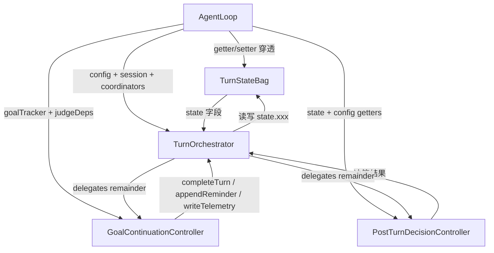

# TurnOrchestratorDeps 瘦身——状态收敛 + 决策控制器提取

> **面向 AI 代理：** 使用 `executing-plans` 逐任务实现。计划阶段已完成深度调研。
> 步骤使用复选框（`- [ ]`）语法跟踪进度。

**目标：** 将 `TurnOrchestratorDeps` 从 50 字段降至 ~20 字段，消除 35 组 get/set 重复接线，提取 Goal 续行和 Phantom/Thinking 决策为独立控制器。

**架构：** 三步递进——① 将 19 组 AgentLoop 可变字段收敛为单个 `TurnStateBag` 对象（orchestrator 通过 getter/setter 透明读写 AgentLoop 字段，工厂接线从 35 行 lambda 降为 1 个 getter/setter 定义对象）；② 提取 `GoalContinuationController`（整个 goal 检查段 ~67 行 + judgeGoalCompletion ~83 行 = ~150 行逻辑）；③ 提取 `PostTurnDecisionController`（thinking-retry ~23 行 + phantom-continuation ~18 行）。三步独立可交付，每步 typecheck + 测试全绿。

**技术栈：** TypeScript strict + node:test

---

## ⚠️ 关键实现约束

### TurnStateBag 必须用 getter/setter，不能用裸字面量

JavaScript 对象字面量对原始类型做**值拷贝**，不是引用。下面写法会在构造时拷贝 `self.streamedText` 的当前值（空字符串），orchestrator 后续 `state.streamedText = 'new'` **不会写回 `self.streamedText`**：

```typescript
// ❌ 错误——静默断裂，typecheck 抓不到
state: {
  streamedText: self.streamedText,
  traceStore: self.traceStore,
  // ...
}
```

正确写法必须用 `Object.defineProperties` 或 `{ get field() {}, set field(v) {} }` 语法定义属性，让每次读写穿透到 `self`：

```typescript
// ✅ 正确——getter/setter 穿透到 AgentLoop 字段
const state: TurnStateBag = {
  get streamedText() { return self.streamedText },
  set streamedText(v) { self.streamedText = v },
  get traceStore() { return self.traceStore },
  set traceStore(v) { self.traceStore = v },
  get recentTextFingerprints() { return self.recentTextFingerprints },
  set recentTextFingerprints(v) { self.recentTextFingerprints = v },
  // ...
} as TurnStateBag
```

`recentTextFingerprints` 虽然当前用法是原地 push/shift（不重新赋值），也加 setter 防止未来代码改写引用。

受影响字段共计 **18 个值类型字段**（string/number）和 **5 个被重新赋值的引用字段**（traceStore、importGraph、latestRisk、latestFsWatcherState、turnBudget 在 execute() 中都有 `setXxx(newValue)` 调用）。

---

## 调研背书

### 全量消费方枚举

`TurnOrchestratorDeps` 定义于 `src/agent/turn-orchestrator.ts:102`，消费方：

| 消费方 | 文件:行 | 用途 |
|--------|---------|------|
| `TurnOrchestrator` 构造函数 | `turn-orchestrator.ts:271` | 唯一运行时消费方 |
| `createTurnOrchestrator()` | `loop-factory.ts:457-590` | 工厂接线（构建 deps 对象） |
| `makeOrchestrator()` 测试 helper | `turn-orchestrator-goal.test.ts:46` | `as unknown as TurnOrchestratorDeps` 类型强转 mock |

**无其他消费方**。测试用 `as unknown as` 强转，不受字段变化影响。

### 被删除项的调研背书

- **35 个 get/set lambda**（loop-factory.ts 的 Per-run state 段）：19 组字段 × 2（get+set），部分仅有 setter 无 getter。每个 lambda 体为单行字段读/写。删除后替换为 `state: { get field() {...}, set field(v) {...} }` getter/setter 定义。
- **goal 检查段**（turn-orchestrator.ts L873-L940，~67 行）：包含 `tracker.check()` 调用、三路分支（continue/achieved→judge/deactivate）、`saveGoalState` 持久化、`flushMeridianTurn`、以及 `shouldContinueGoal` 后续处理（`completeTurn` + 两种 `appendSystemReminder` 分支）。
- **`judgeGoalCompletion` 私有方法**（turn-orchestrator.ts L289-L371，~83 行）：仅被 goal 检查段的 achieved 分支调用（L897）。提取到 `GoalContinuationController` 后成为私有方法。
- **thinking-retry 段**（L859-L868，~10 行 + evaluateThinkingRetry 调用）和 **phantom-continuation 段**（L988-L1005，~18 行）：各自独立决策块，无交叉依赖。

---

## 数据流图



`TurnStateBag` 通过 getter/setter 穿透到 AgentLoop 字段——不是拷贝，不是序列化，是真引用。

---

## 任务

### 任务 1：定义 TurnStateBag 并收敛 per-run state（getter/setter 实现）

- [ ] 在 `src/agent/turn-orchestrator.ts` 新增 `TurnStateBag` interface（19 字段，每字段含 get+set 语义，但 TypeScript interface 只声明 `field: Type`）
- [ ] 修改 `TurnOrchestratorDeps`：删除 `// === Per-run state ===` 段全部 get/set 字段，新增 `state: TurnStateBag`
- [ ] 修改 `TurnOrchestrator.execute()`：全部 `this.deps.getXxx()` → `this.deps.state.xxx`，`this.deps.setXxx(v)` → `this.deps.state.xxx = v`
- [ ] 修改 `loop-factory.ts` 的 `createTurnOrchestrator()`：删除 Per-run state 段 ~35 行 lambda，替换为使用 getter/setter 语法的 `state` 对象字面量
- [ ] 验证 typecheck + 相关测试

**目标：** 消除 35 个 get/set 字段，orchestrator 通过 `state.xxx` 透明读写 AgentLoop 字段。

**调研背书：**
- `getDoomLoopLevel` 调用方法（`self.getDoomLoopLevel()`）——**保留为独立 deps 字段**，不纳入 `TurnStateBag`。
- `getActiveContract` 读 `self.taskContract`（AgentLoop 字段）——纳入 `TurnStateBag`。
- `getMaxAutoContinue` 读 `self.config.maxAutoContinue ?? 0`——**保留为独立 deps 字段**。
- `setTurnsSinceLastObjection` 和 `setThetaRequestsThisTurn` 是 write-only——纳入 `TurnStateBag`，orchestrator 写 `state.turnsSinceLastObjection = v`。

#### TurnStateBag 完整字段列表（19 个，逐字段类型来自 AgentLoop 声明）

| 字段 | AgentLoop 类型 | 读写模式 |
|------|---------------|---------|
| `streamedText` | `string` | RW |
| `lastPrewarmAt` | `number` | RW |
| `gitChangeRate` | `number` | RW |
| `turnBudget` | `TurnBudget` | W（仅 set，无 get in deps，但 orchestrator 内部不读） |
| `latestFsWatcherState` | `FsWatcherState` | RW |
| `consecutiveNoToolTurns` | `number` | RW |
| `autoContinueCount` | `number` | RW |
| `thinkingOnlyRetries` | `number` | RW |
| `lastThinkingContent` | `string` | RW |
| `lastTurnTextFingerprint` | `string` | RW |
| `lastTurnThinkingFingerprint` | `string` | RW |
| `recentTextFingerprints` | `string[]` | R（原地 push/shift，不重新赋值） |
| `turnsSinceLastObjection` | `number` | W |
| `traceStore` | `TraceStore` | RW |
| `importGraph` | `ImportGraph \| null` | RW |
| `lastConflictCheckCount` | `number` | RW |
| `latestRisk` | `RiskAssessment` | RW |
| `thetaRequestsThisTurn` | `number` | W |
| `taskContract` | `TaskContract \| undefined` | R（对应原 `getActiveContract`） |

```typescript
export interface TurnStateBag {
  streamedText: string
  lastPrewarmAt: number
  gitChangeRate: number
  turnBudget: TurnBudget
  latestFsWatcherState: FsWatcherState
  consecutiveNoToolTurns: number
  autoContinueCount: number
  thinkingOnlyRetries: number
  lastThinkingContent: string
  lastTurnTextFingerprint: string
  lastTurnThinkingFingerprint: string
  recentTextFingerprints: string[]
  turnsSinceLastObjection: number
  traceStore: TraceStore
  importGraph: ImportGraph | null
  lastConflictCheckCount: number
  latestRisk: RiskAssessment
  thetaRequestsThisTurn: number
  taskContract: import('../context/task-contract.js').TaskContract | undefined
}
```

#### 工厂接线模板（`loop-factory.ts` 中替换 Per-run state 段）

```typescript
// === Per-run state (getter/setter view into AgentLoop fields) ===
state: {
  get streamedText() { return self.streamedText },
  set streamedText(v) { self.streamedText = v },
  get lastPrewarmAt() { return self.lastPrewarmAt },
  set lastPrewarmAt(v) { self.lastPrewarmAt = v },
  get gitChangeRate() { return self.gitChangeRate },
  set gitChangeRate(v) { self.gitChangeRate = v },
  get turnBudget() { return self.turnBudget },
  set turnBudget(v) { self.turnBudget = v },
  get latestFsWatcherState() { return self.latestFsWatcherState },
  set latestFsWatcherState(v) { self.latestFsWatcherState = v },
  get consecutiveNoToolTurns() { return self.consecutiveNoToolTurns },
  set consecutiveNoToolTurns(v) { self.consecutiveNoToolTurns = v },
  get autoContinueCount() { return self.autoContinueCount },
  set autoContinueCount(v) { self.autoContinueCount = v },
  get thinkingOnlyRetries() { return self.thinkingOnlyRetries },
  set thinkingOnlyRetries(v) { self.thinkingOnlyRetries = v },
  get lastThinkingContent() { return self.lastThinkingContent },
  set lastThinkingContent(v) { self.lastThinkingContent = v },
  get lastTurnTextFingerprint() { return self.lastTurnTextFingerprint },
  set lastTurnTextFingerprint(v) { self.lastTurnTextFingerprint = v },
  get lastTurnThinkingFingerprint() { return self.lastTurnThinkingFingerprint },
  set lastTurnThinkingFingerprint(v) { self.lastTurnThinkingFingerprint = v },
  get recentTextFingerprints() { return self.recentTextFingerprints },
  set recentTextFingerprints(v) { self.recentTextFingerprints = v },
  get turnsSinceLastObjection() { return self.turnsSinceLastObjection },
  set turnsSinceLastObjection(v) { self.turnsSinceLastObjection = v },
  get traceStore() { return self.traceStore },
  set traceStore(v) { self.traceStore = v },
  get importGraph() { return self.importGraph },
  set importGraph(v) { self.importGraph = v },
  get lastConflictCheckCount() { return self.lastConflictCheckCount },
  set lastConflictCheckCount(v) { self.lastConflictCheckCount = v },
  get latestRisk() { return self.latestRisk },
  set latestRisk(v) { self.latestRisk = v },
  get thetaRequestsThisTurn() { return self.thetaRequestsThisTurn },
  set thetaRequestsThisTurn(v) { self.thetaRequestsThisTurn = v },
  get taskContract() { return self.taskContract },
  set taskContract(v) { self.taskContract = v },
} as TurnStateBag,
```

**TypeScript 注意**：对象字面量中的 getter/setter 需要在 `tsconfig.json` 中确认 `target >= ES5`（已满足）。`as TurnStateBag` 类型断言告知编译器该对象满足 interface。

**验证：**
```bash
npx tsc --noEmit                                    # typecheck
npm exec -- tsx --test src/agent/__tests__/turn-orchestrator-goal.test.ts 2>&1 | tail -10
```

**提交：**
```bash
git add src/agent/turn-orchestrator.ts src/agent/loop-factory.ts
git commit -m "refactor(orchestrator): converge 19 per-run state fields into TurnStateBag with getter/setter (任务 1/3)"
```

---

### 任务 2：提取 GoalContinuationController（全 goal 段 + judgeGoalCompletion）

- [ ] 创建 `src/agent/goal-continuation.ts`
- [ ] 定义 `GoalContinuationDeps` interface（11 字段——全 goal 段所需的最小集）
- [ ] 将 `TurnOrchestrator.judgeGoalCompletion()` 私有方法移入 `GoalContinuationController`（作为私有方法）
- [ ] 将 `execute()` 中 goal 检查段（L873-L940）的 **全部逻辑** 移入 `GoalContinuationController.handleGoalCheck()`——包括 tracker.check() 三路分支、saveGoalState、flushMeridianTurn、continuation reminder 拼接
- [ ] 在 `TurnOrchestratorDeps` 新增 `goalContinuation: GoalContinuationController`，删除 `getGoalTracker`、`getGoalJudgeDeps`、`getGoalJudgeEvidence`
- [ ] 修改 `TurnOrchestrator.execute()`：goal 检查段替换为 `const goalResult = await this.deps.goalContinuation.handleGoalCheck({ streamedText, estimatedTokens, isAborted, turn, callbacks, signal })` + 结果分支处理
- [ ] 修改 `loop-factory.ts`：删除 3 个 deps 字段，新增 `goalContinuation: new GoalContinuationController({...})`
- [ ] 更新 `turn-orchestrator-goal.test.ts`：将 judge 测试改为直接测 `GoalContinuationController.handleGoalCheck()`（或保留 judgeGoalCompletion 为公开方法供测试，由 handleGoalCheck 内部调用）
- [ ] 验证 typecheck + 测试

**目标：** 将 ~150 行 goal/judge 逻辑从 orchestrator 完全移出。orchestrator 的 goal 段从 ~67 行压缩为 ~15 行调用 + 结果处理。

**调研背书——提取边界精确界定：**

goal 检查段（L873-L940）精确包含以下逻辑，全部移入 `handleGoalCheck()`：

1. `getGoalTracker()` → tracker
2. `tracker?.isActive()` 守卫
3. `tracker.check(streamedText, estimatedTokens, isAborted)` → goalResult
4. 三路分支：`shouldContinue`（仅 advanceIteration）、`achieved`（调 `judgeGoalCompletion` 子方法）、`deactivate`（四种 reason 映射）
5. `saveGoalState(getSessionDir(cwd), sessionId, tracker)` 持久化
6. `flushMeridianTurn()`
7. `shouldContinueGoal` 后续处理：`completeTurn(isFinal:false)` + 两种 `appendSystemReminder`（judge continuation reminder vs 通用 GOAL CONTINUATION 含 wall clock 信息）

`GoalContinuationDeps` 完整清单（11 字段）：

```typescript
export interface GoalContinuationDeps {
  getGoalTracker: () => GoalTracker | null
  getGoalJudgeDeps?: () => GoalJudgeDeps | undefined
  getGoalJudgeEvidence?: () => { text: string; modifiedFiles: string[] }
  getStreamedText: () => string
  getEstimatedTokens: () => number
  getSessionId: () => string | undefined
  getCwd: () => string
  appendSystemReminder: (content: string) => void
  completeTurn: (params: CompleteTurnParams) => Promise<void>
  writeTelemetry: (entry: any) => void
  flushMeridianTurn: () => void
}
```

**handleGoalCheck 签名与返回值：**

```typescript
export type GoalCheckResult =
  | { kind: 'continue'; reminderKind: 'judge' | 'generic'; reminder: string }
  | { kind: 'accept'; reminder: string }
  | { kind: 'finalize' }  // tracker inactive or deactivated → orchestrator 走 final completion
```

`handleGoalCheck` 内部自行处理 `completeTurn(isFinal:false)` + `appendSystemReminder`，返回 `kind:'continue'` 时 orchestrator 只需 `continue`。返回 `kind:'finalize'` 时 orchestrator 走正常 final completion 路径。

**handleGoalCheck 输入参数：**

```typescript
async handleGoalCheck(params: {
  streamedText: string
  estimatedTokens: number
  isAborted: boolean
  turn: number
  callbacks: AgentCallbacks
  signal: AbortSignal
}): Promise<GoalCheckResult>
```

**验证：**
```bash
npx tsc --noEmit
npm exec -- tsx --test src/agent/__tests__/turn-orchestrator-goal.test.ts 2>&1 | tail -10
```

**提交：**
```bash
git add src/agent/goal-continuation.ts src/agent/turn-orchestrator.ts src/agent/loop-factory.ts src/agent/__tests__/turn-orchestrator-goal.test.ts
git commit -m "refactor(orchestrator): extract GoalContinuationController — full goal section + judge (任务 2/3)"
```

---

### 任务 3：提取 PostTurnDecisionController

- [ ] 创建 `src/agent/post-turn-decision.ts`
- [ ] 定义 `PostTurnDecisionDeps` interface（4 字段）
- [ ] 将 thinking-retry 检查段（L859-L868）和 phantom-continuation 检查段（L988-L1005）的逻辑移入 `PostTurnDecisionController`
- [ ] 在 `TurnOrchestratorDeps` 新增 `postTurnDecision: PostTurnDecisionController`，删除 `getMaxAutoContinue`、`getActiveContract`（这两个字段已通过 `state.taskContract` 和保留的 `getMaxAutoContinue` 被 `PostTurnDecisionDeps` 消费）
- [ ] 修改 `execute()`：替换两个 inline 检查块为 `this.deps.postTurnDecision.evaluateThinkingRetry(...)` 和 `this.deps.postTurnDecision.evaluatePhantomContinuation(...)`
- [ ] 修改 `loop-factory.ts`：新增 `postTurnDecision` 接线
- [ ] 验证 typecheck + 测试

**目标：** 将 thinking-retry 和 phantom-continuation 决策从 orchestrator 移出。

**调研背书：**
- thinking-retry 段依赖：`getStreamedText`、`getThinkingOnlyRetries`/`set*`、`getLastThinkingContent`/`set*`、`collectedBlocks.length`、`thinkingAccum`、`appendSystemReminder`、`getTotalUsage`、`getTurnCount`。后三者只是用于 `onTurnComplete` 回调（存档用），可保留在 orchestrator 调用方。
- phantom-continuation 段依赖：`streamedText`、`taskContract`（已在 state 中）、`autoContinueCount`/`set*`（已在 state 中）、`maxAutoContinue`、`doomLoopLevel`（保留为独立 deps）。
- `evaluateThinkingRetry` 和 `evaluatePhantomContinuation` 已是纯函数——控制器编排参数提取 + 状态写回。

**PostTurnDecisionDeps：**
```typescript
export interface PostTurnDecisionDeps {
  state: TurnStateBag
  getMaxAutoContinue: () => number
  getDoomLoopLevel: () => 'none' | 'warn' | 'blocked'
}
```

**验证：**
```bash
npx tsc --noEmit
npm exec -- tsx --test src/agent/__tests__/loop.test.ts 2>&1 | tail -5
```

**提交：**
```bash
git add src/agent/post-turn-decision.ts src/agent/turn-orchestrator.ts src/agent/loop-factory.ts
git commit -m "refactor(orchestrator): extract PostTurnDecisionController (任务 3/3)"
```

---

## 验证汇总

```bash
npx tsc --noEmit                                    # 三步后全量 typecheck
npm exec -- tsx --test src/agent/__tests__/turn-orchestrator-goal.test.ts
npm exec -- tsx --test src/agent/__tests__/loop.test.ts
```

## 影响评估

| 指标 | 改动前 | 改动后 |
|------|--------|--------|
| `TurnOrchestratorDeps` 字段数 | 50 | ~20 |
| `loop-factory.ts` 接线行数 | ~130 | ~95 |
| `turn-orchestrator.ts` 行数 | 1016 | ~810 |
| orchestrator 新增 import | 0 | 2（GoalContinuationController + PostTurnDecisionController type） |
| 新增文件 | 0 | 2（goal-continuation.ts、post-turn-decision.ts） |

**不变量保证：**
- `TurnOrchestrator.execute()` 控制流完全保持——仅替换 deps 字段访问方式和抽取 inline 块为方法调用
- 所有子流程调用（runCompaction/streamTurn/executeBatch 等）的调用时机和参数不变
- AgentLoop 字段不新增不删除——`TurnStateBag` 是现有字段的 getter/setter 视图
- 每个 getter/setter 体是单行字段读/写，零额外逻辑，语义等价于原 lambda
