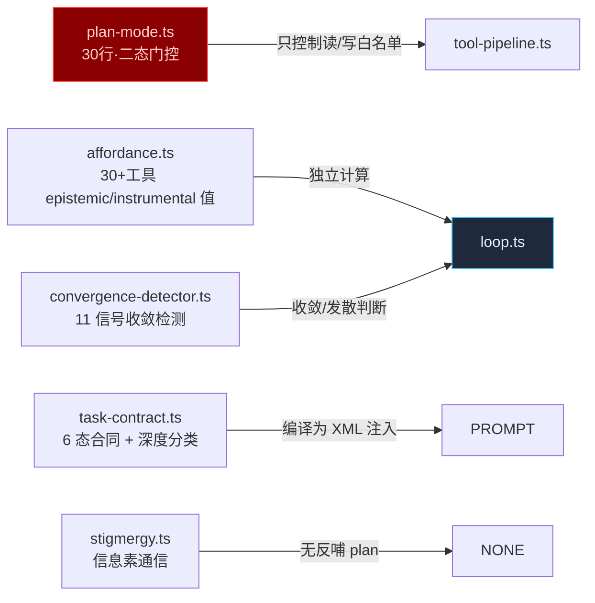
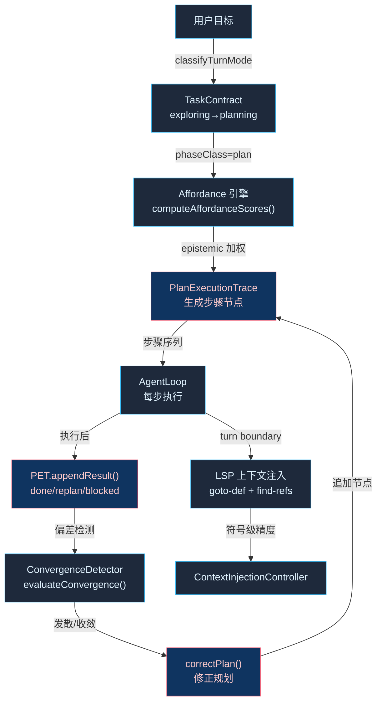

# U 阶段：自主规划循环 — Plan Execution Trace + Replan Loop + LSP 上下文提升

## 天枢 U 阶段 — 自主规划循环

把 agent 从"单步执行器"升级为"自主规划者"——agent 能分解目标、跟踪进度、发现偏差、修正路线，并在回合边界主动用 LSP 级精度获取上下文。

### 现状诊断



**根因**：`plan-mode.ts:4` — `type PlanModeState = 'off' | 'planning'`。整个"规划"只有 30 行代码，一个布尔开关。四个可联合的资产（affordance、task-contract、convergence-detector、stigmergy）各自独立工作，缺少一根"执行轨迹"串起来。

**贪狼判断**：plan-mode.ts 是全 agent 核心里陈旧度最高的模块（30 行 vs 周围模块 600-2500 行/月均 100+ 提交）。不是 bug——是天枢贪婪伸手够到"计划"概念后转身够其他能力留下的"半接"资产。现在四个资产已经成熟，联合它们归一为规划内核的时机到了。

### 事实流图（U1 → U2 → U3 全链路）



### U1 — Plan Execution Trace（计划执行轨迹）

**当前行为**：`plan-mode.ts` — `checkPlanMode('planning', toolName)` → 返回 `{allowed: false, reason: 'write operations blocked'}`。用户说 `/plan`，agent 进入只读模式，自己不会拆分步骤或跟踪进度。

**改后行为**：agent 进入 planning 阶段后，将目标分解为结构化的 `PlanStep[]`（步骤 + 预期工具 + 验证标准）。执行阶段每步追加 `StepResult`（状态 + 产出 + 偏差）。整个 trace 持久化到 `.rivet/traces/<sessionId>.json`，压缩后作为 `<plan-execution-trace>` XML 注入动态附录。

#### 数据模型

```
PlanExecutionTrace {
  contractId: string          // 关联的 TaskContract.id
  steps: PlanStep[]           // 计划步骤
  history: StepResult[]       // 执行历史（追加）
  status: 'active' | 'replanned' | 'completed' | 'blocked'
}

PlanStep {
  id: string                  // "step-1"
  description: string         // "读取 plan-mode.ts 理解现状"
  expectedTools: string[]     // ["read_file"]
  verificationHint?: string   // "确认 PlanModeState 是二态布尔开关"
  status: 'pending' | 'active' | 'done' | 'skip' | 'replanned'
}

StepResult {
  stepId: string
  turnNumber: number
  toolCalls: { tool: string; result_summary: string }[]
  status: 'done' | 'deviated' | 'replanned' | 'blocked'
  newFiles?: string[]         // 新发现的文件
  replanNote?: string         // 偏差时标注原因
}
```

#### 改动文件

| 文件 | 改动 | 行数 |
|------|------|------|
| `src/agent/plan-execution-trace.ts` | **新建** — 数据模型 + `createTrace()` / `appendResult()` / `detectDeviation()` / `serializeTrace()` | ~180 行 |
| `src/agent/plan-mode.ts` | 保留原有 gate（向后兼容），从 `plan-execution-trace.ts` 导入 trace 类型 | ~10 行 |
| `src/agent/loop.ts` | 消费 trace：`planning` 阶段自动填充 `PlanStep[]`；`executing` 阶段每步追加 `StepResult`；压缩时调用 `serializeTrace()` 注入附录 | ~40 行 |
| `src/agent/__tests__/plan-execution-trace.test.ts` | 数据模型测试：create/append/detect/序列化 + 边界（0 步/重复 stepId/偏差标记） | ~100 行 |

**过门**：给 agent 一个 3 文件修改目标 → trace 生成 4+ 步骤 → 执行后每一步有 StepResult → 压缩后 `<plan-execution-trace>` 完整出现在附录中。

---

### U2 — Autonomous Replan Loop（自主修正循环）

**当前行为**：agent 按"感知→意图→执行→验证"回合推进，回合间无显式偏差检测。执行偏了靠下一轮用户纠正。

**改后行为**：`TurnIntentController` 在回合边界自动比较当前 trace 步骤的 `expectedTools` 与实际执行的 `StepResult.toolCalls`。偏差超过阈值时触发 `correctPlan()`——agent 追加修正步骤、标记原步骤为 `replanned`，并在下一轮 prompt 中注入 `replan_context`。

#### 偏差检测规则

```
detectDeviation(trace: PlanExecutionTrace, lastResult: StepResult): DeviationResult

规则（优先级降序）:
1. blocked — 连续 3 步相同工具失败（convergence-detector 的 level>=2）
2. deviated — 当前步 toolCalls 不在 expectedTools 范围内（且非"新发现文件"）
3. replanned — task-contract 的 successCriteria 已经满足（但 trace 未 complete）
4. stray — 执行了不在任何 PlanStep.expectedTools 中的工具（随机探索）
5. stalled — noToolTurnCount >= 3（convergence-detector 的 noToolTurnCount 信号）
```

#### correctPlan() 行为

```
correctPlan(trace, deviation):
  if blocked:  追加 "step-N: 诊断阻塞原因" + 标记受影响的步骤
  if deviated: 追加 "step-N: 修正偏差 — {deviation.reason}"
  if replanned: 标记剩余步骤为 skip → trace.status = 'completed'
  if stray:    追加 "step-N: 验证随机探索发现 — {stray.files}" 或标记当前步保持
  if stalled:  追加 "step-N: 打破停滞 — 选择 affordance 最高的未用工具"
```

**贪狼联合**：`correctPlan()` 不是新写的，是从已有资产的交叉处提取的联合信号：
- `convergence-detector.ts:level` → 决定是否 blocked/stalled
- `affordance.ts:computeAffordanceScores()` → 决定"下一步最佳工具"
- `task-contract.ts:advanceContractStatus()` → 决定是否已完成
- `stigmergy.ts` → 检测"是不是在踩老路"

#### 改动文件

| 文件 | 改动 | 行数 |
|------|------|------|
| `src/agent/replan-loop.ts` | **新建** — `detectDeviation()` + `correctPlan()` + `injectReplanContext()` | ~150 行 |
| `src/agent/loop.ts` | `TurnIntentController` 回合边界调用 `detectDeviation()` + `correctPlan()` | ~30 行 |
| `src/agent/__tests__/replan-loop.test.ts` | 5 条规则的条件矩阵测试 + 反证（误触发/漏触发） | ~120 行 |

**过门**：模拟 5 种偏差各一条 → `detectDeviation()` 正确分类 → `correctPlan()` 产出有效修正步骤 → trace 在修正后自洽。

---

### U3 — LSP-enhanced Context Acquisition（LSP 上下文提升）

**当前行为**：agent 用 `grep` + `glob` + `repo_map` 做符号定位（文本匹配）。`lsp_find_references` 和 `lsp_goto_definition` 在两个工具 definition 里有，但 agent loop 不主动提升它们的优先级。

**改后行为**：

1. **Planning 阶段自动升权**：当 `TaskContract.status === 'planning'` 时，`computeAffordanceScores()` 将 LSP 工具的 epistemic 分提升 0.15（从 0.70/0.75 → 0.85/0.90），使其在"下一步最佳工具"中排在 grep 前面。

2. **ContextInjectionController 符号优先策略**：在 context injection 阶段，如果当前 turn 出现文件路径，自动消费 `lsp_goto_definition` 产出的定义上下文和 `lsp_find_references` 产出的调用方列表——优先于 `grep` 的文本匹配结果。

3. **PlanStep 引导**：当 trace 中的 PlanStep 描述包含"理解"、"追踪"、"调用方"、"依赖"等关键词时，`expectedTools` 自动包含 `lsp_find_references` 和 `lsp_goto_definition`。

#### 改动文件

| 文件 | 改动 | 行数 |
|------|------|------|
| `src/agent/affordance.ts` | `computeAffordanceScores()` 加 `planningPhase` 参数 → LSP 工具升权 | ~15 行 |
| `src/agent/plan-execution-trace.ts` | `createTrace()` 在 planning 阶段自动注入 LSP 工具到 expectedTools | ~15 行 |
| `src/agent/__tests__/affordance.test.ts` | 验证 planning 阶段 LSP 工具 epistemic ≥ grep | ~30 行 |

**过门**：planning 阶段的 trace 中 expectedTools 包含至少一个 `lsp_*` → affordance 计算 LSP > grep for epistemic。

---

### 条件矩阵（U1 × U2 × U3 交叉验证）

| 场景 | U1 (trace) | U2 (replan) | U3 (LSP) | 预期行为 |
|------|-----------|------------|---------|---------|
| 用户给"重构 3 文件"目标 | ✅ 生成 4+ PlanStep | ✅ 偏差触发 replan | ✅ LSP 探测调用方 | 完整 trace 自修正 |
| 单文件简单修复 | ✅ 生成 1-2 PlanStep | — 不到偏差阈值 | — 单文件不需 LSP | 轻量 trace |
| agent 随机探索到新文件 | ✅ 追加 StepResult.stray | ✅ stray → correctPlan | ✅ LSP 查新文件符号 | trace 包含探索发现 |
| 连续 3 次工具失败 | ✅ 标记 blocked | ✅ blocked → 诊断步骤 | — | trace 标记阻塞 |
| 任务提前完成 | ✅ 标记 done | ✅ replanned → skip 剩余 | — | trace 闭环 |
| 纯聊天（chat turn） | — trace 不活跃 | — 无检测 | — 无升权 | 零开销 |

### 反证测试表（哪些偷懒实现会红）

| 偷懒实现 | 会红的测试 |
|----------|-----------|
| 只在 `/plan` 命令触发 trace，正常 task turn 不生成 | `createTrace on exploring→planning phase transition` |
| StepResult 只包含工具名不包含结果摘要 | `appendResult includes tool result summary for replan context` |
| `detectDeviation` 只检查工具名完全匹配（忽略"新发现文件"） | `stray detection excludes files listed in StepResult.newFiles` |
| `correctPlan` 只追加步骤不标记原步骤状态 | `original step marked replanned after correction` |
| LSP 升权只在 toolSelect 阶段生效，affordance 数组排序不反映 | `affordance['lsp_find_references'].epistemic > affordance['grep'].epistemic during planning` |
| 压缩后 trace 不被重新注入 | `serialized trace present in appendix after compaction` |

### 风险与缓解

| 风险 | 缓解 |
|------|------|
| **前缀缓存碎片化** — 每步 trace 追加改变动态附录，频繁 invalidate cache | trace 只在压缩时序列化写入附录（同 task-anchor 模式），不在每步写入；`PlanExecutionTrace` 内存态，`serializeTrace()` 只在 compact 边界调用 |
| **AgentLoop 构造函数增重** — 新增 3 个依赖 | `PlanExecutionTrace` 和 `ReplanLoop` 是纯函数模块（无类/无副作用），loop.ts 通过接口消费 |
| **过度规划** — small task 生成 10+ 步骤 | `createTrace()` 内建步骤数上限 = complexity 自适应（1文件→max 3步, 多文件→max 8步） |
| **LSP 不可用** — `lspManager` 尚未初始化（T9 延迟绑定） | `computeAffordanceScores()` 检查 `lspManager !== null`，不可用时保持原基础分 |

### 执行次序

| Wave | 内容 | 过门条件 |
|------|------|---------|
| W1 | U1 PlanExecutionTrace 数据模型 + loop.ts 消费 | 给 agent 3 文件修改目标 → trace 生成 4+ 步骤 → 压缩后附录完整 |
| W2 | U2 ReplanLoop 偏差检测 + 修正 | 5 种偏差各触发一条 → correctPlan 产出有效修正 → trace 自洽 |
| W3 | U3 LSP 上下文提升 | planning 阶段 LSP 工具 epistemic > grep → trace expectedTools 含 lsp_* |
| W4 | 跨阶段整合测试 + 提示词星域同步 | tsc + full test suite 绿；天弹/天权/天梁域 systemPromptSuffix 加入 trace 认知 |

### 贪狼联合标注

这三个改动不是"新建三个新系统"——是**联合**四个已存在的半接资产：

- `affordance.ts` 的 epistemic/instrumental 调制 → 驱动"下一步做什么"
- `task-contract.ts` 的 6 态合同 + 深度分类 → 驱动"还需要做什么"
- `convergence-detector.ts` 的 11 信号 → 驱动"够了没"
- `stigmergy.ts` 的信息素 → 驱动"是不是在踩老路"

**接到更大的网**：这四根线的共同归宿是 `PlanExecutionTrace`——不是新建三个 store，是把四个已有信号归一到一个执行轨迹上。

### 技术选型

- 数据模型：`interface` + 纯函数（与项目约定一致）
- 存储：内存态 `PlanExecutionTrace`，压缩时序列化 XML 注入附录（同 `renderTaskAnchor` 模式 — 前缀缓存安全）
- 步数上限：复杂度自适应（由 `classifyTaskDepth` 输出驱动）
- LSP：fallback 到 grep（lspManager 不可用时保持基础分）
