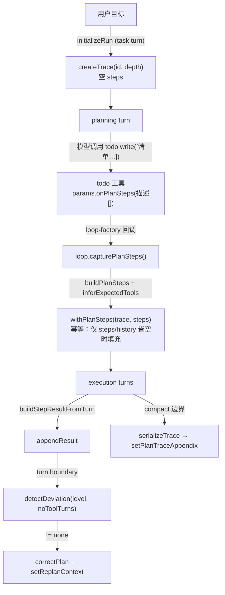

# U6 阶段 — LLM 驱动步骤生产 + PlanExecutionTrace 接入 loop 生产路径

> 承接 [u4.5 遗留项台账](./u4.5-阶段-trace-接入遗留项台账.md)。先解 C1（无 PlanStep 生产者）这个根本缺口——**用 LLM 在 planning 阶段产出结构化步骤**——再补 B 前置、做 A 接线、清 D 技术债。目标：让 U1/U2 的死代码真正通电，agent 运行时拥有「自主分解步骤→跟踪偏差→修正路线」。

## 0. 为什么不能直接照搬 U5/W4-deep

U5 计划 `createTrace(taskContract.id, depthLayer)` 不传步骤 → 空 trace。`detectDeviation:218-220` 的 `deviated`/`stray` 被 `step.expectedTools.length > 0` 守卫，空步骤永不触发 → replan loop 退化为 `convergence-detector` 的回声。**先有步骤生产者，接线才有意义。** 故 U6 次序：`C1 → B → A → D → 测试`。

## 1. C1 机制设计 — LLM 驱动（已选定：从 todo 派生）

### 1.1 选型（决策记录）
**最终方案：从首次 `todo write` 派生 PlanStep[]，不新增工具。**

> 选型对比（2026-06-15）：曾设计独立 `plan_steps` 工具，但默认注册表常驻已 24 个工具，新增会顶到 kernel budget 上限 25（生产含 main.tsx extra 更高），违背「工具 >25 → 选择过载退化」哲学（`kernel-budget.test.ts` / trained-mode-analysis.md 3.2.B）。发现 `todo` 工具结构 `{id, content, status}` 与 `PlanStep` 几乎同构，且 **agent 多步任务本就调 `todo write` 列有序清单**——零预算、零新行为、高采纳率。

机制：`todo` 工具在 `write` 时调 `params.onPlanSteps?.(todos.map(t=>t.content))`（**复用 `leave_mark` 的 `onLeaveMark` 回调先例**），loop 用纯函数 `buildPlanSteps()` 映射成 `PlanStep[]`，经 `withPlanSteps()` 幂等填入 `planTrace`（**首份清单即计划基线**，后续状态更新写入对 trace 无副作用）。

**模型只需产出「todo 描述」**，每步 `expectedTools` 由 `inferExpectedTools()`（`plan-execution-trace.ts:88`，含 LSP 关键词）自动推断；depthLayer 由 loop 持有（工具只传描述）。

### 1.2 回调先例（照抄对象）
```
leave_mark 工具:  params.onLeaveMark(mark)
  └─ ToolCallParams.onLeaveMark?            (types.ts:52)
  └─ tool-pipeline.ts:462 onLeaveMark: deps.onLeaveMark
  └─ tool-execution.ts:194/259 透传
  └─ loop-factory.ts:145 onLeaveMark: mark => self.captureLeaveMark(mark)
  └─ loop.ts:613 captureLeaveMark + :203 pendingLeaveMark 字段
```
`onPlanSteps` 沿同一条链路打造。

### 1.3 附录 setter 先例（照抄对象）
```
setPlanCacheAdvisory (engine.ts:602)
  └─ private planCacheAdvisory 字段 (engine.ts:74)
  └─ dynamicCtx.planCacheAdvisory (engine.ts:246)
  └─ volatile.ts buildDynamicAppendix 渲染
```
`setReplanContext` / `setPlanTraceAppendix` 沿同一模式。

### 1.4 数据流



### 1.5 降级保证
模型若**从不**调用 `todo write`（如简单单文件任务、纯聊天）→ `planTrace.steps` 保持空 → `detectDeviation` 只剩 `blocked`/`stalled`（= 当前行为）。**零回归**，不强制每个任务都分解。

## 2. 改动总览

| 文件 | 改动 | 波次 |
|------|------|------|
| `src/agent/plan-execution-trace.ts` | 新增纯函数 `buildPlanSteps()` + `withPlanSteps()` | W6a |
| `src/tools/todo.ts` | write 时调 `params.onPlanSteps(todos.map(content))` | W6b |
| `src/tools/types.ts` | `ToolCallParams.onPlanSteps?` | W6b |
| `tool-pipeline.ts` + `tool-execution.ts` | 透传 `onPlanSteps` | W6b |
| `src/prompt/engine.ts` + `src/prompt/volatile.ts` | `setReplanContext` + `setPlanTraceAppendix` + 附录渲染 | W6c |
| `src/agent/loop.ts` | `latestConvergenceResult` 字段 | W6c |
| `src/agent/loop.ts` + `loop-factory.ts` + `tool-pipeline.ts` + `tool-execution.ts` | A 接线 + `onPlanSteps` 链路 + `capturePlanSteps` | W6d |
| `src/agent/replan-loop.ts` | `stepCounter` → trace-local | W6e |
| `src/agent/__tests__/trace-integration.test.ts` | **新建** 集成测试 | W6f |
| `src/prompt/`（星域 systemPromptSuffix） | planning 阶段引导调用 `plan_steps` | W6f |

## 3. 执行波次（TDD，每波先写测试）

### W6a — `buildPlanSteps` + `withPlanSteps` 纯函数
**任务契约**：在 `plan-execution-trace.ts` 增两个纯函数。
- `buildPlanSteps(descriptions: string[], depthLayer): PlanStep[]`
  - 截断到 `maxStepsForDepth(depthLayer)`（复用 `:121`）
  - 每步：`id = step-${i+1}`、`description`、`expectedTools = inferExpectedTools(description)`、`status: 'pending'`
  - 空数组 → 空数组
- `withPlanSteps(trace, steps): PlanExecutionTrace`
  - **幂等守卫**：仅当 `trace.steps.length === 0 && trace.history.length === 0` 时填充；否则原样返回（防止重复分解清空进度）
  - 不可变更新

**过门**：3 条描述 → 3 个 PlanStep，含 inferExpectedTools 结果；超 maxSteps 截断；withPlanSteps 在已有 history 时不覆盖。
**风险**：低（纯函数，隔离）。

### W6b — todo 工具接 onPlanSteps + 回调字段（零新工具）
**任务契约**：
- `types.ts`：`ToolCallParams.onPlanSteps?: (descriptions: string[]) => void`
- `src/tools/todo.ts`：`write` 分支在 `store.write` 后调 `params.onPlanSteps?.(data.todos.map(t => t.content))`（仅 `todos.length > 0`）
- `tool-pipeline.ts` + `tool-execution.ts`：透传 `onPlanSteps: deps.onPlanSteps`（照 `onLeaveMark`）

**过门**：todo write 触发 onPlanSteps 且参数为 content 数组；read 不触发；空清单不触发；无回调时不抛。
**风险**：低（无新工具 → 零 kernel budget、零缓存影响；todo 写入路径加一行回调）。

### W6c — B 前置：PromptEngine setter + loop 收敛结果存储
**任务契约**：
- `engine.ts`：加 `private replanContext?` + `private planTraceAppendix?` 字段、`setReplanContext(text|null)` + `setPlanTraceAppendix(xml|null)` setter、塞进 `dynamicCtx`（:246）
- `volatile.ts`：`VolatileContext` 加两字段；`buildDynamicAppendix` 渲染（replan context 作 system-reminder 段、trace 附录作 `<plan-execution-trace>` 段）
- `loop.ts`：加 `private latestConvergenceResult` 字段；`runConvergenceCheck`（:1681）存 `this.latestConvergenceResult = convergenceCheck`

**过门**：setReplanContext 后 buildDynamicAppendix 含该文本；setPlanTraceAppendix 后含 `<plan-execution-trace>`；runConvergenceCheck 后字段非空且含 `level`/`signals.noToolTurnCount`。
**风险**：低（setter 模式成熟，附录走动态段不碰冻结前缀）。

### W6d — A 接线：trace 接入 loop 回合循环
**任务契约**（照 U5/W4-deep 的 4 件 + C1 回填）：
1. `import { createTrace, appendResult, serializeTrace, buildPlanSteps, withPlanSteps, type PlanExecutionTrace, type StepResult } from './plan-execution-trace.js'` + `replan-loop.js`
2. 字段 `private planTrace: PlanExecutionTrace | null = null`
3. `initializeRun`（~L1449，`classifyTaskDepth` 后）：`if (taskContract && depthLayer && turnMode==='task') this.planTrace = createTrace(taskContract.id, depthLayer)`
4. `capturePlanSteps(descriptions)` 方法 + `loop-factory.ts:145` 旁 wiring `onPlanSteps: d => self.capturePlanSteps(d)`：`if (this.planTrace) this.planTrace = withPlanSteps(this.planTrace, buildPlanSteps(descriptions, this.planTrace.depthLayer))`
5. `buildStepResultFromTurn(turn)`：从 `traceStore.events` 提本 turn 工具事件 → StepResult（映射到第一个 pending/active step，fallback `turn-N`）
6. turn boundary（`runConvergenceCheck` 后、`buildTurnRequest` 前）：`detectDeviation` + `correctPlan` + `setReplanContext`（拿 `this.latestConvergenceResult.level / signals.noToolTurnCount`）
7. compact 边界（~L1910，`compactResult.compacted` 后）：`serializeTrace` + `setPlanTraceAppendix`

**过门**：tsc 绿；task turn 后 planTrace 非 null、chat turn 后 null；模拟 plan_steps→3 步、模拟连续失败→blocked→replan context 注入；压缩后附录含 trace。
**风险**：**中-高**（loop.ts 2000+ 行、多会话共享）。缰绳：只在已有 step 间插入，不改控制流。

### W6e — D 技术债：消除模块级 stepCounter
**任务契约**：`replan-loop.ts:35` 的 `let stepCounter` + `:45` 全局 reset 删除；`correctPlan` 内部用 `trace.steps.length + 1` 生成步 ID。
**过门**：两个独立 trace 并发 correctPlan，步 ID 不交叉、不互相清零。
**风险**：低。

### W6f — 集成测试（提示引导可选）
**任务契约**：
- `trace-integration.test.ts`：完整生命周期 / 偏差修正 / 压缩保留 / 空 trace / stalled（U5 W5d 5 场景）+ 反证表；以 `todo write → onPlanSteps → capturePlanSteps` 作为步骤注入入口
- 提示词引导**非必需**（agent 本就调 todo）；如要强化可在 planning systemPromptSuffix 轻提示「多步任务先用 todo 列出有序步骤」——但属可选优化，不阻塞 U6 通电

**过门**：5 场景 + 反证全绿；full suite + tsc 绿。
**风险**：低（无新工具/无强制提示改动）。

## 4. 反证测试表（哪些偷懒实现会红）

| 偷懒实现 | 会红的测试 |
|----------|-----------|
| `buildPlanSteps` 不调 inferExpectedTools，expectedTools 恒空 | `buildPlanSteps populates expectedTools via inferExpectedTools (LSP keyword → lsp_*)` |
| `withPlanSteps` 不加幂等守卫，重复调用清空 history | `withPlanSteps does not overwrite steps once history exists` |
| `todo write` 不调 onPlanSteps | `todo write invokes onPlanSteps with content array; read does not` |
| loop 不回填，planTrace.steps 恒空 | `capturePlanSteps fills planTrace.steps from todo descriptions` |
| `detectDeviation` 拿不到 convergence level（B3 没做） | `blocked detected when latestConvergenceResult.level >= 2` |
| `setReplanContext`/`setPlanTraceAppendix` 不进附录 | `replan context / serialized trace present in dynamic appendix` |
| `stepCounter` 仍是模块级 | `concurrent traces produce non-interleaving step ids` |

## 5. 风险与缓解

| 风险 | 缓解 |
|------|------|
| **模型不调 todo write** | 降级到空 trace（= 当前 blocked/stalled-only 行为），零回归；agent 多步任务本就调 todo，采纳率高 |
| **kernel budget / 前缀缓存** | 零新工具 → 不占预算、不动工具列表前缀；trace/replan 运行时数据走动态附录，不碰冻结前缀 |
| **首份 todo 清单粗糙（占坑后被守卫锁定）** | withPlanSteps 仅首填；后续 todo 扩充不再覆盖 trace。可接受（稳定优先）；如需更优可后续放开「history 仍空时允许重填」 |
| **loop.ts 高风险深改** | 只在已有 step 间插入；planTrace 为 null 全短路；实例字段会话隔离 |
| **重复分解清空进度** | `withPlanSteps` 幂等守卫（steps/history 皆空才填） |
| **buildStepResultFromTurn 状态保真不足（E2）** | W6d 保留 done/blocked/deviated/stray 区分，不简化为二态 |

## 6. 缰绳

- 不改 loop.ts 回合控制流——只在 step 间插入。
- 前缀缓存安全——trace/replan 走动态附录（同 task-anchor / planCacheAdvisory）。
- 零开销 for chat turn——`planTrace` 为 null 全短路。
- 多会话安全——`planTrace` 实例字段；W6e 修掉 stepCounter 后步 ID 也会话隔离。
- TDD——每波先写测试再实现；high-risk 的 W6d 建议独立会话执行。

## 7. 执行次序

```
W6a (纯函数, 低) → W6b (todo 接回调, 低) → W6c (前置, 低)
   → W6d (loop 接线, 中高 ⚠ 建议独立会话) → W6e (技术债, 低) → W6f (集成测试, 低)
```
