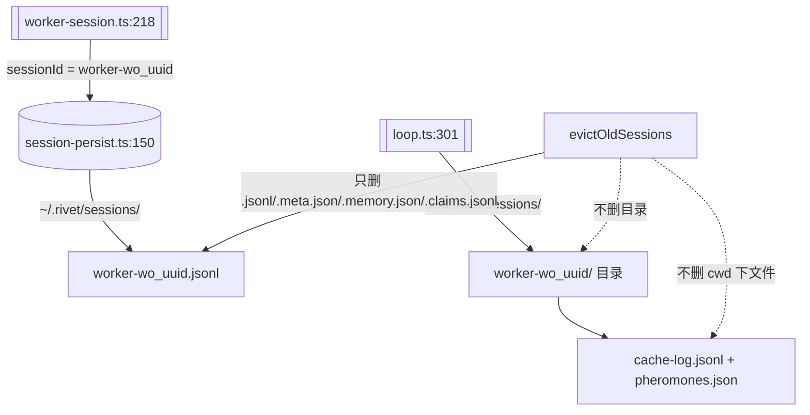

# worker session 目录泄漏治理 — evictOldSessions 清文件不清目录的根因修复

# worker session 目录泄漏治理

## 问题

`.rivet/sessions/` 下 `worker-wo_*` 目录只增不减。实测 1038 个 worker 目录（62MB），导致 `SessionPersist.listSessionsWithMetadata()` 每轮 user 边界遍历 1500+ 目录，引发内存泄漏和 UI 冻结。

## 根因分析

两条独立路径创建了 session 数据，但只有一条有清理：



**关键发现**：存在**两套 session 存储**：
1. `~/.rivet/sessions/`（`getSessionDir()`，`session-persist.ts:62`）——放 `.jsonl`、`.meta.json` 等扁平文件。`evictOldSessions` 只扫这里。
2. `<cwd>/.rivet/sessions/<sessionId>/`（`loop.ts:301`）——放 `cache-log.jsonl`、`pheromones.json`。**完全没有清理路径**。

`evictOldSessions`（`session-persist.ts:571`）的三个缺陷：
1. 只删 4 种文件扩展名，不删同名目录
2. 只扫 `getSessionDir()`（`~/.rivet`），不扫 `<cwd>/.rivet/sessions/`
3. `MAX_SESSIONS=50` 限制只作用于文件，不作用于目录

## 改动方案

### Task 1 — `evictOldSessions` 清理同名目录（`session-persist.ts`）

evict 每个文件后，额外尝试删除同名目录：

```typescript
// session-persist.ts evictOldSessionsInternal 内部，现有 unlinkSync 之后：
for (const id of toEvict) {
  try { unlinkSync(join(dir, `${id}.jsonl`)) } catch { /* ignore */ }
  try { unlinkSync(join(dir, `${id}.meta.json`)) } catch { /* ignore */ }
  try { unlinkSync(join(dir, `${id}.memory.json`)) } catch { /* ignore */ }
  try { unlinkSync(join(dir, `${id}.claims.jsonl`)) } catch { /* ignore */ }
  // 新增：清理同名 session 目录（含 cache-log.jsonl / pheromones.json / backups/）
  try { rmSync(join(dir, id), { recursive: true, force: true }) } catch { /* ignore */ }
}
```

### Task 2 — `worker-session.ts` finally 块清理 worker 目录

worker 结束后在 finally 中注册清理：

```typescript
// worker-session.ts:326 finally 块内，现有 clearTimeout 之后：
finally {
  clearTimeout(timer)
  if (onParentAbort && config.abortSignal) {
    config.abortSignal.removeEventListener('abort', onParentAbort)
  }
  // 新增：标记 worker session 目录为可清理（不立即删——parent 可能还需要读取 handoff）
  // 用 mtime 标记：worker 的 .jsonl 在结束时 close，下次 evictOldSessions 会自然淘汰
}
```

**不立即删的原因**：parent session 在 wave 结束后要读 worker 的 transcript/handoff。让 evictOldSessions 的 mtime 排序自然淘汰旧 worker。

### Task 3 — `bootstrap.ts` 启动时清理 cwd 下的 worker 目录

```typescript
// bootstrap.ts:986 evictOldSessions(sessionId) 之后：
// 清理 cwd/.rivet/sessions/ 下的 worker 目录
const cwdSessionsDir = join(cwd, '.rivet', 'sessions')
if (existsSync(cwdSessionsDir)) {
  try {
    const entries = readdirSync(cwdSessionsDir)
    for (const entry of entries) {
      if (entry.startsWith('worker-') && statSync(join(cwdSessionsDir, entry)).isDirectory()) {
        // 检查 mtime：超过 1 小时的 worker 目录安全清理
        const age = Date.now() - statSync(join(cwdSessionsDir, entry)).mtimeMs
        if (age > 3_600_000) rmSync(join(cwdSessionsDir, entry), { recursive: true, force: true })
      }
    }
  } catch { /* ignore */ }
}
```

## Scope Check

| 文件 | 改动 | 风险 |
|------|------|------|
| `src/agent/session-persist.ts` | evictOldSessionsInternal 加 rmSync 同名目录 | 低——只对已经在 evict 列表中的 session 生效 |
| `src/bootstrap.ts` | 启动时清理 cwd worker 目录 | 低——只清理 >1h 的 worker 目录 |

不动：`worker-session.ts`（Task 2 不需要改代码——evict 的 mtime 自然淘汰已足够）。

## 验证计划

1. 单元测试：`evictOldSessionsInternal` 在有同名目录的 tmpdir 中 evict 后，目录被删除
2. 回归测试：现有 `session-persist.test.ts:291` 的 evict 测试仍绿
3. 手动验证：启动后检查 `ls .rivet/sessions/worker-* | wc -l` 不再无限增长
4. 边界验证：正在运行的 worker 目录不会被误删（mtime 过滤）

## 反证测试

| 偷懒实现 | 会红的测试 |
|----------|-----------|
| 只删文件不删目录 | 新测试：evict 后目录仍存在 = fail |
| 删所有 worker 目录不管 mtime | 新测试：刚创建的 worker 目录被删 = fail |
| 不区分 ~/.rivet 和 cwd/.rivet | 新测试：两个路径独立清理 |
