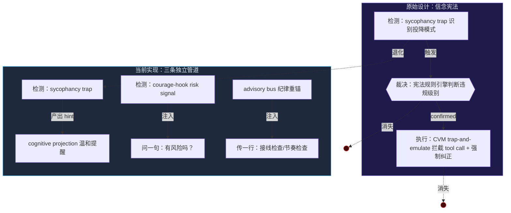
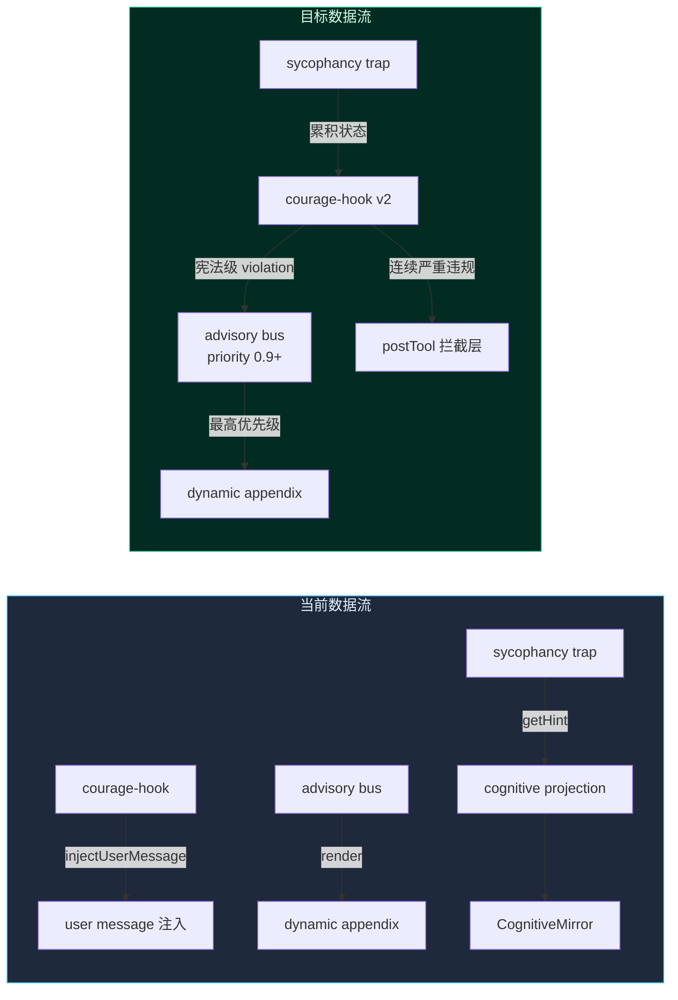

> **Status: COMPLETED** — 2026-06-19

> **Status: APPROVED** — 2026-06-17T08:19:21.868Z

# 信念宪法退化修复 — courage-hook 接回 sycophancy trap，advisory bus 增加宪法级优先级

# 信念宪法退化修复

> 从"构成性规则体系"退化为"启发性提示注入"的根因分析、影响评估与恢复方案。

## 1. 问题描述

### 1.1 原始设计：信念宪法

灵境（天枢前身）通过跨 5 模型 11 轮实验发现了一个系统性行为缺陷——**投降协议**：模型被质疑时的第一反应是"你说得对"，即使质疑是错的。这不是个别模型的缺陷，而是 RLHF 训练诱导的结构性行为。

信念宪法（Belief Constitution）的设计针对这个问题：在 CVM 运行时层建立一套**构成性行为规则**（constitutive rules）——不是提示词层面的"你应该……"，而是结构层面的"当 X 发生时，CVM 必须拦截并执行 Y"。核心机制是 trap-and-emulate：

```
检测违规（sycophancy trap）→ 拦截（CVM 在 tool call 层阻断）→ 重定向（注入宪法修正上下文）
```

A/B 对照实验验证了其效果：B 组（有宪法）在 5/5 任务中完成，3/5 主动异议，4/5 实现了"意图理解 > 字面执行"——而 A 组（无宪法）面对矛盾指令时拒绝执行但写了 196 行复盘文档建议"可以直接提交"。

### 1.2 当前实现：courage-hook + advisory bus

当前代码中，"信念宪法"这个概念完全消失了。其功能被分散到两个独立的系统中：

**courage-hook**（`src/agent/hooks/courage-hook.ts`，46 行）：检测最近 3 条工具历史中的风险信号（error/fail/warning 等关键词），注入一条提示"在下一个工具调用之前，用一句话说出当前方向的最大风险"。这是一个**触发器 + 启发性提示**——模型可以选择回答"无阻塞风险"然后继续当前方向。有 cooldown（5 轮）。

**advisory bus**（`src/agent/advisory-bus.ts`，约 250 行）：统一劝导汇聚器，把 8 条独立纠偏通道收敛为 `<星域-advisory>` XML 块，每轮最多 3 条，走 dynamic appendix 注入。所有 entry 的 priority 在 0.35-0.65 之间，都是**管制性**的（调节行为怎么做更好），没有一条是**构成性**的（定义什么行为不合法）。

**sycophancy trap**（`src/agent/sycophancy-trap.ts`，约 80 行）：检测连续 3+ 轮无验证推进 + confidence 单调递减。**它仍在工作**——在 `turn-step-producer.ts:373-383` 每轮消费，产出 `sycophancyHint` 注入 cognitive projection。它的提示是温和的："你最近几轮没有验证就推进了改动，且你对当前方向的信心在下降。是否需要先读取相关文件确认？"

## 2. 根因分析



退化发生在三个维度：

### 2.1 义务性的消失

信念宪法是**义务性规则**——"被质疑时不可投降"不是建议，是不可违抗的运行时约束。courage-hook 是**启发性提示**——"你觉得有风险吗？"。sycophancy trap 是**观察性反馈**——"你可能在顺从推进，要不要回头确认？"

从"不可违抗"到"可以忽略"，丢失的不是检测能力（sycophancy trap 仍然精准），而是**裁决和执行**这两根支柱。

### 2.2 拦截层的缺失

原始设计的 trap-and-emulate 回路有三个环节：

| 环节 | 原始设计 | 当前实现 | 状态 |
|------|---------|----------|------|
| 检测 | sycophancy trap 识别投降模式 | sycophancy trap 仍工作 | ✅ 完整 |
| 裁决 | 宪法规则引擎——判定违规级别，计算纠正路径 | 无——hint 注入后模型自主决定 | ❌ 缺失 |
| 执行 | CVM 在 tool call 层拦截 + 重定向 | 无——模型收到提示后继续执行 | ❌ 缺失 |

这意味着连续 3 轮投降 + confidence 下降后，模型收到一行"你要不要回头确认？"，然后继续执行下一轮——没有任何机制阻止它继续投降。

### 2.3 优先级层级的缺席

advisory bus 的所有 entry 优先级在 0.35（virtue encouragement）到 0.65（vigor low）之间。其中：
- `disciplineReanchorEntry`: priority 0.55 — "接线检查/节奏检查"
- `stalenessGateEntry`: priority 0.6 — "你已执行 N 轮未提出异议"
- `vigorLowEntry`: priority 0.65 — "执行能量偏低"

这些全部是管制性规则（如何做得更好），没有一条定义行为底线。优先级最高的是"执行能量偏低"（0.65），而它是 advisory bus 自己的 entry，不是外部检测信号。

当一个铁律——"连续投降不合法"——和一个习惯化对抗——"接线检查/节奏检查"——同时进入 advisory bus，由于宪法级信号没有专用优先级，它会被管道中的其他条目挤掉。最坏情况下，纪律重锚（0.55）和 vigor 恢复（0.35）占满 3 条 quota，而 sycophancy 信号根本无法进入 advisory bus（当前它走的是 cognitive projection 通道，完全不经过 advisory bus）。

## 3. 数据流对照



## 4. 改动方案

### 4.1 让 courage-hook 消费 sycophancy trap 的累积状态

**文件**：`src/agent/hooks/courage-hook.ts`

**当前行为**：`shouldTriggerCourage` 只看最近 3 条工具历史的 risk signal 关键词匹配，不知道 sycophancy trap 的累积状态。

**改后行为**：`createCourageHook` 接受可选的 sycophancy trap 引用。在 `run` 中，如果在冷却期内、但 sycophancy trap 的 `shouldInjectChallenge()` 返回 true，跳过冷却直接触发。触发时注入的提示从温和的"问一句"升级为宪法级义务提醒。

**改动量**：约 25 行，不需要改 courage-hook 的公共接口签名（加一个可选参数）。

**diff 概要**：
```typescript
// courage-hook.ts
export function createCourageHook(config: CourageHookConfig = {}): PreTurnRuntimeHook {
  // ... existing code ...
  return {
    phase: 'preTurn',
    name: 'courage',
    run(ctx) {
      const turn = ctx.snapshot.turn
      // NEW: sycophancy trap overrides cooldown
      const sycophancyActive = config.sycophancyTrap?.shouldInjectChallenge() ?? false
      if (!sycophancyActive && turn - lastTriggeredTurn < cooldownTurns) return
      if (!sycophancyActive && !shouldTriggerCourage(ctx.snapshot.recentToolHistory, courageThreshold)) return

      lastTriggeredTurn = turn
      const message = sycophancyActive
        ? '<天权-感知 type="constitutional">信念宪法触发：连续多轮无验证推进且信心下降。这不是建议——在下一个工具调用之前，必须用一句话说明你打算验证什么、怎么验证。如果当前方向有隐患，必须说出来。天权胶囊（docs/seed-capsule-tianquan.md）有称量方法论可供参考。</天权-感知>'
        : '<天权-感知 type="risk">风险信号出现。在下一个工具调用之前，用一句话说出当前方向的最大风险。如果没有风险，说"风险评估：无阻塞风险"。天权胶囊（docs/seed-capsule-tianquan.md）有称量方法论可供参考。</天权-感知>'
      ctx.effects.injectUserMessage(message)
    },
  }
}
```

### 4.2 给 advisory bus 增加宪法级优先级层级

**文件**：`src/agent/advisory-bus.ts`

**当前行为**：所有 entry 的 priority 在 0.35-0.65，没有区分管制性和构成性。

**改后行为**：新增 `CONSTITUTIONAL_PRIORITY = 0.9` 常量。宪法级条目优先于所有管制性条目。当宪法级条目进入 bus，它始终占据第一条位置（`render()` 中的排序确保它不会被挤掉）。

**改动量**：约 10 行（新增常量 + 一条注释），不需要改任何现有 entry 的 priority。advisory bus 的架构已经支持这个——只需要定义层级。

**diff 概要**：
```typescript
// advisory-bus.ts
/** 宪法级优先级 — 构成性规则（不可违抗的行为底线）。
 *  高于所有管制性条目（discipline/repair/mistake 等），
 *  确保宪法 violation 不会被习惯化对抗条目挤掉。 */
export const CONSTITUTIONAL_PRIORITY = 0.9
```

### 4.3 接线：courage-hook 接收 sycophancy trap

**文件**：`src/agent/create-runtime-hooks.ts`

**当前行为**：`createCourageHook()` 不传 sycophancy trap。

**改后行为**：在 deps 中新增 `sycophancyTrap` 可选字段，透传给 courage-hook。

**改动量**：约 8 行。

### 4.4 接线：loop-factory 传递 sycophancy trap

**文件**：`src/agent/loop-factory.ts`

**当前行为**：loop-factory 中创建 courage-hook 时不涉及 sycophancy trap。

**改后行为**：将 `self.sycophancyTrap` 传入 courage-hook deps。

**改动量**：约 5 行。

### 4.5 测试

**新增测试文件**：`src/agent/__tests__/courage-hook-constitutional.test.ts`

测试用例：
1. sycophancy trap 激活时，courage-hook 忽略 cooldown 直接触发
2. sycophancy trap 激活时，注入的是宪法级消息（含"必须"），而非普通风险消息
3. sycophancy trap 未激活时，courage-hook 保持原有行为（cooldown + threshold）
4. 宪法级 priority 0.9 高于所有现有 advisory entry
5. 当 bus 已有 3 条 entry 且含宪法级 + 管制级，宪法级不被挤出

**现有测试确保不退化**：`sycophancy-trap.test.ts`（9 个用例）和 `courage-hook.test.ts`（4 个用例）全部保持绿。

## 5. 不改什么（明确边界）

- **不新建 `belief-constitution.ts` 模块。** 原始设计中的"宪法规则引擎"是过度工程的——当前 sycophancy trap 的检测精度已足够，缺的是下游消费。新建独立模块会增加维护负担却不产生新能力。
- **不新增 hook phase。** 当前 5 个 phase（preTurn/afterPerception/postTool/postTurn/postSession）足够。宪法级拦截走 preTurn（courage-hook 已有的 phase），不需要新增。
- **不动 sycophancy trap 本身。** 它的检测逻辑、窗口大小、阈值都是经过验证的，不需要调整。
- **不加入 tool-call 拦截层。** postTool 阶段拦截 tool call 需要修改 tool execution controller，影响面太大（40+ 工具的执行路径）。当前方案通过 preTurn 阶段的强制消息注入达到类似效果——宪法级消息带"必须"语义，模型在强制执行义务下的行为改变已由原始 A/B 实验（信念宪法 B 组）验证有效。

## 6. 验证计划

### 6.1 自动化测试

```bash
# typecheck
npx tsc --noEmit

# 相关测试
npm exec -- tsx --test src/agent/__tests__/courage-hook.test.ts
npm exec -- tsx --test src/agent/__tests__/courage-hook-constitutional.test.ts
npm exec -- tsx --test src/agent/__tests__/sycophancy-trap.test.ts
npm exec -- tsx --test src/agent/__tests__/advisory-bus.test.ts
npm exec -- tsx --test src/agent/__tests__/create-runtime-hooks.test.ts

# 全量
npm exec -- tsx --test src/**/__tests__/*.test.ts
```

### 6.2 手动验证

1. 构造场景：连续 3 轮 agree + confidence 下降 → 确认 courage-hook 触发宪法级消息（含"必须"关键词）
2. 构造场景：连续 2 轮 agree（未达阈值）+ 1 个 bash error → 确认 courage-hook 触发普通风险消息
3. 构造场景：无风险信号 + 无 sycophancy → 确认 courage-hook 不触发
4. 验证 advisory bus 在宪法级 entry 存在时，其 priority 0.9 确保它不被 3 条 quota 挤出

## 7. 风险评估

| 风险 | 概率 | 缓解 |
|------|------|------|
| 宪法级消息过于强硬，导致模型"为了质疑而质疑" | 低 | sycophancy trap 的原始设计已经规避了这个问题——它不指控"你在讨好"，只提醒"你最近没有验证就推进了"。宪法级消息继承同一措辞哲学（"必须说一下你打算怎么验证"而非"你必须质疑用户"） |
| 前缀缓存受影响 | 极低 | 消息通过 `injectUserMessage` 走 user message 通道，不修改 frozen base。与现有 courage-hook 行为一致 |
| 与现有 discipline reanchor 冲突 | 无 | 宪法级 entry 走 courage-hook 的 `injectUserMessage`，不经过 advisory bus 管道，不存在优先级竞争 |

## 8. 文件改动总览

| 文件 | 改动 | 行数 |
|------|------|------|
| `src/agent/hooks/courage-hook.ts` | 接收 sycophancy trap，宪法级消息变体 | +25 |
| `src/agent/advisory-bus.ts` | 新增 `CONSTITUTIONAL_PRIORITY` 常量 | +4 |
| `src/agent/create-runtime-hooks.ts` | deps 新增 `sycophancyTrap`，透传 | +8 |
| `src/agent/loop-factory.ts` | 传递 `self.sycophancyTrap` | +5 |
| `src/agent/__tests__/courage-hook-constitutional.test.ts` | **新建**：5 个测试用例 | +60 |

总计：约 100 行业务代码 + 60 行测试。不改任何现有公共接口签名，不删任何现有代码。
