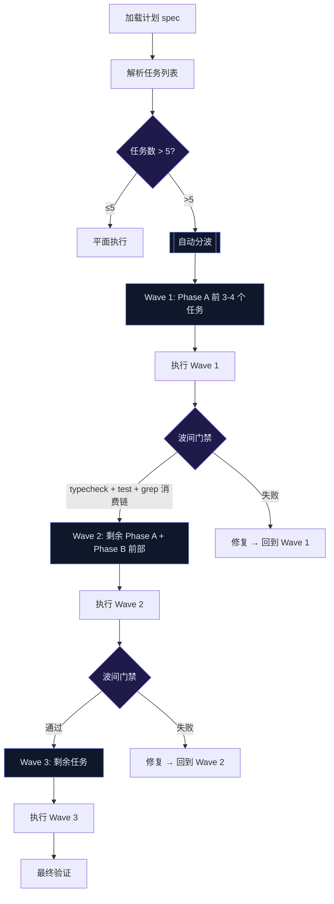

# 大计划自动分波执行 — 防伪闭环设计

# 大计划自动分波执行 — 防伪闭环设计

## 问题描述

执行"噪音治理与委派质量"计划时，9 个任务一次性铺开，系统提示"阈值 5"但执行者忽略了，导致：
- 基础设施建了没接线（AdvisoryBus 实例化为空）
- 改了行为没追消费链（repair-hint 双渲染）
- 改了行为没改测试（2 条红测提交时未发现）

根因：checklist executor 的惯性压过了 dataflow verifier 的纪律。任务量超过认知负荷后，执行质量断崖下降。

## 现有可复用资产

三个领域的碎片指向同一模式：

```
领域1: todo 系统
   - 检测到 >5 个 pending 项时发出"一次性铺开"警告
   - 警告是纯文本提示，不阻塞执行

领域2: team-grouping.ts (已有 wave 逻辑)
   - maxWriteWorkers=2, maxReadWorkers=3
   - 按文件冲突、依赖关系拆分 waves
   - 提供 TeamWave { id, taskIds, reason, risk }
   - 只在 team_orchestrate 工具调用时生效

领域3: deliver_task (已有门禁)
   - 每次提交检查 cohesion gate（跨 area 提交拒绝）
   - 每次提交记录 checklist（done/not-done 状态透明）
   - 门禁只检查提交时刻，不检查执行中
```

## 收敛设计

三个领域都在说同一件事：**任务应该分波，门禁应该在波间生效**。当前各自独立运作，缺少一个"波间验证门禁"把它们串起来。

### 流程设计



### 波间门禁检查项

每波完成后、下一波开始前，强制执行：

| 检查项 | 方法 | 时机 |
|--------|------|------|
| typecheck | `npx tsc --noEmit` | 每波结束 |
| 本波涉及的测试 | `related_tests` × 修改文件 | 每波结束 |
| 消费链闭环 | `grep` 本波新增/修改的函数名，确认调用方存在 | 每波结束 |
| 模块实例化 | 新增模块 → grep `new ModuleName` 确认实例化 | 每波结束 |
| 条件矩阵 | 新增过滤/匹配逻辑 → 列出输入类型表 | 每波开始（规划） |

### 实现路径

**P0（最小可行）**：修改天梁域 volatileBlock + systemPromptSuffix，在执行前自动做分波检查

在 `star-domain.ts` 的天梁域定义中，`systemPromptSuffix` 追加：
```
收到计划后先做分波判断：如果任务数 > 5，主动提议拆为 2-3 个 wave，
每波完成后做 typecheck + test 门禁再继续。不要一次性铺开全部任务。
```

**P1**：在 `todo` 工具的 write action 中增强警告——当 pending > 5 时，不只是文字提示，而是主动建议 "建议拆分为 2-3 个 wave 分批执行，输入 wave 1 开始"

**P2**：在 `deliver_task` 门禁中增加"未完成项检查"——如果 checklist 中有 done:false 的项且属于同一个 wave，在 commit message 中显式提示

### 竞争分析

| 方案 | 优点 | 缺点 |
|------|------|------|
| 修改 system prompt（P0） | 零代码改动，立即生效 | 依赖模型遵守，不可强制 |
| todo 工具增强（P1） | 交互式，用户可选择 | 需要改工具代码 |
| deliver_task 增强（P2） | 门禁强制，不可绕过 | 需要改门禁逻辑 |

P0 是最小成本、最大收益的方案——和天梁域纪律蒸馏同模式，直接在提示词层面约束行为。

### 验证

- 构造一个 8 任务的模拟计划
- 进入天梁域后，模型应主动提议分波
- 若模型未提议，systemPromptSuffix 中的指令应作为 fallback 提醒

### 风险

- 模型可能忽略提示词中的分波建议（概率低但存在）
- P0 无法强制——需要 P2 的门禁作为硬约束
