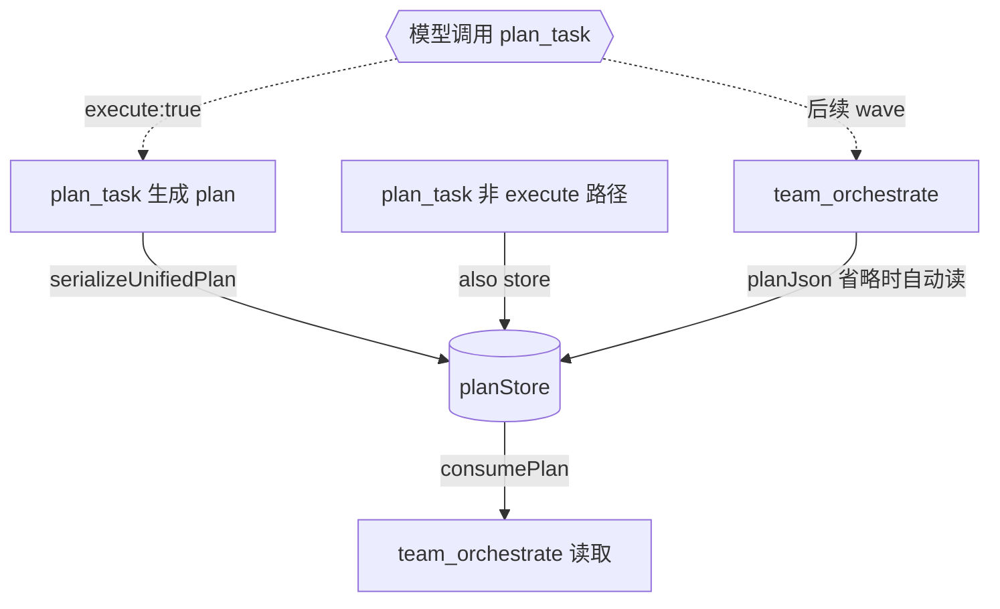

# 天枢 — plan_task ↔ team_orchestrate 自动桥接（session plan store）

# 天枢 — plan_task ↔ team_orchestrate 自动桥接

> **问题：** `buildTeamWorkflowPrompt` 指示模型从 `plan_task` 输出提取 JSON 传给 `team_orchestrate`，但 `plan_task(execute:true)` 内部走 `runTeamSkeleton` 后只返回 worker result——不暴露 UnifiedPlan JSON。模型实际无法完成这个 copy-paste。根源是"让模型搬运结构化数据"这个反模式，与 worker JSON 解析问题是同一族。

> **设计原则（天璇 + 瑶光）：** 不让模型搬运数据——让系统层自动传递。三条路径：Jenkins artifact store / Codex session state / React global store 全部指向"工具间通过共享存储通信，模型只做控制"。

## 事实流图



## 安全不变量

1. `planStore` 是模块级单例，不跨会话泄漏
2. `consumePlan()` 读取后清空——每个 plan 只用一次，避免 stale
3. `team_orchestrate` 的 `planJson` 参数优先级高于 store（显式覆盖）
4. 不改变 `plan_task` 和 `team_orchestrate` 的公开 API
5. 纯 TypeScript，零外部依赖

## 任务拆解

### 任务 1：创建 `src/agent/plan-store.ts`

新文件，3 个导出函数：

```typescript
let storedPlan: string | null = null

/** Store a serialized UnifiedPlan for later retrieval by team_orchestrate. */
export function storePlan(json: string): void { storedPlan = json }

/** Consume and clear the stored plan. Returns null if none stored. */
export function consumePlan(): string | null {
  const plan = storedPlan
  storedPlan = null
  return plan
}

/** Peek without consuming — for diagnostics. */
export function getStoredPlan(): string | null { return storedPlan }
```

### 任务 2：`plan_task` 写入 store

`src/tools/plan-task.ts` 两处改动：

**A — import storePlan**
**B — 在 `execute()` 中，plan 构建完成后（`taskGraphToUnifiedPlan` 之后），`execute: true` 分支之前，调用 `storePlan(serializeUnifiedPlan(plan))`**
**C — 在 `execute: false` 分支，返回 JSON 前也调用 `storePlan(json)`**

### 任务 3：`team_orchestrate` 读取 store

`src/tools/team-orchestrate.ts` 一处改动：

在 execute 函数中，`planJson` 解析处（约 L250）改为：

```typescript
import { consumePlan } from '../agent/plan-store.js'

// 在 parsed.data.planJson 之后：
const planJson = parsed.data.planJson ?? consumePlan()
```

### 任务 4：测试

`src/tools/__tests__/plan-store.test.ts`（新文件）：

- store + consume 循环：写入后 consume 返回写入值 + 清空
- consume 空 store 返回 null
- getStoredPlan 不消费
- 多 plan_task 调用覆盖（第二次 consume 返回 null）

`src/tools/__tests__/team-orchestrate.test.ts`（追加）：

- 当 planJson 参数省略但有 store 中的计划时，自动使用

### 任务 5：更新 `buildTeamWorkflowPrompt`

`src/workflows/ecosystem-workflows.ts` 中 prompt 文本简化——去掉要求模型提取 JSON 并传参的步骤，改为：

```
2. Call plan_task with { objective, files: [...], execute: true }.
   plan_task stores the plan internally; team_orchestrate will pick it up automatically.
3. After the first wave completes, if the output shows remaining waves:
   call team_orchestrate with { mode: 'standard', objective, fromWave: <next wave> }
```

### 任务 6：typecheck + 全量回归

```bash
npx tsc --noEmit
node --import tsx --test src/tools/__tests__/plan-store.test.ts
node --import tsx --test src/tools/__tests__/plan-task.test.ts
node --import tsx --test src/tools/__tests__/team-orchestrate.test.ts
node --import tsx --test src/workflows/__tests__/ecosystem-workflows.test.ts
```

## 条件矩阵

| 条件 | 行为 |
|------|------|
| plan_task execute:true | 存储 plan → 执行 → 返回 worker result |
| plan_task execute:false | 存储 plan → 返回 JSON |
| team_orchestrate planJson 显式 | 用显式值（忽略 store） |
| team_orchestrate planJson 省略 + store 有数据 | 自动 consume |
| team_orchestrate planJson 省略 + store 为空 | 走 planPath/planMarkdown 路径 |
| 多轮 wave: fromWave>0 | store 被消费后为 null → 模型传 planJson 或 team_orchestrate 走 planPath 重读
