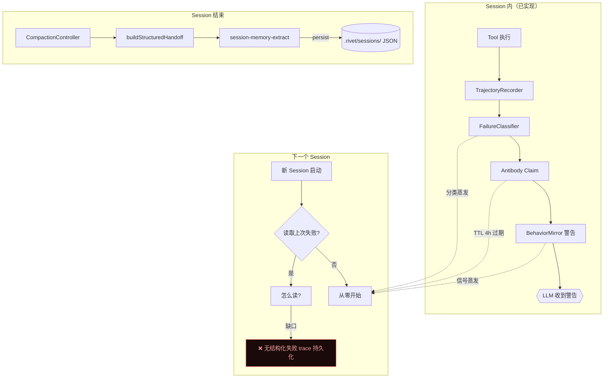
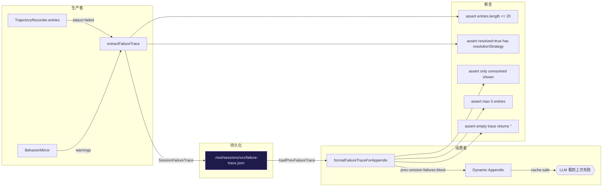

# 夸父·逐日：能力边界探测 + 结构化失败 trace

## 问题描述

当前天枢有丰富的 session 内失败处理基础设施（`failure-classifier.ts`、`behavior-mirror.ts`、`TrajectoryRecorder`、`antibody.ts`），但这些信号在 session 结束后全部蒸发。下一个 session 从零开始，不知道前一个 session 踩过什么坑、在哪个能力边界卡住过。

夸父设计文档（`docs/superpowers/specs/2026-05-28-kuafu-conscious-handoff-design.md`）的「化林」半边（交接包）在 1M 窗口下价值已大幅降低——compaction floor 温和（72%），自然 handoff 质量够用。但「逐日」半边——**有意识地从失败中学习并跨 session 保留**——与窗口大小无关，是真正缺失的能力。

## 根因分析



缺口在图的右下角：失败信号在 session 内已经产生（TrajectoryEntry.status=failed、ClassifiedFailure.class、BehaviorMirror 检测到的循环模式），但 session 结束时只有 handoff 文本和 memory extract 被持久化。**没有结构化的失败 trace 文件**让下一个 session 读取。

## 与参考计划的差异

参考计划 `task_dependency_layer_4384f321.plan.md` 设计了 `TaskDepthLayer`（unit/wiring/system）分类来决定验证策略。逐日不与它竞争——它们是正交的：

| 维度 | TaskDepthLayer (参考) | 逐日 (本计划) |
|------|----------------------|--------------|
| 解决什么 | 任务复杂度→验证策略 | 失败经验→跨 session 学习 |
| 何时生效 | 任务开始时（分类→选 verifier） | Session 结束时（失败→结晶→下个 session 读） |
| 数据流 | TaskContract → classify → prompt advisory | Trajectory → extract failures → persist → load → prompt advisory |

## 现有基础设施盘点

逐日不需要从零建——它缝合已有的散件：

| 已有 | 文件 | 角色 |
|------|------|------|
| TrajectoryRecorder | `src/agent/trajectory.ts` | 记录每个工具调用的 status/duration/errorClass |
| FailureClassifier | `src/agent/failure-classifier.ts` | 13 类错误分类 + retryable 判断 |
| BehaviorMirror | `src/agent/behavior-mirror.ts` | 检测 read_loop、repeated error、unverified edit |
| Antibody | `src/context/antibody.ts` | 失败→Claim（session 级，4h TTL） |
| CompactionController | `src/agent/compaction-controller.ts:78` | `buildStructuredHandoff` — handoff 已含 error 段 |
| SessionMemoryExtract | `src/agent/session-memory-extract.ts` | 从 messages 提取 decision/observation 类 memory |
| CrossSessionHook | `src/agent/hooks/cross-session-hook.ts` | 读 SQLite 事件 → 注入 dynamic appendix |
| SessionRegistry | `src/agent/session-registry.ts` | SQLite 事件存储 + consumeEvents |

**关键发现**：`CrossSessionHook` 已有跨 session 事件注入机制（consumeEvents → formatEventsForAppendix → dynamic appendix）。逐日的持久化层可以复用这个管道，不需要新建传输层。

## 提议改动

### Task 1: FailureTrace 数据结构 + 提取器

**新建 `src/agent/failure-trace.ts`**

```typescript
export interface FailureTraceEntry {
  /** 错误分类（来自 failure-classifier.ts 的 FailureClass） */
  errorClass: string
  /** 工具名 */
  tool: string
  /** 目标文件/命令 */
  target: string
  /** 失败摘要（≤200 chars） */
  summary: string
  /** 是否最终解决了 */
  resolved: boolean
  /** 采取的修复策略（如果解决） */
  resolutionStrategy?: string
  /** 发生时的 turn 号 */
  turn: number
}

export interface SessionFailureTrace {
  sessionId: string
  timestamp: number
  /** 该 session 的失败轨迹（最多 20 条） */
  entries: FailureTraceEntry[]
  /** BehaviorMirror 检测到的模式 */
  patterns: string[]
  /** 高频错误族 top-3 */
  topErrorFamilies: Array<{ family: string; count: number }>
}

/** 从 TrajectoryEntry[] 提取结构化失败 trace */
export function extractFailureTrace(
  trajectory: TrajectoryEntry[],
  mirrorWarnings: string[],
  sessionId: string,
): SessionFailureTrace
```

**当前行为**：TrajectoryEntry 有 status/errorClass/resultSummary，但没有"是否最终解决"和"修复策略"字段。

**改后行为**：`extractFailureTrace` 扫描 trajectory，对每个 `status='failed'` 或 `'retried-failed'` 的条目，向前看是否有后续条目解决了同一 target（status 变为 success），标记 `resolved=true` 并推断 resolutionStrategy。

**为什么安全**：纯函数，不修改任何现有行为。只读取已有的 TrajectoryEntry 数组。

### Task 2: Session 结束时持久化

**修改 `src/agent/compaction-controller.ts`**

在 `buildStructuredHandoff` 被调用的同一位置（`CompactionController.maybeCompact` L563 附近），追加：

```typescript
// 在 handoff 生成之后
const failureTrace = extractFailureTrace(
  this.deps.getTrajectoryEntries(),
  mirrorWarnings,  // 来自 behavior-mirror
  this.deps.session.id,
)
this.deps.persistFailureTrace?.(failureTrace)
```

**当前行为**：CompactionController 在 86%+ context 时触发 handoff + memory extract，持久化到 `.rivet/sessions/`。

**改后行为**：同时持久化一份 `failure-trace.json` 到同一 session 目录。

**为什么安全**：新增可选依赖 `persistFailureTrace?`（可选，不传则跳过）。不改变现有 handoff/memory 流程。

**持久化路径**：`.rivet/sessions/{sessionId}/failure-trace.json`（与 session 日志同级）。

### Task 3: 新 Session 启动时加载

**修改 `src/agent/hooks/cross-session-hook.ts`**

在已有的 `createCrossSessionHook` 的 `run()` 中，追加 failure trace 加载：

```typescript
run(): void {
  // 现有：读 cross-session events
  const events = deps.consumeEvents(deps.sessionId, lastSeen)
  // ...

  // 新增：读上一个 session 的 failure trace
  const prevTrace = deps.loadPrevFailureTrace?.()
  if (prevTrace && prevTrace.entries.length > 0) {
    const traceBlock = formatFailureTraceForAppendix(prevTrace)
    deps.setCrossSessionAppendix(
      (events.length > 0 ? formatEventsForAppendix(events) + '\n' : '') + traceBlock
    )
  }
}
```

**新增 `formatFailureTraceForAppendix`**：

```typescript
function formatFailureTraceForAppendix(trace: SessionFailureTrace): string {
  const lines = trace.entries
    .filter(e => !e.resolved)  // 只展示未解决的
    .slice(0, 5)               // 最多 5 条
    .map(e => `  [WARN] ${e.errorClass}: ${e.tool} ${e.target} — ${e.summary}`)

  if (lines.length === 0) return ''

  const familyHints = trace.topErrorFamilies
    .map(f => `${f.family}×${f.count}`)
    .join(', ')

  return `<prev-session-failures>\n${
    familyHints ? `Patterns: ${familyHints}\n` : ''
  }${lines.join('\n')}\n</prev-session-failures>`
}
```

**当前行为**：新 session 启动时 cross-session hook 只读 SQLite 事件。

**改后行为**：同时读上一个 session 的 `failure-trace.json`，注入 `<prev-session-failures>` 块到 dynamic appendix。

**为什么安全**：cache-safe——dynamic appendix 在 prefix cache 之外。新增 `loadPrevFailureTrace?` 是可选依赖。文件不存在时静默跳过。

### Task 4: 移除 Antibody 的 4h TTL 限制（可选）

**修改 `src/context/antibody.ts`**

当前 `ANTIBODY_TTL = 4 * 60 * 60_000`（4 小时）。对于跨 session 场景太短。

**改后行为**：`failure_pattern` 类型的 Claim TTL 延长到 24h，其他类型不变。

**为什么安全**：只延长过期时间，不改变 Claim 的创建/消费逻辑。超时的 Claim 自然被清理。

### Task 5: 测试

```typescript
// src/agent/__tests__/failure-trace.test.ts
describe('extractFailureTrace', () => {
  test('从 trajectory 提取失败条目')
  test('标记 resolved=true 当后续 turn 成功解决同一 target')
  test('计算 topErrorFamilies top-3')
  test('空 trajectory 返回空 entries')

  // 瑶光反证：checklist-only 实现会漏的条件
  test('retried-success 标记为 resolved=true（不是 failed）')
  test('resolved 条目的 resolutionStrategy 非空')
  test('entries 上限 20 条，超出截断')
})

describe('formatFailureTraceForAppendix', () => {
  test('只展示未解决条目')
  test('最多 5 条')
  test('无条目时返回空字符串')
  test('包含 topErrorFamilies 摘要')
})
```

## 事实流图（dataflow verifier 视角）



## 条件矩阵

| trajectory 状态 | errorClass | 后续有 success? | extractFailureTrace 输出 |
|----------------|-----------|----------------|------------------------|
| failed | type_error | 是 | resolved=true, strategy=推断 |
| failed | type_error | 否 | resolved=false |
| retried-success | timeout | — | resolved=true |
| retried-failed | api_error | 否 | resolved=false |
| success | — | — | 不提取（不是失败） |

## 反证测试表

| 偷懒实现 | 哪条测试会红 |
|---------|-----------|
| 只取最后 N 条，不扫描全 trajectory | `test('计算 topErrorFamilies top-3')` — 需要扫描全部才能算频率 |
| resolved 标记不检查 retried-success | `test('retried-success 标记为 resolved=true')` |
| 不截断 entries | `test('entries 上限 20 条，超出截断')` |
| 格式化包含 resolved 条目 | `test('只展示未解决条目')` |
| 空数组不返回空字符串 | `test('无条目时返回空字符串')` |

## 验证计划

1. **RED**：先写 `failure-trace.test.ts`，全部 fail（模块不存在）
2. **GREEN**：实现 `failure-trace.ts`，测试通过
3. 接入 `compaction-controller.ts`（Task 2），手动验证 `.rivet/sessions/xxx/failure-trace.json` 生成
4. 接入 `cross-session-hook.ts`（Task 3），手动验证新 session dynamic appendix 包含 `<prev-session-failures>` 块
5. `npx tsc --noEmit` + `npm exec -- tsx --test src/agent/__tests__/failure-trace.test.ts`

## Scope 边界

**做**：
- `src/agent/failure-trace.ts`（新建，~80 行）
- `src/agent/__tests__/failure-trace.test.ts`（新建，~60 行）
- `src/agent/compaction-controller.ts`（+5 行：调用 extractFailureTrace + persist）
- `src/agent/hooks/cross-session-hook.ts`（+15 行：加载 + 格式化）
- `src/context/antibody.ts`（可选，+2 行：TTL 延长）

**不做**：
- 不建独立子系统/进程/事件总线
- 不改 TrajectoryRecorder 的数据结构（只读不改）
- 不改 prompt/static.ts（failure trace 走 dynamic appendix，不进 static prompt）
- 不做 LLM 生成式总结（纯确定性提取，零 LLM cost）
- 不改 compaction 阈值或 handoff 逻辑

## 风险与缓解

| 风险 | 缓解 |
|------|------|
| failure-trace.json 文件膨胀 | entries 上限 20 条，每条 summary ≤200 chars，文件 <10KB |
| Dynamic appendix 超长影响 cache | 格式化后 ≤500 chars，与其他 appendix 块加总在 PromptEngine 限制内 |
| 跨 session 读取失败（文件损坏/格式不匹配） | loadPrevFailureTrace 用 try-catch 包裹，失败静默跳过 |
| 误报未解决（agent 在后续 turn 用不同工具解决了） | target 匹配用宽松策略（同文件路径即可，不限同工具） |
