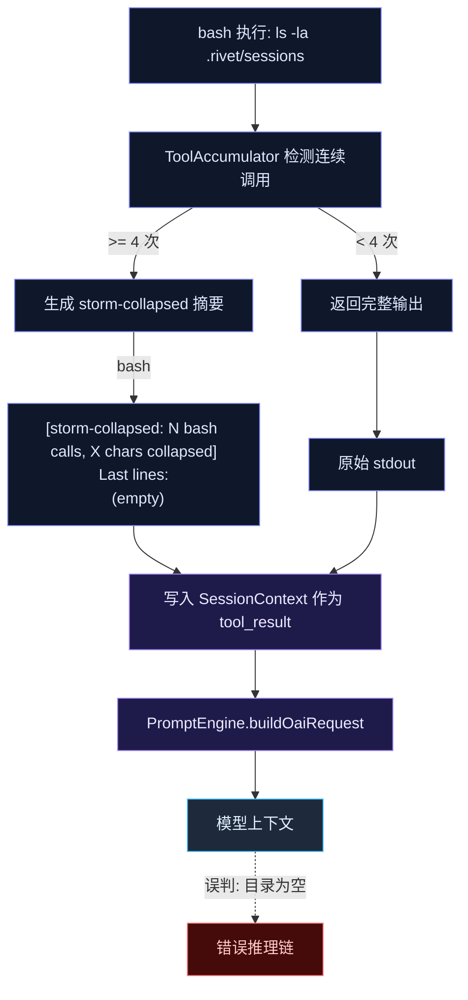

# 工具输出治理：storm-collapse 误判防护 — lossiness 标记 + 负向事实检测 + 交叉验证守卫

# 工具输出治理：storm-collapse 误判防护

## 1. 问题描述

`ls -la .rivet/sessions/` 返回 `(empty)`，agent 直接认定"目录为空"并基于此继续推理。实际上目录有大量文件——`(empty)` 是 storm-collapse 的折叠摘要标签，并非真实空输出。

根因：当前系统对工具输出缺乏**有损性标记**——模型上下文中的工具结果不知道自己是"被折叠/截断"的，摘要标签（`[storm-collapsed: ...]`、`(empty)`）被模型当作原始命令输出解读。

更广的视角：任何有损观测（折叠、截断、摘要化）都不能支持负向结论（"不存在""为空""没有匹配"）。这是一条需要 prompt 规则 + runtime guard 双层保障的原则。

## 2. 根因分析



问题在两条线上：

**线 A：`[storm-collapsed]` 标签本身不够明确**。当前 bash 摘要格式是：
```
[storm-collapsed: 5 bash calls, 12345 chars collapsed]
Last lines:
  (empty)
```
模型看到 `(empty)` 在 "Last lines" 下，会把它当作 `ls` 的真实输出。摘要里没有标明 `lossiness` 语义、没有禁止负向推断。

**线 B：没有 runtime guard**。prompt 规则（`self-verification`）写了交叉验证，但那是软约束——模型可能在高压下跳过。硬约束需要代码层：当工具结果是有损的且暗示负向事实时，注入显式的 `VERIFICATION_REQUIRED` 标记。

## 3. 数据流关闭

当前路径：

```mermaid
flowchart LR
    EXEC[tool execute] --> RESULT[ToolResult{content, rawPath?}]
    RESULT -->|ToolAccumulator| COLLAPSED["[storm-collapsed: ...]"]
    COLLAPSED --> CTX[SessionContext.addToolResults]
    CTX --> PROMPT[PromptEngine → OAI tool 消息]
    PROMPT --> LLM{{模型}}
```

目标路径：

```mermaid
flowchart LR
    EXEC[tool execute] --> RESULT[ToolResult{content, rawPath?, lossiness?}]
    RESULT -->|ToolAccumulator| RICH["[storm-collapsed: ...]\n⚠ lossiness=collapsed, semantic_status=unknown"]
    RICH --> DETECT{{负向事实检测}}
    DETECT -->|"命中: 'empty','not found'..."| VERIFY["[⚠ VERIFICATION_REQUIRED]\n禁止从有损观测推出负向结论\n建议: find/glob/os.scandir 交叉验证"]
    VERIFY --> CTX[SessionContext]
    DETECT -->|未命中| CTX
    CTX --> PROMPT[PromptEngine]
    PROMPT --> LLM{{模型}}
```

## 4. 改动清单

### 改动 1：ToolResult 增加 `lossiness` 字段

**文件**：`src/tools/types.ts:144`

```diff
export interface ToolResult {
  content: string
  uiContent?: string
  rawPath?: string
  isError?: boolean
+ lossiness?: 'lossless' | 'truncated' | 'collapsed' | 'summarized' | 'preview_only'
  verification?: VerificationMetadata
  extraVerifications?: VerificationMetadata[]
}
```

### 改动 2：Bash tool 设置 lossiness 标记

**文件**：`src/tools/bash.ts`

当 bash 输出被截断（当前已有截断逻辑）时设置 `lossiness: 'truncated'`。本身完整返回时设置 `lossiness: 'lossless'`。ToolAccumulator 会在 collapse 时覆盖为 `'collapsed'`。

### 改动 3：ToolAccumulator 在 collapse 时注入语义标记

**文件**：`src/agent/tool-accumulator.ts:161`（`buildBashSummary`）

当前：
```
[storm-collapsed: 5 bash calls, 12345 chars collapsed]
Last lines:
  (empty)
```

改为：
```
[storm-collapsed: 5 bash calls, 12345 chars collapsed]
Last lines:
  (empty)
⚠️ 此摘要是有损观测。lossiness=collapsed。禁止从 Last lines 中的 "empty" 等文本直接下结论。
```

同时，ToolAccumulator 的 `tryCollapse` 返回值增加 `lossiness` 字段，`tool-pipeline.ts` 在消费时设置到 ToolResult 上。

### 改动 4：ToolPipeline 中的负向事实检测

**文件**：`src/agent/tool-pipeline.ts`（在 `onToolResult` 回调附近）

新增函数 `detectNegativeFactInLossyResult(result: ToolResult): string | null`：

```ts
const NEGATIVE_PATTERNS = [
  /\bempty\b/i, /\bnot found\b/i, /\bno matches\b/i,
  /\b0 results\b/i, /\b0 files\b/i, /\bnothing to commit\b/i,
  /\bno tests found\b/i, /\ball passed\b/i, /\bno errors\b/i,
  /\bunchanged\b/i, /\bnot modified\b/i, /\bnot detected\b/i,
]

function detectNegativeFactInLossyResult(result: ToolResult): string | null {
  if (result.lossiness === 'lossless' || !result.lossiness) return null
  for (const pattern of NEGATIVE_PATTERNS) {
    const match = result.content.match(pattern)
    if (match) return `疑似负向事实: "${match[0]}" — 但观测有损 (${result.lossiness})，禁止直接采信`
  }
  return null
}
```

在 tool result 写入 session 前，如果检测到负向事实，在 content 前追加：

```
[⚠ VERIFICATION_REQUIRED]
{检测原因}
建议使用独立工具交叉验证（find / glob / read_file 等），不要基于此观测继续推理。
---
{原始 content}
```

### 改动 5：Prompt 规则强化

**文件**：`src/prompt/static/base-prompt.ts`（或 `engine.ts` 的 `buildSystemPrompt` 附近）

在 `self-verification` 规则中增加 lossy-observation 子规则：

```xml
<rule name="lossy-observation-discipline">
  当工具输出包含以下任一标记时，该观测为有损观测：
  [storm-collapsed], [collapsed], [truncated], [summarized], [tiered-summary],
  [⚠ VERIFICATION_REQUIRED], lossiness=collapsed/truncated/summarized

  有损观测上禁止的操作：
  - 禁止从有损观测中推出负向结论（"不存在""为空""没有匹配""全部通过"）
  - 禁止把摘要标签（如 "(empty)"）当作原始命令输出
  - 单次有损观测不足以支持"文件不存在""目录为空""无改动"等断言

  必须操作：看到有损观测 + 疑似负向事实 → 立即用独立工具交叉验证
  （find -type f -ls / glob / os.scandir / git status 等）
</rule>
```

### 改动 6：完整输出落盘（rawPath）

**文件**：`src/tools/bash.ts`

当前 bash 工具已使用 `rawPath` 保存大输出（`src/artifact/store.ts`）。检查确保所有被 truncate 的 bash 输出都有 `rawPath`，并在 `lossiness: 'truncated'` 时在 content 末尾追加：

```
[完整输出已保存: .rivet/artifacts/bash_xxx.stdout]
```

## 5. 设计决策对比

| 方案 | 优点 | 缺点 | 选择 |
|------|------|------|------|
| 纯 prompt 规则 | 零代码改动 | 软约束，模型可能跳过 | 辅助 |
| `lossiness` 字段 + 标记 | 结构化、可审计 | 需改动 ToolResult 类型 | **采用** |
| 完整 L0-L4 分层 | 架构彻底 | 改动量大，风险高 | 远期 |
| 新增语义工具（list_dir 等） | 从根本上消除问题 | 新工具注册、测试、维护成本 | 后续 |

**MVP 策略**：改动 1-5（最小改动，最大效果），改动 6 确认已有机制完整性。语义工具（list_dir_structured 等）作为后续增强。

## 6. 验证计划

### 单元测试

1. `detectNegativeFactInLossyResult` 测试：
   - lossless + "empty" → null（不误报）
   - collapsed + "empty" → 检测到负向事实
   - collapsed + "42 files" → null（非负向）
   - truncated + "not found" → 检测到
   - collapsed + "all passed" → 检测到

2. ToolAccumulator collapse 注入语义标记测试：
   - bash collapse 摘要包含 `lossiness=collapsed`
   - 摘要包含禁止负向推断的警告

### 集成测试

3. 端到端：连续 5 次 bash（触发 collapse） → 验证 session 中的 tool result 包含 `VERIFICATION_REQUIRED` 标记
4. 正常 1 次 bash `ls -la`（不触发 collapse） → 验证结果不包含错误标记

### 手动验证

5. 运行完整测试套件，确认 typecheck + 所有已有测试通过
6. 检视 collapse 后 session JSONL，确认新标记格式正确

## 7. 风险与缓解

- **风险**：lossiness 字段向后不兼容 → **缓解**：设为 optional，默认 undefined = lossless
- **风险**：负向事实检测误报（如 "0 errors" 在 error log 上下文中是正常信息） → **缓解**：只检测 + 标记，不阻断；标记为 "疑似"；模型可自行判断
- **风险**：VERIFICATION_REQUIRED 标记让模型过度谨慎 → **缓解**：只在 lossy + negative 同时满足时触发（双重条件），正常输出不受影响
- **风险**：ToolResult 类型变更影响下游消费者 → **缓解**：grep 所有 ToolResult 消费点，确认 optional 字段被安全忽略

## 8. 执行步骤

1. `src/tools/types.ts`：ToolResult 加 `lossiness?` 字段
2. `src/tools/bash.ts`：截断时设置 `lossiness: 'truncated'`；完整时设置 `lossiness: 'lossless'`
3. `src/agent/tool-accumulator.ts`：`buildBashSummary` 注入语义警告；`tryCollapse` 返回 `lossiness: 'collapsed'`
4. `src/agent/tool-pipeline.ts`：新增 `detectNegativeFactInLossyResult`；在 tool result 写入 session 前调用
5. `src/prompt/static/base-prompt.ts`：在 `self-verification` 规则中增加 lossy-observation 子规则
6. 编写测试（单元 + 集成）
7. typecheck + 全量测试
