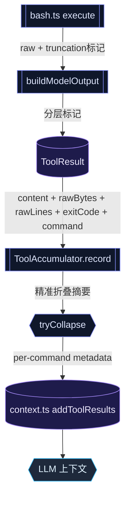

> **Status: APPROVED** — 2026-06-21T10:51:36.639Z

# 工具输出精准化：截断/折叠信息的三处锚点修复

# 工具输出精准化：截断/折叠信息的三处锚点修复

## 问题描述

`ls -la .rivet/sessions/` 返回 `(empty)`，agent 将其当作"目录为空"事实继续推理。实际目录有大量文件，`(empty)` 是 storm-collapse 的显示标签而非真实 stdout。

根因不是提示词没写交叉验证规则（`self-verification` 规则已覆盖），而是**截断/折叠信息缺乏精准的语义标记**——模型收到的内容无法区分"真实空输出"和"被折叠的输出"。

## 根因分析：数据流

```
bash.ts execute()                stdout/stderr ring buffer (32KB 静默截断)
     ↓
bash.ts buildResult()           buildModelOutput() → header + [truncated: N→M lines]
     ↓
ToolResult { content, rawPath }  content 是已格式化的字符串
     ↓
tool-pipeline.ts                callbacks.onToolResult(id, name, finalContent, ...)
     ↓
context.ts addToolResults()     trimToolResultForMemory() → OAI tool 消息
     ↓
ToolAccumulator tryCollapse()   [storm-collapsed: N bash calls, X chars collapsed]
     ↓
prompt/engine.ts                模型上下文中展示
```

三处精度缺失点：

1. **bash.ts L189-196** — stdout 超过 32KB 时只保留最后 24KB，**完全静默**，没有 truncation 标记
2. **output-store.ts buildModelOutput()** — 截断标记 `[truncated: N→M lines]` 缺乏语义分层：不区分「真实空」vs「摘要替代」
3. **tool-accumulator.ts** — `[storm-collapsed: N bash calls, X chars collapsed]` 只告诉模型"折叠了 N 个调用"，不告诉模型每个调用是什么、各自成敗

## 修复方案

### 锚点 1：bash.ts — 静默截断 → 显式标记

当 stdout 超过 ring buffer 限制时，在输出末尾追加标记。

```typescript
// bash.ts:189-196 修改
child.stdout!.on('data', (data: Buffer) => {
  const text = data.toString()
  stdout += text
  params.onOutput?.(text)
  if (stdout.length > 32_000) {
    if (!truncatedStdout) {
      truncatedStdout = true
      stdoutMark = `\n[stdout truncated: output exceeded 32KB, showing last 24KB — full output at rawPath]`
    }
    stdout = stdout.slice(-24_000)
  }
})
```

影响：`buildModelOutput` 收到的 raw 会包含 truncation 标记，模型看到就知道不完整。

### 锚点 2：output-store.ts buildModelOutput — 语义分层

当前三种情况的标记不够精确。改进：

| 情况 | 当前标记 | 改进后标记 |
|------|---------|-----------|
| 输出完整且为空 | `[cmd] exit=0 time=0s lines=0\n` | `[cmd] exit=0 time=0s lines=0\n[output complete: 0 lines — confirmed empty]` |
| 输出 >200 行截断 | `[truncated: 500 lines → 180 shown]` | `[output truncated: head 100 + tail 80 of 500 lines — 320 lines omitted, full output at rawPath]` |
| 输出 ≤200 行完整 | `[cmd] exit=0 time=0.1s lines=5\n<content>` | `[cmd] exit=0 time=0.1s lines=5 — output complete\n<content>` |

关键：`confirmed empty` 是唯一能推出"空"结论的标记。其余所有标记都暗示"有内容但你没看到"。

### 锚点 3：tool-accumulator.ts — 折叠摘要精准化

当前：
```
[storm-collapsed: 5 bash calls, 50000 chars collapsed]
Last lines:
  ...
```

改进为包含每条被折叠命令的元数据：
```
[storm-collapsed: 5 bash calls consolidated — raw output saved]
  ls -la .rivet/sessions/     exit=0  248 lines  (collapsed)
  find . -type f -name '*.ts' exit=0  12 lines   (collapsed)
  grep 'pattern' src/         exit=0  3 lines    (collapsed)
  wc -l src/**/*.ts           exit=0  1 line     (collapsed)
  cat package.json            exit=0  45 lines   (collapsed)
Last output from most recent call (cat package.json):
  {
    "name": "opencode-tui",
    ...
```

这需要 `ToolAccumulator` 在记录条目时保存元数据（exitCode、lineCount、command），而不只是 content 字符串。

### ToolResult 类型扩展

为支持锚点 3 的元数据，`ToolResult` 需增加可选字段：

```typescript
export interface ToolResult {
  content: string
  uiContent?: string
  rawPath?: string
  isError?: boolean
  verification?: VerificationMetadata
  // 新增：输出精准化元数据
  rawBytes?: number      // 原始输出字节数（截断前）
  rawLines?: number      // 原始输出行数（截断前）
  exitCode?: number      // 命令退出码（bash 等）
  command?: string       // 执行的命令原文（用于折叠摘要）
}
```

`AccumulatorEntry` 同步扩展以传递这些字段。

## 数据流变更图



## 调用方影响分析

- `ToolResult` 新增字段均为可选，**零破坏性**——现有代码不做任何修改即兼容
- `AccumulatorEntry` 扩展同理
- `bash.ts` 的 `buildResult()` 需填充新字段
- `output-store.ts` 的 `buildModelOutput()` 格式变更会影响所有工具——但只是标记文本变精准，不改变信息量
- `tool-accumulator.ts` 的 `buildBashSummary()` 需读取新字段

## 验证计划

1. **单元测试**：`buildModelOutput` 三种情况的标记文本断言
2. **单元测试**：`ToolAccumulator.buildBashSummary` 含 per-command metadata
3. **集成测试**：bash 工具执行 → ToolResult 包含 rawBytes/rawLines/exitCode/command
4. **手动验证**：模拟 storm-collapse 场景，确认折叠摘要包含每条命令的 exit code 和行数
5. **反证测试**：确认 `confirmed empty` 只出现在 stdout 真实为 0 byte 时

## 风险

- **低风险**：所有改动都在标记文本层面，不改变消息结构或控制流
- `buildModelOutput` 格式变更可能导致依赖格式字符串的测试失败——需同步更新
- 新增 ToolResult 字段需确保 TypeScript strict 模式下不引入编译错误
