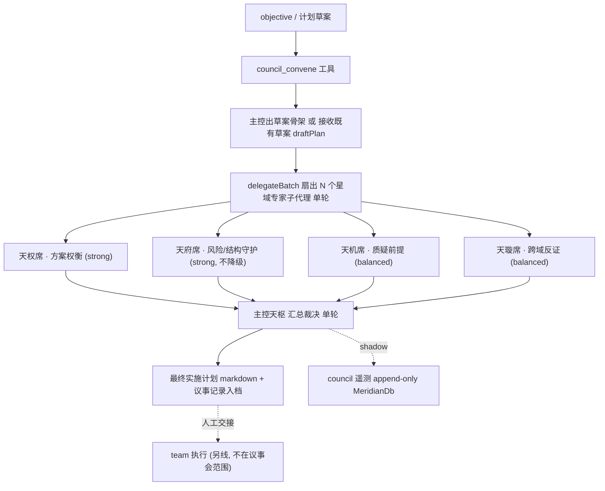

# 星图议事会 — 多星域单轮会诊出计划

> 新建一条**独立于 team 执行编排**的「议事会」管线：把一份计划草案交给 N 个绑定星域 `authority` 的将星子代理，**单轮**各自从领域视角产出结构化修订意见，主控（天枢）**汇总裁决**成一份**可审计的实施计划文档**（议事记录入档）。多模型按 T5 `authority→tier` 真分席位，路由先 shadow。
>
> 定位铁律：**议事会 = 规划期会诊（出计划）；team = 执行期波次编排（跑计划）。计划文档是二者唯一接口，互不调用。** 议事会不派 worker、不分波、不执行。

## 0. 三条硬缰绳（全程不可破）

① 动态附录在用户消息内冻结，中途注入走 **system-reminder**；② 不每轮重写 `frozenBase`/`volatileBlock`；③ 不在 anchor 前重排消息。

**议事会专属缰绳**：④ 只出计划、**绝不执行**（不碰 `groupTeamTasks`/`dispatchWaveAt`/派 worker 写盘）；⑤ **单轮不循环**（无多轮 debate）；⑥ 风险/权衡席（天府/天权）**绝不为省钱降级**模型，`false_green` risk 永远先于 `cost` pragmatic；⑦ 多模型路由**先 shadow 记录**，gated 影响默认关。

## 1. 背景与现状证据

### 1.1 现状：team max 的「多视角」不是议事会

team max 当前是「**固定三视角并行 → 一次性确定性 merge → 顺带驱动执行波**」，且 merge 元数据被丢弃：

| 事实 | 证据 | 缺口 |
|------|------|------|
| 三视角并行扇出（天权/天府/天璇） | [team-orchestrator.ts:361-371](src/agent/team-orchestrator.ts) `delegateBatch(plannerRequests)` | 视角固定写死，不可配置席位 |
| 一次性确定性合并，无 LLM 参与 | [team-perspectives.ts:97-279](src/agent/team-perspectives.ts) `mergePerspectives` | 无主控汇总，无单轮专家会诊语义 |
| 合并完直接驱动执行 | `groupTeamTasks → dispatchWaveAt` ([team-orchestrator.ts:253-313](src/agent/team-orchestrator.ts)) | 规划与执行**耦合**在一条管线 |
| 裁决/冲突记录被丢弃 | `mergePerspectives` 返回 `MergedPlan.conflicts/decisions`，orchestrator **只用 `merged.tasks`**（team-orchestrator.ts:377-378），其余仅测试引用 | **议事过程不可审计** |
| 视角差异主要靠 prompt + 域注入 | `buildPlannerObjective` 的 `PERSPECTIVE_BRIEFS`（team-perspectives.ts:300-323）+ `authority → systemPromptSuffix` | — |
| 模型默认**相同** | 三视角 `profile:'reviewer'`，[`reviewer` 有 `tierLock:'cheap'`](src/agent/profile-registry.ts)（model-tier-policy.ts:37-42 中 tierLock 优先于 authority），`kind:'plan'→code_edit→cheap-flash`（config/default.ts:152-157） | **「不同模型在不同星域」被 tierLock 压死** |
| 无 debate/revise 循环 | 全 repo team 路径无 re-plan loop；`replan-loop.ts` 属 AgentLoop trace，与此无关 | — |

### 1.2 星域机制（已落地，议事会复用）

- `StarDomain`（[star-domain.ts:4-26](src/agent/star-domain.ts)）：`authority` 绑 `systemPromptSuffix` + `toolWhitelist` + 决策风格。8 内置域：天枢/破军/天府/天梁/天权/天机/天璇/辅。
- 注入链路：`DelegationRequest.authority → WorkOrder.authority → buildWorkerPrompt` 注入「## 权域指令」（[worker-prompts.ts:189-254](src/agent/worker-prompts.ts)）；工具 = profile tools ∩ domain.toolWhitelist。
- 将星（general-star）= 跨会话数字生命，`recall_general`/ledger **未实现**——**本轮议事会把将星当「绑星域的子代理专家」用，不落 ledger**（留后续）。

### 1.3 T5 多模型路由（已建，待样本）

shadow→gated 全链路已焊死（7 闸 + 默认关 + false-green 零容忍，见 `T5收官完成后快照`），`ModelRoutingShadow`/`model-tier-policy`/MeridianDb append-only 可直接复用。`authority→tier` 已定义（[model-tier-policy.ts:56-64](src/agent/model-tier-policy.ts) 天府/天璇高风险→strong），只差一个**无 tierLock 的 profile** 让它对规划席位生效。

## 2. 改动总览（供执行，本轮只写文档）

| 文件 | 改动 | 波次 |
|------|------|------|
| `src/agent/council/council-plan.ts` | **新建**：schema + 纯汇总函数 | W-C1 |
| `src/agent/council/__tests__/council-plan.test.ts` | **新建**：裁决记录不丢、冲突标注 | W-C1 |
| `src/agent/council/council-orchestrator.ts` | **新建**：单轮扇出星域专家（复用 delegateBatch） | W-C2 |
| `src/agent/council/council-render.ts` | **新建**：主控汇总 → 计划 markdown + 议事记录 | W-C3 |
| `src/agent/profile-registry.ts` | 加 `council_expert`（无 tierLock，只读规划工具集） | W-C4 |
| `src/agent/council/council-routing.ts` | **新建**：席位 authority→tier + 路由 shadow | W-C4 |
| `src/tools/council-convene.ts` | **新建**：`council_convene` 工具 | W-C5 |
| `src/agent/council/council-telemetry.ts` | **新建**：append-only `council_session:` 落库 | W-C5 |
| `src/agent/star-soul-gate.ts`（或同级 gate） | 加 `isCouncilEnabled()`（`COUNCIL=0` kill switch） | W-C5 |
| **不碰** `team-orchestrator.ts`/`team-perspectives.ts` | 解耦硬约束 | 全程 |

## 3. 议事会数据流



## 4. Schema（W-C1 草案，文档定稿）

```ts
export type SeatVerdict = 'accepted' | 'rejected' | 'deferred'

export interface CouncilSeat {
  authority: StarDomainId          // 'tianquan' | 'tianfu' | 'tianji' | 'tianxuan' | ...
  charter: string                  // 该席领域职责简述（写进 objective brief）
  tierHint: 'strong' | 'balanced' | 'cheap'  // authority→tier 建议（W-C4 路由用）
  noDowngrade?: boolean            // 瑶光门：天府/天权置 true
}

export interface SeatContribution {
  authority: StarDomainId
  summary: string
  additions: PlanItem[]            // 该席主张新增的计划项
  risks: { claim: string; severity: 'low'|'medium'|'high'; mitigation: string }[]
  challenges: string[]             // 对草案的质疑/反证
  alternatives: { proposal: string; recommend: boolean; rationale: string }[]
  modelUsed?: string               // 实际生效模型（遥测/shadow 用，可缺）
}

export interface CouncilDecision {
  id: string
  source: StarDomainId
  title: string
  rationale: string
  verdict: SeatVerdict             // 主控裁决
  conflictWith?: string            // 与哪条主张冲突（席位间分歧）
}

export interface CouncilPlan {
  objective: string
  seats: StarDomainId[]
  contributions: SeatContribution[]
  decisions: CouncilDecision[]     // 裁决全记录 — 不可丢
  finalPlanMarkdown: string        // 主控汇总产物
  meta: { round: 1; convenedAt: number; objectiveHash: string }
}
```

纯汇总函数 `aggregateCouncil(draft, contributions[]): { decisions; mergedItems; conflicts }`：确定性预合并——收集所有 additions/risks/alternatives，标注 accepted/rejected/deferred + 检出席位间冲突；**保留全部裁决记录**（补 team max 丢 `conflicts/decisions` 的洞）。主控的 LLM 汇总只在 W-C3 把这份结构化裁决渲染/润色成最终 markdown，不改裁决事实。

## 5. TDD 执行波次

### W-C1 — schema + 纯汇总函数（零 I/O，最内聚）
**任务契约**：定义 §4 类型 + `aggregateCouncil` 纯函数。
**过门**：单测钉死——①每条 contribution 都在 `decisions` 留痕（无静默丢弃）；②席位间冲突（同 taskId 风险分歧 / 互斥 alternative）被标 `conflictWith`；③deferred ≠ 删除。
**风险**：低。

### W-C2 — 议事会编排器（单轮扇出）
**任务契约**：`runCouncil(input, deps)` 复用 `coordinator.delegateBatch` 一次性扇出席位子代理（`DelegationRequest{ kind:'plan', profile:'council_expert', authority: seat.authority, objective: buildSeatObjective(seat, draft) }`），`'all_required'` 收齐 → `parseSeatContribution`（仿 [parsePerspectiveResult](src/agent/team-perspectives.ts) 的 artifact JSON 解析 + 降级兜底）。
**过门**：①断言**全程不调用** `groupTeamTasks`/`dispatchWaveAt`/任何 worker 写工具；②单轮——`delegateBatch` 恰调用 1 次；③某席失败时降级为空贡献不阻塞会诊。
**风险**：中（复用 coordinator，但须证明解耦）。

### W-C3 — 主控汇总 → 计划文档渲染
**任务契约**：`renderCouncilPlan(councilPlan): string` 产出最终实施计划 markdown，**内嵌「议事记录」段**：每席贡献摘要 + 主控裁决（accepted/rejected/deferred + 理由）+ 冲突表。主控汇总走主 loop 一个 system-reminder 注入的汇总指令（**不**前移 system prompt，守缰绳①②）。
**过门**：渲染含全部席位 + 全部 decisions + 冲突；rejected 项有理由；产物是合法 markdown 计划（可被 team 解析的任务表结构）。
**风险**：中。

### W-C4 — 多模型席位路由（shadow-first）
**任务契约**：`profile-registry` 加 `council_expert`（role:readonly、只读规划工具集、**无 tierLock**）；`council-routing.ts` 按 `seat.tierHint`/`authority→tier`（复用 [model-tier-policy](src/agent/model-tier-policy.ts)）给每席选模型 tier；经 `ModelRoutingShadow` 记录「推荐 vs 实际」。
**过门**：①`council_expert` 无 tierLock → 天权/天府席能选到 strong（反证：若误用 `reviewer` 则全压 cheap，测试须红）；②**瑶光门**：`noDowngrade` 席位在低样本/省钱建议下仍不降级，断言 tier ≥ hardFloor；③路由 shadow 落库，gated 影响默认关。
**风险**：中（碰 T5 路由，但只读规划风险低）。

### W-C5 — 工具注册 + 遥测 + kill switch
**任务契约**：注册 `council_convene` 工具（入参 `objective` 或 `draftPlan` + 可选 `seats[]`，默认席位 = 天权/天府/天机/天璇）；`council-telemetry.ts` 以 **append-only key** `council_session:${sessionId}:${objectiveHash}:${timestamp}` 落 MeridianDb `p3_state`（DB 不可用 no-op）；`COUNCIL=0` kill switch。
**过门**：①工具注册可见、schema 合法；②遥测 key append-only（两 session 同 objective 不覆盖，仿 T5 §快照修正点）；③`COUNCIL=0` 时工具不可用/no-op；④遥测行永不作训练样本。
**风险**：低-中。

**每波统一过门**：`tsc --noEmit` 绿 + 新增 council 测试全绿 + **`team-orchestrator`/`team-perspectives` 测试零改动且全绿**（解耦验证）+ 对照 clean HEAD 预存失败集零新增；每波独立提交。

## 6. 反证测试表（哪些偷懒会红）

| 偷懒实现 | 会红的测试 |
|----------|-----------|
| 汇总时丢弃某席贡献 / 不记 rejected 理由 | W-C1 裁决留痕断言 |
| 议事会顺手调 `dispatchWaveAt` 派执行 | W-C2 解耦断言（执行函数零调用） |
| 偷偷加多轮循环 | W-C2 `delegateBatch` 恰 1 次断言 |
| 复用 `reviewer` profile（tierLock 压死多模型） | W-C4 天权/天府选不到 strong → 红 |
| 风险席为省钱降级 | W-C4 瑶光门 `tier ≥ hardFloor` 断言 |
| 遥测 key 用 `council:${turn}` 跨 session 覆盖 | W-C5 append-only 门 |
| 把 council mode 塞进 `team_orchestrate` | 触碰 team 测试 → 解耦验证红 |
| 让 gated 路由默认开 | W-C4 gated 默认关断言 |

## 7. 复用 vs 新建（锚点）

- **复用**：`coordinator.delegateBatch`、`DelegationRequest.authority`、[`worker-prompts.buildWorkerPrompt`](src/agent/worker-prompts.ts) 域注入、`starDomainRegistry`、[`model-tier-policy`](src/agent/model-tier-policy.ts)、`ModelRoutingShadow`、`parsePerspectiveResult` 解析手法、MeridianDb `p3_state` append-only。
- **新建**：`src/agent/council/{council-plan,council-orchestrator,council-render,council-routing,council-telemetry}.ts`、`src/tools/council-convene.ts`、`profile-registry` 的 `council_expert`、`isCouncilEnabled()`。
- **不碰**：[`team-orchestrator.ts`](src/agent/team-orchestrator.ts)、[`team-perspectives.ts`](src/agent/team-perspectives.ts)（解耦硬约束，团队执行线完全独立）。

## 8. 执行次序

```
W-C1 schema + 纯汇总（低）
  → W-C2 编排器单轮扇出（中，⚠ 先写解耦断言）
  → W-C3 主控汇总渲染（中）
  → W-C4 多模型席位路由（中，shadow-first + 瑶光门）
  → W-C5 工具注册 + 遥测 + kill switch（低中）
```
每波独立会话/独立提交均可；W-C2 的解耦断言建议最先写（作为整条线的安全网）。

## 9. 不建议（破坏不变量）

- 把议事会 mode 塞进 `team_orchestrate`（违解耦）；
- 让议事会直接派 worker 执行 / 分波（违缰绳④）；
- 复用 `reviewer` profile（`tierLock:'cheap'` 压死多模型，违设计目标）；
- 把将星 `recall_general`/ledger 一并塞进本轮（范围膨胀，留后续）；
- 多轮 debate 循环（用户明确单轮即可）；
- 把汇总指令/议事记录前移 system prompt 或每轮重写 frozenBase（违缰绳①②）；
- 路由 gated 默认开（违 T5 shadow-first 纪律）。
