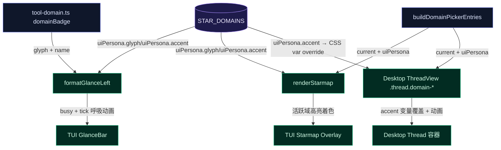

# 星域主题 UI 优化 — TUI GlanceBar + Starmap + Desktop 主题覆盖

# 星域主题 UI 优化 — 修订版

基于外部方案 `implementation_plan.md`，经代码库核验后修订。核验发现：现有 `tokens.css` 已有 `--accent` CVM 覆盖接缝、`glance-bar.ts` 的 `resolveStarDomainAccent()` 已实现但 `formatGlanceLeft` 未调用（为现存 bug）、`domain-picker-entries.ts` 已提供带 `current` 和 `uiPersona` 的域列表。修订版在原方案基础上对齐已有架构，避免重复造轮子。

## 1. 问题描述

10 个星域在 UI 层缺乏视觉区分。`glance-bar.ts` 的域标签和 glyph 统一用 `theme.muted` 渲染（忽略已实现的 `resolveStarDomainAccent`），starmap 覆盖层把所有域 glyph 硬编码为 `✦`，Desktop 端的 ThreadView 未利用 tokens.css 已有的 `--accent` 接缝。

## 2. 根因分析

- **C3 TUI GlanceBar**：`formatGlanceLeft` 在 L90-L91 使用 `theme.muted` 渲染 domainGlyph 和 domainLabel，但同文件 `resolveStarDomainAccent()`（L17-L29）已实现 accent 解析。这是未接通的数据流断裂。
- **C4 TUI Starmap**：`main.ts` 中 starmap 条目构建未使用 `buildDomainPickerEntries()` 返回的 `uiPersona.glyph` 和 `current`，而是硬编码 `✦`。
- **C1 Desktop CSS**：`tokens.css` 注释明确说 `--accent` 是 CVM 覆盖接缝，但 `styles.css` 中未定义 `.thread.domain-<id>` 选择器来激活它。
- **C2 Desktop ThreadView**：ThreadView 容器未写入 `domain-<id>` CSS class，也未渲染活跃域 glyph。

## 3. 修订版变更

### C3: TUI GlanceBar — 接通 accent + 呼吸动画

**文件**: `src/tui/format/glance-bar.ts`

1. `GlanceBarInput` 新增 `busy?: boolean` 和 `tick?: number`
2. `formatGlanceLeft` 改为调用 `resolveStarDomainAccent(input.domainName, theme)` 获取域专属色，glyph 和 label 均用该色渲染（替代 `theme.muted`）。需处理降级：claude/antigravity/cobalt 主题下保持 muted（`resolveStarDomainAccent` 已实现此降级）。
3. 若 `busy` 为 true 且 tick 已提供，glyph 应用文字呼吸：`tick % 4` 对应 bold → normal → dim → normal
4. 导出 `resolveStarDomainAccent`（已导出，维持现状）

**文件**: `src/tui/engine/app.ts`

- 调用 `formatGlanceBar` 时传入 `busy: isStreaming` 和 `tick: this.streamRenderController.tick`

### C4: TUI Starmap — 动态 glyph + 活跃域高亮

**文件**: `src/main.ts`

- starmap 条目构建改用 `buildDomainPickerEntries()` 的返回值：glyph 取 `entry.uiPersona?.glyph ?? '✦'`，active 取 `entry.current`

**文件**: `src/tui/format/overlay.ts`

- `renderStarmap` 中活跃域条目使用 `resolveStarDomainAccent` 着色 name 和 glyph

### C1: Desktop CSS — 10 星域主题变量覆盖 + 动画

**文件**: `desktop/src/styles.css`

- 为每个星域定义 `.thread.domain-<id>` 规则块，覆盖 `--accent`/`--accent-hover`/`--accent-soft`/`--accent-fg`（通过 tokens.css 已有的 `--accent` 变量体系）
- 添加 `@keyframes glyph-breath`（scale + glow 脉冲）
- 添加 `@keyframes pulse-running`（子代理运行节点脉冲）
- 添加 `@keyframes decision-shift-enter`（域切换 slide-in）
- 完善 `.delegation-tree`/`.deleg-node` 样式
- `.turn-divider` 按 `uiPersona.separator` 样式（thin/thick/dots）

**文件**: `desktop/src/styles/tokens.css`

- 无需改动——`--accent` 接缝已就绪

### C2: Desktop ThreadView — 动态域类名 + glyph 渲染

**文件**: `desktop/src/surfaces/ThreadView.tsx`

- 使用 `buildDomainPickerEntries(currentDomainId)` 获取活跃域
- `.thread` 容器添加 `domain-${activeDomainId}` class
- `.thread-glyph` 渲染活跃域 glyph，`session.status === 'running'` 时添加 `breathing` class
- `BlockImpl` 中 assistant fallback label 使用 `STAR_DOMAINS[id].name`

### C5 (追加): 主题降级约束

`resolveStarDomainAccent` 在 claude/antigravity/cobalt 主题下已降级为 muted。C3 和 C4 的着色逻辑天然继承此降级——当降级激活时，呼吸动画不生效（glyph 保持 muted），label 保持 muted。

## 4. 验证

- `npx tsc --noEmit` — typecheck
- `npm exec -- tsx --test src/tui/format/__tests__/overlay.test.ts` — starmap 渲染测试
- 手动 TUI 验证：切换星域 → 确认 GlanceBar 域标签变色 → 确认 starmap 活跃域高亮 → 确认呼吸动画
- 手动 Desktop 验证：切换星域 → 确认 workspace accent 变色 → 确认 glyph 呼吸动画
