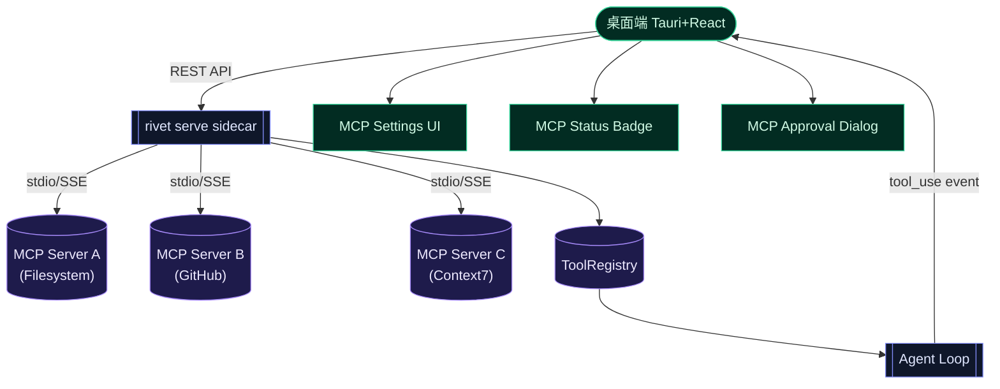
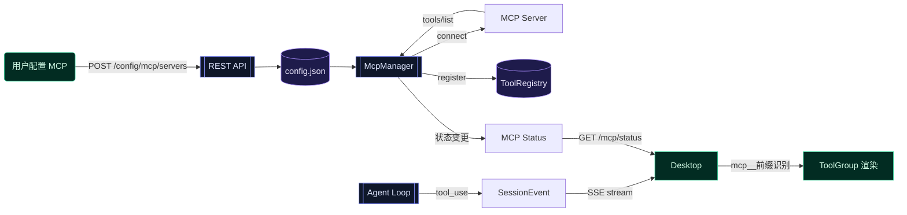

> **Status: APPROVED** — 2026-06-21T11:51:33.676Z

# 桌面端 MCP 接入与处理设计

# 桌面端 MCP 接入与处理设计

## 问题描述

桌面端（`desktop/` — Tauri + React）尚未接入 MCP（Model Context Protocol）。已有的 MCP 客户端基础设施（`src/mcp/`）面向 TUI 端设计，桌面端缺少：
1. **MCP 服务器配置 UI** — 用户无法在桌面端添加/管理 MCP 服务器
2. **MCP 状态可见性** — 无法看到各 MCP 服务器的连接状态、工具数量
3. **MCP 工具审批** — 写类 MCP 工具的审批对话框未适配桌面端
4. **REST API 缺口** — 后端缺少 MCP 配置管理与状态查询的 HTTP 端点

## 架构决策

MCP 客户端运行在 **后端 sidecar**（`rivet serve`），桌面端作为 **纯 UI 外壳** 通过 REST API 间接管理。



**理由**：① MCP SDK 是 Node.js 库，无法在浏览器/Tauri webview 中运行；② 工具执行天然在服务端，桌面端只是审批/展示层；③ 已有 TUI 端 MCP 实现可复用，桌面端只需补齐 API + UI 层。

## 现状分析

### 已有资产
| 模块 | 状态 | 位置 |
|------|------|------|
| MCP 配置 schema（stdio/SSE） | 设计完成 | `docs/.../2026-05-16-rivet-mcp-client-implementation.md` |
| MCP Tool → Rivet Tool wrapper | 设计完成 | `docs/.../2026-05-16-rivet-mcp-client-implementation.md` |
| McpManager 连接生命周期 | 设计完成 | 同上 |
| MCP 失败分类器 | 设计完成 | `docs/.../2026-05-16-rivet-p2-model-mcp-repo-intel-design.md` |
| desktop REST API client | 已实现 | `desktop/src/runtime/client.ts` |
| desktop ToolGroup 组件 | 已实现 | `desktop/src/components/ToolGroup.tsx` |
| desktop SettingsSurface | 已实现 | `desktop/src/surfaces/SettingsSurface.tsx` |

### 缺口
| 缺口 | 影响 |
|------|------|
| 后端无 MCP 管理 REST 端点 | 桌面端无法查询/修改 MCP 配置 |
| 后端无 MCP 状态推送 | 桌面端无法显示连接健康状态 |
| `SessionEvent` 不含 MCP 信息 | tool_use 事件未标注来源是 MCP |
| desktop 无 MCP 配置 UI | 用户只能手动编辑 config.json |
| desktop 无 MCP 状态面板 | 连接失败无感知 |

## 数据流设计



### 事实流图

| 字段/约束 | 生产者 | 中间结构 | 消费者 | 断言 |
|-----------|--------|----------|--------|------|
| `serverId` | 用户输入或 config.json | `McpServerConfig` | Settings UI + Status badge | 非空，唯一 |
| `status: connected\|error` | `McpManager.connectAndDiscover()` | `McpConnectionState` | StatusPanel | connected ⇒ toolCount > 0 |
| `mcp__<server>__<tool>` 前缀 | `createMcpToolWrapper()` | Tool.definition.name | ToolGroup + ApprovalDialog | 前缀唯一，可解析回 serverId |
| `approval_required` for write MCP | `wrapper.requiresApproval()` | SessionEvent | ApprovalDialog | write 类 tool 必须触发审批 |
| `isError: true` + `lastErrorClass` | `classifyMcpError()` | `McpConnectionState` | StatusPanel | error 状态必有 errorClass |

### 条件矩阵：MCP 工具审批

| server status | tool category | approvalMode | 行为 |
|---------------|---------------|-------------|------|
| connected | read (search/read) | auto-safe | 自动执行，不弹窗 |
| connected | write (create/delete) | auto-safe | 弹审批窗，标注 `[MCP: serverId]` |
| connected | write | dangerously-skip | 自动执行 |
| error | any | any | tool 调用失败，返回 error |
| disconnected | any | any | tool 不可见，不注册 |

## 实现计划

### Phase 1：后端 REST API（MCP 管理端点）

**文件：** `src/server/mcp-api.ts`（新建）、`src/server/session-manager.ts`（修改）

新增 REST 端点：

```
GET  /mcp/status          → { servers: McpConnectionState[]; totalTools: number }
POST /mcp/servers         → { ok: boolean }     (添加/更新 MCP 服务器配置)
DELETE /mcp/servers/:id   → { ok: boolean }     (删除 MCP 服务器)
POST /mcp/servers/:id/restart → { ok: boolean } (重启单个服务器连接)
GET  /mcp/servers/:id/tools → { tools: ToolDef[] } (列出某服务器的工具)
```

`McpConnectionState` 返回格式：

```typescript
interface McpConnectionState {
  serverId: string
  status: 'disconnected' | 'connecting' | 'connected' | 'error'
  transport: 'stdio' | 'sse'
  toolCount: number
  error?: string
  lastErrorClass?: 'config' | 'auth' | 'network' | 'protocol' | 'tool_error'
  lastConnectedAt?: number
}
```

修改 `SessionEvent` 类型，在 `tool_use` 事件的 data 中增加可选字段：

```typescript
// tool_use event data 扩展
{
  toolName: string
  toolUseId: string
  input: Record<string, unknown>
  mcpServer?: string      // 新增：MCP 来源服务器 ID
  mcpTool?: string        // 新增：MCP 原始工具名
}
```

### Phase 2：Desktop Runtime Client 扩展

**文件：** `desktop/src/runtime/client.ts`（修改）、`desktop/src/runtime/types.ts`（修改）

新增 API 方法：

```typescript
// MCP Status
export function getMcpStatus(): Promise<McpStatusResponse>

// MCP Server Management
export function addMcpServer(input: McpServerConfig): Promise<{ ok: boolean }>
export function removeMcpServer(serverId: string): Promise<{ ok: boolean }>
export function restartMcpServer(serverId: string): Promise<{ ok: boolean }>
export function listMcpServerTools(serverId: string): Promise<{ tools: ToolDef[] }>
```

新增类型：

```typescript
export type McpTransport = 'stdio' | 'sse'

export interface McpServerConfig {
  serverId: string
  transport: McpTransport
  // stdio
  command?: string
  args?: string[]
  env?: Record<string, string>
  // sse
  url?: string
  headers?: Record<string, string>
  disabled?: boolean
}

export interface McpConnectionState {
  serverId: string
  status: 'disconnected' | 'connecting' | 'connected' | 'error'
  transport: McpTransport
  toolCount: number
  error?: string
  lastErrorClass?: string
  lastConnectedAt?: number
}

export interface McpStatusResponse {
  servers: McpConnectionState[]
  totalTools: number
  enabled: boolean
}
```

### Phase 3：Desktop UI — MCP Settings 面板

**文件：** `desktop/src/surfaces/SettingsSurface.tsx`（修改）、`desktop/src/components/McpSettings.tsx`（新建）

SettingsSurface 新增 "MCP Servers" 分区：

- **服务器列表**：每行显示 serverId、transport 类型、状态指示器（●绿/◐黄/✗红）、tool 数量
- **添加按钮**：弹出对话框，选择 stdio 或 SSE，填写对应参数
- **操作按钮**：启用/禁用、重启、删除
- **测试连接**：添加后自动尝试连接，显示结果

状态指示器设计：
- `● connected` — 绿色，显示 tool 数量
- `◐ connecting` — 黄色闪烁
- `✗ error` — 红色，hover 显示 error message + lastErrorClass

```typescript
// McpSettings 组件 props
interface McpSettingsProps {
  status: McpStatusResponse | null
  onAdd: (config: McpServerConfig) => void
  onRemove: (serverId: string) => void
  onRestart: (serverId: string) => void
  onToggle: (serverId: string, enabled: boolean) => void
}
```

### Phase 4：Desktop UI — MCP Tool 可见性

**文件：** `desktop/src/components/ToolGroup.tsx`（修改）

ToolGroup 已渲染 tool_use/tool_result 事件。需要：
1. 检测 `toolName` 是否以 `mcp__` 为前缀
2. 解析出 `serverId` 和原始 `toolName`（用 `mcpToolName` 的反函数）
3. 在 tool_use 卡片上显示 MCP 来源标签：

```
┌─────────────────────────────────┐
│ 🔧 search_code          [MCP: ctx7] │
│ query: "react useMemo"            │
└─────────────────────────────────┘
```

4. tool_result 同理，显示 MCP 来源

解析函数（纯工具函数，无副作用）：

```typescript
function parseMcpToolName(fullName: string): { serverId: string; toolName: string } | null {
  const m = fullName.match(/^mcp__([^_]+)__(.+)$/)
  if (!m) return null
  return { serverId: m[1]!, toolName: m[2]! }
}
```

### Phase 5：Desktop UI — MCP 审批对话框增强

**文件：** `desktop/src/lib/approval-preview.ts`（修改）、审批相关组件

MCP 写类工具的审批请求需要标注来源：

1. `approval_required` 事件的 data 中已包含 `mcpServer` 字段
2. 审批对话框显示额外信息行：`来源: MCP · <serverId> · 写操作`
3. 对于 MCP 工具，`editedInput` 编辑能力保持不变

approval-preview 的生成逻辑增加 MCP 分支：

```typescript
if (event.data.mcpServer) {
  return `[MCP: ${event.data.mcpServer}] ${toolName} — ${summary}`
}
```

### Phase 6：端到端集成测试

**文件：** `desktop/src/__tests__/mcp-integration.test.ts`（新建）

测试用例：

| 测试 | 覆盖 |
|------|------|
| `parseMcpToolName` 解析正确 | 工具名 → serverId + toolName |
| `parseMcpToolName` 对非 MCP 工具返回 null | 边界 |
| MCP tool_use 事件渲染 MCP 标签 | UI 集成 |
| MCP approval 显示 serverId | 审批流程 |
| SettingsSurface 渲染服务器列表 | UI 集成 |
| 状态指示器颜色逻辑 | green/yellow/red |

## 竞品对比

| 方案 | MCP 位置 | 配置方式 | 优点 | 缺点 |
|------|----------|----------|------|------|
| **A: 后端集中（本方案）** | `rivet serve` 进程内 | REST API → config.json | 复用已有 MCP 实现；SDK 依赖只在 Node.js 侧；桌面端保持轻量 | 桌面端离线时 MCP 不可用 |
| B: Tauri Rust 端 | Rust shell 进程内 | Tauri command | 桌面端直接管理；离线可用 | 需 Rust MCP SDK（生态不成熟）；两套实现 |
| C: 桌面 webview 内 | 浏览器进程内 | IndexedDB | 最轻量 | MCP SDK 依赖 Node.js API，浏览器不可用 |

**选择 A 的理由**：① 已有 TUI 端 MCP 实现基础，不重复造轮子；② MCP SDK 强依赖 Node.js `child_process`/`stdio`，浏览器环境无法运行；③ 桌面端架构已确立"薄客户 + 厚 sidecar"模式，MCP 自然落在 sidecar 侧。

## 验证计划

### 手动验证

1. **不配 MCP 服务器**：桌面端正常启动，Settings 中 MCP 分区显示 "No MCP servers configured"
2. **配置一个 stdio MCP 服务器**（如 filesystem）：Settings 中添加 → 状态变绿 → ToolGroup 中出现 `mcp__fs__*` 工具
3. **配置一个无效服务器**：Settings 中添加无效 command → 状态变红 → hover 显示 error
4. **MCP 写工具审批**：调用 `mcp__fs__create_file` → 弹审批窗 → 显示 `[MCP: fs]` 标签 → 通过后执行
5. **重启 MCP 服务器**：Settings 中点 restart → 状态先黄后绿
6. **禁用/启用 MCP 服务器**：toggle → 工具列表相应增减

### 自动化测试

```bash
# 后端 API 测试
npx tsx --test src/server/__tests__/mcp-api.test.ts

# 桌面端 runtime client 测试
cd desktop && npm test -- --test src/runtime/__tests__/client.test.ts

# 桌面端组件测试
cd desktop && npm test -- --test src/__tests__/mcp-integration.test.ts
```

## 风险与缓解

| 风险 | 概率 | 缓解 |
|------|------|------|
| MCP SDK 体积过大影响 bundle | 中 | MCP 在 sidecar 侧，不影响 desktop bundle |
| MCP 服务器崩溃影响 agent 稳定性 | 中 | `McpManager` 已有 per-server 错误隔离；失败不阻塞其他工具 |
| SSE 传输在 Tauri webview 中的 CORS | 低 | MCP 连接在 Node.js 侧，无浏览器 CORS 问题 |
| 用户配置错误（路径/权限）导致连接失败 | 高 | Settings UI 提供即时连接测试 + 明确错误分类提示 |
| `@modelcontextprotocol/sdk` API breaking change | 低 | 锁定版本 ^1.x；wrapper 层隔离 SDK 类型 |

## 不做的事

- 不做 MCP Resources / Prompts / Sampling 支持（P2 spec 已明确 scope）
- 不做 MCP 服务器市场/自动发现
- 不做 MCP 工具别名机制（后续迭代）
- 不做 MCP 连接池/负载均衡（单用户场景不需要）
- 桌面端不做 MCP 日志流实时展示（先做状态轮询，后续推 SSE）
