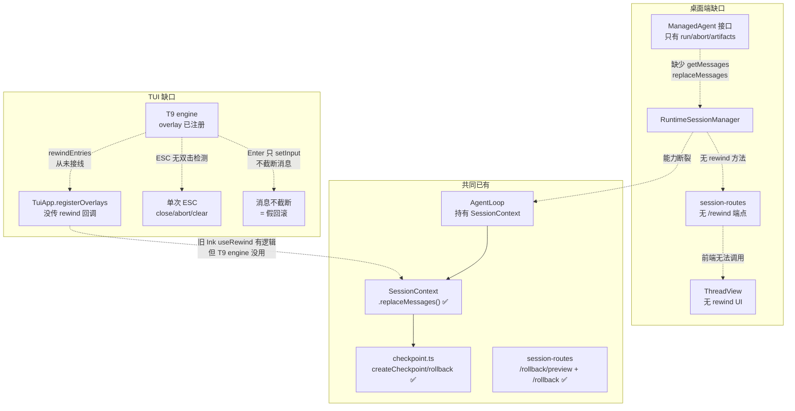

# 桌面端 + TUI Rewind 回滚功能设计

## 1. 问题描述

**两个前端都缺 rewind**：

- **桌面端**：完全无 rewind 能力——没有 UI、没有 API 路由、没有前端组件
- **TUI T9 engine**：有骨架没接线——overlay 渲染器注册了、导航 ↑↓Enter 有了、`/rewind` 命令能打开，但：
  - `rewindEntries` 数据提供函数**从未接线**（只在测试中传入）
  - ESC 只做 close/abort/clear，**无双击 ESC 触发**
  - Enter 选中只 `setInput(content)`，**不截断消息数组**——消息列表回填后旧消息仍在

Claude Code 的 rewind 交互（双击 ESC → 消息列表 → 回滚）是核心体验。天枢两个前端都需要对等能力。

## 2. 根因分析



**两个断裂点**：
1. **桌面端**：`ManagedAgent` 接口太窄，缺 `getMessages/replaceMessages`
2. **TUI**：T9 engine 重写时没接 rewind 数据提供函数，也没实现双击 ESC 触发

## 3. 跨域收敛（天璇方法）

| 域 | rewind 的语义 |
|---|---|
| 数据库 MVCC | 事务看到的是快照，回滚 = 切换到旧快照，新数据不删除 |
| Git | HEAD 指针移回旧 commit，新 commit 仍在 reflog |
| 游戏存档 | load 旧存档创建新分支，旧进度不丢 |

**收敛结论：rewind 是指针移动，不是删除。** 截断后的消息仍在事件日志中——前端用 `rewind` 事件标记截断点，断线重连的客户端能看到"从这里开始回滚了"，不会丢失历史。

## 4. 反证测试表（瑶光方法）

| # | 偷懒实现 | 会红的测试 |
|---|---------|-----------|
| 1 | 只截断事件数组，不标记 rewind | 断线重连后 `getEvents(0)` 返回截断后的数组，旧消息消失 |
| 2 | `replaceMessages()` 后不重置 agent 派生状态 | `turnCount` / `filesModified` / `turnCacheHistory` 残留，下一轮 LLM 收到过期的上下文 |
| 3 | 运行中执行 rewind | `replaceMessages` 与 `run()` 的 `append` 竞态：消息数组在迭代中被修改 |
| 4 | 文件回滚不用 OwnershipGuard | 并行会话 A 的文件被会话 B 的回滚 clobber |

## 5. 能力联合（贪狼方法）

不新建系统——接通已有能力：

| 已有 | 接通方式 |
|------|---------|
| `SessionContext.replaceMessages()` (context.ts:128) | 在 `ManagedAgent` 接口暴露 |
| `AgentLoop.session` (loop.ts:158) | `ManagedAgent` 适配器已有 `agent` 引用 |
| `checkpoint.ts` createCheckpoint/rollback | 每个 user prompt 自动创建 checkpoint |
| `session-routes /rollback/preview` | rewind 时可选联动文件回滚 |
| TUI `useRewind` 逻辑 | 作为桌面端前端逻辑的参考蓝图 |

## 6. 设计方案

### 6.1 数据模型

```typescript
// 会话事件流中新增 rewind 事件
type SessionEventType = ... | 'rewind'

// rewind 事件数据
interface RewindEventData {
  messageIndex: number    // 截断到哪条 user message
  prompt: string          // 选中的 user message 原文（恢复到输入框）
  timestamp: number
}
```

### 6.2 后端改动

**ManagedAgent 接口扩展** (`session-manager.ts`):
```typescript
export interface ManagedAgent {
  run(prompt: string, callbacks: AgentCallbacks): Promise<void>
  abort(): void
  listArtifacts(): Artifact[]
  readArtifact(id: string): Promise<string | null>
  // 新增
  getMessages(): OaiMessage[]
  replaceMessages(msgs: OaiMessage[]): void
}
```

**RuntimeSessionManager 新增** (`session-manager.ts`):
```typescript
// 列出可回滚的消息（所有 user message + 索引）
listRewindPoints(sessionId: string): { index: number; content: string; timestamp: number }[]

// 执行回滚
rewind(sessionId: string, messageIndex: number, options?: { rollbackFiles?: boolean }): boolean
```

**新路由** (`session-routes.ts`):
```
GET  /sessions/:id/rewind-points    → listRewindPoints
POST /sessions/:id/rewind           → { messageIndex, rollbackFiles? }
```

**安全不变量**:
- rewind 时 session 必须处于 `idle` / `completed` / `failed` / `aborted` 状态，**不能在 `running` 中 rewind**（瑶光反证 #3）
- rewind 事件追加到事件日志（append-only），不删除旧事件（天璇收敛：指针移动不是删除）
- 若 `rollbackFiles: true`，调用已有的 `getRollbackPreview` + `rollbackToCheckpoint`，复用 OwnershipGuard（瑶光反证 #4）

### 6.3 前端改动（桌面端）

**RewindOverlay 组件** (`desktop/src/components/RewindOverlay.tsx`):
- 列出 user messages（从 `/rewind-points` 拉取）
- 每条显示时间 + 预览文本（≤60 字符）
- 选中后显示操作选择：Restore conversation / Restore code & conversation
- 确认后调用 `POST /rewind`

**双击 ESC 检测** (`desktop/src/hooks/use-double-esc.ts`):
- 监听 keydown ESC
- 300ms 内第二次 ESC → 打开 RewindOverlay
- 第一次 ESC → 如果输入框有文本则清空（保存草稿），如果为空则等待第二次

**event-reducer 扩展** (`desktop/src/state/event-reducer.ts`):
- 处理 `rewind` 事件：截断 ConvoBlock[] 到对应位置
- 不删除旧 block——标记为 `{ _rewound: true }`，折叠显示

**Runtime client 扩展** (`desktop/src/runtime/client.ts`):
```typescript
getRewindPoints(sessionId: string): Promise<RewindPoint[]>
rewind(sessionId: string, messageIndex: number, rollbackFiles?: boolean): Promise<void>
```

### 6.3b TUI 改动（T9 engine 接线）

T9 engine 已有 rewind overlay 的骨架（注册 + 导航），缺三个接线点：

**① rewindEntries 数据提供**（`app.ts` registerOverlays 调用处）：
- 调用方需传入 `rewindEntries` 回调
- 回调从 `SessionContext.getMessages()` 提取 user messages
- 参考旧 Ink `useRewind.getRewindEntries` 的过滤逻辑

**② 双击 ESC 触发**（`engine/app.ts:535` ESC 处理分支）：
```
当前 ESC 逻辑（idle 时）：
  if (inputLine 有文本) → 清空
  else → 无操作（当前）

改为：
  if (inputLine 有文本) → 清空（保存草稿）
  else if (300ms 内第二次 ESC) → activateOverlay('rewind')
  else → 记录第一次 ESC 时间戳，等待第二次
```

**③ Enter 选中后截断消息**（`engine/app.ts:868-875` rewind Enter 处理）：
```
当前：setInput(entry.content) — 只回填输入框，不截断

改为：调用 rewindCallback(entry) →
  1. session.replaceMessages(msgs.slice(0, entry.index))
  2. commit log 截断到对应位置
  3. setInput(entry.content)
```

需要 `registerOverlays` 新增 `rewindExec` 回调参数（类似 `paletteExec`）。

### 6.4 事实流图

```
user 双击 ESC
  → RewindOverlay 打开
  → GET /sessions/:id/rewind-points
    → RuntimeSessionManager.listRewindPoints()
      → ManagedAgent.getMessages()
        → AgentLoop.session.getMessages()  [已有]
      → 过滤 role=user, content=string
      → 返回 [{ index, content, timestamp }]

user 选中一条 + 选择操作
  → POST /sessions/:id/rewind { messageIndex, rollbackFiles }
    → RuntimeSessionManager.rewind()
      → 1. 检查 session 非 running（fail-closed）
      → 2. ManagedAgent.replaceMessages(msgs.slice(0, messageIndex))
        → AgentLoop.session.replaceMessages()  [已有]
      → 3. [可选] getRollbackPreview + rollbackToCheckpoint
      → 4. 追加 rewind 事件到事件日志
    → 前端收到 rewind SSE 事件
      → event-reducer 截断 ConvoBlock[]
      → 输入框填充选中的 prompt
```

### 6.5 条件矩阵

| session 状态 | rollbackFiles | 行为 |
|---|---|---|
| idle | false | 截断消息 + rewind 事件 |
| idle | true | 截断消息 + 文件回滚 + rewind 事件 |
| running | * | **409 拒绝** — 必须 abort 后 rewind |
| completed | false | 截断消息 + rewind 事件 |
| completed | true | 截断消息 + 文件回滚 + rewind 事件 |
| aborted | false | 截断消息 + rewind 事件 |
| aborted | true | 截断消息 + 文件回滚（若 preview 有内容） |

## 7. Scope Check

### 后端共享（桌面端依赖，TUI 也受益）
| 文件 | 改动类型 | 层 |
|------|---------|---|
| `src/server/session-manager.ts` | 扩展 ManagedAgent + 新 rewind 方法 | agent/server |
| `src/server/session-routes.ts` | 新 2 条路由 | server |
| `src/server/serve.ts` | ManagedAgent 适配器加 getMessages/replaceMessages | server |

### TUI 接线
| 文件 | 改动类型 | 缺口 |
|------|---------|---|
| `src/tui/engine/app.ts` | ESC 双击检测 + rewind Enter 截断 + registerOverlays 加 rewindExec | 双击 ESC、Enter 不截断 |
| `src/tui/engine/app.ts` | rewindEntries 数据提供回调签名 | 数据未接 |
| `src/tui/engine/slash-router.ts` | `/rewind` 已存在 ✅ 无需改 | — |
| `src/tui/engine/__tests__/overlay-nav.test.ts` | 新增 rewind 测试 | — |

### 桌面端新建
| 文件 | 改动类型 | 层 |
|------|---------|---|
| `desktop/src/components/RewindOverlay.tsx` | **新建** | desktop 前端 |
| `desktop/src/hooks/use-double-esc.ts` | **新建** | desktop 前端 |
| `desktop/src/state/event-reducer.ts` | 处理 rewind 事件 | desktop 前端 |
| `desktop/src/runtime/client.ts` | 新 2 个 API 调用 | desktop 前端 |
| `desktop/src/surfaces/ThreadView.tsx` | 接入 RewindOverlay | desktop 前端 |
| `desktop/src/state/queries.ts` | rewind mutation | desktop 前端 |

**不碰**: `src/agent/loop.ts`、`src/agent/context.ts`、`src/agent/checkpoint.ts`（全部已有能力，只读引用）

## 8. 验证计划

### 后端测试（`src/server/__tests__/`）
1. **rewind-points 列表正确**：3 轮对话后，返回 3 条 user message 条目
2. **rewind 截断消息**：rewind 到 index=2 后，`getMessages()` 长度正确
3. **rewind 在 running 中被拒**：mock session 为 running，rewind 返回 false/409
4. **rewind 事件追加到日志**：rewind 后 `getEvents(0)` 包含 type=rewind 事件
5. **rewind + rollbackFiles**：mock checkpoint，验证 `rollbackToCheckpoint` 被调用
6. **反证 #2**：rewind 后检查 agent 的 turnCount / filesModified 已重置

### TUI 测试（`src/tui/engine/__tests__/`）
7. **双击 ESC 打开 rewind overlay**：模拟 idle 空输入 + 两次 ESC keydown
8. **单次 ESC 不打开**：单次 ESC 只清空输入框，不开 overlay
9. **Enter 选中截断消息**：mock rewindExec 回调，验证 replaceMessages 被调用
10. **ESC 间隔 >300ms 不触发**：两次 ESC 间隔超阈值，不打开 overlay

### 桌面端测试（`desktop/src/`）
11. **双击 ESC 打开 overlay**：模拟两次 ESC keydown
12. **rewind 事件处理**：event-reducer 收到 rewind 事件后正确截断

### 交付门
- `npm run typecheck` (desktop) 绿
- `npm run build` (desktop) 绿
- `npm exec -- tsx --test src/server/__tests__/rewind*.test.ts` 绿
- `npx tsc --noEmit` (主项目) 绿

## 9. 风险与缓解

| 风险 | 缓解 |
|------|------|
| `replaceMessages` 后 agent 派生状态（cache history, turn count, files modified）残留 | SessionContext.replaceMessages 已重置 estimatedTokens；需检查是否重置 turnCount/filesModified |
| 持久化会话 rehydrate 后 rewind 不一致 | rewind 事件写入持久化日志，rehydrate 时 replay 到 rewind 事件自动截断 |
| 双击 ESC 与现有 ESC（abort）冲突 | ESC 第一次 → abort（如果 running）；输入框为空 + idle 时第二次 ESC → rewind |
