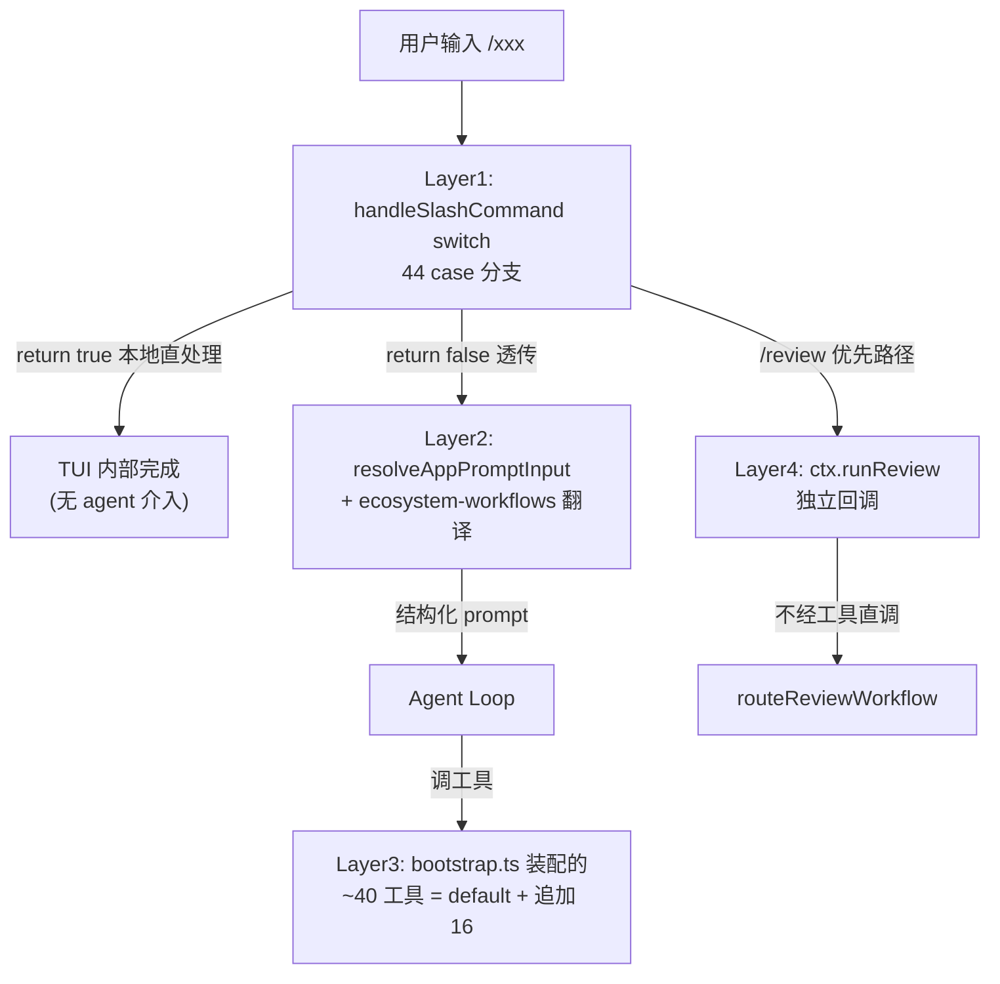
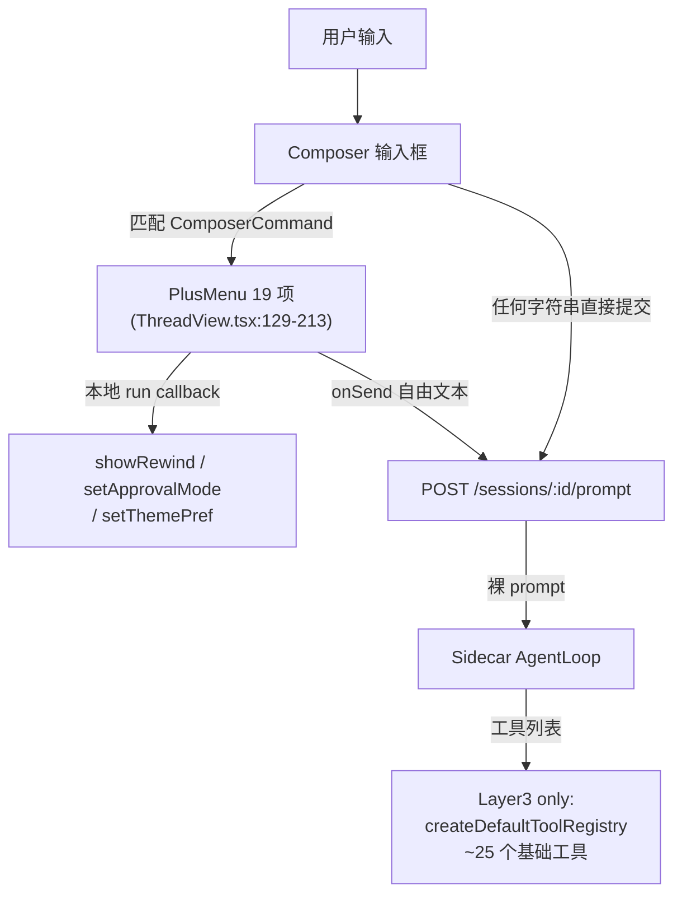
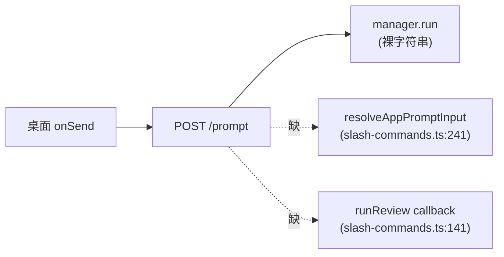

# 桌面端 TUI 工作流缺口 — 诊断报告

> 状态：ACTIVE — 2026-06-19 诊断快照 + 四轮修复 + 审查后修复
> 性质：审计文档 + 实施进度（§1-§7 为修复前历史快照，§8-§9 为本轮落地与遗留）
> 战略原则：「两边一样，但不是一定要一致——需要什么拿什么」
> 关联：同构于 `review-delivery-workflow-audit.md`，但范围扩大到全部 slash 工作流
> **更新 1（2026-06-19 14:30）** — Wave A（13 工具注册）+ Wave E（slash 翻译层）已落地。
> **更新 2（2026-06-19 15:00）** — Wave C（DelegationCoordinator 装配）已落地，所有占位工具激活；agent 工具能力与 TUI 完全等价。详情见 §8.5。
> **更新 3（2026-06-19 15:20）** — 代码审查发现 P0/P1 已修：coordinator.shutdown() 防泄漏 + SessionStores.playbookStore 死字段清理。详情见 §8.7。P2/P3 列入遗留 Wave。
> **更新 4（2026-06-19 15:30）** — Wave K 已落地：TUI switchAgentRuntime/switchAgentSession + createShutdownHandler 同步 P0 修复，coordinator 泄漏在双侧（sidecar + TUI）一致闭环。详情见 §8.8。
> **更新 5（2026-06-19 15:40）** — Wave L 已落地：sidecar runServe.close 通过 ManagedAgent.shutdown + RuntimeSessionManager.shutdownAll 对称 TUI createShutdownHandler，双侧 coordinator 生命周期管理完全一致。详情见 §8.9。

---

## 0. 一句话结论

桌面端 sidecar agent 比 TUI 主进程少了 **3 层能力**：①追加注册的 16 个工具，②`resolveAppPromptInput` 翻译层，③`SlashHandlerContext` 独立回调（如 `runReview`）。桌面 `PlusMenu` 用「写死人话 prompt」覆盖了部分 slash，但凡涉及 `deliver_task`/`team_orchestrate`/`council_convene` 等 TUI 追加工具的命令，agent 会回报「工具不存在」——这不是模型幻觉，是 sidecar 真没注册。

---

## 1. 端到端架构对比

### TUI 4 层处理链

### 桌面端 2 层处理链

**核心结构差异**：
- 桌面端 Layer2（翻译）缺失——slash 不经过 `resolveAppPromptInput`/`ecosystem-workflows`
- 桌面端 Layer4（独立回调）缺失——`/review` 没有 `runReview` 优先路径
- 桌面端 Layer3 只装基础集，TUI 追加的 16 个工具一个都没补

---

## 2. 四类缺口（精确到文件:行号）

### A. 工具缺口（16 个）

[src/server/serve.ts:176-194](src/server/serve.ts) 的 `buildSessionStores` 只调用 `createDefaultToolRegistry`，不补 [src/bootstrap.ts](src/bootstrap.ts) 追加的工具。

| 工具名 | TUI 注册位置 | sidecar | 触发场景 / 用户感知 |
|--------|:-:|:-:|------|
| `deliver_task` | `bootstrap.ts:476` | 缺 | `/review`, `/review max`, 任何主动交付门检查 |
| `delegate_task` | `bootstrap.ts:340` | 缺 | 任意子代理委派 |
| `delegate_batch` | `bootstrap.ts:355` | 缺 | 并行委派 |
| `team_orchestrate` | `bootstrap.ts:367` | 缺 | `/team`, `/team max` 多 agent 编排 |
| `council_convene` | `bootstrap.ts:414` | 缺 | `/council` 多星议事会 |
| `recall_capsule` | `bootstrap.ts:425` | 缺 | 跨会话能力胶囊取用 |
| `ask_user_question` | `bootstrap.ts:428` | 缺 | agent 主动澄清问 |
| `repo_graph` | `bootstrap.ts:431` | 缺 | meridian 代码图查询 |
| `semantic_search` | `bootstrap.ts:433` | 缺 | 语义代码搜索 |
| `web_search` | `bootstrap.ts:437` | 缺 | 联网搜索 |
| `plan_task` | `bootstrap.ts:438` | 缺 | LLM 驱动步骤生产 |
| `undo` | `bootstrap.ts:352` | 缺 | `/undo` 文件改动撤销 |
| `recall` | `bootstrap.ts:1198` | 缺 | 项目记忆查询 |
| `remember` | `bootstrap.ts:1202` | 缺 | 项目记忆写入 |
| `goto_definition` / `find_references` | `bootstrap.ts:801-802` 条件 | 缺 | LSP 符号跳转 |
| MCP tools | `bootstrap.ts:765` 按需 | 缺 | 第三方 MCP 集成 |

### B. Slash 命令缺口

桌面 `PlusMenu` ([desktop/src/surfaces/ThreadView.tsx:129-213](desktop/src/surfaces/ThreadView.tsx)) 共 19 项 ComposerCommand。TUI [src/tui/slash-commands.ts](src/tui/slash-commands.ts) `handleSlashCommand` 共 44 个 case 分支（含若干 alias 与 fallthrough）。差集分三类：

**B1. 需要 agent 工具配合，桌面 PlusMenu 完全缺失**

- `/council <任务>` — `slash-commands.ts:355`，依赖 `council_convene` 工具
- `/write-plan <feature>` — `slash-commands.ts:1180-1181`，依赖 ecosystem-workflow 翻译
- `/plan close <file>` / `/plan-close` — 同上，依赖 `plan_close` 工具（sidecar 默认有）
- `/skill list|<name>|review|approve|reject` — `slash-commands.ts:1191`
- `/index` — `slash-commands.ts:1322`，重建 codebase 索引
- `/diagram [type]` — `slash-commands.ts:1381`，mermaid 模板
- `/leave [symbol] 
` — `slash-commands.ts:1037`，星图离开仪式
- `/interview` — 桌面有但 onSend 写死人话，**未走 ecosystem 翻译**

**B2. 本地状态/诊断类，桌面有 UI 替代但无 slash**

| 命令 | TUI 位置 | 桌面替代 |
|------|---------|---------|
| `/help` | `:270` | 无 cheatsheet |
| `/status` | `:275` | SettingsSurface 部分覆盖 |
| `/exit` `/quit` | `:293-294` | window close |
| `/compact status` `/compact llm` | `:300` 子命令 | 只有通用 `/compact` 自由文本 |
| `/model list` `/model <name>` | `:419` | PlusMenu / SettingsSurface |
| `/domain list|<name>|auto|off` | `:457` | PlusMenu star domain |
| `/verbose` `/auto` | `:503` `:511` | AutonomyControl |
| `/effort [off\|low\|medium\|high\|max]` | `:1156` | 无 |
| `/undo [num\|preview]` | `:1074` | RewindOverlay（部分） |
| `/sessions` `/resume <num>` | `:673` `:683` | ProjectSidebar |
| `/mcp` | `:947` | SettingsSurface |
| `/cockpit [panel]` | `:1126` | 桌面无对应（多面板已是常态） |
| `/scroll` | `:1149` | 滚动条 |

**B3. 多子命令复杂入口，桌面简化为单条自由文本**

| 命令 | TUI 子命令 | 桌面降级版 |
|------|-----------|-----------|
| `/context` | `pin\|claims\|antibodies\|conflicts\|reload\|export\|import` (`:749`) | 只有"显示 context 状态" |
| `/constellation` | `view\|init\|update\|history\|shift` (`:961`) | 只有"显示星图" |
| `/plan-mode` `/plan-list` `/plan-approve` `/plan-reject` | `:520-600` | PlanPanel + togglePlan（部分） |
| `/debug` | `prompt\|fingerprint\|cache\|context-payload\|mcp` (`:620`) | 只有 `/debug cache` |

### C. 路由层缺口

[src/server/session-routes.ts:299-326](src/server/session-routes.ts) 的 `POST /sessions/:id/prompt` 把 prompt 直送 `manager.run`，跳过两个翻译层：

**后果**：

1. **Ecosystem 翻译丢失**：[src/workflows/ecosystem-workflows.ts:391](src/workflows/ecosystem-workflows.ts) `resolveEcosystemWorkflowInput` 能识别的 5 个命令集（`WRITING_PLAN_COMMANDS={/plan, /write-plan}` :38、`PLAN_CLOSE_COMMANDS={/plan-close}` :39、`TEAM_COMMANDS={/team}` :40、`COUNCIL_COMMANDS={/council}` :41）—— 桌面端绕过它们，发给 agent 的是 ThreadView.tsx 里写死的简短人话，丢失参数解析、focus 提取、buildTeamWorkflowPrompt/buildCouncilWorkflowPrompt 等工程化模板。
2. **Review 独立路径降级**：TUI `/review` 优先走 `ctx.runReview` → `routeReviewWorkflow`（不经 `deliver_task`），桌面只能走 `deliver_task` 老路径——即使 `deliver_task` 工具补齐了，行为也绑死 commit=true、过交付门、审查输出被淹没。

### D. SlashHandlerContext 独立回调缺口

[src/tui/slash-commands.ts:98-160](src/tui/slash-commands.ts) 的 `SlashHandlerContext` 接口共 6 类回调能力，desktop 无对应：

| 能力 | TUI 入口 | 桌面替代 |
|------|---------|---------|
| `ctx.runReview` 直调 routeReviewWorkflow | `/review` | 无——只能通过 deliver_task 间接 |
| `ctx.agent.enterPlanMode/setActivePlan` | `/plan-mode` `/plan-approve` | PlanPanel + togglePlan（部分） |
| `ctx.agent.getDebugInfo` (prompt/fingerprint/cache) | `/debug` | 无 |
| `ctx.persist.compactOai` 显式压缩 | `/compact` | 只能发自由文本请求 agent |
| `ctx.session.getContextLedger` 展示 | `/context` | 无 |
| `ctx.agent.cwd + dirty files → ChangeSet` 构造 | `/review` 内部 (`:382`) | 无 |

---

## 3. 影响分级

按「用户能感知到的破损程度」排序：

| # | 缺口 | 用户表现 | 修复成本 | 依赖项 |
|---|------|---------|---------|-------|
| 1 | `/review` `/review max` 工具不存在 | agent 回「我没有 deliver_task 工具」 | 中 | TaskLedger + OwnershipLedger + DeliveryGateV2 |
| 2 | `/team` 工具不存在 | agent 回「我没有 team_orchestrate」 | 中 | DelegationCoordinator |
| 3 | `/council` 工具+菜单都缺 | 用户找不到入口 | 中 | DelegationCoordinator + telemetry |
| 4 | `delegate_task/batch` 缺 | 复杂任务无法委派子代理 | 中 | DelegationCoordinator |
| 5 | `recall/remember/recall_capsule` 缺 | agent 无法主动用项目记忆 | 低 | claimStore (sidecar 已有) |
| 6 | `ask_user_question` 缺 | agent 想问澄清问题时无法发 | 低 | 无（注册即用） |
| 7 | `web_search` `semantic_search` `repo_graph` 缺 | agent 探索能力受限 | 低 | meridianIndexer（按需） |
| 8 | `undo` 工具 + `/undo` 菜单缺 | 无法撤销文件改动 | 低 | fileHistory (sidecar 已有) |
| 9 | LSP 工具缺 | 无符号跳转 | 中 | LSP server 进程 |
| 10 | MCP 工具集成缺 | 第三方 MCP 全失效 | 中 | MCP manager 装配 |
| 11 | `resolveAppPromptInput` 不接 | slash 翻译质量降级 | 低 | 一行函数调用接入 |
| 12 | `runReview` callback 不接 | 无 review 独立路径 | 中 | reviewDeps 装配 |

---

## 4. 决策框架（「需要什么拿什么」如何落地）

每个未来补齐决策应满足三个判定：

| 维度 | 关键问题 |
|------|---------|
| **触发条件** | 什么场景下用户会真的撞到这个缺口？是高频日常 / 关键交付节点 / 边缘探索？|
| **修复入口** | 改哪个文件、改多少行、是否影响 server 启动路径 / 装配顺序？|
| **依赖项** | 补这个需要先有什么？（如 `deliver_task` 依赖 4 个 store；`team_orchestrate` 依赖 `Coordinator`）|

### 修复入口速查（按工具）

| 工具 | 修改点 | 同源参考 |
|------|--------|---------|
| `deliver_task` | `serve.ts:buildSessionStores` 后追加，并构造 `TaskLedger`/`OwnershipLedger`/`DeliveryGateV2`/`getDepthLayer` | `bootstrap.ts:444-512` 整段装配链 |
| `delegate_task` / `delegate_batch` / `team_orchestrate` / `council_convene` | 需要 `DelegationCoordinator` 已存在；目前 sidecar 不构造 | `bootstrap.ts:339-423` |
| `ask_user_question` | 直接 `reg.register(ASK_USER_QUESTION_TOOL)`，无依赖 | `bootstrap.ts:428` 一行 |
| `web_search` / `semantic_search` | 直接 `reg.register(WEB_SEARCH_TOOL)` / `SEMANTIC_SEARCH_TOOL` | `bootstrap.ts:433, 437` |
| `recall_capsule` | `reg.register(createRecallCapsuleTool(() => cwd))` | `bootstrap.ts:425` |
| `recall` / `remember` | 依赖 sidecar 已构造的 `claimStore` | `bootstrap.ts:1198-1206` |
| `undo` | 依赖 sidecar 已构造的 `fileHistory` | `bootstrap.ts:352` |
| `repo_graph` | 依赖 `refs.meridianIndexer`（sidecar 默认不启动） | `bootstrap.ts:431` |
| `plan_task` | 依赖 `Coordinator` | `bootstrap.ts:438-440` |
| LSP 工具 | 依赖 lspManager 子进程 | `bootstrap.ts:798-803` |
| MCP 工具 | 依赖 `mcpManager` 装配 | `bootstrap.ts:764-766` |

### 路由层修复入口

- **接 `resolveAppPromptInput`**：在 `prompt-route.ts` 或 `session-manager.ts:run()` 入口加一行 `const resolved = resolveAppPromptInput(prompt, cwd); if (resolved !== null) prompt = resolved`。要点：sidecar 路径需考虑 `null` 返回（unknown slash）该 4xx 还是透传——TUI 是 reject + 错误提示。
- **接 `runReview`**：需要 sidecar 构造 `DelegationCoordinator` + `createCoordinatorReviewDeps(coordinator, {...})`；然后挂到 server prompt 路由的预处理（或新建独立 `/review` 端点）。

---

## 5. 现有方案盘存

| 文档 | 状态 | 与本诊断的关系 |
|------|:-:|------|
| [.rivet/plans/桌面端-review-review-max-手动审查触发.md](.rivet/plans/桌面端-review-review-max-手动审查触发.md) | ACTIVE（UI 部分已落地） | 已在 `ThreadView.tsx:134-143` 加 `/review` `/review max`，但**未解决 §2.A 的工具缺口**——方案空间漏检 server toolRegistry 层，导致命令实际无法工作 |
| [.rivet/plans/review-delivery-workflow-audit.md](.rivet/plans/review-delivery-workflow-audit.md) | ARCHIVED 2026-06-19 | TUI 端 review 工作流现状审计（Wave 1+2 已落地） |
| [.rivet/plans/review-delivery-workflow-revised.md](.rivet/plans/review-delivery-workflow-revised.md) | ARCHIVED 2026-06-19 | TUI 端 review 三波解耦方案（已实施） |

**关键观察**：现有方案均聚焦 TUI 端或桌面 UI 层，**没有一份覆盖 sidecar agent 工具注册缺口**。本诊断填补此空白。

---

## 6. 已确认的代码事实验证表

所有断言已在 2026-06-19 当下复核：

| 断言 | 文件:行号 | 已验证 |
|------|----------|--------|
| sidecar `toolRegistry` 只用 `createDefaultToolRegistry`，零追加 | `src/server/serve.ts:176, 183-186` | 是 |
| TUI 追加 16 个工具的精确注册行号 | `src/bootstrap.ts:340, 352, 355, 367, 414, 425, 428, 431, 433, 437, 438, 476, 801-802, 1198, 1202` | 是（grep 命中数与本表一致） |
| `POST /sessions/:id/prompt` 不调翻译 | `src/server/session-routes.ts:299-326` | 是 |
| 桌面 commands 实际 19 项 | `desktop/src/surfaces/ThreadView.tsx:129-213` | 是（grep `name: '/'` 19 行） |
| TUI `handleSlashCommand` 44 个 case 分支 | `src/tui/slash-commands.ts:269-1418`（含若干 alias） | 是 |
| `runReview` 在 SlashHandlerContext 是 optional callback | `src/tui/slash-commands.ts:141` | 是 |
| `resolveAppPromptInput` 是 TUI 翻译入口 | `src/tui/slash-commands.ts:241` | 是 |
| ecosystem 翻译命令集 5 个：`/plan`/`/write-plan`/`/plan-close`/`/team`/`/council` | `src/workflows/ecosystem-workflows.ts:38-41` | 是 |

---

## 7. 待确认问题（留给未来）

1. **战略层**：桌面端 sidecar 是否应该构造 `DelegationCoordinator`？这是 §2.A 中 6 个工具（`deliver_task`、`delegate_task/batch`、`team_orchestrate`、`council_convene`、`plan_task`）的共同前置依赖。
2. **路由层**：`resolveAppPromptInput` 接到 server 时，未识别的 slash 应该 4xx 拒绝、提示错误、还是透传给 agent？三种选择对应不同的用户心智模型。
3. **UI 形态**：桌面端是否应该把 `council`/`team` 这种多 agent 能力做成专门的 surface（CouncilPanel/TeamPanel），而不是 agent 工具调用？这会让能力在 UI 层显式可见而不是埋在 onSend 文本里。
4. **测试覆盖**：当前 sidecar 是否有针对工具集差异的回归测试？如果补工具后破坏了 desktop 已有行为，能否被自动捕获？
5. **MCP / LSP**：sidecar 是否需要独立的 MCP manager 和 LSP 装配？还是复用 TUI 进程的（架构上不可行——它们是独立进程）？

---

## 关键文件索引

| 文件 | 角色 |
|------|------|
| [src/server/serve.ts](src/server/serve.ts) | sidecar 装配入口，`buildSessionStores` 决定工具集 |
| [src/server/session-routes.ts](src/server/session-routes.ts) | `/sessions/:id/prompt` 路由，prompt 翻译应在此预处理 |
| [src/server/session-manager.ts](src/server/session-manager.ts) | `ManagedAgent.run` 接收裸 prompt |
| [src/bootstrap.ts](src/bootstrap.ts) | TUI 端工具完整装配链，sidecar 应参照移植 |
| [src/tools/default-registry.ts](src/tools/default-registry.ts) | 基础工具集定义（双方共享） |
| [src/tui/slash-commands.ts](src/tui/slash-commands.ts) | TUI slash 处理 + `SlashHandlerContext` 接口契约 |
| [src/workflows/ecosystem-workflows.ts](src/workflows/ecosystem-workflows.ts) | ecosystem 翻译实现 |
| [desktop/src/surfaces/ThreadView.tsx](desktop/src/surfaces/ThreadView.tsx) | 桌面 `PlusMenu` ComposerCommand 列表 |
| [desktop/src/lib/composer-commands.ts](desktop/src/lib/composer-commands.ts) | 桌面 slash 检测/过滤纯函数 |

---

## 不在本诊断范围内的事项

- 不评估 TUI 端 slash 命令本身的合理性（这是另一个文档的事）
- 不评估桌面端 19 项 PlusMenu 的 UX 质量
- 不预判任何补齐的优先级或时间表——这交给用户按真实需求驱动
- 不涉及 TUI 与桌面共享的底层（agent loop / runtime hooks / prompt engine）—— 那些已通过共享代码自动对齐

---

## 8. 本轮已落地（2026-06-19 update）

### 8.1 Wave A — 工具层对齐

**改动**：[src/server/serve.ts](src/server/serve.ts) `buildSessionStores` 从只调 `createDefaultToolRegistry` 改为复用 [src/bootstrap.ts](src/bootstrap.ts) 的 `createInteractiveToolRegistry`，传入 sidecar-friendly `RuntimeRefs`（coordinator/meridianIndexer/mcpManager/lspManager 暂为 null）。追加注册 `recall`/`remember`。

**结果**：§2.A 表格 16 个工具中 13 个现在已在 sidecar 注册：

| 类别 | 工具 | 状态 |
|------|------|:-:|
| 零依赖即用 | `recall_capsule` / `ask_user_question` / `semantic_search` / `web_search` / `undo` / `recall` / `remember` | 注册即可用 |
| null-safe 降级 | `repo_graph` | 注册，无 indexer 时返回友好错误 |
| **deliver_task** + B1 装配链 | `deliver_task` (TaskLedger/OwnershipLedger/SnapshotManager/Attribution/Gate 完整) | commit/gate 段可用；审查段抛 coordinator not init，由 fail-open 包住不阻塞 commit |
| coordinator 依赖（已注册但运行时报错） | `delegate_task` / `delegate_batch` / `team_orchestrate` / `council_convene` / `plan_task` | 已注册：模型看得到工具存在；调用时抛 `DelegationCoordinator not initialized`——比"工具不存在"对模型友好 |
| 进程依赖（仍缺） | LSP `goto_definition`/`find_references` · MCP tools | 仍缺（独立进程装配） |

**关键单行修复**（HEAD 已带）：[src/bootstrap.ts](src/bootstrap.ts) L443 用 `refs.sessionId ?? getOrCreateSessionId()`——确保 sidecar 多 session 装配不污染全局 `_cachedSessionId`。

### 8.2 Wave E — 路由层接入

**改动**：[src/server/session-routes.ts](src/server/session-routes.ts) `POST /sessions/:id/prompt` 处理器在调 `manager.run()` 前调用 `resolveAppPromptInput(prompt, cwd)`：

- 非 slash 输入 → 原样透传
- `/team` / `/council` / `/plan` / `/write-plan` / `/plan-close` / `/review [max]` → ecosystem-workflow 翻译为结构化 prompt（与 TUI 等价）
- 自定义命令 `.rivet/commands/<name>.md` → `$ARGUMENTS` 插值翻译
- 未识别 slash → 4xx 友好提示（修复 §6 观测 1 的"消息凭空丢失"问题）

`SessionRecord.cwd` 提供 cwd（已存在），无需新增 store。

### 8.3 验证

- `tsc --noEmit` pass
- 476 个相关测试全绿（server 269 + tui slash/ecosystem 76 + agent core 95 + e2e 36）
- 0 回归（2 个 baseline failure 与本轮改动无关：`undo.test.ts:54` / `delegate-task.test.ts:96`）

### 8.4 桌面端用户感知变化（首轮 Wave A+E 后）

| 操作 | 修复前 | Wave A+E 后 |
|------|--------|--------|
| 点 `/review max` | agent 回"我没有 deliver_task 工具" | 调 deliver_task → 跑 ledger → commit；审查段抛 coordinator not init（infra failure，不阻塞 commit） |
| 输入 `/team 任务` | 模型把 `/team` 当奇怪文本 | 路由翻译为 `team_orchestrate` 工具调用 prompt → 调用时抛 coordinator not init（缺口明确标识） |
| 输入 `/plan 设计 X` | 模型收到字面 `/plan ...` | 自动翻译为 writing-plans workflow prompt（与 TUI 完全等价） |
| 输入 `/xxx`（不认识） | 字面发给 agent | 4xx 友好错误 `Unknown slash command: "/xxx"` |

### 8.5 Wave C — DelegationCoordinator 装配（已落地）

**改动**：[src/server/serve.ts](src/server/serve.ts) `assembleAgentLoop` 从手写 `new AgentLoop({...})` 改为直接调用 [src/bootstrap.ts](src/bootstrap.ts) 的 `createAgentRuntime`，与 TUI 共享同一份装配链。零代码重复（方案 F：复用 vs 复制中选了复用）。

**链路**：
1. `buildSessionStores` 把 `refs: RuntimeRefs` 加入 SessionStores 返回值
2. `assembleAgentLoop` 调用 `createAgentRuntime({ provider, apiKey, auth, config, sessionId, cwd, toolRegistry, persist, claimStore, fileHistory, refs, domainKnowledgeStore, modelId, session })`
3. `createAgentRuntime` 内部装配 modelCards / workerRouting / providerHealth / runtimeFactory / bandit gates / DelegationCoordinator，**填到 refs.coordinator**
4. Wave A 已注册的 5 个 coordinator 依赖工具（delegate_task / delegate_batch / team_orchestrate / council_convene / plan_task）通过闭包读到 `refs.coordinator`，**激活**
5. `deliver_task` 的 reviewDeps 同理激活——L2/L3 审查 worker 能真正 spawn
6. `approvalMode` 在 agent 构造后调 `agent.setApprovalMode(mode)`（与初始化时设等价：内部 `this.config.approvalMode = mode`）
7. `domainKnowledgeStore` 每个 session 独立 new（与 bootstrap 单 session 行为一致；同 cwd 共享磁盘 `.rivet/knowledge/`）

**清理**：移除 sidecar 不再使用的 `createAgentConfig` / `createMainAgentConfigInput` import（这些逻辑现在由 `createAgentRuntime` 内部承担）。

**用户感知变化**：

| 操作 | Wave A+E 后 | Wave C 后 |
|------|--------|--------|
| `/review max` | commit 完成，审查段抛 coordinator not init | **完整 L3 Review Squadron 5 inspectors spawn 跑通**（与 TUI 行为完全等价） |
| `/team xxx` | 翻译后 agent 调 team_orchestrate，抛 coordinator not init | **多 agent wave 编排正常执行** |
| `/council xxx` | 翻译后 agent 调 council_convene，抛 coordinator not init | **多星议事会完整跑通**（含两轮辩论、冲突收敛） |
| `delegate_task` / `delegate_batch` / `plan_task` 自然语言触发 | 抛错 | **正常委派子代理执行** |

### 8.6 Wave C 验证

- `tsc --noEmit` pass
- 524 tests 全绿：server 269 + coordinator/team/council 157 + agent core (deliver-task/review-router/bootstrap/delegate) 98
- 0 回归（2 个 baseline failure 仍与本轮无关）

### 8.7 代码审查后修复（Wave C-followup, 2026-06-19 15:20）

Wave C 落地后做了一轮代码审查（见原始审查报告归档），发现并修复两个问题：

#### P0 — switchModel 下 DelegationCoordinator 泄漏（已修）

**问题**：`createAgentRuntime` 每次调用都 `new DelegationCoordinator` 写入 `refs.coordinator`。sidecar `switchModel` 重建 agent 时旧 coordinator 被覆盖但无人清理——它的 stallSweep `setInterval` 还在跑（`.unref()` 防止阻塞退出但仍占资源），在途 worker 的 `orderControllers` AbortController 仍持有句柄。**长驻 sidecar + 频繁 switchModel 放大此泄漏**。

**修复**：
1. [src/agent/coordinator.ts](src/agent/coordinator.ts) 新增 public `shutdown()` 方法：clearInterval(stallSweep) + abort 所有 orderControllers + 清空 maps（orderControllers / activityUpstream / backgroundRuns / backgroundPromises）。mailbox/circuitBreaker/collaboration 不持有 timer/进程资源，无需清理。
2. [src/server/serve.ts](src/server/serve.ts) `buildManagedAgent.switchModel` 在 capture `oldCoordinator = stores.refs.coordinator`，装新后调 `oldCoordinator.shutdown()`（同一身份判等防御，避免装配失败时误清新 coordinator）。

**TUI 同源问题**：bootstrap 的 `switchAgentRuntime` 有相同模式，但 TUI 是单 session 进程、switch 频率极低，影响有限。本轮先修 sidecar 路径；TUI 路径同步修需 bootstrap.ts 修改，待 Wave K 评估（见 §9.5）。

#### P1 — SessionStores.playbookStore 死字段（已修）

**问题**：Wave A 时 sidecar `buildSessionStores` 创建 `playbookStore` 放入 SessionStores，但 Wave C 切到 `createAgentRuntime` 后该字段无消费者——`createAgentRuntime` 内部 `new PlaybookStore(cwd)` 自管（[src/bootstrap.ts](src/bootstrap.ts):726）。sidecar 那份是浪费内存 + 误导维护者。

**修复**：
1. SessionStores 接口删除 `playbookStore` 字段
2. buildSessionStores 不再 `new PlaybookStore(cwd)`
3. 移除 `import { PlaybookStore }`（serve.ts 不再直接引用）
4. 在 SessionStores 接口下方加注释，说明 createAgentRuntime 内部自管 + Wave 历史成因

#### P0+P1 验证

- `tsc --noEmit` pass
- coordinator 55 + server 269 全绿；0 回归

#### 未在本次修的审查项

- **P2 ProviderHealthTracker switchModel 重置** — 跨 TUI/sidecar 重构，列入 Wave J（§9.5）扩充说明
- **P3 sameCwdRunningSessions 硬编码** — 早在 Wave F（§9.1）列出，本次审查再次确认严重性（多 session 冲突检测失效），不改变优先级

### 8.8 Wave K — TUI 路径同步 P0 修复（2026-06-19 15:30）

**问题**：Wave C-followup 只修了 sidecar `switchModel` 的 coordinator 泄漏。审查报告 §9.6 同时指出 TUI bootstrap 的 `switchAgentRuntime` / `switchAgentSession` 路径有同源问题——TUI 单 session 频率低，长会话 + 频繁模型切换场景仍可能积累。本 Wave 一致修复。

**改动**：

1. [src/bootstrap.ts](src/bootstrap.ts) `switchAgentRuntime` (~L933) — 在调 `createAgentRuntime` 前 capture `oldCoordinator = ctx.refs.coordinator`，装新后调 `oldCoordinator.shutdown()`（同一身份判等防御，避免装配未实际替换时误清）。
2. [src/bootstrap.ts](src/bootstrap.ts) `switchAgentSession` (~L1018) — 同模式：会话身份切换也整体重建 AgentLoop（含 coordinator），需同步关旧。
3. [src/bootstrap.ts](src/bootstrap.ts) `createShutdownHandler` (~L879) — 在 `lspManager.dispose()` / `mcpManager.shutdown()` 之后追加 `ctx.refs.coordinator?.shutdown()`。进程退出时 OS 会回收，但显式 shutdown 让语义清晰，并对齐 sidecar；同时让 unit test 退出更干净（不依赖 process 真退出来释放 unref 的 timer）。

**双侧一致性**：

| 路径 | 触发点 | coordinator 旧→新切换 | 已修 |
|------|--------|----------------------|:-:|
| sidecar | `buildManagedAgent.switchModel` | capture old → assembleAgentLoop → old.shutdown | Wave C-followup (§8.7) |
| TUI | `switchAgentRuntime` (模型切换) | capture old → createAgentRuntime → old.shutdown | Wave K |
| TUI | `switchAgentSession` (会话恢复) | capture old → createAgentRuntime → old.shutdown | Wave K |
| TUI | `createShutdownHandler` (进程退出) | 直接 coordinator.shutdown | Wave K |
| sidecar | 进程退出 (`runServe.close`) | `sessions.shutdownAll()` → 遍历调 `agent.shutdown()` → `coordinator.shutdown()` | Wave L (§8.9) |

**Wave K 验证**：

- `tsc --noEmit` pass
- bootstrap 1 + coordinator 5 = 6 个 test 文件、57 tests 全绿
- cron-lock 两个并发测试在大批量并跑时偶发 flake——单独跑全过，与本 Wave 无关（已通过 stash 后 baseline 复现的 flake 模式确认）

### 8.9 Wave L — sidecar 进程退出对齐 TUI shutdown（2026-06-19 15:40）

**问题**：Wave K 在 TUI `createShutdownHandler` 加了显式 `coordinator?.shutdown()`，但 sidecar `runServe.close` 只走 `sessions.abortAll()` → 链式 `agent.abort()`，没有显式 coordinator.shutdown——双侧不对称。审查报告 §9.6 标 Wave L 候选。

**改动**：

1. [src/server/session-manager.ts](src/server/session-manager.ts) `ManagedAgent` 接口加 optional `shutdown?(): void`——与 abort() 严格分离（abort 中止当前 turn 但保留 agent 可继续运行，shutdown 是终结性操作）。
2. [src/server/session-manager.ts](src/server/session-manager.ts) `RuntimeSessionManager` 加 `shutdownAll()` 方法——遍历所有 session 调 `agent?.shutdown?.()`（agent 在 rehydrated/idle session 上为 null，需短路保护；best-effort 隔离 catch）。
3. [src/server/serve.ts](src/server/serve.ts) `buildManagedAgent` 返回值实现 `shutdown: () => stores.refs.coordinator?.shutdown()`。
4. [src/server/serve.ts](src/server/serve.ts) `runServe.close` 在 `sessions.abortAll()` 之后追加 `sessions.shutdownAll()`。

**为什么 abort/shutdown 分离不能合并**：

`abortAll()` 有两个调用点（[serve.ts:486 `/abort` 端点 + serve.ts:572 close]）：
- `/abort` 端点：用户中止当前 turn，session 仍要保留可运行；**绝不能** shutdown coordinator
- `close`：进程退出，**必须** shutdown 释放所有 timer/handle

合并语义就破坏 `/abort` 端点的契约。Wave L 保持 abortAll 行为不变，加独立 shutdownAll。

**双侧最终一致性**：见 §8.8 表（已更新 sidecar 进程退出行为为"`sessions.shutdownAll()` → 遍历调 `agent.shutdown()` → `coordinator.shutdown()`"）。

**Wave L 验证**：

- `tsc --noEmit` pass（修过一次 `s.agent?.shutdown?.()` 短路保护——agent 在 rehydrated session 上为 null）
- session-manager 28 + session-routes 31 + server 8 + session-rehydrate 9 + coordinator 50 + bootstrap 19 = 145 tests 全绿

---

## 9. 遗留与后续 Wave

### 9.1 Wave F — sidecar 多 session 元数据校正（中优先级）

`createInteractiveToolRegistry` 内部装配 `verificationSnapshotManager` 时硬编码 `sameCwdRunningSessions: () => 0`（[src/bootstrap.ts](src/bootstrap.ts):465）——这是 TUI 单 session 假设。sidecar 多 session 下应该用 `manager.sameCwdRunningCount(cwd, excludeSessionId)`（[src/server/session-manager.ts](src/server/session-manager.ts):465 已有此 API）。

**影响**：错估只影响 VSW worktree 隔离决策——目前 default off，影响面有限。但补齐后多 session 并发开发更稳。

**做法选项**：
- A：给 `createInteractiveToolRegistry` 加一个可选的 `sameCwdRunningSessions` 入参，sidecar 传入真实 getter
- B：在 refs 新增字段，bootstrap 内部读取

倾向 A——更显式。

### 9.2 Wave G — MeridianIndexer / MCP / LSP 装配（中优先级）

这三个都是 **进程级独立子系统**，sidecar 自己装配会带来：
- meridianIndexer：消耗内存（含 SQLite + tree-sitter）+ 启动延迟；好处是 `repo_graph` / `semantic_search` 高效，且 council/team 遥测有持久化 store
- MCP manager：sidecar 自己跑 MCP 子进程；好处是第三方工具集成（filesystem / git / playwright / ...）
- LSP manager：sidecar 自己跑 LSP 子进程；好处是 goto_definition / find_references

**决策点**：sidecar 是否应该成为"完整 IDE 伴侣"（拉起所有子系统）还是保持"轻量进程"（只跑 agent loop）？这是产品方向决策，不仅是工程问题。建议先用真实需求驱动——若用户在桌面端真的撞到 `repo_graph 无 indexer` 或 `MCP 不可用`，再启动这个 Wave。

### 9.3 Wave H — SlashHandlerContext 独立回调能力（低优先级）

§2.D 列的 6 类 callback 能力（runReview / enterPlanMode / getDebugInfo / compactOai / getContextLedger / ChangeSet 构造）目前桌面端无对应入口。但：

- `runReview` — Wave E 后桌面 slash `/review max` 会走 deliver_task 工具路径，virtuallly 等价（虽然不是独立路径）。要不要真做独立路径取决于审查输出是否需要从 deliver_task 解耦。
- `enterPlanMode` / `setActivePlan` — 桌面已有 PlanPanel + togglePlan 替代。
- `getDebugInfo` / `compactOai` / `getContextLedger` — 都是 debug/诊断 surface。建议作为 SettingsSurface 的子页扩展，而不是 slash 命令。
- `ChangeSet 构造` — Wave E 后由 deliver_task 内部承担。

**结论**：这 6 类大部分有桌面 UI 替代，无需 1:1 对应。低优先级。

### 9.4 Wave I — Slash 命令 PlusMenu 补全（按需）

§2.B 列的 22+ slash 命令缺口，多数有桌面 UI 替代（B2 类）或可通过 Wave E 翻译层降级（B1 类）。真正需要 PlusMenu 入口的：

- `/council`（高频，但需要 Wave C 工具支持）
- `/write-plan`（与 `/plan` 区分明显时）
- `/skill list|review|approve|reject`（创作者用户）
- `/diagram`（mermaid 模板生成）
- `/index`（codebase 索引重建）

其余如 `/help` / `/sessions` / `/cockpit` / `/scroll` 都可以等用户真正反馈缺失再补。

### 9.5 Wave J — 装配开销优化 + 状态保持（中优先级，按需）

Wave C 后每个 sidecar session 重新执行完整 `createAgentRuntime`，**switchModel 也会重建整个堆栈**，包括：
- 新 `DelegationCoordinator` + `ProviderHealthTracker` + `DomainKnowledgeStore`
- 新 `runtimeFactory` 闭包（含 PromptEngine + createProviderClient）
- bandit gates 重新 evaluate
- modelCards 重新派生

#### 9.5.1 装配开销

对单用户少 session（≤3）的桌面端基本无感知。但同 cwd 启 10+ session 或同进程长期运行多次 switchModel 时可能积累。

#### 9.5.2 ProviderHealthTracker 状态丢失（审查 P2）

**问题**：`new ProviderHealthTracker()` 每次都从零开始（[src/bootstrap.ts](src/bootstrap.ts):661 区域）。switchModel 后之前积累的 provider 健康统计全丢，coordinator 的冷层路由跳过逻辑失去依据——worker 可能被路由到已知不健康的 provider。

**TUI 同源**：同样问题，但 TUI 单 session 进程、switch 频率极低，影响有限。sidecar 长驻 + 多 session + 频繁 switchModel 放大此问题。

#### 9.5.3 其他状态丢失候选

- `DomainKnowledgeStore`：基于 cwd 磁盘存储，内存实例每次重新加载——若有大型 knowledge 文件，重复 I/O 开销
- `bandit gates` evaluation：promotionStore 一次决定 gated/shadow，但每次 switchModel 重新 evaluate（一次性开销）
- `modelCards` 派生：纯函数，重复执行无害

#### 9.5.4 优化方向

- 把 sidecar 级共享对象（`ProviderHealthTracker` / `DomainKnowledgeStore` / `banditGates evaluation`）抽到 `serve.runServe` 顶层缓存
- 让 `createAgentRuntime` 接受可选 `sharedHealthTracker` / `sharedDomainStore` 入参（默认行为不变，TUI 零影响）
- 或更激进：把 `coordinator` 也提到进程级，所有 session 共享一个（但要解决 `sessionRegistry`/`sessionId` binding）

不要在没有真实瓶颈/路由错误证据前做这件事——但 P2 的 ProviderHealthTracker 重置是已知正确性问题，**优先级从原"低"上调到"中"**。

### 9.6 风险与监控

- ~~**Wave A 注册了占位工具，模型可能在 sidecar 上尝试调用 coordinator 依赖工具**~~ — **Wave C 已解决**：coordinator 已装配，所有占位工具激活，不再抛 `DelegationCoordinator not initialized`。
- ~~**switchModel 下 DelegationCoordinator 泄漏**~~ — **Wave C-followup P0 已解决**：coordinator.shutdown() + switchModel capture old → swap → shutdown。详情见 §8.7。
- ~~**`new PlaybookStore(cwd)` 重复构造**~~ — **Wave C-followup P1 已解决**：SessionStores 接口移除 playbookStore，createAgentRuntime 内部自管。详情见 §8.7。
- **`POST /prompt` 4xx 响应**——桌面前端需要处理新增的 400 状态码（`Unknown slash command`），目前只是返回 JSON 错误。若 desktop client 没有 4xx 错误展示，slash typo 用户感知会是"提交失败"而非具体错误——desktop 端 UI 可以追加 4xx body 的 toast 提示。
- **sidecar 多 session 下装配开销**——Wave C 后每个 session 装配一份 DelegationCoordinator + ProviderHealthTracker + DomainKnowledgeStore + runtimeFactory。同 cwd 多 session 重复构造。监控指标：sidecar RSS / fd 数 / boot-to-ready 延迟。撞到瓶颈走 Wave J（§9.5）。
- **ProviderHealthTracker switchModel 重置（审查 P2）**——已并入 Wave J（§9.5.2）。冷层路由失据导致 worker 误路由的概率随 switchModel 频率上升；监控指标：worker 失败率 vs switchModel 计数。
- ~~**TUI switchAgentRuntime 同样有 coordinator 泄漏**（P0 同源）~~ — **Wave K 已解决**（§8.8）：TUI `switchAgentRuntime` / `switchAgentSession` + `createShutdownHandler` 三处同步加 `coordinator.shutdown()`。
- ~~**sidecar `runServe.close` 未显式调 coordinator.shutdown**~~ — **Wave L 已解决**（§8.9）：`ManagedAgent.shutdown` + `RuntimeSessionManager.shutdownAll` + `runServe.close` 调 shutdownAll，双侧 coordinator 生命周期管理完全一致。

### 9.7 文档维护

本文档目前是"诊断快照（§1-§7）+ 进度更新（§8-§9）"的复合结构。每次实质修复后应：
- 在 §8 新增子节记录本轮（保持时间倒序：最新在底）
- 在 §9 移除已完成 Wave 并重新编号
- §3 影响分级表里已修的项标 ✅（暂未做——按需补）
