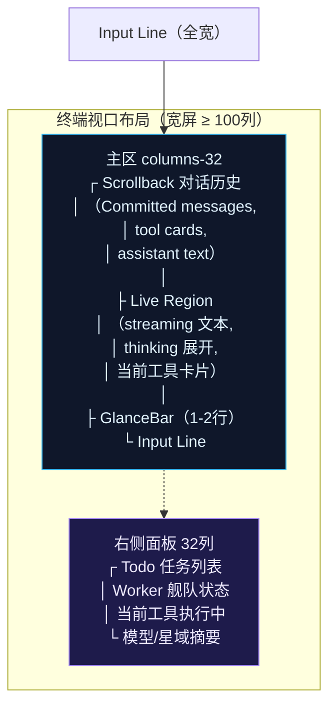

> **Status: APPROVED** — 2026-06-21T15:32:46.121Z

# 桌面端 TUI 布局重设计 — 多区非模态信息架构

# 桌面端 TUI 布局重设计 — 多区非模态信息架构

## 1. 问题描述

当前 TUI 是单列流式布局：scrollback → GlanceBar（单行）→ input。代理工作时，工具执行进度、worker 状态、todo 列表等关键信息要么混在 scrollback 里被冲走，要么需要唤起全屏 Overlay 遮住对话。GlanceBar 单行信息过载，窄终端大量截断。用户无法在持续对话的同时感知代理工作全貌。

## 2. 设计约束

- **终端字符网格**：monospace、行优先、无鼠标、无重叠窗口
- **键盘优先**：所有交互纯键盘，不可引入鼠标依赖
- **非模态优先**：信息面板应与对话共存，不要遮住 scrollback
- **渐进增强**：宽终端展示更多信息，窄终端自动退化为当前布局
- **主题兼容**：新设计不破坏现有 12 套主题的色彩体系
- **渲染性能**：120ms ticker 已存在，新增面板渲染增量 <1ms

## 3. 目标架构



| 终端宽度 | 布局 |
|----------|------|
| ≥ 120 列 | 主区 + 右侧面板（32列）并排 |
| 100-119 列 | 主区 + 右侧面板（24列压缩版） |
| 60-99 列 | 单列 + GlanceBar 升级为 2 行 |
| < 60 列 | 当前布局（单行 GlanceBar，无面板） |

## 4. 具体改动

### A. 右侧持久面板（`src/tui/side-panel.ts` — 新文件）

非模态侧面板，主区缩减宽度时在右侧展示：

**内容区块（从上到下）**：
1. **当前任务**：顶部 sticky todo item（如果有进行中的任务），带状态 icon
2. **Worker 舰队**：活跃子代理列表，每行显示 `[profile icon] shortLabel — elapsed`，用 pulse 色表示状态
3. **当前工具**：正在执行中的工具名 + 已用时间 + spinner
4. **模型/域摘要**：模型名缩写 + 星域 glyph + 推理 effort（1行紧凑）
5. **Token 仪表**：context 占比进度条（`[|||||...] 72%`），比 GlanceBar 的 ◧ 更直观

**交互**：
- 面板纯展示，不接收焦点
- 面板宽度固定（32 列），内容超宽截断
- 窄终端时面板完全消失，信息回归 GlanceBar 或 scrollback

### B. GlanceBar 升级（`src/tui/format/glance-bar.ts`）

从单行变为 **条件多行**：

**宽终端（≥ 100 列）— 单行**：
```
◇ 天枢  (main)   deepseek-chat  ⚡high   ◧ 24k/128k  ⚡ 72%  $0.042  32s  #12
```

**中等终端（60-99 列）— 双行**：
```
◇ 天枢 · main · deepseek-chat · high effort
◧ 24k/128k token · cache 72% · $0.042 · 32s · turn #12
```

**改动细节**：
- 新增 `formatGlanceBarDual()` 导出，双行模式下主区预留 `reservedRows: 4`（从现在的 3 增到 4）
- 缓存命中率加可视进度条：`⚡ [███████░░░] 72%`
- 上下文占比加颜色阈值：<50% muted、50-75% normal、>75% warning、>90% error

### C. 工具卡片视觉层级（`src/tui/format/tool-card.ts`）

当前工具卡片格式：`⚙ tool_name  ✓ 1.2s` → 输出。改进：

```
┌─────────────────────────────────────────────┐
│ ⚙ glob src/**/*.ts                    ✓ 1.2s │
│ ─────────────────────────────────────────── │
│ src/tui/engine/app.ts                       │
│ src/tui/theme.ts                            │
│ src/tui/format/glance-bar.ts                │
│ ... (截断，Ctrl+O 展开)                     │
└─────────────────────────────────────────────┘
```

- 用 box-drawing 字符（`┌─┐│└┘`）包裹工具卡片，给每个工具调用清晰边界
- 工具名 + 耗时右对齐
- 输出区域更明确的视觉缩进
- 错误工具用红色边框

### D. Turn 分隔（`src/tui/format/assistant-message.ts`）

每个 assistant turn 结束（`onTurnComplete` 的 `isFinal=true`）时，在 scrollback 中插入一条细分隔线：

```
─── turn 12 · 32s · 24k tokens ─────────────────
```

颜色使用 `theme.muted`，不抢注意力但提供清晰的"这一段对话结束"的视觉线索。

### E. 输入框增强（`src/tui/engine/input-line.ts`）

- 输入框左侧加当前星域 glyph 作为 prompt indicator：`◇ > 用户输入...`
- 输入框左侧颜色跟随星域 accent（已有的 `resolveStarDomainAccent`）
- 审批模式时输入框颜色切换为 warning/error 色

## 5. 实现分波

| 波次 | 内容 | 预计改动文件 |
|------|------|-------------|
| **W1** | GlanceBar 双行 + token 进度条 | `glance-bar.ts`, `live-engine.ts` (reservedRows 动态) |
| **W2** | 右侧面板核心渲染 | `side-panel.ts`（新）, `app.ts`（renderLive 分支） |
| **W3** | 终端宽度自适应布局切换 | `app.ts`（renderLive 重构）, `use-terminal-size.ts` |
| **W4** | 工具卡片 box-drawing 边框 | `tool-card.ts` |
| **W5** | Turn 分隔线 + 输入框星域 indicator | `assistant-message.ts`, `input-line.ts` |

## 6. 风险与缓解

| 风险 | 缓解 |
|------|------|
| 渲染性能退化 — 右侧面板每 tick 重计算 | 面板内容 diff：只有数据变化时才重绘对应行，用 `LiveEngine` 的局部更新 |
| 窄终端体验恶化 — 面板消失时关键信息丢失 | GlanceBar 双行模式兜底；面板中的所有信息都有 GlanceBar fallback |
| ANSI 转义码复杂度 — box-drawing 字符可能在某些终端显示异常 | 用标准 box-drawing（U+2500-U+257F），所有现代终端都支持；加 theme flag 允许回退为 ASCII |
| 与现有 Overlay 系统冲突 — 侧面板和 Overlay 同时可见时视觉杂乱 | Overlay 激活时隐藏侧面板（Overlay 本身是全屏模态，不应该同时看到面板） |

## 7. 验证计划

1. **单元测试**：`glance-bar.test.ts` 新增双行格式断言；`side-panel.test.ts`（新）测面板渲染
2. **集成测试**：`app-core.test.ts` 验证布局分支（宽/中/窄三种宽度下的渲染输出）
3. **手动验证**：在 ≥120 列终端启动 → 确认侧面板可见；缩窄到 <60 列 → 确认回退当前布局
4. **性能**：`renderLive()` 在 120ms ticker 下不产生可感知延迟
5. **主题兼容**：切换 12 套主题各跑一次，确认无 ANSI 转义码残留/断色
