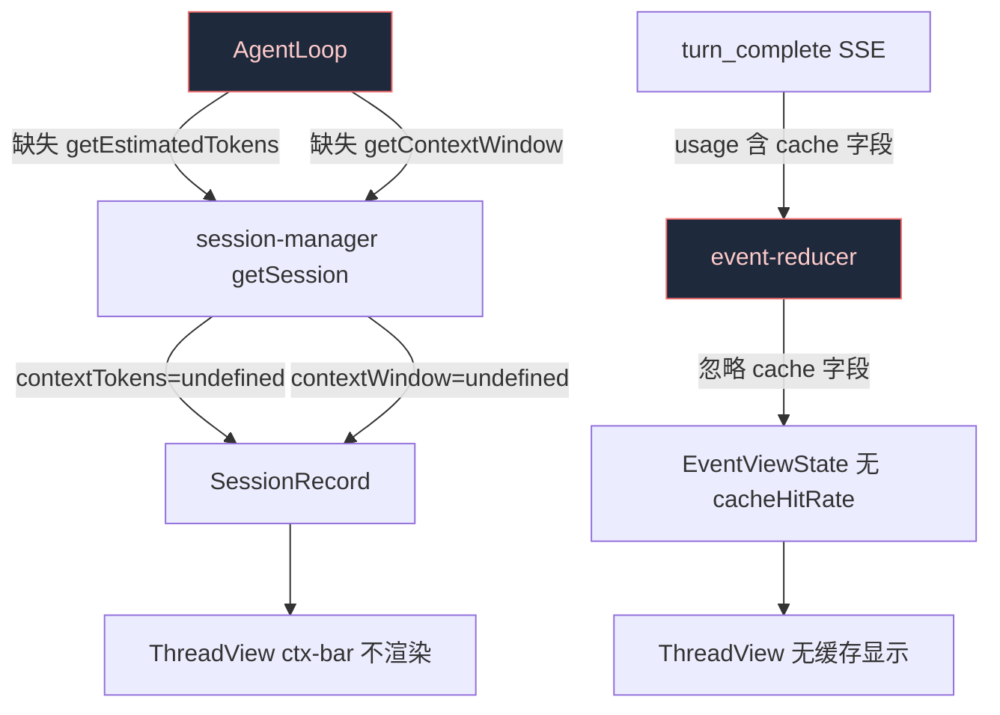
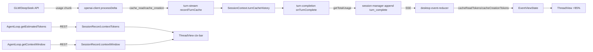

> **Status: APPROVED** — 2026-06-16T17:44:50.885Z

# 桌面端上下文窗口大小/缓存命中率/上下文增量 — 三处缺失修复

# 桌面端上下文窗口大小/缓存命中率/上下文增量 — 三处缺失修复

> 日期: 2026-06-19  
> 触发: 用户反馈桌面版看不到上下文窗口大小、上下文增量和缓存命中率  
> 关联 commit: `e32429f4` (TUI GlanceBar 修复，但未覆盖桌面端)

## 1. 问题描述

桌面版 ThreadView header 中有三个展示位与用户期望不符：

| 展示位 | 当前行为 | 期望行为 |
|--------|---------|---------|
| 上下文窗口条 `ctx-bar` | 永不渲染（`session.contextWindow` 恒为 undefined） | 显示 `◧ 12k/128k` 进度条 |
| 缓存命中率 | 完全不显示 | 显示 `⚡85%` |
| 上下文增量 | 完全不显示 | 显示本轮新增 token 量 |

回退路径 `latestTokens` 仅显示上一轮总 token 数，缺乏窗口占比和增量感知。

## 2. 根因分析



**断裂点 1 — AgentLoop 缺少方法**：`session-manager.ts:937-938` 通过可选链 `s.agent.getEstimatedTokens?.()` / `s.agent.getContextWindow?.()` 获取实时数据，但 AgentLoop 从未实现这两个方法 → 始终返回 undefined。

**断裂点 2 — event-reducer 忽略缓存字段**：`turn_complete` SSE 事件携带完整 `Usage` 对象（含 `cache_read_input_tokens` / `cache_creation_input_tokens`），但 `event-reducer.ts` 仅提取 `totalTokens`，丢弃了缓存数据。

**断裂点 3 — 无线程级增量追踪**：`EventViewState` 无字段记录上一轮的 token 基线，无法计算增量。

## 3. 变更计划

### Task 1: AgentLoop 补两个方法（server 侧）

**文件**: `src/agent/loop.ts`

```typescript
// 在 AgentLoop 类中新增两个 public 方法（约 L670 附近，其他 getter 区）

/** Estimated token count for the current conversation (live, for desktop ctx-bar). */
getEstimatedTokens(): number {
  return this.session.getEstimatedTokens()
}

/** Model context window size in tokens. */
getContextWindow(): number {
  return this.config.contextWindow
}
```

- `this.session.getEstimatedTokens()` 已存在（SessionContext），返回 `state.estimatedTokens + state.prefixOverhead`
- `this.config.contextWindow` 已存在，来自模型配置

### Task 2: event-reducer 提取缓存命中率 + 增量（desktop 侧）

**文件**: `desktop/src/state/event-reducer.ts`

在 `EventViewState` 中新增字段：
```typescript
/** Cumulative cache read tokens (latest turn_complete usage). */
cacheReadTokens: number
/** Cumulative cache creation tokens. */
cacheCreationTokens: number
/** Latest turn's total input tokens (for increment calc). */
lastTotalTokens: number
/** Previous turn's total input tokens. */
prevTotalTokens: number
```

在 `turn_complete` case 中：
```typescript
case 'turn_complete': {
  // ... existing logic ...
  const usage = (ev.data.usage as Record<string, unknown> | undefined) ?? {}
  // Extract cache fields
  const cacheRead = Number(usage.cache_read_input_tokens ?? 0)
  const cacheCreation = Number(usage.cache_creation_input_tokens ?? 0)
  if (cacheRead > 0 || cacheCreation > 0) {
    next.cacheReadTokens = cacheRead
    next.cacheCreationTokens = cacheCreation
  }
  // Track increment
  const totalTokens = Number(usage.totalTokens ?? usage.total_tokens ?? usage.total ?? 0)
  if (totalTokens > 0 && ev.data.isFinal) {
    next.prevTotalTokens = next.lastTotalTokens
    next.lastTotalTokens = totalTokens
  }
  // ... existing return ...
}
```

### Task 3: ThreadView 展示缓存命中率 + 上下文增量（desktop 侧）

**文件**: `desktop/src/surfaces/ThreadView.tsx`

在 header 的 thread-status 区域，ctx-bar 旁边增加缓存命中率 chip：

```tsx
{/* 缓存命中率 */}
{view.cacheReadTokens + view.cacheCreationTokens > 0 ? (
  <span className="cache-chip" title={`缓存读 ${formatTokens(view.cacheReadTokens)} / 创建 ${formatTokens(view.cacheCreationTokens)}`}>
    ⚡{Math.round(view.cacheReadTokens / (view.cacheReadTokens + view.cacheCreationTokens) * 100)}%
  </span>
) : null}

{/* 上下文增量 */}
{view.prevTotalTokens > 0 && view.lastTotalTokens > view.prevTotalTokens ? (
  <span className="ctx-delta" title="本轮上下文增量">
    +{formatTokens(view.lastTotalTokens - view.prevTotalTokens)}
  </span>
) : null}
```

**文件**: `desktop/src/styles.css` — 新增 `.cache-chip` 和 `.ctx-delta` 样式。

## 4. 数据流验证



## 5. 验证计划

1. `npx tsc --noEmit` — typecheck 全量
2. 桌面端 `npm run build` — 确认 build 通过
3. `npm exec -- tsx --test src/agent/__tests__/context.test.ts` — SessionContext 已有测试
4. 手动验证：启动桌面端，发送消息后观察 header 是否出现 `◧ Xk/Yk` 进度条和 `⚡XX%` 缓存命中率

## 6. 风险

- **低风险**: AgentLoop 新增两个方法是纯代理，不改变任何现有行为
- **低风险**: event-reducer 新增字段不影响现有 block 渲染
- CSS 新增需确认不与现有样式冲突（使用独立 class 名）
