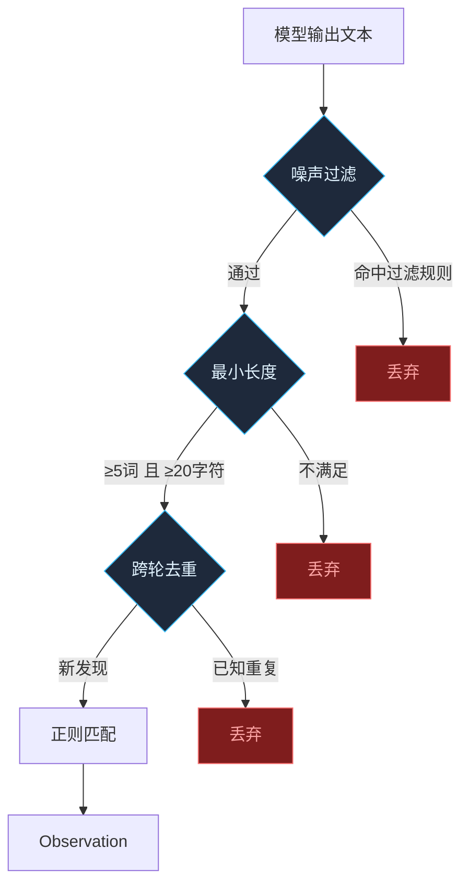

# 观察提取器升级：噪声门控 + 来源过滤 + 跨轮去重

## 1. 问题归族（瑶光 #4）

从实际 `observations.jsonl` 数据中识别出三族噪声：

| 族 | 特征 | 示例 |
|----|------|------|
| 代码片段 | 含反引号 `` ` ``、`src/`、`:数字` 行号引用 | `"sees, validates, or acts on a UnifiedPlan directly"` |
| 元认知反射 | 含"被当成"、"这些不是"、"正则匹配"等自我引用 | `"被当成 decision 记录"` |
| 碎片 | 匹配文本 < 20 字符或 < 3 个词 | `"wired"`, `"node:test"` |

**根因**：正则在全量模型输出文本上无差别匹配，不区分叙述性内容、代码引用、和自我反思。

## 2. 升级策略（天璇 #2 收敛）

三个独立领域（反垃圾、NLP 质量门控、数据库去重）收敛为同一模式：**在入口做三层门控**。



### 2.1 噪声过滤（G1）

正则匹配前先检查捕获文本是否命中噪声特征：

- `/\x60.*\x60/` — 含反引号（代码片段）
- `/src\/\S+\.(ts|tsx|js)/` — 文件路径
- `/:\d+/` — 行号引用 `loop.ts:1431`
- `/被当成|这些不是|正则匹配|误抓|噪声/` — 元认知反射
- `/evidence.*confidence/i` — JSON 属性碎片

命中任意一条 → 丢弃该匹配。

### 2.2 最小长度（G2）

- 捕获文本 ≥ 20 字符 **且** ≥ 5 个词
- 当前门槛是 5 字符——太短，`"wired"` 通过

### 2.3 跨轮去重（G3）

当前 `seen` 只在单次 `extractObservations` 调用内去重。增加：
- 调用 `countSimilarMemoryEntries(cwd, text)` 查 unified memory 中是否已有 ≥2 条相同文本
- 已有 ≥2 条 → 跳过（不是新发现，已积累足够 repeatCount 触发 rule）

### 2.4 置信度校准

- `constraint` 模式（`don't/never`）confidence 从 0.9 → 0.7：当前噪声中 constraint 占比最高，因为代码注释里 "do not" 很常见
- `decision` 模式增加负向过滤：如果捕获文本包含引号字符 `"` → 置信度减半（很可能是引用而非声明）

### 2.5 提取上限收紧

- 每轮上限从 5 → 3：减少低质量条目堆积

## 3. 变更清单

单文件：`src/memory/observation-extractor.ts`

| 变更 | 位置 |
|------|------|
| 新增 `isNoiseFragment()` | 噪声过滤函数 |
| 新增 `minWordCount()` | 词数检查 |
| 新增 `isAlreadyKnown()` | 跨轮去重查询 |
| 修改 `extractObservations` | 加入三层门控 |
| 修改 `FACT_PATTERNS` | constraint confidence 0.9→0.7 |
| 修改上限 | 5→3 |

## 4. 验证（瑶光 #1：复现即证）

```bash
# 反证测试：噪声片段应被过滤
npm exec -- tsx --test src/memory/__tests__/observation-extractor.test.ts

# 验证要点：
# 1. 含反引号的文本不被提取
# 2. 含 "src/" 路径的文本不被提取
# 3. <20 字符的文本不被提取
# 4. 含 "被当成" 的元认知不被提取
# 5. constraint confidence 降为 0.7
```

## 5. 不变的部分

- `appendObservation` 双写逻辑不变
- `observation-store.ts` 不变
- `unified-memory.ts` 不变
- `memory-learning-hook.ts` 调用方不变
