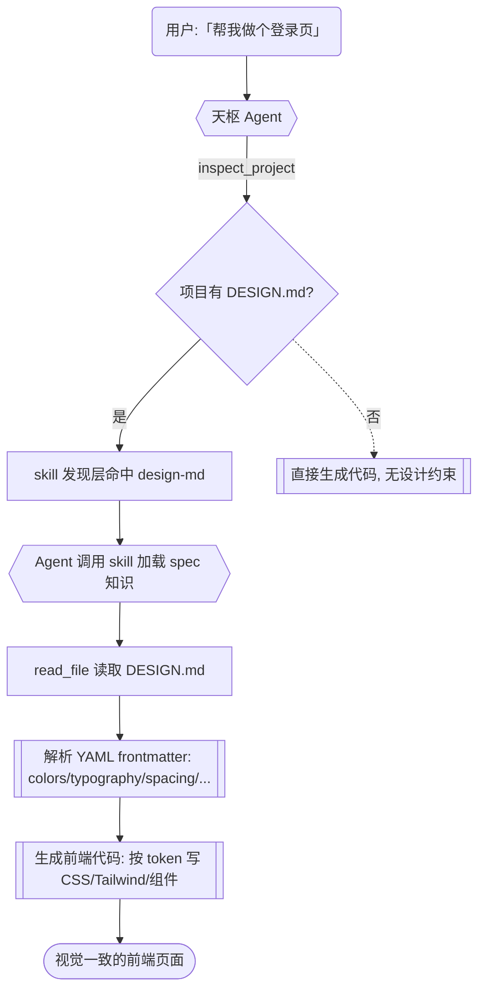

# 集成 DESIGN.md 设计规范支持

> **面向 AI 代理：** 使用 `executing-plans` 逐任务实现。

**目标：** 让天枢 Agent 在帮用户写前端代码时，能识别用户项目中的 `DESIGN.md` 文件，按其中定义的 design token（颜色、字体、间距、阴影、圆角等）生成视觉一致的前端 UI 代码。

**架构：** 纯 skill 方案，利用天枢现有的两级渐进加载 skill 系统，创建一个 `design-md` skill，零代码改动。同时将 `DESIGN.md` 加入 `inspect_project` 的配置文件检测列表。Agent 在遇到前端/UI 任务时，skill trigger 匹配自动出现在 `<available-skills>` relevant 区，Agent 调用 `skill(name="design-md")` 加载完整 spec 知识，然后读取用户项目的 DESIGN.md 并按 token 生成代码。

**技术栈：** 天枢现有 skill 系统（`src/skills/skill-loader.ts` + `skill` 工具），无需新增依赖。



## 根因分析

当前天枢在帮用户写前端代码时，没有任何机制感知用户项目的设计系统。Agent 生成的颜色、字体、间距完全依赖自身训练数据中的默认审美，导致多个问题：不同会话生成的 UI 风格不一致，用户已在 DESIGN.md 中定义的设计 token 被忽略，用户需要反复口头纠正 Agent 的颜色/字体选择。

Google DESIGN.md 规范（Apache 2.0）是一份开放格式规范，不是代码库。集成方式是让 Agent 学会这个格式并主动遵循，而非引入代码依赖。天枢的 skill 系统（两级渐进加载）天然适合此场景：DESIGN.md 知识仅在前端/UI 任务时需要，不应每轮都消耗 token 预算。

## 任务 1：创建 design-md skill

创建 `.rivet/skills/design-md/SKILL.md`，内容为完整的 DESIGN.md 格式规范知识。当 Agent 遇到前端 UI / 设计系统相关任务时，按需加载此 skill，然后读取用户项目的 DESIGN.md 并遵循 design token 生成代码。

SKILL.md frontmatter：
- name: `design-md`
- description: 当用户项目包含 DESIGN.md 文件时，按其中的设计 token 生成视觉一致的前端代码
- triggers: `DESIGN\.md`, `design system`, `设计系统`, `设计规范`, `design token`, `颜色规范`, `字体规范`, `间距规范`, `视觉规范`, `UI 组件`, `frontend`, `前端`, `组件样式`, `Tailwind`, `CSS 变量` 等

SKILL.md 正文包含五个步骤的工作流：
1. 用 read_file 检查项目根目录是否存在 DESIGN.md
2. 解析 YAML frontmatter 获取 design token（colors、typography、spacing、shadows、borders、components），展开 `{path.to.token}` 引用
3. 将 token 映射为代码：CSS 变量 / Tailwind config / 组件属性，按场景 A-D 分类处理
4. 读取 markdown body 获取组件级设计指引
5. 生成代码时遵守六条约束：不硬编码颜色/字体值、优先 CSS 变量、Tailwind 项目写 config、token 缺失用框架默认值、展开引用、DESIGN.md token 优先级最高

错误处理表覆盖 6 种场景：文件不存在、YAML 解析失败、token 格式无效、引用循环、未知 section、重复 section。

完整 SKILL.md 内容约 180 行，详见活动计划文件附件。

验证：重启后 `/skill list` 能看到 `design-md`；触发前端任务时 skill 出现在 relevant 区。

提交：`git add .rivet/skills/design-md/SKILL.md && git commit -m "feat(skill): 添加 design-md skill"`

## 任务 2：inspect_project 添加 DESIGN.md 检测

修改 `src/tools/inspect-project.ts` 的 `CONFIG_FILE_PATTERNS` 数组（L51），在首位插入 `'DESIGN.md'`。

调研背书：`CONFIG_FILE_PATTERNS` 定义在 L51，现有 14 种 config 文件模式，调用者为 `findConfigFiles()`（L173-196）。添加 `DESIGN.md` 仅增加一个 glob 模式，零破坏性。

```typescript
const CONFIG_FILE_PATTERNS = [
  'DESIGN.md',             // 新增：Google DESIGN.md 设计系统规范
  'tsconfig.json', 'tsconfig.*.json',
  'vite.config.ts', 'vite.config.js', 'vite.config.mjs',
  // ... 其余不变
]
```

验证：`npx tsc --noEmit` + 相关测试通过。

提交：`git add src/tools/inspect-project.ts && git commit -m "feat(tools): inspect_project 检测 DESIGN.md"`

## 设计决策

Skill vs 工具 vs prompt 注入：选择 Skill。DESIGN.md 仅在前端/UI 任务时需要，不应每轮都注入 token 预算。skill 的 trigger 匹配 + 按需加载完美匹配此场景。

单文件 vs 目录 skill：选择目录型（`design-md/SKILL.md`）。为将来扩展留空间，references/ 可放完整 spec 原文、常见框架映射表等。

inspect_project 修改：选择修改。让 Agent 在了解项目结构时就感知设计系统，不等触发 UI 任务才发现。

## 验证计划

1. skill 加载验证：重启后 `/skill list` 能看到 `design-md`
2. trigger 匹配验证：用户说"帮我做个登录页面"，Agent 在 `<available-skills>` 中看到 `design-md` relevant
3. 端到端验证：在含 DESIGN.md 的测试项目中，让 Agent 生成按钮组件，CSS 颜色匹配 DESIGN.md 的 primary 颜色
4. 缺失场景验证：无 DESIGN.md 的项目中，Agent 正常生成代码不提 design system
5. inspect_project 验证：有 DESIGN.md 的项目运行 inspect_project，输出中包含 DESIGN.md
