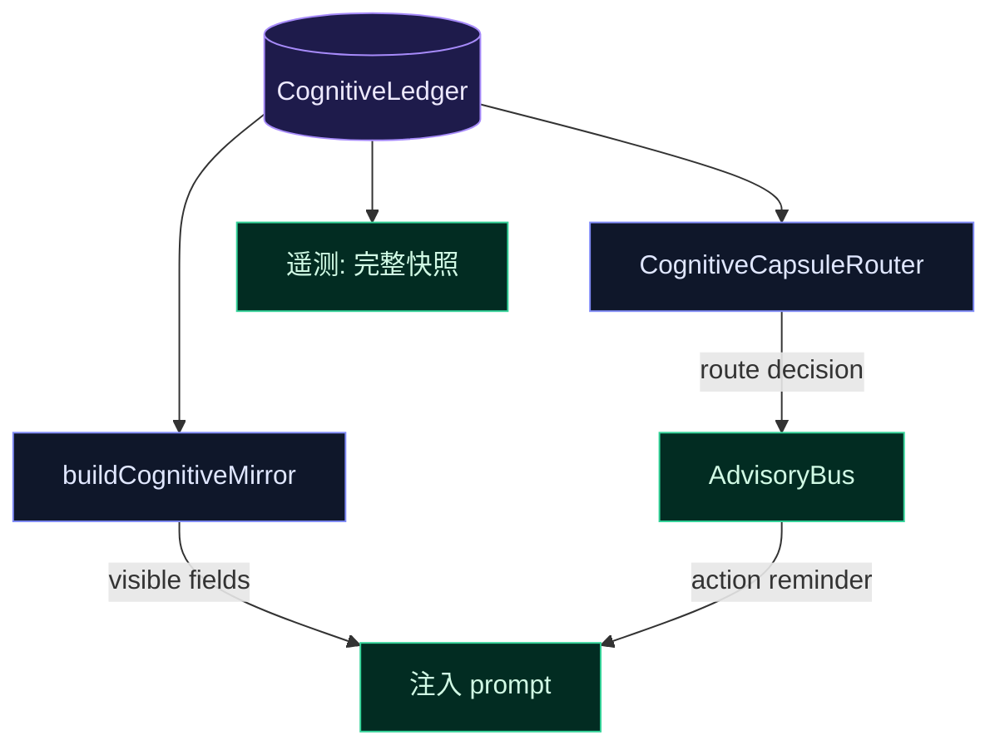

# SR 路由增补：原则池、认知镜面分层、星域精简

> 增补于 2026-06-18，基于 `2026-06-17-sr-intelligent-reminder.md` 的审查讨论。
> 讨论对象：主设计文档 §1-§7 + 修订 §8。

## 1. 原则池与规则表（对应主文档 §3.3–§3.4）

### 1.1 原则池候选（从现有种子胶囊提取）

**瑶光** — 6 条可用：

| 键 | 格言（frozen 前缀用） | 行动提示（动态注入用） |
|----|----------------------|----------------------|
| Y1 | 绿非证明，复现即证 | 那行修复能复现原缺陷吗？先 RED→GREEN 再声称已验证 |
| Y2 | 声称"已修复"前先能复现原缺陷 | 不要靠测试绿就判断完成——用原缺陷输入跑一次确认 |
| Y3 | 缺陷归族——一族 bug 是结构问题 | 这个 bug 和上次的是同一族吗？查 git log 看同类修复 |
| Y4 | 离枢最远才看得见全弧 | 退到时间轴上——这个模式在之前的提交里出现过吗 |
| Y5 | 把对外人的 fail-closed 转向自己 | 你刚下的结论有没有 ground truth 能自检？ |
| Y6 | 方案 GREEN ≠ 落地 GREEN | 逐条核对 spec 的验收条件，不靠"看起来完成了" |

**天璇** — 4 条：

| 键 | 格言 | 行动提示 |
|----|------|---------|
| X1 | 到 3+ 个无关领域寻找碎片 | 去一个不相关的目录 glob，看你是否忽略了其他模块 |
| X2 | 碎片之间寻找收敛 | 如果多个独立领域指向同一模式，那个模式可能是宇宙级 |
| X3 | 派一个反证 scout 杀死你最兴奋的假设 | 用一个不匹配现有方案的输入跑一次测试，看它会不会红 |
| X4 | 去找层间的温跃层 | 别在同一个抽象层深挖——上一层或下一层可能有捷径 |

**天权** — 3 条：

| 键 | 格言 | 行动提示 |
|----|------|---------|
| Q1 | 先读完，再规划 | grep 调用方、读代码、理解数据流——再画架构图 |
| Q2 | 分阶段交付，逐段验证 | 每完成一个 task：typecheck + test + commit，不积攒 |
| Q3 | 承认天花板——换方向 | 这条路走了三次都撞墙？换维度，别同方向硬推 |

**天府** — 2 条：

| 键 | 格言 | 行动提示 |
|----|------|---------|
| F1 | 遇歧义大声失败而非咽下 | 不确定的假设不要默认通过——写断言让它 fail，再看 |
| F2 | 结构是承诺 | 不变更不破坏既有契约，改动前确认调用方 |

### 1.2 修订后规则表

所有行动提示为**模板格式**，路由器投递时填充上下文变量（见 §4 模板变量表）。

冷却按**星域**追踪（非按规则 ID）——同一星域的所有规则共享一个冷却计时器（P1/P5 共享是这个规则的自然推论，不需要特别声明）。

恶化升级覆盖（见主文档 §8.3）本身有 **2 轮最小间隔**——防止指标振荡时反复打破冷却。

```
前置门控（所有规则共享）：
  - convergence-detector level >= 2 → 本轮 CCR 静默（互斥，见主文档 §8.9）
  - 上轮最后工具为 edit_file/write_file → 瑶光规则延迟一轮（意图感知，见主文档 §8.11）

P1. verification_coverage < 0.3 ∧ turn > 3 → 瑶光
    冷却: 5轮 | 恶化升级覆盖 | 原则池: Y1/Y2/Y5
    行动提示: "【瑶光】改了 {files_modified} 个文件但还没验证（距上次验证 {turns_since_verify} 轮）。typecheck + 相关测试，跑通再继续。"
    suppressWhen: lastTool ∈ {run_tests} ∨ lastToolTarget contains "test"
    替代: advisory-bus.ts vigorLowEntry → 否（无关）; stalenessGateEntry → 否（无关）

P2. freshness < 0.25 ∧ turn > 4 → 天璇
    冷却: 4轮 | 原则池: X1/X3/X4
    行动提示: "【天璇】第 {turn} 轮，连续在同一路径上。去一个不相关的目录 glob 一下，或者上/下一层抽象找捷径。"
    替代: advisory-bus.ts stalenessGateEntry() — CCR 上线后该函数标记 @deprecated

P3. vigor < 0.25 ∧ turn > 2 → 天权 (原破军→天权替代)
    冷却: 4轮 | 原则池: Q3
    行动提示: "【天权】第 {turn} 轮执行能量低。最后成功的工具调用是 {last_tool}。写下三个可能方向，选最不熟悉的先试。"
    替代: advisory-bus.ts vigorLowEntry() — CCR 上线后该函数标记 @deprecated

P4. complexity > 0.7 ∧ turn > 3 → 天权
    冷却: 6轮 | 原则池: Q1/Q2
    行动提示: "【天权】复杂度高（改了 {files_modified} 文件）。先 grep 调用方和受影响文件，画出变更边界再动手。"

P5. files_modified > 5 ∧ verification_coverage < 0.5 → 瑶光
    冷却: 与瑶光星域共享（同 P1）| 原则池: Y3/Y6
    行动提示: "【瑶光】大面积改动（{files_modified} 文件，验证覆盖 {verification_coverage}）。只交付已验证的部分，未验证的留到下轮。"
    suppressWhen: 同 P1

P6. stability < 0.2 ∧ turn > 3 → 天府
    冷却: 5轮 | 原则池: F1/F2
    行动提示: "【天府】第 {turn} 轮稳定性低。如果同一方向第三次撞墙，换维度而非硬推。改动前确认调用方。"
```

### 1.3 星域精简决策

原设计包含破军（vigor 低）和天梁（momentum 高缺验证），但这两颗星没有种子胶囊，原则池为空。

**决策（推荐 A）**：用已有星域覆盖这两个信号——

| 原规则 | 替代 | 理由 |
|--------|------|------|
| vigor < 0.3 → 破军 | vigor < 0.25 → 天权 Q3 | Q3"承认天花板、换方向"同样能打破犹豫 |
| momentum > 0.7 ∧ verif < 0.4 → 天梁 | files_modified > 5 ∧ verif < 0.5 → 瑶光 P5 | 同根：快速推进但缺验证 |

减少星域数量让每条提醒更精炼，且都来自有胶囊支撑的星域。如果后续破军/天梁积累了自己的胶囊方法论，可以再加回。

### 1.4 行动提示 vs 格言

格言（"绿非证明，复现即证"）适合 frozen 前缀常驻——短、可回味。但动态注入时模型只有一秒注意力，需要动作导向版本。

原则池每条同时存两个版本：格言（frozen 用）和行动提示（动态注入用）。router 用行动提示。如果 Phase 1 做不到双版本，至少优先写入行动提示。

---

## 2. 认知镜面分层：路由字段不应进入模型视野

### 2.1 问题

认知镜面（`<cognitive-mirror />`）目前每轮向模型注入 15 个维度值。如果 CognitiveCapsuleRouter 用这些维度做路由决策，那么部分维度对模型而言是**冗余的**——模型不需要知道 `vigor: 0.30` 或 `exploration: 0.15`，它只需要收到系统基于这些值给出的**行动提示**。

### 2.2 本会话的实际注入数据

当前轮次的 cognitive-mirror 内容：

```xml
<cognitive-mirror
  verification_coverage="1.00"
  files_modified="0"
  complexity="1.00"
  momentum="0.00"
  stability="0.84"
  freshness="0.96"
  pressure="0.09"
  reasoning="high"
  exploration="0.60"
  vigor="1.00"
  curiosity="0.80"
  season="genesis"
  regulation-cost="0.02"
/>
```

约 300 字符，~75 tokens。

### 2.3 分层方案

**模型必须看到的（可行动维度）**：

| 字段 | 理由 |
|------|------|
| verification_coverage | "你还没有验证"——直接促进行为改变 |
| files_modified | "你改了 N 个文件"——帮助范围感知 |
| complexity | "当前任务很复杂"——帮助自我调节速度 |
| pressure | "上下文在填满"——促进行为调整（精简输出等） |
| season | genesis/growth/climax/closure——帮助阶段校准 |
| reasoning | 当前思考模式——自我意识 |

**应该只做路由、对模型隐藏的（系统判断维度）**：

| 字段 | 隐藏理由 | 路由用途 |
|------|---------|---------|
| vigor | 告诉模型"你活力 0.30"不会让它更有活力；行动提示会 | vig < 0.25 → 天权（换方向） |
| exploration | 模型知道自己是否在探索，不需要数字 | expl < 0.3 可作为辅助信号 |
| freshness | "你连续在同一路径"不如直接路由到天璇 X1 | fresh < 0.25 → 天璇 |
| momentum | "你动量很低"不如直接建议下一步 | 辅助 vigor 判断 |
| stability | "你不稳定"可能引发焦虑，不如静默路由到天府 | stab < 0.2 → 天府 |

**两者有争议的（按实施阶段决定）**：

| 字段 | 保留在镜面 | 隐藏做路由 |
|------|-----------|-----------|
| curiosity | 可能激发探索心态 | 已通过 vigor 间接覆盖 |
| regulation-cost | 有趣的元信号，但模型不需要知道压制度的数值 | 系统自己监控 |

### 2.4 收益与风险

**收益**：

1. **精炼镜面**：移除 5 个路由专用字段，镜面从 ~300 字符降到 ~150 字符，每次节省 ~40 tokens。跨会话累计可观。
2. **注意力集中**：模型看到的是 6 个可行动的维度，而非 15 个需要自己解读的数字。不会出现"看到 vigor 0.30 但不知道该怎么办"的浪费。
3. **路由静默化**：系统层面的判断不暴露给模型。模型不会因为看到 `stability: 0.15` 而产生额外的不安——它只收到一条温和的提醒。

**风险**：

1. **丧失自我调节机会**：如果模型在 vigor 降到 0.25 之前就能看到趋势（如 vigor 在下降），它可能提前自我纠正。隐藏 vigor 意味着模型只能在收到提醒后才调整。
2. **阈值敏感度增加**：路由决策完全依赖系统侧的阈值，而模型失去了通过自我观察来校准的机会。
3. **调试困难**：看不到隐藏字段的值，排查"为什么没有触发提醒"时需要查遥测日志而非 prompt 快照。

**缓解**：

- Phase 1 先保留全部镜面字段，同时实现路由层。观察 10-20 轮实际触发的规律。
- 遥测记录每轮完整的镜面快照（含隐藏字段），便于离线分析和阈值调优。
- Phase 2 根据遥测数据决定哪些字段可以安全地只做路由、不进镜面。

### 2.5 实现路径

```typescript
// cognitive-ledger.ts

// 当前：所有维度进入 buildCognitiveMirror
// Phase 1：保持不变 → 路由层从同一个 CognitiveLedger 读取

// Phase 2（待遥测验证后）：
// buildCognitiveMirror 增加第二个参数 visibleFields: Set<string>
// ROUTING_ONLY_FIELDS = new Set(['vigor', 'exploration', 'freshness', 'momentum', 'stability'])
// router 读全部字段，镜面只渲染 visibleFields
```



---

## 3. 与主设计文档的对照索引

| 增补条目 | 对应主文档 |
|---------|-----------|
| §1.1 原则池候选 | §3.3 原则池（替代硬编码数组） |
| §1.2 修订规则表 | §3.4 触发条件原型 |
| §1.3 星域精简 | §2.3 星域能力表（移除破军/天梁行） |
| §1.4 行动提示 vs 格言 | §3.3 原则池格式（新增双版本建议） |
| §2 认知镜面分层 | 新增——原设计未涉及 |
| §2.5 实现路径 | §4 Phase 1–3（新增渐进策略） |
| §4 模板变量与替代声明 | 主文档 §8.7–§8.13 |

---

## 4. 行动提示模板变量表

路由器投递行动提示时可使用的上下文变量：

| 变量 | 来源 | 说明 |
|------|------|------|
| `{files_modified}` | `evidence.filesModified.size` | 已修改文件数 |
| `{turn}` | `ctx.snapshot.turn` | 当前轮次 |
| `{turns_since_verify}` | 从 evidence 推算：`turn - lastVerificationTurn` | 距上次验证的轮数 |
| `{last_tool}` | `recentToolHistory` 末条 `.tool` | 最近一次工具名 |
| `{verification_coverage}` | sensorium `.confidence` formatted | 验证覆盖率（百分比） |

模板解析在 `CognitiveCapsuleRouter.buildAdvisoryContent()` 内完成，不暴露给 advisory bus。未解析的变量保留原始占位符（不 crash）。

---

## 5. 废弃条目迁移清单

CCR Phase 1 上线后，以下已有条目被 CCR 规则替代，标记 `@deprecated` 并从调用方移除：

| 废弃条目 | 文件 | CCR 替代规则 | 迁移动作 |
|---|---|---|---|
| `vigorLowEntry()` | `src/agent/advisory-bus.ts` L113 | P3 (vigor < 0.25 → 天权) | 标记 deprecated；`loop.ts` 中调用改为 CCR |
| `stalenessGateEntry()` | `src/agent/advisory-bus.ts` L99 | P2 (freshness < 0.25 → 天璇) | 标记 deprecated；`loop.ts` 中 `turnsSinceLastObjection` 逻辑清除 |

**不废弃**的条目（CCR 不覆盖）：
- `disciplineReanchorEntry()` — 天梁纪律重锚，按工具调用计数触发，与 CCR 的认知维度路由正交
- `virtueEncouragementEntry()` / `testPassEncouragementEntry()` / `vigorRecoveryEntry()` — 正向激励，不在 CCR 的纠偏范畴内
- constitutional entries (courage-hook) — 宪法级，CCR 不触碰

---

## 6. 互斥与前置门控

CCR 运行在 preTurn 阶段。在评估规则表之前执行以下前置检查：

```
┌─ CCR preTurn ─────────────────────────────────────────────────┐
│                                                                │
│  1. wasConvergenceTriggered() === true?                       │
│     YES → return（convergence 在 kick，CCR 静默）              │
│                                                                │
│  2. 评估规则表 P1-P6（按优先级，首条命中即停）                   │
│                                                                │
│  3. 命中的规则有 suppressWhen？                                 │
│     YES → 检查抑制条件                                         │
│       命中抑制 → return（模型即将自行纠偏，不干扰）              │
│                                                                │
│  4. 星域冷却检查：                                              │
│     在冷却期 ∧ 无恶化升级 → return                              │
│     恶化升级 ∧ 上次升级覆盖 < 2轮前 → return（二级冷却）        │
│                                                                │
│  5. 填充模板变量 → advisoryBus.submit()                        │
│     category: 'discipline'（Phase 1 复用，见 §7.2）            │
│     priority: 规则 bus priority（见 §7.3）                     │
│                                                                │
│  6. 记录触发快照到遥测                                          │
└────────────────────────────────────────────────────────────────┘
```

---

## 7. 接口审计与实施决策

> 基于代码审计（2026-06-18），逐条核实 CCR Phase 1 的接口依赖。

### 7.1 构造函数注入——三个依赖全部已有先例

CCR 工厂函数 `createCcrHook(opts)` 通过构造函数注入获取依赖，**不需要改 `RuntimeHookSnapshot` 或 `RuntimeHookEffects`**。所有三个依赖在 `RuntimeHookDeps` 中已有，只需透传：

| CCR 依赖 | 来源 | 已有消费者先例 |
|---|---|---|
| `advisoryBus` | `RuntimeHookDeps.advisoryBus` (L159) | signal-consumer-hook, dedup-guard-hook |
| `wasConvergenceTriggered` | `RuntimeHookDeps.wasConvergenceTriggered` (L74) | kick-hook (L26) |
| `getEvidenceState` | `RuntimeHookDeps.getEvidenceState` (L50) | stigmergy-hook, dream-hook |

```typescript
// cognitive-capsule-router.ts — 工厂函数签名
export interface CcrHookOptions {
  advisoryBus: AdvisoryBus
  wasConvergenceTriggered: () => boolean
  getEvidenceState: () => EvidenceState
}

export function createCcrHook(opts: CcrHookOptions): PreTurnRuntimeHook { ... }
```

```typescript
// create-runtime-hooks.ts — 注册（在 signal-consumer 之后、courage-hook 之前）
createCcrHook({
  advisoryBus: deps.advisoryBus!,
  wasConvergenceTriggered: deps.wasConvergenceTriggered ?? (() => false),
  getEvidenceState: deps.getEvidenceState,
}),
```

关于 `wasConvergenceTriggered` 的实现精度：`loop-factory.ts` L232 实现为 `self.latestConvergenceResult?.shouldKick ?? false`，这是 convergence level >= 2 的 ground truth（`shouldKick = level >= 2`）。**不需要用 `shouldKick(sensorium)` 近似**——直接复用这个已有函数更准确。

关于 `turns_since_verify`：CCR 内部维护 `lastVerifyTurn` 计数器，在 `getEvidenceState().deliveryStatus` 变化时更新。不需要在外部接口暴露。

### 7.2 Advisory category：Phase 1 复用 `'discipline'`

`AdvisoryCategory` 类型定义不含 `'cognitive_route'`。Phase 1 复用 `'discipline'`：

- CCR 触发频率很低（冷却 4-6 轮 + convergence 互斥），不会占满 `MAX_PER_CATEGORY = 2`
- 语义上"认知路由提醒"属于"认知纪律"的子集
- 避免改 `AdvisoryCategory` 类型定义及其所有消费方

Phase 2 如果 CCR 触发频率上升或需要独立配额，再新增 category。

### 7.3 Bus priority：继承被替代条目的 priority

规则表中的 priority（0.9→0.4）是**规则匹配优先级**（哪条规则先触发）。Bus 投递的 priority 是独立的值。CCR 替代已有条目时，bus priority 不应低于原值：

| CCR 规则 | 替代的条目 | 原 bus priority | CCR bus priority |
|---|---|---|---|
| P1 瑶光 | 无直接对应 | — | 0.55 |
| P2 天璇 | `stalenessGateEntry()` | 0.60 | 0.60 |
| P3 天权 | `vigorLowEntry()` | 0.65 | 0.65 |
| P4 天权 | 无直接对应 | — | 0.55 |
| P5 瑶光 | 无直接对应 | — | 0.55 |
| P6 天府 | 无直接对应 | — | 0.50 |

### 7.4 镜面分层：Phase 1 不做

CCR 从 `ctx.snapshot.sensorium` 直接读原始维度值，不解析镜面 XML。`buildCognitiveMirror` 的分层是独立的 prompt 优化，与 CCR 路由逻辑完全解耦。Phase 1 保持镜面全字段注入。

---

## 8. Vigor 信号可信度处理（2026-06-18 讨论）

### 8.1 问题

Vigor 是一个**滞后指标**——它在回合结束时由 `computeVigor()` 更新，反映的是上一轮的执行能量。而 CCR 在 preTurn 阶段读取 vigor 做路由决策，本质是用"上轮的体力"预测"本轮是否需要帮助"。这导致三种误判：

| 情境 | vigor 值 | 实际情况 | 误判风险 |
|------|---------|---------|---------|
| agent 刚完成大任务 | 低 | 自然低谷，下一轮会恢复 | 误触发提醒 |
| agent 探索中，多轮没有产出 | 低 | 正常探索，方向没错 | 误触发提醒 |
| agent 受挫，反复失败 | 低 | 真正需要换方向 | ✓ 正确触发 |
| agent 盲目自信，不验证 | 高 | 实则跑偏，最需要提醒 | 漏触发 |

单看 vigor 一个数字无法区分这四种情境。当 `vigor < 0.25` 单独做路由条件时，把数字当成语义——数字本身没有语境。

### 8.2 解决：vigor 降级为确认信号，不作为主信号

CCR 规则表中的 vigor **不再单独成规则**。原 P3（vigor < 0.25 → 天权）变更为双条件：

```
P3. verification_coverage < 0.3 ∧ vigor < 0.3 → 天权（双赤字触发）
    ──客观指标（verification_coverage）先出问题，vigor 确认 agent 感知到了困境
    ──如果 verif_cov < 0.3 但 vigor 仍然高：agent 盲目自信 → 不用 vigor 提醒，用瑶光 P1
    ──如果 vigor < 0.3 但 verif_cov 正常：agent 只是累了/完成了 → 不提醒
```

**设计原则**：vigor 回答"agent 是否感觉到自己处于困境"，而非"agent 是否处于困境"。客观指标（verification_coverage、files_modified、freshness）判断后者。只有**双重确认**（客观困境 + 能量下降）时才触发天权提醒——这是 agent 知道自己在困境但被卡住的情况，最需要换方向的建议。

### 8.3 VigorState 子字段的细粒度用法

`VigorState` 提供了 `tonic`（长期基线）和 `phasic`（即时反馈）两个分量，CCR 利用它们区分提醒类型：

| 分量 | 含义 | 低值时对应模式 | 路由星域 | 具体提醒 |
|------|------|--------------|---------|---------|
| `vigor` | 综合值 | 双确认（客观指标 + 能量双低） | 天权 | Q3：换方向 |
| `tonic` | 长期基线 | session 过长、方向积累性错误 | 天权 | Q3：如果同一方向第三次撞墙，换维度而非同方向硬推 |
| `phasic` | 即时反馈 | agent 刚遭遇一次出乎意料的失败 | 天璇 | X3：用一个反例输入跑一次测试，它会红的——那就是你的下一个线索 |

**实现**：CCR 在规则命中时额外检查 `vigorState.tonic` 和 `vigorState.phasic`，选择对应的原则池条目。

- `tonic < 0.3` 且 `phasic` 正常 → 使用长期低能量版行动提示（天权 Q3"承认天花板"）
- `phasic < -0.3` 且 `tonic` 正常 → 使用即时受挫版行动提示（天璇 X3"反证 scout"）
- 两者都低 → 使用综合版（天权 Q3 + 天璇 X3 合并）

### 8.4 修订后规则表中的 Vigor 使用

在增补文档 §1.2 的规则表中，P3 修订为：

```
P3. verification_coverage < 0.3 ∧ vigor < 0.3 ∧ turn > 3 → 天权
    冷却: 4轮 | 原则池: Q3 (tonic 低时) / X3 (phasic 低时)
    行动提示（默认）: "【天权】检查点：改了 {files_modified} 个文件未验证，且执行能量在下降。这是认知卡点而非状态波动。如果同一方向第三次撞墙，换维度。"
    行动提示（phasic < -0.3）: "【天璇】刚遭遇了出乎意料的失败。用一个反例输入跑一次测试，它会红的——那就是你的下一个线索。"
    suppressWhen: lastTool ∈ {run_tests}
    替代: advisory-bus.ts vigorLowEntry() — CCR 上线后该函数标记 @deprecated
```

P1（瑶光 verif_cov < 0.3）独立于 vigor——当 verif_cov 低但 vigor 正常时仍触发，但内容偏向"你没验证"而非"你卡住了"。两条规则互补而非重叠：P1 覆盖"忘了验证"，P3 覆盖"受挫卡住"。

### 8.5 Vigor 对规则优先级的隐性影响

Vigor 的高值不作为"无需提醒"的信号——它只用来区分 P1 和 P3。agent 盲目自信（high vigor + low verif_cov）时 P1 仍然触发，因为不验证的习惯比能量下降更危险。规则优先级保持不变：P1（瑶光）> P2（天璇）> P3（天权），P3 只在 P1 不命中时才有可能匹配。

---

## 9. 实施记录 (2026-06-18)

### 9.1 Phase 1 落地 (`890fa698`)

已实施内容与设计文档对齐，额外修复一处设计缺陷：

- **P3 死规则修复**：设计文档原定 P1 优先级高于 P3，但 P3 的条件是 P1 的真子集（P3 要求 `verif_cov < 0.3 ∧ vigor < 0.3`，P1 只要求 `verif_cov < 0.3`），导致 P3 永远不会触发。实施时调换求值顺序：P3 → P1，P3 先匹配"双赤字"（天权"换方向"），P1 兜底"单赤字"（瑶光"去验证"）。
- **文件清单**：`cognitive-capsule-router.ts`（新建）、`cognitive-capsule-router.test.ts`（新建，23 测试）、`create-runtime-hooks.ts`（注册）、`turn-step-producer.ts`（移除手动调用）、`advisory-bus.ts`（标记 deprecated）

### 9.2 Phase 2 落地 (`bfec5aaf`)

| 交付项 | 文件 | 说明 |
|--------|------|------|
| `<principle>` 标签 | `docs/seed-capsule-{yaoguang,tianxuan,tianquan,tianfu}.md` | 16 条原则行，格式 `<principle key="Y1" action="...">格言</principle>` |
| 原则提取 | `seed-capsule-store.ts` | `extractPrinciplesFromRaw()` / `extractPrinciples(cwd, star)` |
| 动态池 | `cognitive-capsule-router.ts` | `cwd` 参数，按星域缓存，无标签 fallback 硬编码 |
| tonic/phasic 分流 | `cognitive-capsule-router.ts` → `selectP3Principle()` | `tonic < 0.3` → Q3，`phasic < -0.3` → X3（跨星域到天璇） |
| 遥测 | `cognitive-capsule-router.ts` / `create-runtime-hooks.ts` | `onTrigger` 回调 + `RuntimeHookDeps.onCcrTrigger` |
| 测试 | `cognitive-capsule-router.test.ts` | 30 测试（+7 Phase 2 新增） |

### 9.3 偏差与遗留

- **§8.4 标记层**：设计建议用正则引导词提取，实施改为 `<principle>` XML 标签（更精确、向后兼容更好）。无标签胶囊回退到硬编码，不丢功能。
- **§8.7 bus 预算预留**：Phase 1 未实施 `cognitive_route` category 独立配额预留，复用 `'discipline'` category。在 bus 竞争激烈时 CCR 条目可能被挤出。Phase 2 遥测数据可量化此问题，若频繁发生再加独立 category。
- **认知镜面分层（§2）**：未实施。等遥测数据积累后再决定哪些字段可以隐藏。
- **遥测写入**：`onTrigger` 回调已暴露，但尚未接入 `TelemetryWriter`（其接口只接受 `PerceptionTelemetrySnapshot`）。需要扩展遥测 schema 或单独写文件。当前回调可由主调方自行处理。
