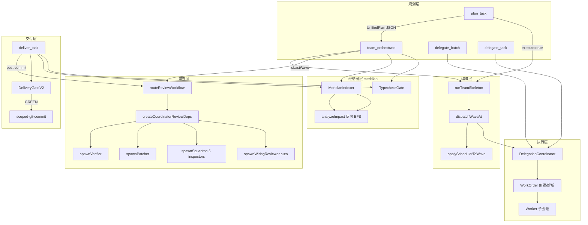

# 主链路接线审查 — team 子代理 / 审查门 / 经络图

> 审查日期: 2026-06-25
> 审查域: 天权（称量架构合理性）
> 审查范围: 最近 40 条提交涉及的核心链路变动
> 审查方法: 源码阅读 + git 历史分析 + 接线完整性交叉验证

## 1. 链路全景图



## 2. Team 子代理系统

### 2.1 接线完整性 — 通过

**bootstrap.ts:388-453** 注册 `createTeamOrchestrateTool`，注入完整的 coordinator 闭包：
- `delegate` / `delegateBatch` → `refs.coordinator`
- `recordTeamWaveTelemetry` / `recordTeamWaveRewardClosure` → meridian DB 持久化
- `getTeamSchedulerRewardStore` → `refs.meridianIndexer?.getDb()`
- `getMeridianIndexer` → `refs.meridianIndexer`
- `getTypecheckRunner` → `runTypeCheck(cwd, '*')`

**接线链**: `team_orchestrate` tool → `runTeamSkeleton` → `dispatchWaveAt` → `delegateBatch` → coordinator → worker sessions。每一跳都有明确的错误处理和 null guard。

### 2.2 跨波次失败传播 (commit 96284769, bdef21cf)

`dispatchWaveAt` 接收 `priorResults: WorkerResult[]`，从中提取失败任务 ID，阻断依赖这些任务的后波任务。

**提取逻辑** (`team-orchestrator.ts:175-182`):
```
workOrderId 格式 "team:T1" → lastIndexOf(':') → "T1"
```
然后与 `task.dependsOn` 数组中的 ID 做集合匹配。

**风险**: workOrderId 格式是隐式契约，没有 schema 约束。如果未来 workOrderId 格式变化（如 `team:wave2:T1`），`lastIndexOf(':')` 仍然能正确提取最后一段，但如果前缀不是 `team:` 则提取的 ID 与 `dependsOn` 中的不匹配——静默放过而非报错。当前安全，因为是内部生成，但缺少断言。

### 2.3 plan_task 的 meridian 缺口

`plan_task` 的 `execute=true` 路径 (`plan-task.ts:117-137`) 创建 `orchestratorDeps` 时：
- **缺少** `planCacheStore` → max 模式计划骨架缓存不可用
- **缺少** `recordTeamWaveTelemetry` / `recordTeamSchedulerShadow` → 遥测丢失
- **缺少** meridian / typecheck 集成

**影响**: `plan_task(execute=true)` 是便捷路径，但产出质量和可观测性低于 `plan_task` + `team_orchestrate` 两步走。用户文档中已建议两步走（`Output is a UnifiedPlan JSON — pass it to team_orchestrate`），所以这是已知的 tradeoff，不是 bug。

### 2.4 dispatchWaveAt 的原地变异

`team-orchestrator.ts:178`: `dispatchWave.taskIds = filteredTaskIds` 直接修改了传入的 wave 对象。

**当前安全**: `runTeamSkeleton` 每次调用都重新分组生成 waves，不会跨调用复用。
**潜在风险**: 如果未来 team_orchestrate 工具缓存 waves 数组用于多波续行（当前只缓存 `priorWaveResults`），变异会导致波次丢失。建议加注释标记这个假设。

## 3. 审查门系统

### 3.1 双审查路径架构

系统有**两条独立的审查入口**，都汇入 `routeReviewWorkflow`：

| 维度 | deliver_task 审查 | team_orchestrate 审查 |
|------|-------------------|----------------------|
| 触发时机 | 每次 commit 后 | 每个 team 任务的最后一波 |
| 位置 | `deliver-task.ts:execute()` | `team-orchestrate.ts:execute()` |
| meridian 注入 | `ctx.meridianIndexer?.getDb()` → `analyzeImpact(db, files)` | `coordinator.getMeridianIndexer?.()` → `analyzer.impact(files)` |
| typecheck 注入 | `ctx.typecheckRunner` (undefined → 真 tsc) | `coordinator.getTypecheckRunner?.()` (需显式接线) |
| 审查深度守卫 | `reviewDepth === 0` 才触发 | 无显式 reviewDepth 守卫 |
| 强制级别 | `classifyChangeScale` 自动分级 | `teamReviewForceLevel` 提高 floor 到 ≥L2 |

### 3.2 审查级别强制策略

`teamReviewForceLevel` (`team-orchestrate.ts:139-146`) 对 team 任务施加更严格的审查密度：
- max 模式 → 始终 L3（5 inspector 编队）
- standard 模式 → floor L2；跨模块 / ≥3 任务 / 高风险任务 → L3

**合理性**: team 任务是多 worker 产出的聚合，单 worker 的盲区需要交叉验证。提高 floor 是正确的。

### 3.3 证据门 (commit a954b0c9, 3420eb44)

`review-router.ts:hasBlockingSquadronFinding()` 要求 CRITICAL/HIGH 级别的 finding **必须附带 evidence** 才能阻断交付。无 evidence 的 finding 降级为非阻断。

**这是对 worker 幻觉的关键防线**——worker 可能声称"file:line 存在问题"但实际行号不存在。evidence gate 不验证 evidence 的真实性，但至少要求 worker 提供可追溯的引用。主控提示词中也有"审查意见来自 worker，未经主控独立核验"的警告（`deliver-task.ts` post-commit review 输出）。

### 3.4 reviewDepth 守卫不对称

deliver_task 的审查有 `reviewDepth === 0` 守卫——防止审查 worker 递归触发自身审查。但 team_orchestrate 的审查路径**没有这个守卫**。

```typescript
// deliver-task.ts — 有守卫
if (skipAutoReview) { ... }
else if (reviewDepth === 0 && shouldRouteReviewWorkflow(change) && ...) {
  // 触发审查
}

// team-orchestrate.ts — 无守卫
if (isLastWave && changedFiles.length > 0) {
  // 直接触发审查，无 reviewDepth 检查
}
```

**风险评估**: team_orchestrate 的审查通过 `createCoordinatorReviewDeps` spawn worker，这些 worker 的 `reviewDepth` 会是 `params.reviewDepth + 1`。如果审查 worker 本身调用 `team_orchestrate`（虽然 profile 限制应该阻止），理论上可能递归。但实际上 reviewer profile 的 `disallowedTools` 包含 `delegate_task`/`delegate_batch`，所以递归被 profile 层挡住了。**低风险，但建议补齐守卫保持一致性**。

### 3.5 auto wiring reviewer 的双 inspector 设计

`review-coordinator-deps.ts:spawnWiringReviewer` 派发 **2 个并行 inspector**（Wiring + Silence），而非原来注释说的 1 个。

**演变轨迹**: 从单 inspector（Wiring）升级到双 inspector（Wiring + Silence），增加了对虚假绿灯和吞错误的覆盖。代价是 auto review 的 worker 数翻倍，但 180s 外层预算和 150s 内层预算保持不变，预算仍然充裕。

## 4. 经脉图（Meridian）接线

### 4.1 meridian-impact.ts 的反向 BFS

`analyzeImpact` 从 changed files 出发，反向 BFS（谁导入/调用了这些文件），最多 3 跳。产出：
- `direct`: 1 跳依赖者
- `transitive`: 2+ 跳依赖者
- `tests`: 相关测试文件（通过 `getTestsFor` + `getCoEditNeighbors` + 文件名模式匹配）

### 4.2 两个消费者，两种接口

**deliver_task** (`deliver-task.ts:282-293`):
```typescript
const meridianDb = ctx.meridianIndexer?.getDb()
if (meridianDb && relChangeFiles.length > 0) {
  const impact = analyzeImpact(meridianDb, relChangeFiles)
  // 注入 focusHint
}
```

**team_orchestrate** (`team-orchestrate.ts:execute`):
```typescript
const analyzer = coordinator.getMeridianIndexer?.()
if (analyzer && observed.length > 0) {
  const impact = analyzer.impact(observed)  // TeamImpactAnalyzer 接口
  // 注入 focusHint
}
```

**差异**: deliver_task 直接操作 `MeridianDb`，team_orchestrate 通过 `TeamImpactAnalyzer` 接口（`impact()` 方法）间接操作。两者底层都是 `analyzeImpact`，但接口不统一。

**合理性**: team_orchestrate 的 `TeamImpactAnalyzer` 接口更干净——测试可以 mock 一个 `{ impact() }` 对象而不需要完整 MeridianDb。deliver_task 直接用 Db 是历史遗留，因为它还需要从 Db 做其他查询（虽然当前只用了 analyzeImpact）。

### 4.3 路径过滤的正确性

两个消费者都过滤了绝对路径：
- deliver_task: `relChangeFiles = change.files.filter(f => !isAbsolute(f))`
- team_orchestrate: `observed.filter(f => !isAbsolute(f))`

**原因**: meridian DB 中的边是 repo-relative 路径，LIKE 查询对绝对路径静默返回空。这个过滤是正确的防御。

### 4.4 co-edit neighbors 的行为信号

`analyzeImpact` 除了反向 BFS，还通过 `db.getCoEditNeighbors(file)` 发现"经常一起编辑"的文件。这是一个行为信号（co-edit frequency），补充了静态依赖图的盲区——两个文件可能没有 import 关系但高度耦合（如接口和实现）。

## 5. 近期关键提交影响分析

### 5.1 提交聚类

| 提交 | 类型 | 影响模块 | 风险等级 |
|------|------|----------|----------|
| `96284769` | feat | team-orchestrator: 跨波失败传播 | 中 — 改变波次语义 |
| `bdef21cf` | fix | team-orchestrate tool: priorResults 透传 | 中 — 修复上一条的接线断裂 |
| `a9ae8097` | feat | task-size-gate: 小任务阻断 | 低 — 纯增量 |
| `3420eb44` | fix | review: 强制独立验证 review findings | 高 — 改变信任模型 |
| `a954b0c9` | fix | review: evidence gate for blocking findings | 高 — 改变阻断语义 |
| `1b566602` | fix | work-order: unknown authority fail-closed | 中 — 安全加固 |
| `4496742c` | feat | delegateOrder: 指数退避重试 | 中 — 改变重试行为 |
| `74e7e44b` | feat | delegate_batch: resume + session persistence | 中 — 新能力 |

### 5.2 信任模型演变

最近三次 review 相关提交（`a954b0c9` → `3420eb44` → `dafc07ac`）构成了一条清晰的信任收紧线：

1. **a954b0c9**: HIGH/CRITICAL finding 无 evidence 不能阻断——防止 worker 幻觉阻断交付
2. **3420eb44**: 强制独立验证 review findings 后再报告——主控不能照搬 worker 结论
3. **dafc07ac**: 精简 delegation 提示词——减少"3+ fronts"模糊条件

这条线的方向是正确的：**worker 输出是外部来源，格式完整不等于可信**。提示词中的"审查意见来自 worker，未经主控独立核验。汇报用户前请用 grep/read 确认每条声称的文件:行号真实存在"正是这个原则的体现。

### 5.3 fail-closed 演变

`work-order.ts:toolsForAuthority` (`1b566602`): 当 authority 不在 starDomainRegistry 中时，worker 获得**零工具**（fail-closed），而非回退到 profile 默认工具集。

**正确性**: authority 是额外限制层，不是替代层。如果 authority 拼写错误或域定义未加载，静默回退会使限制消失无信号。零工具 + console.warn 让问题立即暴露。

## 6. 发现的问题

### P1: team_orchestrate 审查路径缺少 reviewDepth 守卫

**位置**: `team-orchestrate.ts:execute()` 中的 `if (isLastWave && changedFiles.length > 0)` 块
**问题**: 无 `reviewDepth === 0` 检查，理论上可被深层嵌套的审查 worker 触发递归审查
**当前缓解**: reviewer profile 的 `disallowedTools` 包含 `delegate_task`/`delegate_batch`
**建议**: 补齐 `params.reviewDepth === 0` 守卫，与 deliver_task 保持一致。防御性编程，即使 profile 层已挡住。

### P2: dispatchWaveAt 原地变异 wave.taskIds

**位置**: `team-orchestrator.ts:178`
**问题**: 直接修改 `dispatchWave.taskIds`，而非创建副本
**当前安全**: waves 在每次 `runTeamSkeleton` 调用时重新生成，不跨调用缓存
**建议**: 加注释 `// Safe: waves are regenerated per call, not cached across invocations` 标记这个不变量

### P3: plan_task meridian/typecheck 缺口

**位置**: `plan-task.ts:117-137`
**问题**: `execute=true` 路径创建的 orchestratorDeps 缺少 meridian、typecheck、telemetry、planCacheStore
**影响**: 通过 plan_task 直接执行的 team 任务缺少 blast-radius 分析和质量遥测
**建议**: 文档标注此差异，或补齐 deps（从 bootstrap 传入更多引用）

### P4: workOrderId 格式是隐式契约

**位置**: `team-orchestrator.ts:175-182` 跨波失败传播
**问题**: `lastIndexOf(':')` 提取任务 ID 依赖 workOrderId 格式为 `prefix:taskId`，无 schema 约束
**建议**: 抽取为显式函数 `extractTaskIdFromWorkOrderId(woId: string): string` 并加测试

## 7. 架构评价

### 7.1 分层清晰度 — 高

四个层次职责明确：
- **规划层** (plan_task / team_orchestrate): 决定做什么、怎么做
- **执行层** (coordinator / work-order): 管理 worker 生命周期
- **审查层** (review-router / review-coordinator-deps): 验证产出质量
- **交付层** (deliver_task / delivery-gate): 控制提交门禁

层间通过接口（DelegationRequest、ChangeSet、ReviewRouterDeps）解耦，测试时可替换依赖。

### 7.2 审查的非对称设计 — 合理

deliver_task（commit 后审查）和 team_orchestrate（terminal wave 审查）采用不同的强制策略：
- deliver_task 默认 auto（轻量），可选手动升级
- team_orchestrate 强制 ≥L2，max 模式强制 L3

这反映了不同的风险分布：单次 commit 可能是小改动（适合 auto），而多 worker 聚合产出更可能有集成缺陷（需要更严审查）。

### 7.3 经脉图的角色 — 咨询而非强制

meridian 的 blast-radius 分析在两个消费者中都标注了"advisory, never blocks"。这是正确的——meridian 索引可能过期或不完整，强制依赖它会导致误报。它的价值在于为审查者提供结构线索（下游消费者、相关测试），缩短审查者的探索路径。

### 7.4 遥测隔离纪律 — 严格

整个链路中所有遥测/持久化调用都包裹在 `try { ... } catch { /* must never affect dispatch */ }` 中。这是正确的生产纪律——观测基础设施的故障不应影响核心流程。

## 8. 建议（优先级排序）

1. **补齐 team_orchestrate reviewDepth 守卫** — 低成本高一致性
2. **抽取 workOrderId 任务 ID 提取为命名函数** — 消除隐式契约
3. **为 dispatchWaveAt 变异添加不变量注释** — 防止未来重构引入 bug
4. **评估 plan_task execute=true 路径的 deps 完整性** — 决定是补齐还是标注为轻量路径
5. **考虑统一 meridian 消费接口** — deliver_task 也走 TeamImpactAnalyzer 接口而非直接操作 Db
6. **P2 补充：考虑返回新对象而非原地变异** — `dispatchWave` 虽然是局部引用且 waves 每次重建，但返回一个浅拷贝的 wave 对象（如 `{ ...dispatchWave, taskIds: filteredTaskIds }`）比加注释更稳健。成本同样极低，但消除了"未来有人缓存 waves 导致静默污染"的可能。如坚持注释方案，至少标记 `// INVARIANT: waves are regenerated per runTeamSkeleton call; never cached across invocations`

## 9. 审查补充（天权域审查者追加）

### 9.1 getMeridianIndexer 接口契约验证缺口

**发现**: `TeamOrchestrateCoordinator.getMeridianIndexer` 的类型签名为 `() => TeamImpactAnalyzer | null | undefined`（`team-orchestrate.ts:60`），但在 `bootstrap.ts` 中注入时，实际注入的对象是 `refs.meridianIndexer`——一个 `MeridianIndexer` 实例。`MeridianIndexer` 类是否实现了 `TeamImpactAnalyzer` 接口的 `impact()` 方法是隐式的（duck typing），没有显式的 `implements` 声明。

**风险**: 如果 `MeridianIndexer` 类的 `impact()` 方法签名发生变化（如参数名、返回类型），TypeScript 不会在 bootstrap 注入点报错——因为注入走的是 `getMeridianIndexer?: () => TeamImpactAnalyzer | null | undefined` 可选链 + 类型断言，实际的 `MeridianIndexer` 与 `TeamImpactAnalyzer` 之间的类型关系是结构性兼容而非名义约束。

**建议**: 在 `MeridianIndexer` 类上加 `implements TeamImpactAnalyzer` 声明，或至少在 `bootstrap.ts` 注入点加一个类型断言注释说明这个隐式契约。

### 9.2 审查结论

文档的 **5.2 信任模型演变分析**（`a954b0c9` → `3420eb44` → `dafc07ac`）是全文最有价值的洞见——它将三个独立提交串联为"格式完整不等于可信"原则的逐级落地。**7.3 经脉图定位**（"咨询而非强制"）同样关键，避免了未来将 advisory 信号升级为 blocking gate 的错误。

文档 5 条建议的优先级排序合理。P1（reviewDepth 守卫）和 P4（workOrderId 函数化）应优先处理——低成本、高一致性收益。P2 建议补上返回新对象的替代方案。P3 和 P5 可排后。
