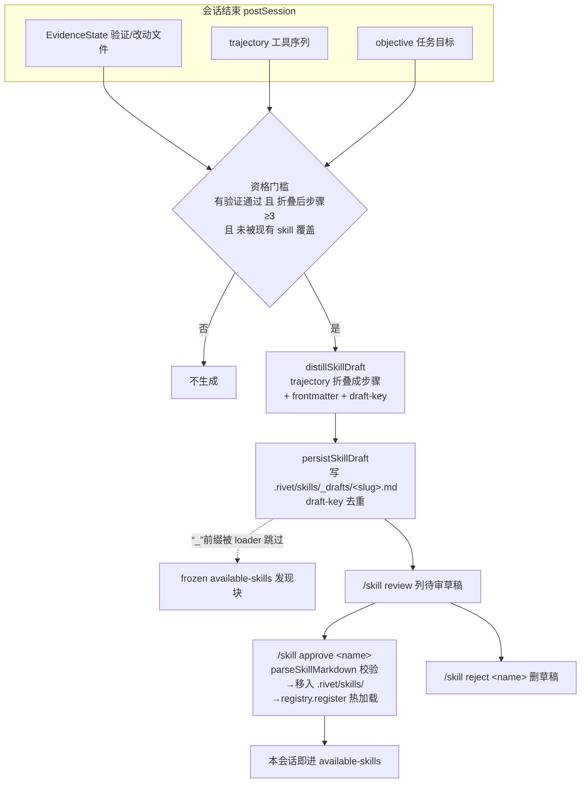

# 自动提炼 Skill(human-in-loop)

## 背景

Rivet 已有完整的 runtime skill 系统([`src/skills/skill-loader.ts`](../../src/skills/skill-loader.ts)):三级渐进披露(L1 发现块 / L2 `skill` 工具加载全文 / L3 子文件按需读)、`/skill` 命令、`.rivet/skills/` 单一来源。但此前**只能人工编写或从 `.claude` 导入** skill,没有"从会话经验自动生成可复用技能"的能力——而 Claude Code / Cursor 也都只停在"建议你手动把反复粘贴的流程提成 skill"。

这是一个可以领先的空白:Rivet 已有 `dream` / `playbook` 的 postSession 蒸馏管线,把"成功且可复现的工作流"也接一条管道升格为 skill 草稿,技术上是顺的。

## 设计原则(四条硬约束)

1. **前缀缓存是核心**:草稿绝不能自动进 `<available-skills>` 发现块(那是常驻 frozen 前缀区,任何注入都会撑大并影响 cache)。草稿落到 `.rivet/skills/_drafts/` 子目录,只有用户审核入库后才注册进发现层。
2. **human-in-loop**:自动只生成**草稿**,`/skill approve` 才生效。质量与信任由人把关,机器不擅自扩充能力面。
3. **deterministic 可测**:蒸馏内核用 trajectory + verifications 的确定性逻辑(不依赖 LLM 调用),便于单测;LLM 增强留作后续可选注入项。
4. **不破坏现有 `/skill`**:在现有 `case '/skill'` 上加子命令,`list` / `<name>` 语义不变。

## 数据流

## 实现

### 核心逻辑 — [`src/agent/skill-distill.ts`](../../src/agent/skill-distill.ts)

镜像 [`dream.ts`](../../src/agent/dream.ts) 的纯逻辑模块,无副作用入口与 fs 入口分离。

- `distillSkillDraft(input): SkillDraft | null` —— 资格门槛:
  - 至少 1 个 `verification.status === 'passed'`(**绿非证明**:没有通过的验证就不配成 skill);
  - trajectory 折叠后 `≥3` 个有意义步骤;
  - objective / 文件关键词未被任何 `existingSkills.triggers` 命中(**去重**,不重复造轮子)。
- 步骤折叠:把 trajectory 按 `read / write / verify / other` 相位**连续合并**成编号步骤,每步保留代表性 target(去重、上限 3)。`bash` 命令按 `VERIFY_BASH_RE`(test/tsc/lint/build…)判定为 verify,否则归 read。
- frontmatter 生成:`name`(从 objective 或主导文件派生 slug)、`description`(objective + `verified by N checks`)、`triggers`(关键词 2–4 条,去停用词)。
- `renderSkillDraftMarkdown(draft)` 产出**合法 SKILL.md**(能被 `parseSkillMarkdown` 解析),body 含 `## Steps` / `## Verified by` / `<!-- skill-draft-key -->` / `<!-- source-session -->`。
- 草稿 fs:`persistSkillDraft`(按 `skill-draft-key` 去重,`writeFileAtomicSync`)、`listSkillDrafts` / `readSkillDraft` / `approveSkillDraft`(复用 `parseSkillMarkdown` 校验,非法 frontmatter 拒绝入库;同名 skill 已存在则拒绝覆盖)/ `rejectSkillDraft`。

### 触发 — [`src/agent/hooks/skill-distill-hook.ts`](../../src/agent/hooks/skill-distill-hook.ts)

`createSkillDistillHook` 是 `postSession` hook,门控同 dream(需有 passed verification 且有改动文件),`setImmediate` 落草稿,best-effort 永不阻塞会话关闭。

### 接线

- [`create-runtime-hooks.ts`](../../src/agent/create-runtime-hooks.ts):在 `if (deps.dream)` 块内注册 `skill-distill`,默认开,`skillDistillDisabled` 可关;新增 `getRegisteredSkills` dep 供去重。
- [`loop-factory.ts`](../../src/agent/loop-factory.ts):`getRegisteredSkills` 从单例 `skillRegistry` 读现有 skills;`getObjective` 复用已有顶层 dep。
- [`skill-loader.ts`](../../src/skills/skill-loader.ts):`loadFromDirectory` 显式跳过 `_` 前缀条目(`_drafts/`)——**草稿隔离的关键护栏**,确保草稿永不进发现块/frozen 前缀。

### TUI

- [`slash-commands.ts`](../../src/tui/slash-commands.ts) `case '/skill'`:
  - `/skill review`(或 `drafts`):列待审草稿;
  - `/skill approve <name>`:`approveSkillDraft` → `skillRegistry.register` 本会话热加载;
  - `/skill reject <name>`:删草稿;
  - `/skill list` 尾部提示待审草稿数。`list` / `<name>` 语义不变。
- [`command-palette.tsx`](../../src/tui/command-palette.tsx) 与 `HELP_TEXT` 补 `/skill review` 等条目。

## 测试

- [`skill-distill.test.ts`](../../src/agent/__tests__/skill-distill.test.ts):资格门槛(无 passed / 步骤不足 / 被现有 skill 覆盖均返回 null)、步骤折叠、`renderSkillDraftMarkdown` round-trip 合法性、draft-key 去重、**`_drafts` 隔离回归**(草稿不进 `loadFromDirectory`)、approve 入库 + 非法 frontmatter 拒绝、reject。
- [`create-runtime-hooks.test.ts`](../../src/agent/__tests__/create-runtime-hooks.test.ts):`skill-distill` 随 dream 注册、`skillDistillDisabled` 抑制。
- [`slash-commands.test.ts`](../../src/tui/__tests__/slash-commands.test.ts):`/skill review|approve|reject` 输出与副作用(临时 cwd)。

## 边界(本次不做)

- 不做 overlay 图形审核 UI(v1 用 `/skill review` 文本,与 `/skill list` 风格一致)。
- 不做 LLM 增强蒸馏(deterministic 内核,留注入接口)。
- 不碰记忆补桥(durable→memory.jsonl 等)与跨会话默认开关——属另一方向。
- `_drafts/` 默认随 `.rivet/` 落盘,未加 `.gitignore` 规则(非强制)。

## 与瑶光纪律的关系

资格门槛第一条"必须有验证通过才配成 skill"正是瑶光「绿非证明,复现即证」的工程落点:只有经 ground truth 验证过的工作流才值得沉淀为可复用单元。草稿而非自动入库,也呼应 human-in-loop 的护栏理念——机器不在用户没看见时擅自扩充自己的能力面。
