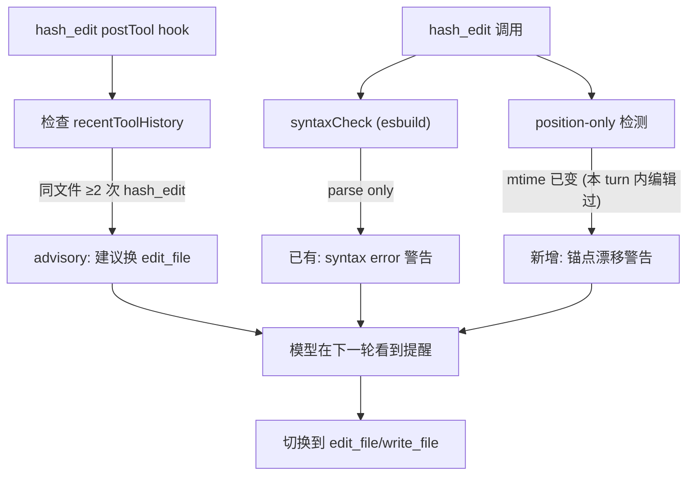
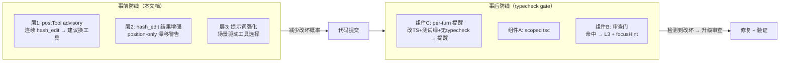

# 智能化编辑工具调用 + 类型检查门禁 —— 互补设计背景

> **定位**：这是「事前预防」与「事后兜底」两道互补防线的设计背景说明。
> - **本文档（事前）**：智能化编辑工具选择，让 agent 在合适的场景选对编辑工具，减少 hash_edit 误用导致的结构性破损。
> - **互补方案（事后）**：`edit-corruption_typecheck_gate` plan（`~/.cursor/plans/edit-corruption_typecheck_gate_741c0e25.plan.md`），在任务收尾时跑 scoped tsc 做兜底硬信号。

---

## 事故复盘：为什么需要这两道防线

### 失败链（53e1e4a8 hash_edit debris 事故）

```
hash_edit 改多层嵌套 if/else
  → anchor stale → 重试 → 大括号配对错乱
    → syntaxCheck (esbuild) 只做 parse，放过重复键/重复成员/不可能比较
      → tsc --noEmit exit=0（TS 对部分重复标识符容忍）
        → node:test (tsx/esbuild 同引擎) 全绿
          → 交付 → 用户发现 4 个类型错误
```

**关键盲格**：esbuild `transformSync`（syntaxCheck）和 tsx（测试）**只转译不查类型**。重复对象 key 取最后一个、重复接口成员被抹掉、TS2367 不可能比较是纯类型错——这些全部逃逸。唯一的结构检测（LSP 诊断）在 worker/headless 路径 `lspManager=null`，根本不跑。

### 两道防线的分工

| 维度 | 事前：智能编辑选择（本文档） | 事后：typecheck gate（互补方案） |
|------|---------------------------|-------------------------------|
| **目标** | 减少改坏的概率 | 改坏了能检测到 |
| **时机** | 编辑发生时/发生前 | 任务收尾（deliver_task / team 审查门） |
| **机制** | hook 信号 + 提示词强化 + 工具结果增强 | scoped `tsc --noEmit` 跑一次 |
| **延迟** | 零（纯历史判定/文本注入） | ~3-10s（收尾一次性） |
| **阻断** | advisory（提醒，不阻断） | advisory（升级审查等级，不阻断 commit） |
| **覆盖** | 全路径（含 worker/headless） | 全路径（确定性 tsc） |

两者**缺一不可**：只有事前，改坏了不知道；只有事后，同一文件反复改坏反复 tsc 浪费时间。

---

## 事前防线：智能化编辑工具选择

### 现状问题

系统提示词 `static.ts:114` 只说了「hash_edit 用于精确锚定编辑」，没有给出场景判断规则。agent（尤其是长会话压缩后）倾向于不分场景用 hash_edit，因为它的 description 里写了「Safer alternative to edit_file」——这句话在 hash 稳定时成立，但在连续编辑同一文件时反而更危险。

### hash_edit 的失效模式（来自事故）

| 失效模式 | 根因 | 后果 |
|---------|------|------|
| anchor stale 连环 | 每次编辑使后续 anchor 全部 stale → 重试 | 重试链中容易吞掉闭合括号 |
| position-only 漂移 | fast path `L<num>` 无 hash 验证，编辑后行号漂移 | 替换到错误位置 |
| 大括号配对错乱 | 多层嵌套 if/else 中间插入/替换 | 吞掉 `}` 或多出死分支 |
| syntaxCheck 放过 | esbuild 不查类型 | 重复键/重复成员/不可能比较逃逸 |

### 工具选择决策矩阵

| 场景 | 推荐工具 | 理由 |
|------|---------|------|
| 单行精确替换，old_string 唯一 | **edit_file** | 最安全，不依赖行号 |
| 同文件多处独立修改（≤3 处） | **edit_file ×N**（逐个串行） | 每次匹配独立验证 |
| 同文件多处修改（>3 处）或大段重写 | **write_file**（全量覆写） | 一次性写入，无锚点依赖 |
| 新建文件 | **write_file** | 唯一选择 |
| 多文件精确补丁 | **apply_patch** | unified diff + hunk 上下文验证 |
| 已读文件的单行小改，需要锚定确认 | **hash_edit**（完整 hash） | 可接受，锚点稳定时安全 |
| 连续编辑同一文件（第 2 次起） | **edit_file** | hash_edit anchor 已 stale |
| 多层嵌套 if/else 结构修改 | **edit_file** 或 **write_file** | hash_edit 在结构密集区风险最高 |

### 实现方案（三层，由轻到重）

#### 层 1：postTool advisory hook（编辑模式感知）

新建 `src/agent/hooks/edit-tool-advisory-hook.ts`，postTool 阶段纯历史判定：

**触发条件**（全部满足才触发）：
- agent 在同一 turn 内对同一文件用了 ≥2 次 hash_edit
- 第 2 次 hash_edit 返回了 stale diagnostic 或 auto-recovered 信息

**动作**：`advisoryBus.submit` 一条 ttl=1 advisory：
> 你已连续用 hash_edit 编辑同一文件。每次编辑使后续锚点全部 stale——大括号配对容易错乱。考虑用 edit_file（old_string 精确匹配，不依赖行号）或 write_file（全量覆写）完成剩余修改。

**注入点**：`create-runtime-hooks.ts`，与 self-verify hook 并列注册。

**判定数据源**：`RuntimeToolEvent.input`（hash_edit 的 `file_path` 参数）+ `RuntimeToolEvent.success`（stale 时 isError=true 或 content 含 "recovered"）。

#### 层 2：hash_edit 工具结果增强（结构性破损信号）

修改 `src/tools/hash-edit.ts` 的 execute 返回，在以下情况追加警告：

- **syntaxCheck 命中**（已有）→ 追加 syntax error 警告（已实现）
- **新增：position-only 连续调用检测** → 如果同一文件的 mtime 在本次编辑前已变（说明本 turn 内已编辑过），追加：
  > ⚠ 此文件本 turn 内已被编辑。position-only 锚点可能已漂移——请改用 edit_file 或验证替换结果。

这不需要 hook，直接在 hash_edit.ts 的 position-only stale 检测分支（L160-169）内做。当前代码是 `refreshFileReadMtime` 静默刷新——改为刷新 + 追加 advisory。

#### 层 3：系统提示词强化

修改 `static.ts:114` 编辑工具指导，从平铺描述改为**场景驱动**：

```
文件操作：read_file 先读再改。
- edit_file：精确替换（old_string 须唯一）。适用于单行/小段修改、结构密集区域（多层嵌套 if/else）。
- write_file：仅用于新建或全量覆写。同文件 >3 处修改时优先用此。
- hash_edit：精确锚定编辑。仅在锚点稳定时安全——连续编辑同一文件会使后续锚点 stale，大括号配对容易错乱。
  ⚠ 不适合：多层嵌套结构修改、同文件连续编辑第 2 次起。这些场景改用 edit_file。
- apply_patch：unified diff，适合跨多文件精确补丁。
禁止用 bash 读写文件。新建大文件用 write_file 一次写完，禁止 hash_edit 分段拼接。
```

### 数据流（事前防线）



---

## 事后防线：typecheck gate（互补方案概要）

> 完整设计见 `~/.cursor/plans/edit-corruption_typecheck_gate_741c0e25.plan.md`

**三层**：
- **组件 A**：`runChangedFilesTypecheck(cwd, changedFiles)` —— scoped tsc，只保留落在改动文件里的 error，tsc 跑不起来时 fail-open
- **组件 B**：deliver-task / team-orchestrate 审查门消费 A，命中则 forceLevel=L3 + focusHint
- **组件 C**：per-turn advisory hook（改 TS + 测试绿 + 无类型检查 → 提醒跑 typecheck）

---

## 两方案的互补关系



**关键互补点**：
1. 事前的 advisory hook 和事后的 reminder hook 可以合并注册（同一个 postTurn），按优先级排序触发。
2. 事前减少 hash_edit 误用 → 事后 tsc gate 需要拦截的次数自然下降。
3. 事前不管住时（模型忽略 advisory），事后是确定性的最后一道防线。
4. 两个方案的注入点不同：事前主要在 tool 执行层 + 提示词，事后在审查门层——互不干扰。

## 实现优先级

| 优先级 | 方案 | 组件 | 理由 |
|--------|------|------|------|
| P0 | 事后 | 组件 A+B（scoped tsc + 审查门） | 确定性兜底，不依赖模型遵从 advisory |
| P1 | 事后 | 组件 C（per-turn 提醒） | 廉价、无延迟、覆盖面广 |
| P1 | 事前 | 层 3（提示词强化） | 零代码改动，立即生效 |
| P2 | 事前 | 层 2（hash_edit 结果增强） | 低风险小改，直接在 hash-edit.ts 内 |
| P2 | 事前 | 层 1（postTool advisory hook） | 需要 hook 注册 + 历史判定逻辑 |

## 不变量

1. 两道防线都是 advisory 性质——不阻断编辑、不阻断 commit。
2. 事前方案不增加任何同步开销（纯历史判定 + 文本注入）。
3. 事后方案的 tsc 只在收尾跑一次，scoped 到改动文件。
4. 两方案的总开关独立：`RIVET_EDIT_SMART_ROUTING`（事前）、`RIVET_TYPECHECK_GATE`（事后），默认都 on。
5. worker/headless 路径全覆盖：事前靠 RuntimeToolEvent（不依赖 LSP），事后靠确定性 tsc。

## 审查补充（2026-06-24 交叉审查）

以下为对原始设计的技术审查补充，应在实现前解决。

### 1. Layer 1 的历史窗口与"同 turn"概念脱节

`tool-history-recorder.ts` 只保留最近 **5 条**工具记录。若一个 turn 有 20 次工具调用，第 1 次和第 2 次 hash_edit 之间可能穿插了 10 次其他调用——等第 2 次触发 postTool hook 时，`recentToolHistory` 里已经没有第 1 次的记录。

**修正**：不使用 `recentToolHistory`，改为在 `RuntimeHookContext` 外挂一个 turn 级 `Map<filePath, hashEditCount>`，由 postTool hook 直接维护。或降低判定条件为"连续 2 次 hash_edit"（5 条窗口够用），与"同 turn 内 2 次"做区分。

### 2. Layer 2 同时增强 full-hash anchor stale 的错误信息

当前 full-hash anchor 失败时，hash_edit 返回错误信息包含 "anchor L<n>:<hash> not found" + 实际行内容。可以在检测到 `anchors.length >= 2` 且 stale 时，在错误信息中追加："Consider switching to edit_file for this file — anchors are interdependent and stale."

### 3. Layer 3 的提示词改动影响前缀缓存

`static.ts` 属于 frozen base。修改 frozen base 内容会生成新 hash，导致增量 prefix cache 失效（一次 cache miss）。影响可控但需要在 plan 中标注。建议：在实现 Layer 3 的 commit message 中标注 `[cache-affecting]`。

### 4. `RIVET_EDIT_SMART_ROUTING` 总开关注入路径

文档只说"默认 on"，未指定在哪里读取。应以 `process.env.RIVET_EDIT_SMART_ROUTING !== '0'` 的形式在 `bootstrap.ts` 或 config 层读取，通过 `RuntimeHookDeps` 下发到各 hook 的 factory 函数。与 `RIVET_TYPECHECK_GATE` 共用同一注入模式。

### 5. advisory tier 协调（与 typecheck gate 交叉）

Layer 1 的 advisory key 和 tier 未定义。建议：

| hook | key | tier | priority |
|------|-----|------|----------|
| edit-tool-advisory (L1) | `edit-tool-advisory` | discipline | 0.55 |

与 typecheck gate 的 Component C（`typecheck-reminder`, discipline, ~0.5）共用 discipline tier。两个 discipline 条目不冲突（不同 key），在 3 槽限制内可共存。但如果同时与 self-verify（discipline, 0.58）+ discipline-reanchor（discipline, 0.55）触发，可能被挤出。当前约定：discipline tier 同一 category 最多 2 条（`MAX_PER_CATEGORY=2`），需确认四个 discipline 条目不会同时触发。

### 6. 连续编辑检测与 spec-verify-gate 的交互

刚交付的 `spec-verify-gate-hook.ts`（preTurn）检测"读 spec → 实现 → 零验证"。Layer 1（postTool）检测"连续 hash_edit"。两者不冲突——不同相位、不同检测模式。但如果两者同时触发（agent 读 handoff 后连续 hash_edit），agent 会收到两条 advisory：一条 constitutional（spec-verify-gate），一条 discipline（edit-tool-advisory）。需要确保两条 advisory 不矛盾——当前设计下两者语义互补（"先验证再动手"+"换更安全的工具"），不会造成指令冲突。
