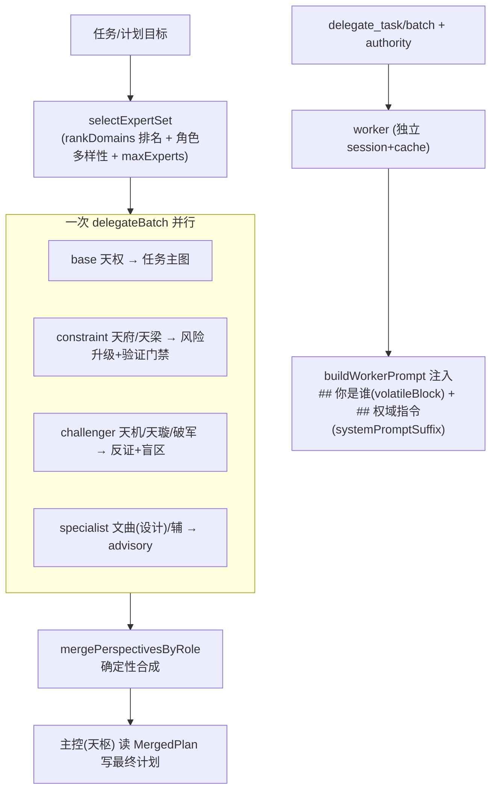

# 将星机制（Star-General Mechanism）实现说明

> 将「星域胶囊」从单纯的主会话认知场，升级为**可委派的子代理人格** + **按任务智能召唤的多专家议事会**。
> 本文档面向后续维护与迭代，记录架构、关键锚点、数据流、扩展点与约束。

## 1. 一句话概述

- **委派带人格**：`delegate_task` / `delegate_batch` 可携带 `authority`（星域 id），worker 拿到完整人格（`volatileBlock`「你是谁」）+ 方法论（`systemPromptSuffix`「怎么做」），并按星域 `toolWhitelist` 收敛工具。
- **议事会动态化**：`/team max` 不再写死 `tianquan/tianfu/tianxuan` 三视角，而是用 `selectExpertSet(mission)` 按任务**智能召唤** N 个互补专家（base + constraint + challenger + 命中的 specialist），单轮 Flash 并行调研，主控（天枢）确定性汇总。

## 2. 四个 Lever 与落点

| Lever | 作用 | 主要文件 |
|------|------|---------|
| L1 委派带星域人格 | `authority` 参数 + worker 注入 volatileBlock | `src/tools/delegate-task.ts`、`src/tools/delegate-batch.ts`、`src/agent/worker-prompts.ts` |
| L2 专家阵容扩充 | 新增 `wenqu`(文曲) 设计专家 + `designer` profile + 既有胶囊求证增强 | `src/agent/star-domain.ts`、`src/agent/profile-registry.ts`、`src/agent/domain-voice.ts` |
| L3 智能路由 | task → 互补专家集合（排名 + 角色多样性 + 上限） | `src/agent/expert-router.ts`（新建） |
| L4 议事会动态化 | 泛化 perspective + 角色合成 merge | `src/agent/team-perspectives.ts`、`src/agent/team-orchestrator.ts` |

## 3. 数据流

## 4. 关键实现锚点

### L1 — 委派带人格

- **schema**：`delegate-task.ts` / `delegate-batch.ts` 用 `authorityStringSchema`（zod `refine` 校验 `starDomainRegistry.getDomainIds()`），input_schema 暴露 `authority` enum；透传到 `DelegationRequest.authority`（coordinator 早已支持，无需改）。
- **注入**：`buildWorkerPrompt(order, authoritySuffix?)`（`worker-prompts.ts`）
  - `domainDef = starDomainRegistry.get(order.authority)`
  - `personaBlock = domainDef?.volatileBlock` → 在「## 权域指令」**之前**插入「## 你是谁」块（人格在前定调）。
  - 显式传入 `authoritySuffix` 时**抑制** persona 块（保留旧的纯方法论注入路径）。
- **fail-closed**：未知 authority → `toolsForAuthority` 返回 `[]`（`work-order.ts`），worker 拿不到任何工具，也不注入人格。

### L2 — 专家阵容

- **文曲 wenqu**（设计/前端美学专家，蒸馏自 Claude-Design-Sys-Prompt）：
  - ⚠️ **命名缘由**：原计划用 `yuheng`(玉衡)，但玉衡在既有星相位 `StarPhase` 里已是「实现者/编码者」（`yuheng-implementing`、武曲/张飞），语义冲突。改用 **文曲**（主文采艺术审美）避免撞车。
  - 6 条方法论：化身领域专家不套俗套 / 扎根既有视觉语汇 / 先问澄清(每轮≤1问) / 给 3+ 跨维度变体 / 占位符优于劣质实现 / 交付前验证渲染。
  - `domain-voice.ts` 同步加了文曲语气表（保持议事会播报一致）。
- **designer profile**（`profile-registry.ts`）：`role: 'readonly'`，`tierLock: 'cheap'`，只提建议不落盘（由主控/patcher 携 `authority='wenqu'` 实际改）。
- **求证增强**：`tianquan`(先求证再断言) / `tianji`(可核验优先) / `tianliang`(先答后问) 各 +1 条纪律，来自 FABLE-5 / Opus 4.7 的 search-first 精神。

### L3 — expert-router（`src/agent/expert-router.ts`）

- `rankDomains(task)`：对**全部**域按关键词命中计分，降序（id 稳定 tie-break）。与 `matchDomain`（top-1、tie 返 null）不同，议事会需要全排名。
- `mergeRoleFor(id)`：域 → `ExpertRole`（base/constraint/challenger/specialist）。映射表见 `DOMAIN_MERGE_ROLE`；未知域默认 `specialist`。
- `selectExpertSet(task, { maxExperts })`：
  - 必含 1 个 **base**（`result[0]` 恒为 base，merge 骨架依赖此约定）；
  - 补 constraint / challenger（无命中则用默认 `tianfu` / `tianxuan`）；
  - 补命中的 specialist（无默认，仅在确实命中时）；
  - 其余按相关度补足；去重；`maxExperts` 默认 3、上限 `MAX_COUNCIL_EXPERTS=5`（成本控制）。

### L4 — 议事会动态化（`team-perspectives.ts` / `team-orchestrator.ts`）

- `TeamPerspectivePlan.perspective` 由字面量联合泛化为 `string`（星域 id）。
- `buildPlannerObjective(domainId, mission)`：brief 取自胶囊（`name` + `volatileBlock` 首行 + 角色职责 `ROLE_BRIEFS`），弃用硬编码 `PERSPECTIVE_BRIEFS`。
- **orchestrator max 模式**：`selectExpertSet(input.objective)` 替换写死三视角；每个 planner `profile='reviewer'`、`authority=星域id`、一次 `delegateBatch`。
- **`mergePerspectivesByRole(perspectives[])`**：按 merge-role 确定性合成
  - base：深拷贝任务主图；
  - constraint：风险升级（never downgrade）+ 验证门禁去重 + 风险/依赖并入；
  - challenger：风险×备选冲突检测、依赖集冲突、额外任务 defer、备选 accept/defer/reject、盲区 → accepted；
  - specialist：备选 + 盲区**一律 defer**（advisory 默认）。
  - `mergePerspectives(tianquan, tianfu, tianxuan?)` 保留为**向后兼容包装器**，等价于 `mergePerspectivesByRole([...])`。

## 5. 扩展点（如何加一个新专家）

1. 在 `src/agent/star-domain.ts` 的 `STAR_DOMAINS` 加一条（id 加进 `StarDomainId` 联合类型），填 `volatileBlock`(你是谁) + `systemPromptSuffix`(5-7 条「动作+判据+反例」) + `keywords` + `toolWhitelist` + `uiPersona`。
2. 若该域会出现在议事会播报，去 `src/agent/domain-voice.ts` 的 `DomainVoiceId` + `DOMAIN_NAMES`(+可选语气表) 加一项。
3. 在 `src/agent/expert-router.ts` 的 `DOMAIN_MERGE_ROLE` 给它指定 merge 角色（不加则默认 specialist）。
4. 同步更新计数断言：`star-domain-registry.test.ts`（域总数）、必要时 `profile-registry.test.ts`。
5. 用户自定义域走 `.rivet/domains/<id>/card.md`，无需改代码（`StarDomainRegistry.loadFromDirectory`）。

> 也可零代码：用户在 `.rivet/domains/` 放 card.md 即注册新域，`authority`/`selectExpertSet` 自动识别（未知 merge 角色按 specialist 处理）。

## 6. 约束与注意

- **前缀缓存生命线**：给 `delegate_task`/`delegate_batch` 加 `authority` 是**一次性永久 schema 变更**，提交后主 agent 全局前缀缓存重热一次（可接受）。**禁止**把星域注入做成主 agent 每轮动态文本。worker / 议事会子代理有独立 session+cache，注入人格不影响主缓存。
- **辅胶囊纪律**：新增专家 `systemPromptSuffix` 控制在 5-7 条，不侵蚀相邻域。
- **成本**：议事会上限 N=5 → 单轮最多 5 个 Flash worker；默认 3。
- **plan cache**：max 模式命中 `loadTeamPlanSkeleton` 时跳过整个 fanout，不受本机制影响。

## 7. 测试覆盖

| 测试文件 | 覆盖点 |
|---------|-------|
| `src/agent/__tests__/authority-injection.test.ts` | persona 注入顺序、显式 suffix 抑制、未知 authority deny-all |
| `src/tools/__tests__/delegate-task.test.ts` | authority 端到端透传、未知值拒绝、enum 暴露 |
| `src/agent/__tests__/star-domain.test.ts` | wenqu 路由 + 方法论 |
| `src/agent/__tests__/expert-router.test.ts` | rankDomains / mergeRoleFor / selectExpertSet（默认三角色、specialist 命中、budget 钳制、去重） |
| `src/agent/__tests__/team-perspectives.test.ts` | mergePerspectivesByRole（按角色选 base、specialist advisory、与三视角包装器等价） |
| `src/agent/__tests__/profile-registry.test.ts` / `star-domain-registry.test.ts` | designer profile / 域计数 |
